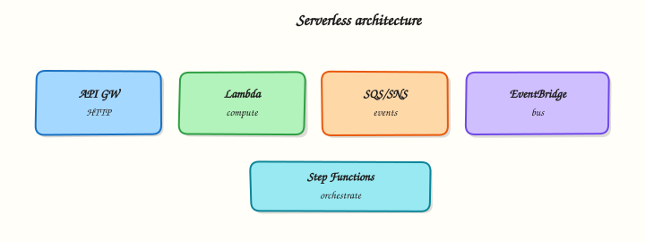

# Serverless on AWS

## Overview

**Serverless** means you run code without renting and patching a server yourself. AWS starts a tiny runtime when an event happens, runs your function, and stops — you pay for invocations and duration, not idle EC2 hours.

**Lambda** is AWS’s main serverless compute service. Triggers include HTTP (via **Function URL** or **API Gateway**), uploads to S3, messages on queues, schedules, and more.

This module teaches the serverless execution model first, then a hands-on lab: deploy Python, hit it with `curl`, break the handler, fix it from **CloudWatch Logs**, and delete everything.

This is **Tutorial 1** in **Module 8: Serverless** of the REBASH Academy **AWS for Cloud & DevOps Engineers** series.

!!! warning "Cost hygiene"
    Lambda free tier covers small labs. Function URLs and CloudWatch Logs cost pennies. Delete function, IAM role, and log group in Cleanup. **No VPC-attached Lambda** in this lab — avoids NAT Gateway cost.

## Prerequisites

- [Containers: ECS, EKS, and ECR](containers-ecs-eks-ecr.md) — you understand “run my code in a box”
- AWS CLI v2 with `lambda:*`, `iam:*`, `logs:*` in sandbox
- Python 3 and `zip` installed locally
- `curl` for HTTP proof

## Learning Objectives

By the end of this tutorial, you will be able to:

- [ ] Explain Lambda and **cold start** in plain English
- [ ] Deploy a Python zip function with an IAM execution role
- [ ] Enable and test a **Lambda Function URL** with `curl`
- [ ] Diagnose and fix a broken handler using CloudWatch Logs
- [ ] Contrast Function URL vs API Gateway for HTTP
- [ ] Clean up Lambda, IAM role, and log groups completely

## Architecture

Event sources (HTTP, S3, SQS, EventBridge) invoke Lambda synchronously or asynchronously. Lambda assumes an **execution role**, runs in an isolated environment, writes logs to **CloudWatch Logs**, and returns a response.



## Theory

### The problem (before AWS words)

Your team runs a small webhook that fires twice a day. Paying for a 24/7 EC2 instance wastes money. You want code that scales to zero and wakes on demand.

### Lambda — functions as a service

**Problem:** Managing servers for sporadic or spiky workloads is expensive and boring.

**Analogy:** Lambda is a vending machine — you drop in an event (coin), it runs your snippet (snack), and goes quiet again. No shopkeeper (server) standing around all night.

**AWS name:** **AWS Lambda**.

**Tiny example:** Python function returns JSON when someone POSTs to a Function URL.

**Interview one-liner:** “Lambda runs stateless functions up to 15 minutes — great for event-driven work, not long batch jobs.”

### Cold start — the first-cup delay

**Problem:** The first request after idle time feels slow.

**Analogy:** **Cold start** is like the coffee machine heating up — the first customer waits longer; later cups are faster while the machine stays warm.

**Causes:** New execution environment, runtime init, large deployment package, optional VPC network setup.

**Interview one-liner:** “Mitigate cold starts with smaller packages, avoid unnecessary VPC, use provisioned concurrency for latency-sensitive HTTP.”

### Function URL vs API Gateway

**Problem:** You need HTTP access to your function — which front door?

| Option | Plain job | Interview note |
|--------|-----------|---------------|
| **Function URL** | Built-in HTTPS on the function | Fastest lab setup; limited enterprise features |
| **API Gateway** | Full HTTP API with throttling, authorisers | Better for public APIs and WAF integration |
| **ALB + Lambda** | Same load balancer as EC2/ECS | ALB hourly cost |

**Interview one-liner:** “Function URL for internal/quick HTTP; API Gateway when you need authorisers, usage plans, and WAF.”

### Sync vs async invocation

| Type | Caller waits? | Example |
|------|---------------|---------|
| **Synchronous** | Yes | Function URL, API Gateway |
| **Asynchronous** | No | S3 event, EventBridge — retries + DLQ |

**Interview one-liner:** “Async invocations need idempotent handlers — duplicates can happen.”

### IAM execution role

**Problem:** Lambda must write logs and maybe call AWS APIs — it needs permissions like EC2 instance profiles.

**Analogy:** The **execution role** is the function’s ID badge — trusted by `lambda.amazonaws.com`, usually with CloudWatch Logs at minimum.

### EventBridge and friends (awareness)

- **EventBridge** — event bus routing between AWS services
- **SQS / SNS** — queue and fan-out patterns into Lambda
- **Step Functions** — orchestrate multiple Lambdas into workflows

### Common pitfalls

- Putting a 20-minute batch job in Lambda (900 s max timeout)
- **VPC without reason** — slower cold start + NAT cost
- Logging secrets in plain environment variables
- Public Function URL with `auth-type NONE` in production
- One giant Lambda doing everything — split with Step Functions

## Hands-on Lab

### Objective

Deploy a Python Lambda from zip with IAM role and Function URL; `curl` success; break the handler; fix from logs; delete function, role, and log group.

### Prerequisites

| Tool | Notes |
|------|--------|
| AWS CLI v2 | Create role, function, URL |
| Python 3 + zip | Package handler |
| curl | HTTP proof |

### Lab environment

``` {.bash .ra-terminal title="Terminal"}
mkdir -p ~/rebash-aws/module-08 && cd ~/rebash-aws/module-08
export AWS_REGION="${AWS_REGION:-eu-west-2}"
export AWS_PAGER=""
export FUNC="rebash-m08-hello"
export ROLE="rebash-m08-lambda-role"
echo "$FUNC" | tee func-name.txt
echo "$ROLE" | tee role-name.txt
aws sts get-caller-identity --output table
```

### Real-world scenario

A partner webhook expects JSON `{"status":"ok"}` from your **health Lambda**. Deploy passes smoke tests, then a bad edit returns 502. You reproduce with `curl`, read CloudWatch Logs, fix the handler, and tear down — the standard serverless incident loop.

### Step-by-step tasks

#### Task 1 – Create IAM trust policy and role

Create `lambda-trust.json`:

```json title="lambda-trust.json"
{
  "Version": "2012-10-17",
  "Statement": [
    {
      "Effect": "Allow",
      "Principal": {"Service": "lambda.amazonaws.com"},
      "Action": "sts:AssumeRole"
    }
  ]
}
```

``` {.bash .ra-terminal title="Terminal"}
cd ~/rebash-aws/module-08
ROLE=$(cat role-name.txt)
aws iam create-role --role-name "$ROLE" \
  --assume-role-policy-document file://lambda-trust.json \
  --description "REBASH module-08 Lambda execution" | tee create-role.json
aws iam attach-role-policy --role-name "$ROLE" \
  --policy-arn arn:aws:iam::aws:policy/service-role/AWSLambdaBasicExecutionRole
sleep 10
aws iam get-role --role-name "$ROLE" --query 'Role.Arn' --output text | tee role-arn.txt
```

!!! example "Expected output"
    `role-arn.txt` contains `arn:aws:iam::…:role/rebash-m08-lambda-role`.


#### Task 2 – Package Python handler and create function + Function URL

Create `handler.py`:

```python title="handler.py"
import json

def lambda_handler(event, context):
    return {
        "statusCode": 200,
        "headers": {"Content-Type": "application/json"},
        "body": json.dumps({"status": "ok", "service": "rebash-m08"})
    }
```

``` {.bash .ra-terminal title="Terminal"}
cd ~/rebash-aws/module-08
zip -j function.zip handler.py
FUNC=$(cat func-name.txt)
ROLE_ARN=$(cat role-arn.txt)
aws lambda create-function \
  --function-name "$FUNC" \
  --runtime python3.12 \
  --role "$ROLE_ARN" \
  --handler handler.lambda_handler \
  --zip-file fileb://function.zip \
  --timeout 10 \
  --memory-size 128 \
  --output json | tee create-function.json
aws lambda wait function-active-v2 --function-name "$FUNC"
aws lambda create-function-url-config \
  --function-name "$FUNC" \
  --auth-type NONE \
  --output json | tee url-config.json
aws lambda add-permission \
  --function-name "$FUNC" \
  --statement-id FunctionUrlAllowPublic \
  --action lambda:InvokeFunctionUrl \
  --principal "*" \
  --function-url-auth-type NONE
FUNC_URL=$(aws lambda get-function-url-config --function-name "$FUNC" \
  --query FunctionUrl --output text)
echo "$FUNC_URL" | tee function-url.txt
curl -fsS "$FUNC_URL" | tee curl-ok.json
grep -q '"status": "ok"' curl-ok.json
```

!!! example "Expected output"
    `curl-ok.json` contains `"status": "ok"`; Function URL ends with `.on.aws/`.


#### Task 3 – Break handler, observe failure, fix

Create `handler-broken.py`:

```python title="handler-broken.py"
import json

def lambda_handler(event, context):
    # BUG: wrong shape for Function URL / API Gateway proxy integration
    return {"status": "ok", "service": "rebash-m08"}
```

``` {.bash .ra-terminal title="Terminal"}
cd ~/rebash-aws/module-08
FUNC=$(cat func-name.txt)
zip -j function-broken.zip handler-broken.py
aws lambda update-function-code --function-name "$FUNC" \
  --zip-file fileb://function-broken.zip --output json | tee update-broken.json
aws lambda wait function-updated-v2 --function-name "$FUNC"
FUNC_URL=$(cat function-url.txt)
set +e
curl -sS -o curl-broken.json -w "%{http_code}" "$FUNC_URL" | tee http-code-broken.txt
set -e
grep -E '502|500' http-code-broken.txt || test ! -s curl-broken.json
LOG_GROUP="/aws/lambda/${FUNC}"
sleep 3
aws logs tail "$LOG_GROUP" --since 5m | tee logs-broken.txt || true
zip -j function.zip handler.py
aws lambda update-function-code --function-name "$FUNC" \
  --zip-file fileb://function.zip
aws lambda wait function-updated-v2 --function-name "$FUNC"
curl -fsS "$(cat function-url.txt)" | tee curl-fixed.json
grep -q '"status": "ok"' curl-fixed.json
echo "lambda break-fix OK" | tee evidence.txt
```

!!! example "Expected output"
    Broken deploy returns 502/500 or empty body; logs show error; fixed curl returns ok JSON.


#### Task 4 – Delete function, URL permission, role, log group

``` {.bash .ra-terminal title="Terminal"}
cd ~/rebash-aws/module-08
FUNC=$(cat func-name.txt)
ROLE=$(cat role-name.txt)
aws lambda delete-function-url-config --function-name "$FUNC" 2>/dev/null || true
aws lambda remove-permission --function-name "$FUNC" \
  --statement-id FunctionUrlAllowPublic 2>/dev/null || true
aws lambda delete-function --function-name "$FUNC"
aws logs delete-log-group --log-group-name "/aws/lambda/${FUNC}" 2>/dev/null || true
aws iam detach-role-policy --role-name "$ROLE" \
  --policy-arn arn:aws:iam::aws:policy/service-role/AWSLambdaBasicExecutionRole
aws iam delete-role --role-name "$ROLE"
echo "lambda cleanup OK" | tee cleanup-ok.txt
```

!!! example "Expected output"
    Function and role deleted; cleanup message printed.


### Validation steps

- [ ] Function active with Python 3.12 zip deployment
- [ ] Function URL returned 200 JSON on first curl
- [ ] Broken handler reproduced HTTP error; logs inspected
- [ ] Fixed handler restored success response
- [ ] Function, role, and log group removed

### Common errors and fixes

| Error | Cause | Fix |
|-------|-------|-----|
| Role not ready | IAM eventual consistency | Sleep/retry after create-role |
| 403 on Function URL | Missing invoke permission | Run add-permission for URL |
| Handler not found | Wrong handler string | Match `file.function` to zip layout |
| ResourceConflictException | Update in progress | Wait `function-updated-v2` |

### Challenge exercise

Create `eventbridge-rule.json` describing a schedule `rate(5 minutes)` targeting this function (do not deploy unless needed). Add a comment field explaining why **dead-letter queues (DLQ)** matter for async triggers.

```json title="eventbridge-rule.json"
{
  "Name": "rebash-m08-schedule",
  "ScheduleExpression": "rate(5 minutes)",
  "State": "DISABLED",
  "Targets": [{"Arn": "LAMBDA_ARN_PLACEHOLDER", "Id": "lambda-target"}],
  "_comment": "Production async invokes should use DLQ so failed events are not lost"
}
```

``` {.bash .ra-terminal title="Terminal"}
cd ~/rebash-aws/module-08
test -f eventbridge-rule.json
grep -q rate eventbridge-rule.json
echo "eventbridge challenge OK" | tee challenge.txt
```

### Learning outcomes

- You deployed Lambda with zip packaging and execution role
- You used Function URL and curl for synchronous HTTP proof
- You practised break/fix using CloudWatch Logs
- You cleaned up IAM and logging artefacts

### Cleanup

``` {.bash .ra-terminal title="Terminal"}
cd ~/rebash-aws/module-08
FUNC=$(cat func-name.txt 2>/dev/null || echo rebash-m08-hello)
ROLE=$(cat role-name.txt 2>/dev/null || echo rebash-m08-lambda-role)
aws lambda delete-function --function-name "$FUNC" 2>/dev/null || true
aws logs delete-log-group --log-group-name "/aws/lambda/${FUNC}" 2>/dev/null || true
aws iam detach-role-policy --role-name "$ROLE" \
  --policy-arn arn:aws:iam::aws:policy/service-role/AWSLambdaBasicExecutionRole 2>/dev/null || true
aws iam delete-role --role-name "$ROLE" 2>/dev/null || true
```

## Validation

- [ ] No `rebash-m08-*` Lambda or role remains
- [ ] You can explain sync vs async invocation
- [ ] You can describe cold start in plain English
- [ ] You understand Function URL auth modes

## Code Walkthrough

1. **Response shape** — HTTP integrations need `statusCode`, `headers`, and string `body`.
2. **Wait after IAM** — role propagation delay causes obscure create-function failures.
3. **Basic execution role** — CloudWatch Logs only; add S3/VPC policies explicitly when needed.
4. **`zip -j`** — flat zip so handler path matches module name.
5. **Delete log group** — avoids orphaned `/aws/lambda/*` storage charges.

## Security Considerations

- Never use `auth-type NONE` Function URLs in production without WAF or auth layer.
- Least-privilege IAM per function — one role per domain.
- Do not log secrets; use Secrets Manager or Parameter Store SecureString.
- Cap blast radius with **reserved concurrency** on critical functions.
- Monitor `Errors` and `Throttles` CloudWatch metrics.

## Common Mistakes

!!! warning "Public unauthenticated Function URL in prod"
    Anyone on the internet can invoke your code. Use IAM auth, JWT via API Gateway, or CloudFront + WAF.

!!! warning "Fat Lambda in VPC"
    Adds ENI setup latency and often NAT costs. Attach VPC only for private resource access.

!!! warning "No DLQ on async triggers"
    Failed S3/SQS events can disappear silently. Configure dead-letter queues and alarms.

## Best Practices

- Infrastructure as Code for functions — SAM, CDK, Terraform
- Keep deployment packages small; use layers or container images for heavy deps
- Provisioned concurrency for latency-sensitive HTTP
- Idempotency keys for payments and webhooks
- Structured JSON logging (Powertools) for searchability

## Troubleshooting

| Symptom | Likely cause | Fix |
|---------|--------------|-----|
| 502 from Function URL | Malformed response / exception | Fix handler shape; check logs |
| Task timed out | Long downstream call | Increase timeout; async pattern |
| Throttled | Concurrency limit | Request limit increase; reserved concurrency |
| AccessDenied on AWS SDK | Execution role missing action | Extend IAM policy |

## Summary

**Lambda** fits event-driven and HTTP workloads when you respect limits and security. This lab proved **deploy → curl → break → logs → fix → cleanup** — the serverless story interviewers expect when you have actually touched the console and CLI.

Next: [Monitoring and Observability on AWS](monitoring-and-observability-on-aws.md).

## Interview Questions

**1. What is AWS Lambda in simple words?**

??? success "Reveal answer"
    Lambda runs your code in response to events without you managing servers. AWS starts an environment, runs the function, and bills for invocations and compute time. You upload code or a container image and configure triggers like HTTP, S3, or schedules.

**2. What is a cold start?**

??? success "Reveal answer"
    A cold start happens when Lambda creates a new execution environment — runtime init, code load, and optional VPC setup add latency to the first request. Warm invocations reuse the environment and are faster. Mitigate with smaller packages, avoid unnecessary VPC, and provisioned concurrency for strict latency needs.

**3. Function URL vs API Gateway?**

??? success "Reveal answer"
    **Function URL** is a direct HTTPS endpoint on a function — minimal setup, `AWS_IAM` or public auth. **API Gateway** adds authorisers, throttling, request validation, WAF integration, and usage plans — better for public APIs at extra cost and complexity.

**4. Sync vs async Lambda invocation?**

??? success "Reveal answer"
    **Synchronous** (Function URL, API Gateway) waits for the response and shows errors to the caller. **Asynchronous** (S3, EventBridge) queues the event, retries by default, and can send failures to a DLQ — design handlers to be idempotent.

**5. What IAM role does Lambda need?**

??? success "Reveal answer"
    An **execution role** trusted by `lambda.amazonaws.com` with at least CloudWatch Logs permissions (`AWSLambdaBasicExecutionRole`). Add VPC access if in VPC, plus any AWS API permissions the function code calls — often kept in separate policies for least privilege.

**6. When is Lambda the wrong choice?**

??? success "Reveal answer"
    Sustained high-throughput compute cheaper on EC2/ECS, jobs over 15 minutes, strict low latency at huge scale without provisioned concurrency, or apps needing full OS control. Large batch ETL may fit Glue or EMR better.

**7. Why did our broken handler return 502?**

??? success "Reveal answer"
    Function URL expects API Gateway proxy format: numeric `statusCode`, `headers`, and string `body`. Returning a bare dict fails integration and surfaces as 502 to the HTTP client — check CloudWatch Logs for the runtime error.

**8. What is reserved concurrency?**

??? success "Reveal answer"
    Reserved concurrency guarantees capacity for a function and caps its maximum concurrent executions — protecting critical functions from noisy neighbours and limiting blast radius of runaway bugs.

## Related Tutorials

- Previous: [Containers: ECS, EKS, and ECR](containers-ecs-eks-ecr.md)
- Next: [Monitoring and Observability on AWS](monitoring-and-observability-on-aws.md)
- [IAM, Identity Access, and Organizations](iam-identity-access-and-organizations.md)

## References

- [AWS Lambda Developer Guide](https://docs.aws.amazon.com/lambda/latest/dg/welcome.html)
- [Lambda Function URLs](https://docs.aws.amazon.com/lambda/latest/dg/lambda-urls.html)
- [Amazon API Gateway](https://docs.aws.amazon.com/apigateway/latest/developerguide/welcome.html)
- [Amazon EventBridge](https://docs.aws.amazon.com/eventbridge/latest/userguide/eb-what-is.html)
- [Lambda quotas](https://docs.aws.amazon.com/lambda/latest/dg/gettingstarted-limits.html)
