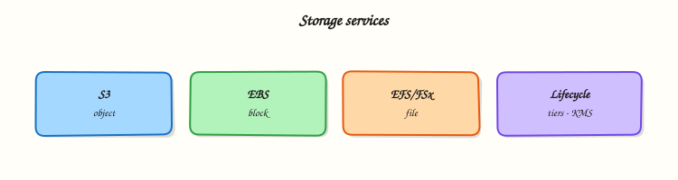

# Storage: S3, EBS, and EFS

## Overview

Every application needs somewhere to keep files, disks, and backups. On AWS you usually choose between three storage shapes — and picking the wrong one wastes money or breaks your design in interviews.

Start with the storage problem each service solves:

- **S3** — store files as objects (like a massive shared drive accessed over HTTP)
- **EBS** — attach a disk to one virtual machine (like a USB drive for EC2)
- **EFS** — share a folder across many Linux servers (like a network file share)

This is **Tutorial 1** in **Module 5: Storage** of the REBASH Academy **AWS for Cloud & DevOps Engineers** series. You will harden an S3 bucket, prove read/write, inject a **Deny** policy on a folder, restore access, add a **lifecycle** rule, and delete every version cleanly.

!!! warning "Cost hygiene"
    S3 charges for storage and requests. **EBS volumes bill even when detached.** This lab uses S3 only — no EC2 or NAT Gateway required. Always run **Cleanup**.

## Prerequisites

- [Compute: EC2, ASG, and Load Balancing](compute-ec2-asg-and-load-balancing.md) — you know what an EC2 instance is
- AWS CLI v2 with permission to create S3 buckets in a sandbox account
- Optional: [Lab — AWS SSM and S3](../labs/aws-ssm-s3.md)

## Learning Objectives

By the end of this tutorial, you will be able to:

- [ ] Explain S3 vs EBS vs EFS using everyday analogies
- [ ] Enable Block Public Access (BPA), versioning, and encryption on a bucket
- [ ] Apply a bucket policy that **Denies** reads and prove `AccessDenied`
- [ ] Add a lifecycle rule and delete a versioned bucket completely
- [ ] Answer fresher interview questions on storage classes and public bucket risk

## Architecture

Clients and services read/write **S3 objects** over HTTPS. **EC2** instances attach **EBS volumes** as block devices in one AZ. **EFS** mount targets in subnets expose **NFS** to many instances. Lifecycle rules move or expire S3 objects over time.



## Theory

### The problem (before AWS words)

Your app needs to store user uploads, database backups, and static website files. Buying NAS hardware does not scale globally. Attaching one disk per server does not share files across ten web servers.

**What AWS sells:** managed storage services with different shapes for different jobs.

### S3 — the internet-scale filing cabinet

**Problem:** You need durable, cheap storage for millions of files accessed by many services worldwide.

**Analogy:** **S3** is a giant filing cabinet where each drawer is a **bucket** and each file is an **object** with a key name like `logs/2026/app.log`. There are no real folders — only key prefixes that *look* like folders.

**AWS name:** **Amazon Simple Storage Service (S3)**.

**Tiny example:** Upload `hello.txt` to `s3://my-bucket/public/hello.txt` and download it from anywhere with HTTPS.

**Interview one-liner:** “S3 is object storage — great for backups, static assets, and logs; not a POSIX disk you mount as `/` on one server.”

| Term | Plain meaning |
|------|----------------|
| **Bucket** | Container with a globally unique name |
| **Object** | File + metadata (key, bytes, headers) |
| **Versioning** | Keep old copies when you overwrite |
| **BPA** | **Block Public Access** — account/bucket guardrail against public exposure |

### EBS — the EC2 hard drive

**Problem:** Your virtual machine needs a boot disk and maybe a data disk with low latency.

**Analogy:** **EBS** is a network USB drive locked to one instance in one **Availability Zone (AZ)**.

**AWS name:** **Elastic Block Store (EBS)**.

**Tiny example:** Root volume `/dev/xvda` on your EC2 instance is usually EBS.

**Interview one-liner:** “EBS is block storage for one EC2 instance in one AZ — snapshot to copy across AZs.”

### EFS — shared Linux folder

**Problem:** Ten web servers need the same uploaded images directory without copying files constantly.

**Analogy:** **EFS** is a shared network drive (NFS) that many Linux instances mount at once, spread across AZs.

**AWS name:** **Elastic File System (EFS)**.

**Interview one-liner:** “EFS is managed NFS for shared POSIX files; S3 is object storage; EBS is one instance’s block disk.”

### When to pick which

| Need | Choose | Why |
|------|--------|-----|
| Website images, backups, logs | **S3** | Cheap, durable, HTTP access |
| OS disk for EC2 | **EBS** | Block device the OS expects |
| Shared `/uploads` across web tier | **EFS** | Multiple mounts, POSIX |
| Static site + CDN | **S3 + CloudFront** | Objects at edge |

### Encryption and policies (why labs matter)

**Problem:** Public S3 buckets still cause real-world data leaks. Teams also need guardrails so even admins cannot read certain prefixes.

**Tools you will touch today:**

| Control | Plain job |
|---------|-----------|
| **SSE-S3** | S3-managed encryption keys (`AES256`) |
| **Bucket policy** | Resource-based rules (who may read this bucket) |
| **Explicit Deny** | Always wins over Allow — compliance guardrail |
| **Lifecycle** | Auto-move or expire old objects to save money |

**Interview one-liner:** “Block Public Access plus bucket policies — neither alone replaces the other for intentional cross-account access.”

### S3 storage classes (awareness)

| Class | Plain meaning |
|-------|----------------|
| **Standard** | Frequent access |
| **Standard-IA** | Infrequent — 30-day minimum charge |
| **Glacier** | Archive — cheap storage, slower retrieval |
| **Intelligent-Tiering** | AWS moves tiers when access pattern changes |

### Common pitfalls

- Thinking S3 “folders” are real directories — they are key prefixes
- Deleting a versioned bucket without deleting all versions — `BucketNotEmpty` error
- Leaving detached **EBS volumes** running up a bill
- Disabling **BPA** “just to test” and forgetting to re-enable

## Hands-on Lab

### Objective

Create a versioned, encrypted S3 bucket; upload and download objects; deny `GetObject` on a `restricted/` prefix via bucket policy; restore access; add a lifecycle rule; delete all versions and the bucket.

### Prerequisites

| Tool | Notes |
|------|--------|
| AWS CLI v2 | `s3:*` in sandbox |
| `jq` | Optional JSON checks |
| Unique bucket name | Globally unique across all AWS customers |

### Lab environment

``` {.bash .ra-terminal title="Terminal"}
mkdir -p ~/rebash-aws/module-05 && cd ~/rebash-aws/module-05
export AWS_REGION="${AWS_REGION:-eu-west-2}"
export AWS_PAGER=""
ACCOUNT_ID=$(aws sts get-caller-identity --query Account --output text)
export BUCKET="rebash-m05-${ACCOUNT_ID}-$(date +%s)"
echo "$BUCKET" | tee bucket-name.txt
aws sts get-caller-identity --output table
```

### Real-world scenario

Platform needs a **compliance archive** bucket: encryption and versioning on, public access blocked, and a policy that blocks reads of `restricted/` objects. You prove the deny works, remove bad policy drift, add lifecycle for old logs, then tear down for FinOps.

### Step-by-step tasks

#### Task 1 – Create bucket with BPA, versioning, and SSE

``` {.bash .ra-terminal title="Terminal"}
cd ~/rebash-aws/module-05
BUCKET=$(cat bucket-name.txt)
if [[ "$AWS_REGION" == "us-east-1" ]]; then
  aws s3api create-bucket --bucket "$BUCKET" --output json | tee create-bucket.json
else
  aws s3api create-bucket --bucket "$BUCKET" \
    --create-bucket-configuration LocationConstraint="$AWS_REGION" \
    --output json | tee create-bucket.json
fi
aws s3api put-public-access-block --bucket "$BUCKET" \
  --public-access-block-configuration \
  BlockPublicAcls=true,IgnorePublicAcls=true,BlockPublicPolicy=true,RestrictPublicBuckets=true
aws s3api put-bucket-versioning --bucket "$BUCKET" \
  --versioning-configuration Status=Enabled
aws s3api put-bucket-encryption --bucket "$BUCKET" \
  --server-side-encryption-configuration '{
    "Rules": [{"ApplyServerSideEncryptionByDefault": {"SSEAlgorithm": "AES256"}}]
  }'
aws s3api get-bucket-versioning --bucket "$BUCKET" | tee versioning.json
grep -q Enabled versioning.json
```

!!! example "Expected output"
    `versioning.json` contains `"Status": "Enabled"`.


#### Task 2 – Put, get, and overwrite (versioning proof)

Create `hello.txt`:

```text title="hello.txt"
rebash module-05 v1
```

``` {.bash .ra-terminal title="Terminal"}
cd ~/rebash-aws/module-05
BUCKET=$(cat bucket-name.txt)
aws s3 cp hello.txt "s3://${BUCKET}/public/hello.txt"
aws s3 cp hello.txt "s3://${BUCKET}/restricted/secret.txt"
echo "rebash module-05 v2" > hello-v2.txt
aws s3 cp hello-v2.txt "s3://${BUCKET}/public/hello.txt"
aws s3 cp "s3://${BUCKET}/public/hello.txt" - | tee get-public.txt
grep -q "v2" get-public.txt
aws s3api list-object-versions --bucket "$BUCKET" --prefix public/hello.txt \
  --output json | tee versions-public.json
jq -e '.Versions | length >= 2' versions-public.json
```

!!! example "Expected output"
    `get-public.txt` shows `v2`; `versions-public.json` lists at least two versions.


#### Task 3 – Deny GetObject on `restricted/` prefix, break, restore

Create `deny-restricted-policy.json`:

```json title="deny-restricted-policy.json"
{
  "Version": "2012-10-17",
  "Statement": [
    {
      "Sid": "DenyRestrictedReads",
      "Effect": "Deny",
      "Principal": "*",
      "Action": "s3:GetObject",
      "Resource": "arn:aws:s3:::BUCKET_NAME/restricted/*"
    }
  ]
}
```

``` {.bash .ra-terminal title="Terminal"}
cd ~/rebash-aws/module-05
BUCKET=$(cat bucket-name.txt)
sed "s/BUCKET_NAME/${BUCKET}/g" deny-restricted-policy.json > bucket-policy.json
aws s3api put-bucket-policy --bucket "$BUCKET" --policy file://bucket-policy.json
set +e
aws s3 cp "s3://${BUCKET}/restricted/secret.txt" - 2>&1 | tee deny-get.txt
set -e
grep -Eiq 'AccessDenied|403' deny-get.txt
aws s3 cp "s3://${BUCKET}/public/hello.txt" - | tee still-ok.txt
grep -q v2 still-ok.txt
aws s3api delete-bucket-policy --bucket "$BUCKET"
aws s3 cp "s3://${BUCKET}/restricted/secret.txt" - | tee restored.txt
grep -q "module-05" restored.txt
echo "s3 deny-restore OK" | tee evidence.txt
```

!!! example "Expected output"
    `deny-get.txt` shows AccessDenied; public read still works; after policy removal, `restored.txt` returns the object body.


#### Task 4 – Lifecycle rule and full bucket deletion

Create `lifecycle.json`:

```json title="lifecycle.json"
{
  "Rules": [
    {
      "ID": "ExpireOldPublicLogs",
      "Status": "Enabled",
      "Filter": { "Prefix": "public/" },
      "Transitions": [
        { "Days": 30, "StorageClass": "STANDARD_IA" }
      ],
      "NoncurrentVersionExpiration": { "NoncurrentDays": 7 }
    }
  ]
}
```

Create `delete-versions.py`:

```python title="delete-versions.py"
import json
import sys

data = json.load(open("all-versions.json"))
objs = []
for v in data.get("Versions", []):
    objs.append({"Key": v["Key"], "VersionId": v["VersionId"]})
for m in data.get("DeleteMarkers", []):
    objs.append({"Key": m["Key"], "VersionId": m["VersionId"]})
print(json.dumps({"Objects": objs, "Quiet": True}))
```

``` {.bash .ra-terminal title="Terminal"}
cd ~/rebash-aws/module-05
BUCKET=$(cat bucket-name.txt)
aws s3api put-bucket-lifecycle-configuration --bucket "$BUCKET" \
  --lifecycle-configuration file://lifecycle.json
aws s3api get-bucket-lifecycle-configuration --bucket "$BUCKET" | tee lifecycle-applied.json
grep -q ExpireOldPublicLogs lifecycle-applied.json
aws s3api list-object-versions --bucket "$BUCKET" --output json > all-versions.json
python3 delete-versions.py > delete-batch.json
if jq -e '.Objects | length > 0' delete-batch.json >/dev/null 2>&1; then
  aws s3api delete-objects --bucket "$BUCKET" --delete file://delete-batch.json
fi
aws s3api delete-bucket --bucket "$BUCKET"
echo "bucket deleted" | tee cleanup-ok.txt
```

!!! example "Expected output"
    Lifecycle rule present; `cleanup-ok.txt` confirms bucket deletion.


### Validation steps

- [ ] Bucket had BPA, versioning Enabled, and SSE-S3 (AES256)
- [ ] Overwrite created two versions of `public/hello.txt`
- [ ] Bucket policy deny blocked `restricted/` read; public read worked
- [ ] After policy removal, restricted object readable again
- [ ] Lifecycle applied; all versions deleted; bucket gone

### Common errors and fixes

| Error | Cause | Fix |
|-------|-------|-----|
| BucketAlreadyExists | Name not globally unique | Append account ID + timestamp |
| IllegalLocationConstraintException | `us-east-1` special case | Omit `LocationConstraint` for `us-east-1` |
| BucketNotEmpty on delete | Versioned objects remain | Run `delete-versions.py` batch delete |
| AccessDenied on put-bucket-policy | Missing IAM permission | Use sandbox admin role |

### Challenge exercise

Create `storage-class-picker.sh` that prints which S3 class you would pick for three scenarios (active website assets, monthly audit logs, seven-year legal archive) — a script interviewers accept as “you thought about cost”.

```bash title="storage-class-picker.sh"
#!/bin/bash
set -euo pipefail
echo "active-website-assets -> S3 Standard"
echo "monthly-audit-logs -> S3 Standard-IA (30-day minimum applies)"
echo "seven-year-legal-archive -> S3 Glacier Flexible Retrieval or Deep Archive"
```

``` {.bash .ra-terminal title="Terminal"}
cd ~/rebash-aws/module-05
chmod +x storage-class-picker.sh
./storage-class-picker.sh | tee storage-class-output.txt
grep -qi glacier storage-class-output.txt
grep -qi intelligent storage-class-output.txt || grep -qi standard-ia storage-class-output.txt
echo "storage challenge OK" | tee challenge.txt
```

### Learning outcomes

- You hardened S3 with BPA, versioning, and encryption
- You proved explicit Deny on a prefix via bucket policy
- You applied lifecycle rules and deleted a versioned bucket completely
- You can map S3 to backups and static assets in production designs

### Cleanup

``` {.bash .ra-terminal title="Terminal"}
cd ~/rebash-aws/module-05
BUCKET=$(cat bucket-name.txt 2>/dev/null || echo "")
if [[ -n "$BUCKET" ]] && aws s3api head-bucket --bucket "$BUCKET" 2>/dev/null; then
  aws s3api list-object-versions --bucket "$BUCKET" --output json > all-versions.json
  python3 delete-versions.py > delete-batch.json 2>/dev/null || true
  if jq -e '.Objects | length > 0' delete-batch.json >/dev/null 2>&1; then
    aws s3api delete-objects --bucket "$BUCKET" --delete file://delete-batch.json
  fi
  aws s3api delete-bucket --bucket "$BUCKET" 2>/dev/null || true
fi
rm -f create-bucket.json versioning.json deny-get.txt evidence.txt
```

## Validation

- [ ] Lab completed under `~/rebash-aws/module-05` with deny/restore evidence
- [ ] You can explain S3 vs EBS vs EFS without notes
- [ ] You can describe why explicit Deny beats Allow
- [ ] No lab buckets left in the account

## Code Walkthrough

1. **Globally unique bucket names** — embed account ID; never hard-code in Terraform without a random suffix.
2. **Versioning before lifecycle** — noncurrent version expiration needs versioning enabled.
3. **Explicit Deny** — test with evidence files; public prefix unaffected if policy scopes correctly.
4. **Delete markers and versions** — always `list-object-versions` before `delete-bucket`.
5. **`us-east-1` bucket create** — no `LocationConstraint` (common fresher exam trap).

## Security Considerations

- Keep **Block Public Access** enabled at account level.
- Use bucket policies **and** IAM together for cross-account access.
- Enable access logging or CloudTrail data events on sensitive buckets.
- Prefer **SSE-KMS** in regulated environments (Module 10 goes deeper).
- Apply least-privilege `s3:ListBucket` with prefix conditions for multi-tenant apps.

## Common Mistakes

!!! warning "Public bucket by mistake"
    Legacy ACLs and disabled BPA still cause breaches. Keep BPA on; use policies only for intentional sharing.

!!! warning "Forgotten EBS volumes"
    Detached volumes still bill. Delete snapshots you no longer need.

!!! warning "Lifecycle without understanding minimum duration"
    Infrequent Access and Glacier classes charge for minimum storage duration even if you delete early.

## Best Practices

- Default encrypt all buckets; prefer KMS with key policies in production
- Match storage class to access pattern; review costs monthly
- For EBS: use `gp3`, right-size IOPS, snapshot with lifecycle
- For EFS: use lifecycle to Infrequent Access for cold files
- Use S3 Inventory or Storage Lens for FinOps reporting

## Troubleshooting

| Symptom | Likely cause | Fix |
|---------|--------------|-----|
| 403 on GetObject | Bucket policy Deny, KMS key, or wrong account | Check policy; KMS `Decrypt` permission |
| Slow LIST on huge prefix | Hot prefix in flat namespace | Shard keys (`logs/2026/08/03/`) |
| EBS attach fails | AZ mismatch | Create volume in instance AZ |
| EFS mount timeout | Security group missing TCP 2049 | Allow NFS from client to EFS SG |

## Summary

**S3** is the default durable object store on AWS. **EBS** and **EFS** cover block and shared file needs on EC2. Master **BPA, versioning, encryption, lifecycle, and bucket policies** — and prove deny/restore with CLI evidence. That is how storage shows up in interviews and incident response.

Next: [Databases on AWS](databases-on-aws.md).

## Interview Questions

**1. S3 vs EBS — when do you pick each?**

??? success "Reveal answer"
    Choose **S3** for durable objects accessed over HTTP/API — backups, static assets, logs, data lakes — when many clients need read access without attaching a disk. Choose **EBS** when one EC2 instance needs a block device (OS or database disk) with low-latency attachment in one AZ.

**2. What does S3 versioning buy you?**

??? success "Reveal answer"
    Versioning keeps every overwrite as a distinct version ID so you can recover from accidental delete or overwrite (including delete markers). It enables lifecycle rules on old versions and replication. It is not a full backup strategy by itself — you still plan cross-Region copies for disasters.

**3. Why can explicit Deny in a bucket policy block an admin Allow?**

??? success "Reveal answer"
    AWS policy evaluation gives **explicit Deny** precedence over Allow. A bucket policy Deny on `s3:GetObject` for `restricted/*` applies to all principals unless another boundary applies. That is how compliance guardrails work.

**4. EBS vs EFS — key trade-off?**

??? success "Reveal answer"
    **EBS** is block storage for one instance (AZ-bound), ideal for boot/data volumes with controlled IOPS. **EFS** is multi-AZ NFS shared across many Linux instances with elastic capacity — better for shared content, different cost and latency profile. Neither replaces S3 for object storage.

**5. What breaks when you delete a versioned bucket with objects inside?**

??? success "Reveal answer"
    `DeleteBucket` returns `BucketNotEmpty` until all object versions and delete markers are removed. Automation must paginate `list-object-versions` and batch `delete-objects`, then delete the bucket.

**6. What is Block Public Access (BPA)?**

??? success "Reveal answer"
    BPA is an account- or bucket-level setting that blocks public ACLs and public bucket policies that would expose data to the internet. It is a safety rail — you still design intentional private cross-account access with IAM and policies.

**7. SSE-S3 vs SSE-KMS in one sentence each?**

??? success "Reveal answer"
    **SSE-S3** uses keys managed entirely by S3 with simple setup. **SSE-KMS** uses AWS Key Management Service keys with separate key policies and CloudTrail audit of decrypt operations — better for regulated data, with KMS quota and latency trade-offs.

**8. How do you prevent accidental public S3 exposure?**

??? success "Reveal answer"
    Enable account and bucket **Block Public Access**, avoid public ACLs, use bucket policies only for intentional cross-account access, monitor with IAM Access Analyzer for S3, and require encryption plus logging on sensitive buckets.

## Related Tutorials

- Previous: [Compute: EC2, ASG, and Load Balancing](compute-ec2-asg-and-load-balancing.md)
- Next: [Databases on AWS](databases-on-aws.md)
- Lab: [AWS SSM and S3](../labs/aws-ssm-s3.md)
- [AWS Security Services](aws-security-services.md) — KMS encryption depth

## References

- [Amazon S3 User Guide](https://docs.aws.amazon.com/AmazonS3/latest/userguide/Welcome.html)
- [S3 security best practices](https://docs.aws.amazon.com/AmazonS3/latest/userguide/security-best-practices.html)
- [Amazon EBS](https://docs.aws.amazon.com/ebs/latest/userguide/what-is-ebs.html)
- [Amazon EFS](https://docs.aws.amazon.com/efs/latest/ug/whatisefs.html)
- [S3 lifecycle configuration](https://docs.aws.amazon.com/AmazonS3/latest/userguide/object-lifecycle-mgmt.html)
