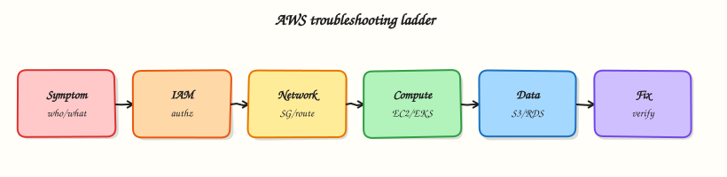

# Troubleshooting AWS

## Overview

**Troubleshooting** is the skill that separates “I read tutorials” from “I can help on day one.” This module builds a calm method: identity first, then network versus application, with a break-and-fix lab.

**Problem in plain English:** Monitoring says “website down.” The server status shows **running**. Panic clicks begin — reboot, change security settings, redeploy — and nobody writes down what they tried.

**What good triage means:** Follow **evidence first** — confirm who you are logged in as, classify the symptom (permission error vs timeout vs application error), check one layer at a time, make **one change**, validate, repeat.

**Analogy:** A doctor checks temperature and symptoms before surgery — not the other way around.

**AWS approach:** Use `describe-*` commands, Security Token Service (STS) identity checks, security groups, route tables, CloudWatch logs, and CloudTrail — in a **fixed order** so you do not confuse IAM problems with network problems.

This is **Tutorial 1** in **Module 16: Troubleshooting** — the capstone connecting Modules 1–15. You will run a **mini triage lab**: prove caller identity, launch a tiny web server, `curl` it, break security group ingress, restore service, and tear down. For full multi-layer practice, continue to [Lab — AWS IAM and VPC Reachability Triage](../labs/aws-iam-vpc-triage.md) and [Lab — Secure EC2 via SSM and S3](../labs/aws-ssm-s3.md).

!!! warning "Cost"
    Use `t3.micro`/`t2.micro` in the default VPC. Terminate the instance and delete the security group when finished.

## Prerequisites

- [VPC Networking on AWS](vpc-networking-on-aws.md) *(Module 3)* — security groups and routes
- [Compute: EC2, ASG, and Load Balancing](compute-ec2-asg-and-load-balancing.md) *(Module 4)*
- [IAM, Identity Access, and Organizations](iam-identity-access-and-organizations.md) *(Module 2)*
- [Production AWS Landing Zones](production-aws-landing-zones.md) *(Module 15)* — where logs live in multi-account setups

You do **not** need prior on-call experience.

## Learning Objectives

By the end of this tutorial, you will be able to:

- [ ] Follow a beginner-safe triage order (identity → symptom → layer)
- [ ] Separate `AccessDenied` from network timeout using STS
- [ ] Break and fix security group ingress with curl proof
- [ ] Know when to use the full [IAM and VPC Triage](../labs/aws-iam-vpc-triage.md) and [SSM and S3](../labs/aws-ssm-s3.md) labs
- [ ] Name first checks for Lambda, EKS, DNS, and cost spikes at interview level
- [ ] Answer fresher scenario questions without guessing randomly

## Architecture

Incidents flow from alert → identity check → service health → dependency map → layer isolation → fix → validation → post-incident review. Cross-account and landing-zone context (Module 15) determines which logs and roles you may access.



## Theory

### The problem (before the decision tree)

**Problem:** “Site down” could mean wrong AWS account, firewall blocking port 80, missing internet route, nginx not installed, or DNS pointing to an old IP — five different fixes.

**Analogy:** Phone “no signal” — could be aeroplane mode, unpaid bill, broken tower, or broken phone. Check the cheap tests first.

**Interview one-liner:** “I confirm identity with STS, classify the symptom, then isolate one layer at a time with describe commands and curl — one fix per attempt.”

### Master triage order (memorise this)

1. **Scope** — one user, one Region, or whole org? Check [AWS Health Dashboard](https://health.aws.amazon.com/health/status).
2. **Identity** — `aws sts get-caller-identity` — correct account and role?
3. **Recent change** — CloudTrail: security group, route, deploy?
4. **Symptom branch:**
   - **`AccessDenied`** → IAM, SCP, resource policy (Module 2, 15)
   - **Timeout to IP** → security group → route table → NACL (Module 3)
   - **HTTP 5xx** → app logs, load balancer target health (Module 4)
   - **DNS failure** → Route 53 record wrong (Module 7+)
   - **Bill spike** → Cost Explorer by service (Module 13)
5. **One fix → re-validate**

### Symptom table for beginners

| What you see | Likely layer | First command |
|--------------|--------------|---------------|
| `AccessDenied` in CLI | IAM / SCP | `aws sts get-caller-identity` |
| `curl` hangs to public IP | Network path | `describe-security-groups`, `describe-route-tables` |
| TCP works; HTTP 502 | Application / LB | Target group health, app logs |
| Wrong IP in browser | DNS | `dig`, Route 53 records |
| Lambda error in test | Function config | CloudWatch Logs for function |

### IAM vs network — the mistake juniors make

| Failure type | How it feels | What NOT to do |
|--------------|--------------|----------------|
| **IAM** | Immediate `AccessDenied` text | Open security groups when CLI already denied |
| **Network** | `curl` timeout; describe APIs work | Keep rebooting when SG blocks port 80 |

**Tiny example:** `aws ec2 describe-instances` returns `UnauthorizedOperation` → fix profile/role first. If describe works but `curl` times out → check security group and routes.

### Security group vs route table (Module 3 recap)

| Layer | Plain job | Symptom if broken |
|-------|-----------|-------------------|
| **Security group** | Door lock on the server | Timeout to port even if server healthy |
| **Route table** | Road to the internet | Timeout even if SG allows — no path |

**Interview one-liner:** “SG is the lock on the door; route table is whether a road exists to the building.”

### When to escalate to full labs

| Your situation | Next step |
|----------------|-----------|
| Mini lab SG break/fix done | [Lab — AWS IAM and VPC Reachability Triage](../labs/aws-iam-vpc-triage.md) — IAM profile + route + NACL faults |
| Need access without opening SSH to world | [Lab — Secure EC2 via SSM and S3](../labs/aws-ssm-s3.md) — Session Manager and instance role |

### Common pitfalls

- **Changing three things at once** — you never know what fixed it.
- **Skipping STS** — hour wasted in wrong account.
- **Rebooting before SG check** — classic junior move on timeout.
- **Opening SSH 0.0.0.0/0** — use SSM patterns from the SSM lab instead.

## Hands-on Lab

### Objective

Run a **lite IAM/VPC triage**: confirm STS identity, launch a minimal nginx EC2 in the default VPC, prove HTTP with `curl`, revoke port 80 ingress to simulate outage, restore ingress, re-validate, terminate.

### Prerequisites

| Tool | Notes |
|------|--------|
| AWS CLI v2 | EC2, STS |
| `curl` | HTTP proof |
| Default VPC | Required for simplified lab |

### Lab environment

``` {.bash .ra-terminal title="Terminal"}
mkdir -p ~/rebash-aws/module-16 && cd ~/rebash-aws/module-16
export AWS_REGION="${AWS_REGION:-eu-west-2}"
export AWS_PAGER=""
aws sts get-caller-identity --output json | tee identity.json
jq -e '.Account and .Arn' identity.json
aws ec2 describe-vpcs --filters Name=isDefault,Values=true \
  --query 'Vpcs[0].VpcId' --output text | tee default-vpc.txt
```

### Real-world scenario

Monitoring alerts: **“rebash-status endpoint down — instance running.”** Before opening a change ticket, you must prove **who you are** (STS), **whether HTTP works**, inject an SG fault like a bad change window, restore with evidence — the same story as Module 4 and the full [IAM and VPC Triage lab](../labs/aws-iam-vpc-triage.md).

### Step-by-step tasks

#### Task 1 – Identity baseline and triage note

Create `triage-checklist.md`:

```markdown title="triage-checklist.md"
# REBASH Module 16 — mini triage order

1. `aws sts get-caller-identity` — correct account/role?
2. Symptom: AccessDenied → IAM/SCP; timeout → network path
3. `describe-instances` — state, public IP, SG IDs
4. `describe-security-groups` — ingress on service port
5. `describe-route-tables` — 0.0.0.0/0 → IGW for public subnet
6. Application proof: `curl` HTTP body
7. One change → re-validate
```

``` {.bash .ra-terminal title="Terminal"}
cd ~/rebash-aws/module-16
test -f triage-checklist.md
aws sts get-caller-identity --query Account --output text | tee account.txt
echo "identity baseline OK" | tee identity-evidence.txt
```

!!! example "Expected output"
    `identity.json` shows `Account`, `Arn`, `UserId`; `identity-evidence.txt` confirms baseline.


#### Task 2 – Security group, user data, launch instance

Create `user-data.sh`:

```bash title="user-data.sh"
#!/bin/bash
set -euxo pipefail
dnf install -y nginx || yum install -y nginx
systemctl enable --now nginx
echo "rebash-m16 triage ok from $(hostname -f)" > /usr/share/nginx/html/index.html
```

``` {.bash .ra-terminal title="Terminal"}
cd ~/rebash-aws/module-16
VPC_ID=$(cat default-vpc.txt)
test "$VPC_ID" != "None" && test -n "$VPC_ID"
SG_ID=$(aws ec2 create-security-group --vpc-id "$VPC_ID" \
  --group-name rebash-m16-triage --description "REBASH module-16 triage SG" \
  --query GroupId --output text)
echo "$SG_ID" | tee sg-id.txt
aws ec2 authorize-security-group-ingress --group-id "$SG_ID" \
  --protocol tcp --port 80 --cidr 0.0.0.0/0
AMI_ID=$(aws ssm get-parameters \
  --names /aws/service/ami-amazon-linux-latest/al2023-ami-kernel-default-x86_64 \
  --query 'Parameters[0].Value' --output text)
SUBNET_ID=$(aws ec2 describe-subnets --filters Name=vpc-id,Values="$VPC_ID" \
  --query 'Subnets[0].SubnetId' --output text)
echo "$SUBNET_ID" | tee subnet-id.txt
INSTANCE_TYPE="t3.micro"
aws ec2 run-instances --image-id "$AMI_ID" --instance-type "$INSTANCE_TYPE" \
  --subnet-id "$SUBNET_ID" --security-group-ids "$SG_ID" \
  --user-data file://user-data.sh --associate-public-ip-address \
  --tag-specifications 'ResourceType=instance,Tags=[{Key=Name,Value=rebash-m16-triage}]' \
  --query 'Instances[0].InstanceId' --output text | tee instance-id.txt \
  || aws ec2 run-instances --image-id "$AMI_ID" --instance-type t2.micro \
       --subnet-id "$SUBNET_ID" --security-group-ids "$SG_ID" \
       --user-data file://user-data.sh --associate-public-ip-address \
       --tag-specifications 'ResourceType=instance,Tags=[{Key=Name,Value=rebash-m16-triage}]' \
       --query 'Instances[0].InstanceId' --output text | tee instance-id.txt
```

!!! example "Expected output"
    `instance-id.txt` contains `i-…`; security group allows TCP 80.


#### Task 3 – Prove reachability with curl

``` {.bash .ra-terminal title="Terminal"}
cd ~/rebash-aws/module-16
IID=$(cat instance-id.txt)
aws ec2 wait instance-running --instance-ids "$IID"
aws ec2 wait instance-status-ok --instance-ids "$IID"
PUBLIC_IP=$(aws ec2 describe-instances --instance-ids "$IID" \
  --query 'Reservations[0].Instances[0].PublicIpAddress' --output text)
echo "$PUBLIC_IP" | tee public-ip.txt
sleep 20
curl -fsS "http://${PUBLIC_IP}/" | tee curl-ok.txt
grep -q rebash-m16 curl-ok.txt
aws ec2 describe-security-groups --group-ids "$(cat sg-id.txt)" \
  --output json | tee sg-before.json
echo "reachability OK" | tee reach-evidence.txt
```

!!! example "Expected output"
    `curl-ok.txt` contains `rebash-m16 triage ok`; `reach-evidence.txt` confirms success.


#### Task 4 – Break SG, prove failure, restore (core triage loop)

``` {.bash .ra-terminal title="Terminal"}
cd ~/rebash-aws/module-16
PUBLIC_IP=$(cat public-ip.txt)
SG_ID=$(cat sg-id.txt)
aws ec2 revoke-security-group-ingress --group-id "$SG_ID" \
  --protocol tcp --port 80 --cidr 0.0.0.0/0
aws ec2 describe-security-groups --group-ids "$SG_ID" \
  --query 'SecurityGroups[0].IpPermissions' --output json | tee sg-broken.json
set +e
curl -m 8 -fsS "http://${PUBLIC_IP}/" 2>&1 | tee curl-broken.txt
CURL_EXIT=$?
set -e
test "$CURL_EXIT" -ne 0 || grep -Eiq 'timed out|failed|refused|000|timeout' curl-broken.txt
aws ec2 authorize-security-group-ingress --group-id "$SG_ID" \
  --protocol tcp --port 80 --cidr 0.0.0.0/0
curl -fsS "http://${PUBLIC_IP}/" | tee curl-fixed.txt
grep -q rebash-m16 curl-fixed.txt
echo "break-fix triage OK" | tee breakfix.txt
```

!!! example "Expected output"
    `curl-broken.txt` shows timeout or failure; after restore, `curl-fixed.txt` contains the success body; `breakfix.txt` confirms loop.


### Validation steps

- [ ] STS identity captured in `identity.json`
- [ ] Instance launched and HTTP verified before fault
- [ ] SG revoke caused curl failure with describe evidence
- [ ] SG restore returned HTTP 200 body
- [ ] Triage checklist artefact documents order

### Common errors and fixes

| Error | Cause | Fix |
|-------|-------|-----|
| `curl` hangs | SG/route or cloud-init not finished | Wait; check SG and nginx via SSM if configured |
| No default VPC | Account cleaned | Recreate default VPC or reuse Module 3 VPC |
| `UnauthorizedOperation` on describe | Wrong IAM user | Fix role/profile; distinguish from network fault |
| Instance has no public IP | Subnet not public | Enable auto-assign public IP or use public subnet |

### Challenge exercise

Extend triage with **route table break/fix** (delete `0.0.0.0/0` → IGW on default subnet route table, prove curl fail, restore) — mirror Module 3. For full multi-fault practice, complete [Lab — AWS IAM and VPC Reachability Triage](../labs/aws-iam-vpc-triage.md). When the scenario forbids public HTTP/SSH, use [Lab — Secure EC2 via SSM and S3](../labs/aws-ssm-s3.md).

### Learning outcomes

- You executed STS-first triage discipline
- You proved SG-caused outage vs healthy nginx with curl evidence
- You have portfolio files under `~/rebash-aws/module-16`
- You know when to escalate to standalone triage and SSM labs

### Cleanup

``` {.bash .ra-terminal title="Terminal"}
cd ~/rebash-aws/module-16
IID=$(cat instance-id.txt 2>/dev/null || true)
SG_ID=$(cat sg-id.txt 2>/dev/null || true)
[[ -n "${IID:-}" ]] && aws ec2 terminate-instances --instance-ids "$IID"
[[ -n "${IID:-}" ]] && aws ec2 wait instance-terminated --instance-ids "$IID"
[[ -n "${SG_ID:-}" ]] && aws ec2 delete-security-group --group-id "$SG_ID" || true
echo "cleanup complete" | tee cleanup-log.txt
```

## Validation

- [ ] Mini triage lab completed with break/fix evidence
- [ ] Can recite triage order without looking at notes
- [ ] Can reference Module 3/4/13/15 ties in incident narrative
- [ ] Knows full labs for deeper practice

## Code Walkthrough

1. **STS before anything** — wrong account makes all `describe-*` misleading or denied.
2. **User data file fence** — cloud-init installs nginx; failures show in console output.
3. **Revoke specific ingress rule** — mirrors bad change ticket, not deleting the SG.
4. **`curl -m 8`** — bounded wait distinguishes timeout from HTTP error body.
5. **Terminate then delete SG** — dependency order prevents `DependencyViolation`.

## Security Considerations

- Lab opens HTTP to `0.0.0.0/0` — never copy to admin interfaces; use SSM for shell ([SSM lab](../labs/aws-ssm-s3.md)).
- CloudTrail records SG changes — alert on prod SG modifications.
- Read-only break-glass roles for triage before granting write access.
- VPC Reachability Analyzer for complex paths instead of guessing.
- Redact ARNs and account IDs in public post-mortems.

## Common Mistakes

!!! warning "Rebooting before SG check"
    If curl times out and SG lacks ingress, rebooting wastes minutes. Check SG and routes first.

!!! warning "Shared prod credentials on laptop"
    Use named profiles and Identity Center roles; STS proves which principal you actually use.

!!! warning "Closing ticket on first green curl"
    Validate monitoring, logs, and dependent systems — partial fixes hide secondary faults.

## Best Practices

- Runbooks with ordered checks and expected CLI snippets
- Tag instances with owner and environment for faster Cost Explorer correlation
- Automate post-incident guardrails (Config rule, unit test in IaC pipeline)
- Game days combining IAM deny + SG fault + DNS typo
- Central log account access documented for on-call (Module 15)

## Troubleshooting

| Symptom | Likely cause | Fix |
|---------|--------------|-----|
| `AccessDenied` on `describe-instances` | IAM/SCP | `get-caller-identity`; fix policy or switch role |
| Timeout to public IP | SG, NACL, missing IGW route | Module 3 path; Reachability Analyzer |
| HTTP 403 from S3 | IAM or bucket policy | Separate from EC2; check `aws s3api head-object` |
| Lambda timeout in VPC | ENI/subnet IP exhaustion | Add subnet capacity or remove VPC config if not needed |
| EKS `ImagePullBackOff` | ECR IAM or repo policy | Node/instance role `ecr:BatchGetImage` |
| Sudden bill spike | NAT, new GPU, orphaned EIP | Module 13 CE drill; CloudTrail creators |

## Summary

AWS troubleshooting is **ordered evidence**: confirm identity with STS, classify the symptom, isolate one layer, make one fix, validate. You completed a lite **STS + security group + curl** loop. Scale up with [IAM and VPC Triage](../labs/aws-iam-vpc-triage.md) and [SSM and S3](../labs/aws-ssm-s3.md) when interviews or on-call demand deeper practice.

## Interview Questions

**1. First three commands when a web app on EC2 is “down”?**

??? success "Reveal answer"
    `aws sts get-caller-identity` (confirm you can investigate), `aws ec2 describe-instances` (state, IP, SG), `aws ec2 describe-security-groups` on attached SGs for inbound service port. If operator gets AccessDenied, fix IAM before network. If instance healthy, curl to distinguish network timeout from application 5xx.

**2. How do you tell IAM failure from network failure?**

??? success "Reveal answer"
    IAM failures return explicit `AccessDenied` or `UnauthorizedOperation` on API calls — often immediately. Network failures to EC2 typically time out on curl with describe APIs still working. STS and CloudTrail show which principal attempted the call.

**3. Security group vs NACL vs route table — triage order?**

??? success "Reveal answer"
    Check instance state → SG (stateful, most common app fault) → route table (IGW/NAT for internet) → NACL (stateless, subnet level) → host firewall/app. SG is fastest to verify; routes explain “no path”; NACL when SG looks correct but traffic still drops.

**4. Lambda works in console test but fails in VPC — why?**

??? success "Reveal answer"
    VPC-attached Lambda needs subnets with available IPs for ENIs, security group egress to the target, and often NAT or VPC endpoints for AWS APIs. Cold start ENI creation delays first invoke. Check CloudWatch Logs, subnet IP utilization, and SG rules.

**5. EKS pod stuck Pending — what do you check?**

??? success "Reveal answer"
    `kubectl describe pod` Events (insufficient CPU, PVC bind failure), node capacity and taints, Cluster Autoscaler logs, IAM roles for service accounts (IRSA) if accessing AWS APIs, and node security groups allowing control plane communication.

**6. Route 53 failover not happening — causes?**

??? success "Reveal answer"
    Health check misconfigured (wrong path/port), TTL too high prolonging old IP, weighted records not as expected, or alias target unhealthy. Verify health check status in console and `dig` against authoritative name servers.

**7. Cost spike triage after deploy pipeline run?**

??? success "Reveal answer"
    Check Budgets/Cost Explorer by service and linked account, CloudTrail for `RunInstances`, `CreateNatGateway`, OpenSearch domains. Module 12 pipelines can leak environments if destroy failed. Terminate untagged resources; fix IaC cleanup stage.

**8. When do you use the full IAM/VPC triage lab vs this mini lab?**

??? success "Reveal answer"
    Mini lab proves SG break/fix with STS discipline in one session. Full [IAM and VPC Triage](../labs/aws-iam-vpc-triage.md) adds restricted IAM profile, NACL/route faults, and structured multi-layer narrative for interview depth. Use [SSM and S3](../labs/aws-ssm-s3.md) when the scenario forbids public SSH and needs instance-role S3 proof.

## Related Tutorials

- Previous: [Production AWS Landing Zones](production-aws-landing-zones.md) *(Module 15)*
- Foundation: [VPC Networking](vpc-networking-on-aws.md) *(Module 3)* · [Compute EC2](compute-ec2-asg-and-load-balancing.md) *(Module 4)* · [IAM](iam-identity-access-and-organizations.md) *(Module 2)*
- [AWS Security Services](aws-security-services.md) *(Module 10)* · [Cost Optimisation](cost-optimisation-on-aws.md) *(Module 13)* · [Monitoring and Observability](monitoring-and-observability-on-aws.md) *(Module 9)*
- Labs: [IAM and VPC Reachability Triage](../labs/aws-iam-vpc-triage.md) · [Secure EC2 via SSM and S3](../labs/aws-ssm-s3.md)
- Course index: [AWS for Cloud & DevOps Engineers](index.md)

## References

- [AWS Troubleshooting documentation hub](https://docs.aws.amazon.com/awsconsolehelpdocs/latest/gsg/learn-tutorials.html)
- [VPC Reachability Analyzer](https://docs.aws.amazon.com/vpc/latest/reachability/what-is-reachability-analyzer.html)
- [CloudTrail LookupEvents](https://docs.aws.amazon.com/awscloudtrail/latest/userguide/view-cloudtrail-events.html)
- [Amazon EKS troubleshooting](https://docs.aws.amazon.com/eks/latest/userguide/troubleshooting.html)
- [Lambda networking](https://docs.aws.amazon.com/lambda/latest/dg/foundation-networking.html)
