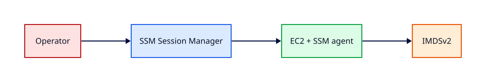

# User Data, IMDS, and SSM Session Manager

## Overview

**User data** bootstraps instances at first launch via cloud-init. The **Instance Metadata Service (IMDS)**
exposes instance identity and role credentials — protect it with IMDSv2. **SSM Session Manager**
delivers operator access without bastions or SSH keys.

You will write user data to install a web server, fetch metadata safely, harden IMDS, and open
an SSM session — the standard REBASH lab access pattern.

This is **Tutorial 10** in **Module 3: Compute** of the REBASH Academy AWS track.

!!! warning "Destroy lab resources and watch billing"
    Tear down every resource you create before you close your laptop. Set a **billing alarm**
    (see [Accounts, Free Tier, Billing, and Cost Hygiene](accounts-free-tier-billing-and-cost-hygiene.md))
    and check the Cost Explorer dashboard after each lab session.


## Prerequisites

- Completed [EC2 Fundamentals](ec2-fundamentals.md)

## Learning Objectives

By the end of this tutorial, you will be able to:

- [ ] Write cloud-init user data to configure software at boot
- [ ] Retrieve metadata with IMDSv2 token workflow
- [ ] Require IMDSv2 on new instances
- [ ] Connect with SSM and run port forwarding demo
- [ ] Review user data logs for debugging

## Architecture




## Theory

### User data lifecycle

- Runs at **first boot** (and optionally every reboot if configured)
- `#cloud-config` YAML or shell scripts
- Logs: `/var/log/cloud-init.log` on Amazon Linux

### IMDS paths

- `latest/meta-data/instance-id`
- `latest/meta-data/placement/availability-zone`
- `latest/meta-data/iam/security-credentials/ROLE_NAME`

### IMDSv2 token flow

```bash
TOKEN=$(curl -X PUT "http://169.254.169.254/latest/api/token" \
  -H "X-aws-ec2-metadata-token-ttl-seconds: 21600")
curl -H "X-aws-ec2-metadata-token: $TOKEN" \
  http://169.254.169.254/latest/meta-data/instance-id
```

### SSM Session Manager

Uses outbound HTTPS to SSM endpoints; supports port forwarding and logging to S3/CloudWatch.
No inbound security group rules required for admin.

## Hands-on Lab

Create `user-data.sh`:

```bash
#!/bin/bash
set -euxo pipefail
dnf install -y httpd
echo "rebash lab OK" > /var/www/html/index.html
systemctl enable --now httpd
```

Launch with user data (base64 handled by CLI file://):

```bash
aws ec2 run-instances \
  --image-id resolve_ssm:/aws/service/ami-amazon-linux-latest/al2023-ami-kernel-default-x86_64 \
  --instance-type t3.micro \
  --subnet-id $PUBLIC_SUBNET_ID \
  --security-group-ids $WEB_SG \
  --iam-instance-profile Name=rebash-ec2-ssm-profile \
  --user-data file://user-data.sh \
  --metadata-options HttpTokens=required,HttpPutResponseHopLimit=1 \
  --tag-specifications 'ResourceType=instance,Tags=[{Key=Name,Value=rebash-userdata-lab}]' \
  --region $LAB_REGION
```

SSM session and verify:

```bash
aws ssm start-session --target $INSTANCE_ID --region $LAB_REGION
sudo tail -50 /var/log/cloud-init.log
curl localhost
```

IMDSv2 from inside instance (see Theory). Teardown: terminate instance.

### LocalStack / dry-run alternative

With [LocalStack](https://localstack.cloud/) running on port 4566:

```bash
export AWS_ACCESS_KEY_ID=test
export AWS_SECRET_ACCESS_KEY=test
export AWS_DEFAULT_REGION=eu-west-1
aws --endpoint-url=http://localhost:4566 ec2 run-instances --user-data file://user-data.sh ...
```

Some services are emulated imperfectly — treat LocalStack as CLI practice, not a full AWS substitute.

## Validation

| Check | Pass criteria |
|-------|---------------|
| User data | `index.html` serves rebash message |
| cloud-init log | No fatal errors |
| IMDSv2 | Token required for metadata |
| SSM | Session opens without SSH |

## Code Walkthrough

| Mechanism | Detail |
|-----------|--------|
| `file://user-data.sh` | CLI encodes script at launch |
| `HttpPutResponseHopLimit=1` | Blocks container SSRF to IMDS |
| SSM agent | Preinstalled on Amazon Linux |
| cloud-init | Idempotent modules; mind first-boot only defaults |

## Security Considerations

- Never embed IAM access keys in user data — use instance profiles
- Require IMDSv2; hop limit 1 unless containers need metadata
- Enable SSM session logging in production
- User data is visible to anyone with `ec2:DescribeInstanceAttribute`

## Common Mistakes

!!! warning "Secrets in user data"
    Visible in console/API. **Fix:** Use Secrets Manager + role at runtime.

!!! warning "IMDSv1 enabled"
    Credential theft via SSRF. **Fix:** HttpTokens=required on all launches.

!!! warning "Assuming user data re-runs on reboot"
    Config drift. **Fix:** Use SSM Run Command or Ansible for changes.

## Best Practices

- Keep user data minimal — bootstrap only
- Golden AMI for heavy software stacks
- SSM as default admin path
- Log shipping via CloudWatch agent (Tutorial 18)

## Troubleshooting

| Issue | Cause | Fix |
|-------|-------|-----|
| User data not applied | Wrong shebang or MIME | Validate with cloud-init schema |
| 401 on metadata | Missing IMDSv2 token | Use token PUT first |
| SSM access denied | IAM or endpoint | Fix role policy; VPC endpoints |

## Production Patterns and Deep Dive

        ### How `User Data, IMDS, and SSM Session Manager` fits in real environments

        Engineers working on **Module 3: Compute** material use these concepts daily during design reviews,
        incident response, and cost optimisation workshops. The lab exercises prove you can execute;
        this section connects those commands to production trade-offs you will defend in interviews
        and on-call handovers.

        Production teams treating AWS as a first-class platform typically document:

        | Artefact | Purpose |
        |----------|---------|
        | Architecture decision record (ADR) | Why this service, alternatives rejected |
        | Runbook | Step-by-step operational procedures with rollback |
        | Teardown / DR checklist | What to destroy or fail over during exercises |
        | Cost owner | Who receives Budget alerts for resources tagged to this service |

        Always pair technical controls with **billing alarms** and a **destroy discipline** after
        experiments. The REBASH AWS track assumes British English documentation and explicit
        mention of Free Tier limits.

        ### Extended CLI and console reference

        The commands below extend the lab — run read-only variants first, then mutating operations
        in a non-production account. Replace `$LAB_REGION` and resource identifiers with your values.

        ```bash
aws ec2 describe-instances --instance-ids $INSTANCE_ID --query 'Reservations[].Instances[].MetadataOptions'
TOKEN=$(curl -X PUT "http://169.254.169.254/latest/api/token" -H "X-aws-ec2-metadata-token-ttl-seconds: 21600")
curl -H "X-aws-ec2-metadata-token: $TOKEN" http://169.254.169.254/latest/meta-data/iam/security-credentials/
aws ssm start-session --target $INSTANCE_ID
aws ssm describe-sessions --state History
```

        ### Operational scenario (table-top)

        **Scenario:** A teammate announces "customers cannot reach the application after a change."
        You suspect a misconfiguration related to **User Data, IMDS, and SSM Session Manager**.

        | Step | Action | Why |
        |------|--------|-----|
        | 1 | Confirm Region and account (`aws sts get-caller-identity`) | Wrong profile wastes triage time |
        | 2 | Check CloudWatch alarms and recent deploys | Correlates timeline |
        | 3 | Review CloudTrail events for API changes in this service | Identifies who changed what |
        | 4 | Compare running config to IaC/Terraform state | Detects manual console drift |
        | 5 | Roll back or restore last known good | Document in incident ticket |
        | 6 | Update runbook and least-privilege IAM if human error | Prevents repeat |

        ### Hardening checklist before production

        - [ ] IAM roles preferred over IAM users with long-lived keys
        - [ ] MFA enabled for privileged humans; root not used daily
        - [ ] Resources tagged `Environment`, `Owner`, `CostCentre`
        - [ ] Budgets and anomaly detection configured
        - [ ] Encryption at rest and in transit enabled where supported
        - [ ] No `0.0.0.0/0` administrative ports (use SSM Session Manager)
        - [ ] Teardown script or `terraform destroy` documented for non-prod environments
        - [ ] Cross-links reviewed: [Networking](../networking/index.md), [Linux](../linux/index.md), [Terraform](../terraform/index.md)

        ### When to choose a different AWS service

        No service exists in isolation. If **User Data, IMDS, and SSM Session Manager** feels forced, discuss alternatives with your
        team: managed versus self-managed, serverless versus EC2, or whether the workload belongs in
        another Region or account under AWS Organizations. Capture that decision in an ADR so future
        engineers understand the constraints you optimised for.

        ### Terraform handoff note

        After completing the AWS track, reproduce this tutorial's resources using modules in the
        [Terraform](../terraform/index.md) curriculum. Start with `required_providers` for `hashicorp/aws`,
        pin provider versions, store remote state in S3 with locking, and never commit secrets. The
        `user-data-imds-and-ssm-session-manager` lesson maps cleanly to named resources you will import or recreate in HCL.

        ### Review questions (self-check)

        Before moving to the next tutorial, answer without looking at notes:

        1. Which API calls in this lesson are **read-only** versus **mutating**?
        2. What is the first command you run to confirm account and Region?
        3. Which tags will you apply so Cost Explorer can attribute spend?
        4. How do you destroy lab resources created here?
        5. Which [Networking](../networking/index.md) or [Linux](../linux/index.md) concept underpins this AWS service?

        ### Additional references inside AWS

        Browse the official **AWS Documentation** centre for `User Data, IMDS, and SSM Session Manager` — focus on quotas, API permissions,
        and CloudWatch metrics emitted by the service. Bookmark the **Pricing** page for the service and
        add a line item to your personal cheat sheet noting Free Tier eligibility and the most common
        bill surprise mentioned in this tutorial.

## Summary

- User data bootstraps instances; keep secrets out of it
- **IMDSv2** protects role credentials; **SSM** replaces SSH for access
- Terminate lab instances; confirm billing alarms remain active

## Interview Questions

1. When does user data execute?
2. How fetch instance-id with IMDSv2?
3. Why not put AWS keys in user data?
4. SSM vs SSH trade-offs?
5. What is hop limit on IMDS?
6. Where debug failed user data?
7. Can user data be changed after launch?
8. How SSM port forwarding works?
9. Role credentials rotation on instance?
10. cloud-init vs SSM Run Command?

!!! tip "Sample answer — question 2"
    PUT to `/latest/api/token` with TTL header returns a token; subsequent GETs to metadata paths must include `X-aws-ec2-metadata-token`. IMDSv1 allowed GET without token — deprecated.


!!! tip "Sample answer — question 4"
    SSM needs outbound 443 and an instance profile — no inbound SG rules, full audit logging possible, works for private subnets with endpoints. SSH requires key management and often opens port 22.


## Related Tutorials

- Track overview: [AWS](index.md)
- Previous: [EC2 Fundamentals](ec2-fundamentals.md)
- Next: [EBS Volumes, Snapshots, and Encryption](ebs-volumes-snapshots-and-encryption.md)
- [Terraform track](../terraform/index.md) — automate these patterns next


## References

1. [EC2 user data](https://docs.aws.amazon.com/AWSEC2/latest/UserGuide/user-data.html)
2. [Configure IMDS](https://docs.aws.amazon.com/AWSEC2/latest/UserGuide/configuring-instance-metadata-service.html)
3. [Session Manager](https://docs.aws.amazon.com/systems-manager/latest/userguide/session-manager.html)
