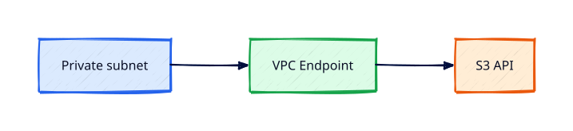

# VPC Endpoints and Private AWS Access

## Overview

Private subnets should reach S3, DynamoDB, and SSM without traversing the public internet or
expensive NAT. **VPC endpoints** provide that path: **Gateway** endpoints for S3/DynamoDB and
**Interface** endpoints (PrivateLink) for most other AWS APIs.

You will add an S3 gateway endpoint and an SSM interface endpoint, update route tables or DNS,
and verify private-only access patterns suitable for production tiers.

This is **Tutorial 8** in **Module 2: VPC Networking** of the REBASH Academy AWS track.

!!! warning "Destroy lab resources and watch billing"
    Tear down every resource you create before you close your laptop. Set a **billing alarm**
    (see [Accounts, Free Tier, Billing, and Cost Hygiene](accounts-free-tier-billing-and-cost-hygiene.md))
    and check the Cost Explorer dashboard after each lab session.


## Prerequisites

- Completed [Security Groups and NACLs](security-groups-and-nacls.md)

## Learning Objectives

By the end of this tutorial, you will be able to:

- [ ] Compare Gateway vs Interface VPC endpoints
- [ ] Create an S3 Gateway endpoint and associate route tables
- [ ] Create an Interface endpoint for SSM or EC2 messages
- [ ] Explain DNS considerations for interface endpoints
- [ ] Remove endpoints during teardown (interface endpoints bill hourly)

## Architecture




## Theory

### Gateway endpoints (S3, DynamoDB)

- Free to use; no hourly charge
- Added as a route in **route table** (`pl-xxx` prefix list target)
- No security group on the endpoint itself

### Interface endpoints (PrivateLink)

- ENI in your subnet with hourly + data charges (lower than NAT for AWS-only traffic)
- Requires **private DNS** enablement for seamless API calls
- Security group on endpoint ENI — allow 443 from clients

### SSM required endpoints (private subnet)

For Session Manager without internet:

- `com.amazonaws.region.ssm`
- `com.amazonaws.region.ssmmessages`
- `com.amazonaws.region.ec2messages`

### Cost note

Interface endpoints have hourly cost but often **replace NAT GB charges** for AWS API traffic.
Still **destroy lab endpoints** after validation.

## Hands-on Lab

```bash
export LAB_REGION=eu-west-1

aws ec2 create-vpc-endpoint --vpc-id $VPC_ID --service-name com.amazonaws.${LAB_REGION}.s3 \
  --route-table-ids $PRIVATE_RTB_ID --region $LAB_REGION

aws ec2 create-vpc-endpoint --vpc-id $VPC_ID \
  --service-name com.amazonaws.${LAB_REGION}.ssm \
  --vpc-endpoint-type Interface \
  --subnet-ids $PRIVATE_SUBNET_ID \
  --security-group-ids $ENDPOINT_SG \
  --private-dns-enabled --region $LAB_REGION
```

From private EC2 with SSM role (no public IP):

```bash
aws s3 ls   # uses gateway route
aws ssm describe-instance-information --region $LAB_REGION
```

Teardown:

```bash
aws ec2 delete-vpc-endpoints --vpc-endpoint-ids vpce-xxx --region $LAB_REGION
```

### LocalStack / dry-run alternative

With [LocalStack](https://localstack.cloud/) running on port 4566:

```bash
export AWS_ACCESS_KEY_ID=test
export AWS_SECRET_ACCESS_KEY=test
export AWS_DEFAULT_REGION=eu-west-1
aws --endpoint-url=http://localhost:4566 ec2 describe-vpc-endpoints
    aws --endpoint-url=http://localhost:4566 s3 mb s3://rebash-lab-bucket
```

Some services are emulated imperfectly — treat LocalStack as CLI practice, not a full AWS substitute.

## Validation

| Check | Pass criteria |
|-------|---------------|
| S3 endpoint | Route table entry to prefix list |
| SSM endpoint | Interface ENI in private subnet |
| Private EC2 | SSM session without public IP |
| Teardown | No interface endpoints left billing |

## Code Walkthrough

| Endpoint type | Billing | Routing |
|---------------|---------|---------|
| Gateway S3 | No hourly | Route table entry |
| Interface SSM | Hourly ENI | Private DNS resolves API name |
| vs NAT | NAT charges internet GB | Endpoints only for AWS APIs |

## Security Considerations

- Restrict endpoint SG to client SGs only on 443
- Use endpoint policies to limit S3 bucket access via endpoint
- Prefer private access over public S3 URLs for internal data

## Common Mistakes

!!! warning "Interface endpoint left running"
    Hourly charges accumulate. **Fix:** Delete after lab.

!!! warning "Private DNS disabled"
    SDK still resolves public IPs. **Fix:** Enable private DNS on interface endpoints.

!!! warning "Missing ssmmessages endpoint"
    SSM sessions fail in private subnet. **Fix:** Create all three SSM-related endpoints.

## Best Practices

- Gateway endpoints for S3/DynamoDB in every production VPC
- Interface endpoints for SSM, ECR, Secrets Manager in private tiers
- Endpoint policies for exfiltration guardrails

## Troubleshooting

| Issue | Cause | Fix |
|-------|-------|-----|
| S3 still public IP | Missing gateway route | Associate endpoint with RTB |
| SSM timeout private | Missing endpoint or SG | Add endpoints; open 443 on endpoint SG |
| DNS resolution fails | Private DNS off | Enable on interface endpoint |

## Production Patterns and Deep Dive

        ### How `VPC Endpoints and Private AWS Access` fits in real environments

        Engineers working on **Module 2: VPC Networking** material use these concepts daily during design reviews,
        incident response, and cost optimisation workshops. The lab exercises prove you can execute;
        this section connects those commands to production trade-offs you will defend in interviews
        and on-call handovers.

        Production teams treating AWS as a first-class platform typically document:

        | Artefact | Purpose |
        |----------|---------|
        | Architecture decision record (ADR) | Why this service, alternatives rejected |
        | Runbook | Step-by-step operational procedures with rollback |
        | Teardown / DR checklist | What to destroy or fail over during exercises |
        | Cost owner | Who receives Budget alerts for resources tagged to this service |

        Always pair technical controls with **billing alarms** and a **destroy discipline** after
        experiments. The REBASH AWS track assumes British English documentation and explicit
        mention of Free Tier limits.

        ### Extended CLI and console reference

        The commands below extend the lab — run read-only variants first, then mutating operations
        in a non-production account. Replace `$LAB_REGION` and resource identifiers with your values.

        ```bash
aws ec2 describe-vpc-endpoints --filters Name=vpc-id,Values=$VPC_ID
aws ec2 create-vpc-endpoint --vpc-id $VPC_ID --service-name com.amazonaws.eu-west-1.s3 --route-table-ids $RTB_ID
aws ec2 modify-vpc-endpoint --vpc-endpoint-id vpce-xxx --private-dns-enabled
aws ec2 describe-prefix-lists --filters Name=prefix-list-name,Values=com.amazonaws.eu-west-1.s3
```

        ### Operational scenario (table-top)

        **Scenario:** A teammate announces "customers cannot reach the application after a change."
        You suspect a misconfiguration related to **VPC Endpoints and Private AWS Access**.

        | Step | Action | Why |
        |------|--------|-----|
        | 1 | Confirm Region and account (`aws sts get-caller-identity`) | Wrong profile wastes triage time |
        | 2 | Check CloudWatch alarms and recent deploys | Correlates timeline |
        | 3 | Review CloudTrail events for API changes in this service | Identifies who changed what |
        | 4 | Compare running config to IaC/Terraform state | Detects manual console drift |
        | 5 | Roll back or restore last known good | Document in incident ticket |
        | 6 | Update runbook and least-privilege IAM if human error | Prevents repeat |

        ### Hardening checklist before production

        - [ ] IAM roles preferred over IAM users with long-lived keys
        - [ ] MFA enabled for privileged humans; root not used daily
        - [ ] Resources tagged `Environment`, `Owner`, `CostCentre`
        - [ ] Budgets and anomaly detection configured
        - [ ] Encryption at rest and in transit enabled where supported
        - [ ] No `0.0.0.0/0` administrative ports (use SSM Session Manager)
        - [ ] Teardown script or `terraform destroy` documented for non-prod environments
        - [ ] Cross-links reviewed: [Networking](../networking/index.md), [Linux](../linux/index.md), [Terraform](../terraform/index.md)

        ### When to choose a different AWS service

        No service exists in isolation. If **VPC Endpoints and Private AWS Access** feels forced, discuss alternatives with your
        team: managed versus self-managed, serverless versus EC2, or whether the workload belongs in
        another Region or account under AWS Organizations. Capture that decision in an ADR so future
        engineers understand the constraints you optimised for.

        ### Terraform handoff note

        After completing the AWS track, reproduce this tutorial's resources using modules in the
        [Terraform](../terraform/index.md) curriculum. Start with `required_providers` for `hashicorp/aws`,
        pin provider versions, store remote state in S3 with locking, and never commit secrets. The
        `vpc-endpoints-and-private-aws-access` lesson maps cleanly to named resources you will import or recreate in HCL.

        ### Review questions (self-check)

        Before moving to the next tutorial, answer without looking at notes:

        1. Which API calls in this lesson are **read-only** versus **mutating**?
        2. What is the first command you run to confirm account and Region?
        3. Which tags will you apply so Cost Explorer can attribute spend?
        4. How do you destroy lab resources created here?
        5. Which [Networking](../networking/index.md) or [Linux](../linux/index.md) concept underpins this AWS service?

        ### Additional references inside AWS

        Browse the official **AWS Documentation** centre for `VPC Endpoints and Private AWS Access` — focus on quotas, API permissions,
        and CloudWatch metrics emitted by the service. Bookmark the **Pricing** page for the service and
        add a line item to your personal cheat sheet noting Free Tier eligibility and the most common
        bill surprise mentioned in this tutorial.

## Summary

- Gateway endpoints route S3/DynamoDB privately; interface endpoints cover most AWS APIs
- Enable SSM endpoints for private subnet admin without NAT
- Destroy interface endpoints after labs; monitor billing

## Interview Questions

1. Gateway vs Interface endpoint?
2. Which services support Gateway endpoints?
3. Why enable private DNS on interface endpoints?
4. How do endpoint policies differ from IAM?
5. SSM endpoints needed for private instances?
6. Cost comparison NAT vs interface endpoint for S3 API traffic?
7. Security group on interface endpoint purpose?
8. Can endpoints replace all internet egress?
9. What is AWS PrivateLink?
10. How do you verify traffic uses the endpoint?

!!! tip "Sample answer — question 1"
    Gateway endpoints are free route table targets for S3 and DynamoDB only. Interface endpoints place an ENI in your subnet with PrivateLink, usable for most AWS services, with hourly and data charges but no internet traversal.


!!! tip "Sample answer — question 5"
    Typically `ssm`, `ssmmessages`, and `ec2messages` interface endpoints in the same Region, plus an instance profile with SSM permissions and SG allowing HTTPS to the endpoint ENI.


## Related Tutorials

- Track overview: [AWS](index.md)
- Previous: [Security Groups and NACLs](security-groups-and-nacls.md)
- Next: [EC2 Fundamentals](ec2-fundamentals.md)
- [Networking track](../networking/index.md) — TCP/IP and routing before VPC specifics
- [Cloud Networking: VPC and Subnets](../networking/cloud-networking-vpc-and-subnets.md) — conceptual VPC model
- [Linux track](../linux/index.md) — host skills for EC2 and SSM
- [Terraform track](../terraform/index.md) — automate these patterns next

- [Networking track](../networking/index.md) — TCP/IP and routing before VPC specifics
- [Cloud Networking: VPC and Subnets](../networking/cloud-networking-vpc-and-subnets.md) — conceptual VPC model
- [Linux track](../linux/index.md) — host skills for EC2 and SSM

## References

1. [VPC endpoints](https://docs.aws.amazon.com/vpc/latest/privatelink/vpc-endpoints.html)
2. [Gateway endpoints](https://docs.aws.amazon.com/vpc/latest/privatelink/gateway-endpoints.html)
3. [SSM VPC endpoints](https://docs.aws.amazon.com/systems-manager/latest/userguide/session-manager-getting-started-privatelink.html)
