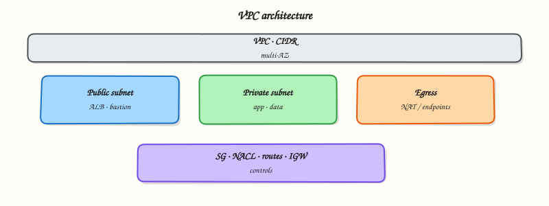

# VPC Networking on AWS

## Overview


Design a production-shaped Amazon Virtual Private Cloud (VPC): Classless Inter-Domain Routing (CIDR) plan, public and private subnets across Availability Zones (AZs), routing, Internet Gateway (IGW), Network Address Translation (NAT), security groups, network access control lists (NACLs), and when to use peering, Transit Gateway (TGW), endpoints, and Amazon Route 53.

Almost every AWS workload sits in a **VPC** — your isolated network in a Region. Poor CIDR planning and “open to `0.0.0.0/0`” security groups cause outages and breaches. This module builds the mental model Cloud, DevOps, and platform engineers use daily.

!!! warning "Cost"
    **NAT Gateways** and **Transit Gateway** attachments bill hourly plus data processing. Prefer **VPC endpoints** for AWS APIs from private subnets when you can. Destroy lab VPCs, NAT Gateways, and Elastic IPs before you finish. Use `--dry-run` where supported.

This is a core tutorial in **Module 3 · Networking** of the REBASH Academy **AWS for Cloud & DevOps Engineers** series — written for Cloud, DevOps, Platform, and SRE engineers.


## Prerequisites


- [IAM, Identity Access, and Organizations](iam-identity-access-and-organizations.md)
- [Networking Fundamentals](../networking/index.md) — CIDR, routing, TCP/UDP


## Learning Objectives


By the end of this tutorial, you will be able to:

- [ ] Plan a non-overlapping VPC CIDR and multi-AZ public/private subnet layout  
- [ ] Explain routing with Internet Gateway, NAT Gateway, and route tables  
- [ ] Contrast security groups and Network ACLs (NACLs)  
- [ ] Choose VPC peering vs Transit Gateway vs VPC endpoints  
- [ ] Place Amazon Route 53 public/private zones and health checks in the design


## Architecture


This topic’s control points and relationships are shown below.




## Theory


### What it is

An **Amazon Virtual Private Cloud (VPC)** is your isolated, Region-scoped virtual network on AWS. You control Internet Protocol (IP) addressing with Classless Inter-Domain Routing (CIDR) blocks, place resources in subnets across Availability Zones (AZs), and steer traffic with route tables, gateways, security controls, and optional private connectivity to other VPCs or AWS services. Almost every production workload lives inside a VPC.

### Why it matters

Platform teams standardise multi-AZ public subnets (load balancers) and private subnets (apps, data), central egress, no public database addresses, and S3 gateway endpoints so traffic stays on the AWS network. CI/CD runners and Kubernetes nodes need predictable egress and security-group hygiene. Site Reliability Engineering (SRE) incidents often trace to missing routes, Network ACL asymmetry, or open security groups — not application code. Poor CIDR planning blocks peering later.

### How it works

1. Choose a non-overlapping CIDR (for example `10.20.0.0/16`).  
2. Carve per-AZ public `/24`s (load balancers), private `/24`s (apps), optional data `/24`s (no NAT).  
3. Attach an **Internet Gateway**; public default route `0.0.0.0/0` → IGW.  
4. Place a **NAT Gateway** per AZ for private egress; private routes → NAT.  
5. **Security groups** allow only required ports (prefer source SGs over wide CIDRs).  
6. Gateway endpoints for S3/DynamoDB; interface endpoints when APIs must avoid NAT.  
7. Many VPCs → **Transit Gateway**; simple pairs → peering.  
8. **Route 53** private zones for internal names; public zones for internet DNS.

Path: client → Route 53 → public LB → private app → DB SG; egress via NAT or endpoints.

### Concept deep dive

- **Amazon VPC** — Logical network boundary in one Region. Resources get private IPs; internet reachability depends on gateways and routes, not on “being in AWS” alone.
- **CIDR** — Address plan for the VPC and each subnet. Avoid overlapping on-premises or peer VPC ranges. Leave headroom; reclaiming a `/16` mid-flight is painful.
- **Public and private subnets** — Public when the route table sends `0.0.0.0/0` to an Internet Gateway (instances may get public IPs). Private subnets have no direct IGW route; outbound IPv4 usually uses a NAT Gateway. Apps and databases stay private; load balancers sit in public subnets.
- **Route tables** — Next hop per destination: `local`, Internet Gateway, NAT Gateway, peering, Transit Gateway, or VPC endpoint. Associate the correct table with each subnet.
- **Internet Gateway (IGW)** — Highly available gateway for bidirectional internet traffic to public-subnet resources with public or Elastic IPs.
- **NAT Gateway** — Managed NAT for private-subnet IPv4 egress. Bills hourly plus data processing. Use one per AZ in production to avoid an egress SPOF and reduce cross-AZ charges.
- **Security groups** — Stateful firewalls on elastic network interfaces. Allow rules only; return traffic is tracked. Prefer other security groups as sources for tiered apps.
- **Network ACL (NACL)** — Stateless subnet-level allow/deny. You must allow ephemeral ports for return traffic. Use Network ACLs for coarse denies; keep day-to-day controls in security groups.
- **VPC peering** — One-to-one private link between two VPCs. Non-transitive: A↔B and B↔C does not imply A↔C. Fine for a few VPCs; painful as a mesh.
- **Transit Gateway (TGW)** — Hub-and-spoke for many VPCs and hybrid attachments. Prefer TGW over a peering mesh as VPC count grows.
- **VPC endpoints** — Private AWS API access without the public internet. **Gateway endpoints** (S3, DynamoDB) update route tables. **Interface endpoints** (PrivateLink) place ENIs in your subnets for most other services.
- **Route 53** — Authoritative DNS. **Public hosted zones** answer on the internet; **private hosted zones** resolve inside associated VPCs. **Health checks** monitor endpoints and can drive DNS failover.

### Key concepts and comparisons

| Decision | Prefer |
|----------|--------|
| App servers with public IPs? | No — private subnets + load balancer |
| Database exposure | Private subnet; security group from app tier only |
| Many VPCs | Transit Gateway hub, not a peering mesh |
| S3 from private subnet | Gateway endpoint before paying for NAT |
| Firewall model | Security groups primary; Network ACL for coarse deny |
| Internal service names | Route 53 private hosted zones |

### Common pitfalls

- Exhausting a `/16` because teams carved huge `/20`s without a plan  
- Single NAT Gateway in one AZ (egress SPOF and cross-AZ charges)  
- Security group `0.0.0.0/0` on SSH/RDP or database ports  
- Expecting VPC peering to be transitive  
- Forgetting Network ACL ephemeral ports on return traffic (stateless)  
- Leaving lab NAT Gateways running overnight  
- Treating Route 53 health checks as a substitute for multi-AZ application design


## Hands-on Lab


Create a workspace for this tutorial.

```bash
mkdir -p ~/rebash-aws/module-03 && cd ~/rebash-aws/module-03
```

**Focus:** describe existing VPCs/subnets/route tables (read-only)

### Step 1 – Network inventory

```bash
aws sts get-caller-identity
aws ec2 describe-vpcs --query 'Vpcs[].{Id:VpcId,Cidr:CidrBlock,Default:IsDefault}' --output table
aws ec2 describe-subnets --query 'Subnets[].{Id:SubnetId,Vpc:VpcId,Az:AvailabilityZone,Cidr:CidrBlock}' --output table
aws ec2 describe-route-tables --query 'RouteTables[0:3].{Id:RouteTableId,Vpc:VpcId}' --output table
```

### Step 2 – Design notes only

```bash
cat > vpc-design.md << 'EOF'
Public subnet: route to IGW
Private subnet: NAT is costly while idle — avoid in labs without destroy plan
Security groups: stateful allow-lists
EOF
```

### Final step – Cleanup note

```bash
# COST WARNING: prefer describe/list APIs. Destroy anything you create.
# Keep ~/rebash-aws/ for later tutorials
```


## Validation


- [ ] Lab commands run under `~/rebash-aws/module-03/`
- [ ] You can explain each Theory section in your own words
- [ ] You used modern tooling where it applies to this topic
- [ ] You can describe one production failure mode for this topic


## Code Walkthrough


Production practice for **VPC Networking on AWS** always combines:

1. Inspect before you change (status, plan, logs, dry-run)
2. Prefer reversible, documented changes (Git, IaC, drop-ins, version pins)
3. Capture evidence (command output, pipeline logs) for handovers
4. Prefer current tools and APIs over legacy shortcuts
5. Least privilege — escalate credentials only when required

Keep runbooks short enough to follow under pressure. Automate checks; keep humans for judgement.


## Security Considerations


- Treat credentials and tokens for aws as privileged — never commit them
- Prefer short-lived auth (OIDC, roles, SSO) over long-lived keys
- Validate blast radius before apply/deploy/delete operations
- Restrict who can approve production changes
- Collect audit logs; limit who can read sensitive traces


## Common Mistakes


!!! warning "Exhausting a `/16` because teams carved huge `/20`s without a plan  "
    Validate assumptions against the Theory section and official docs before changing production.

!!! warning "Single NAT Gateway in one AZ (egress SPOF and cross-AZ charges)  "
    Lab shortcuts (open security groups, admin roles, skip approvals) must not ship unchanged.

!!! warning "Changing production without a rollback path"
    Always know how to revert (previous artefact, prior release, state rollback, DNS failback).


## Best Practices


- Encode VPC Networking on AWS changes as code and review them in pull requests
- Pin versions (images, modules, actions, provider plugins)
- Separate environments with clear promotion gates
- Alert on symptoms with runbooks attached
- Destroy lab resources; tag everything with owner and expiry where possible


## Troubleshooting


| Symptom | Likely cause | Fix |
|---------|--------------|-----|
| Auth / permission denied | Wrong identity, policy, or scope | Check caller identity, roles, and least-privilege policies |
| Timeout / no route | Network, DNS, security group, or endpoint | Trace path, DNS, and allow-lists before retrying |
| Drift / unexpected plan | Manual change or wrong state/workspace | Reconcile desired vs actual; avoid click-ops on managed resources |
| Pipeline/job red | Flaky step, cache, or missing secret | Read failing step logs; bisect recent workflow/config changes |
| Cost spike | Idle load balancer, NAT, oversized compute | Inventory billable resources; stop/delete labs promptly |


## Summary


**VPC Networking on AWS** is essential for Cloud and DevOps engineers working with aws. Practise the lab until the inspection and change path is muscle memory, then continue the track.


## Interview Questions


1. Public versus private subnet routing?
2. Security group versus NACL?
3. Why are NAT gateways a cost surprise?
4. How do you troubleshoot no route to host for EC2?
5. VPC endpoints — when do they help?

!!! tip "Sample answer — question 2"
    Trace route tables, subnet association, security groups, and NACLs in that order.

!!! tip "Sample answer — question 4"
    Avoid 0.0.0.0/0 SSH from the world. Prefer SSM Session Manager.


## Related Tutorials


- [Course overview](index.md)
- [Compute: EC2, ASG, and Load Balancing](compute-ec2-asg-and-load-balancing.md)


## References


- [Amazon VPC User Guide](https://docs.aws.amazon.com/vpc/latest/userguide/what-is-amazon-vpc.html)  
- [Security groups vs NACLs](https://docs.aws.amazon.com/vpc/latest/userguide/vpc-security-comparison.html)  
- [VPC endpoints](https://docs.aws.amazon.com/vpc/latest/privatelink/vpc-endpoints.html)  
- [Transit Gateway](https://docs.aws.amazon.com/vpc/latest/tgw/what-is-transit-gateway.html)
