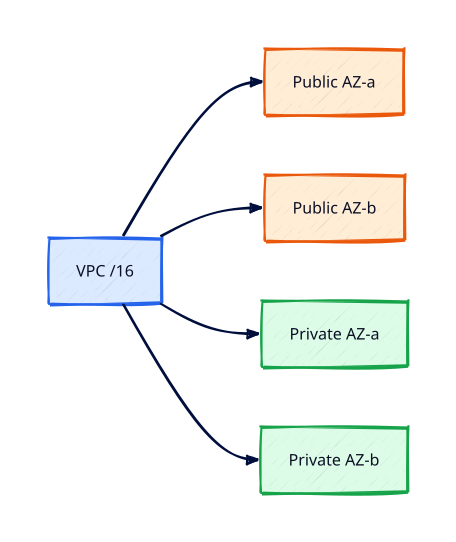

# VPC, Subnets, and Multi-AZ Design

## Overview

A **Virtual Private Cloud (VPC)** is your isolated network in AWS. Subnets slice the VPC CIDR
across **Availability Zones** so you can build tiers that survive single-AZ failure.

You will design a small multi-AZ VPC with public and private subnets, associate route tables,
and document why production apps spread across at least two AZs. This tutorial connects REBASH
networking theory to AWS objects you will use in every later compute and data lab.

This is **Tutorial 5** in **Module 2: VPC Networking** of the REBASH Academy AWS track.

!!! warning "Destroy lab resources and watch billing"
    Tear down every resource you create before you close your laptop. Set a **billing alarm**
    (see [Accounts, Free Tier, Billing, and Cost Hygiene](accounts-free-tier-billing-and-cost-hygiene.md))
    and check the Cost Explorer dashboard after each lab session.


## Prerequisites

- Completed [AWS CLI, Credentials, and Profiles](aws-cli-credentials-and-profiles.md)
- Read [Cloud Networking: VPC and Subnets](../networking/cloud-networking-vpc-and-subnets.md)
- Understanding of CIDR and subnetting from [Networking](../networking/index.md)

## Learning Objectives

By the end of this tutorial, you will be able to:

- [ ] Plan VPC CIDR and subnet sizes without overlap
- [ ] Create public and private subnets in two AZs
- [ ] Associate route tables and explain default routes
- [ ] Tag VPC resources for cost and ownership
- [ ] Destroy the lab VPC cleanly to avoid NAT charges later

## Architecture




## Theory

### VPC and subnet fundamentals

| Object | Scope | Key field |
|--------|-------|-----------|
| VPC | Regional | `CidrBlock` e.g. `10.20.0.0/16` |
| Subnet | Single AZ | `CidrBlock` subset of VPC |
| Route table | Subnet association | Routes to IGW, NAT, local |
| Internet Gateway | VPC attachment | Public ingress/egress |

### Public vs private subnet

A **public** subnet has a route `0.0.0.0/0` → **Internet Gateway (IGW)** and instances with
public IPs (or an Elastic IP). A **private** subnet has no direct IGW route; outbound internet
uses NAT (Tutorial 6 — prefer SSM instead for labs).

### Multi-AZ design pattern

```
AZ-a: public 10.20.1.0/24 | private 10.20.11.0/24
AZ-b: public 10.20.2.0/24 | private 10.20.12.0/24
```

Load balancers and RDS subnet groups span both AZs; EC2 Auto Scaling replaces failed AZ capacity.

### IP planning

Reserve space for growth. `/16` VPC with `/24` subnets is a common lab pattern. Avoid overlapping
with on-premises ranges you may VPN later.

### Default VPC

Older accounts may still have a default VPC. Labs create a dedicated `rebash-lab-vpc` to practice
explicit design — production rarely relies on defaults.

## Hands-on Lab

Set variables:

```bash
export AWS_PROFILE=rebash-lab
export LAB_REGION=eu-west-1
export VPC_CIDR=10.20.0.0/16
```

### Step 1 — Create VPC and subnets

```bash
VPC_ID=$(aws ec2 create-vpc --cidr-block $VPC_CIDR --tag-specifications \
  'ResourceType=vpc,Tags=[{Key=Name,Value=rebash-lab-vpc},{Key=Environment,Value=lab}]' \
  --query Vpc.VpcId --output text --region $LAB_REGION)

aws ec2 create-subnet --vpc-id $VPC_ID --cidr-block 10.20.1.0/24 \
  --availability-zone ${LAB_REGION}a \
  --tag-specifications 'ResourceType=subnet,Tags=[{Key=Name,Value=rebash-public-a}]' \
  --region $LAB_REGION

aws ec2 create-subnet --vpc-id $VPC_ID --cidr-block 10.20.2.0/24 \
  --availability-zone ${LAB_REGION}b \
  --tag-specifications 'ResourceType=subnet,Tags=[{Key=Name,Value=rebash-public-b}]' \
  --region $LAB_REGION

aws ec2 create-subnet --vpc-id $VPC_ID --cidr-block 10.20.11.0/24 \
  --availability-zone ${LAB_REGION}a \
  --tag-specifications 'ResourceType=subnet,Tags=[{Key=Name,Value=rebash-private-a}]' \
  --region $LAB_REGION

aws ec2 create-subnet --vpc-id $VPC_ID --cidr-block 10.20.12.0/24 \
  --availability-zone ${LAB_REGION}b \
  --tag-specifications 'ResourceType=subnet,Tags=[{Key=Name,Value=rebash-private-b}]' \
  --region $LAB_REGION
```

### Step 2 — Verify

```bash
aws ec2 describe-subnets --filters Name=vpc-id,Values=$VPC_ID \
  --query 'Subnets[*].[SubnetId,CidrBlock,AvailabilityZone,Tags[?Key==`Name`].Value|[0]]' \
  --output table --region $LAB_REGION
```

### Step 3 — Teardown (same session)

```bash
# delete subnets, then vpc (after detaching IGW in later tutorials if added)
aws ec2 describe-subnets --filters Name=vpc-id,Values=$VPC_ID --query 'Subnets[].SubnetId' \
  --output text --region $LAB_REGION | xargs -n1 aws ec2 delete-subnet --subnet-id --region $LAB_REGION
aws ec2 delete-vpc --vpc-id $VPC_ID --region $LAB_REGION
```

### LocalStack / dry-run alternative

With [LocalStack](https://localstack.cloud/) running on port 4566:

```bash
export AWS_ACCESS_KEY_ID=test
export AWS_SECRET_ACCESS_KEY=test
export AWS_DEFAULT_REGION=eu-west-1
aws --endpoint-url=http://localhost:4566 ec2 create-vpc --cidr-block 10.20.0.0/16
    aws --endpoint-url=http://localhost:4566 ec2 describe-vpcs --output table
```

Some services are emulated imperfectly — treat LocalStack as CLI practice, not a full AWS substitute.

## Validation

| Check | Pass criteria |
|-------|---------------|
| VPC | `rebash-lab-vpc` with `/16` CIDR |
| Subnets | Four subnets across two AZs |
| Tags | `Environment=lab` present |
| Teardown | VPC deleted; no stray subnets |

## Code Walkthrough

| Resource | Walkthrough note |
|----------|------------------|
| `create-vpc` | Regional; CIDR cannot change after creation |
| `create-subnet` | AZ is immutable; plan AZ spread upfront |
| Tags | Required for Cost Explorer activation |
| Teardown order | Dependents (instances, IGW) before VPC delete |

## Security Considerations

- Private subnets for application tiers; public only for load balancers or bastion-less patterns
- Use Network ACLs and security groups (Tutorial 7) for defence in depth
- Flow logs (optional) for audit — enable in production VPCs

## Common Mistakes

!!! warning "Single AZ for production tiers"
    AZ outage takes app offline. **Fix:** Spread subnets and ASG across ≥2 AZs.

!!! warning "Overlapping CIDR with office VPN"
    Routing conflicts later. **Fix:** Document IPAM; use non-overlapping RFC1918 ranges.

!!! warning "Forgetting teardown"
    Orphan subnets rarely bill alone but clutter quotas. **Fix:** Delete VPC at end of lab.

## Best Practices

- One VPC per environment or account in production
- IPAM or spreadsheet for CIDR allocation
- Enable DNS hostnames/support on VPC for internal names
- Automate with Terraform modules after this track

## Troubleshooting

| Issue | Cause | Fix |
|-------|-------|-----|
| `InvalidSubnet.Range` | CIDR outside VPC | Recalculate subnet bounds |
| Cannot delete VPC | Dependencies remain | Delete IGW, subnets, endpoints first |
| AZ name error | Region typo | Use `${REGION}a` pattern carefully |

## Production Patterns and Deep Dive

        ### How `VPC, Subnets, and Multi-AZ Design` fits in real environments

        Engineers working on **Module 2: VPC Networking** material use these concepts daily during design reviews,
        incident response, and cost optimisation workshops. The lab exercises prove you can execute;
        this section connects those commands to production trade-offs you will defend in interviews
        and on-call handovers.

        Production teams treating AWS as a first-class platform typically document:

        | Artefact | Purpose |
        |----------|---------|
        | Architecture decision record (ADR) | Why this service, alternatives rejected |
        | Runbook | Step-by-step operational procedures with rollback |
        | Teardown / DR checklist | What to destroy or fail over during exercises |
        | Cost owner | Who receives Budget alerts for resources tagged to this service |

        Always pair technical controls with **billing alarms** and a **destroy discipline** after
        experiments. The REBASH AWS track assumes British English documentation and explicit
        mention of Free Tier limits.

        ### Extended CLI and console reference

        The commands below extend the lab — run read-only variants first, then mutating operations
        in a non-production account. Replace `$LAB_REGION` and resource identifiers with your values.

        ```bash
aws ec2 describe-vpcs --filters Name=tag:Environment,Values=lab
aws ec2 describe-subnets --filters Name=vpc-id,Values=$VPC_ID --output table
aws ec2 describe-route-tables --filters Name=vpc-id,Values=$VPC_ID
aws ec2 describe-network-acls --filters Name=vpc-id,Values=$VPC_ID
aws ec2 modify-vpc-attribute --vpc-id $VPC_ID --enable-dns-hostnames
aws ec2 modify-vpc-attribute --vpc-id $VPC_ID --enable-dns-support
```

Cross-read [Cloud Networking: VPC and Subnets](../networking/cloud-networking-vpc-and-subnets.md).

        ### Operational scenario (table-top)

        **Scenario:** A teammate announces "customers cannot reach the application after a change."
        You suspect a misconfiguration related to **VPC, Subnets, and Multi-AZ Design**.

        | Step | Action | Why |
        |------|--------|-----|
        | 1 | Confirm Region and account (`aws sts get-caller-identity`) | Wrong profile wastes triage time |
        | 2 | Check CloudWatch alarms and recent deploys | Correlates timeline |
        | 3 | Review CloudTrail events for API changes in this service | Identifies who changed what |
        | 4 | Compare running config to IaC/Terraform state | Detects manual console drift |
        | 5 | Roll back or restore last known good | Document in incident ticket |
        | 6 | Update runbook and least-privilege IAM if human error | Prevents repeat |

        ### Hardening checklist before production

        - [ ] IAM roles preferred over IAM users with long-lived keys
        - [ ] MFA enabled for privileged humans; root not used daily
        - [ ] Resources tagged `Environment`, `Owner`, `CostCentre`
        - [ ] Budgets and anomaly detection configured
        - [ ] Encryption at rest and in transit enabled where supported
        - [ ] No `0.0.0.0/0` administrative ports (use SSM Session Manager)
        - [ ] Teardown script or `terraform destroy` documented for non-prod environments
        - [ ] Cross-links reviewed: [Networking](../networking/index.md), [Linux](../linux/index.md), [Terraform](../terraform/index.md)

        ### When to choose a different AWS service

        No service exists in isolation. If **VPC, Subnets, and Multi-AZ Design** feels forced, discuss alternatives with your
        team: managed versus self-managed, serverless versus EC2, or whether the workload belongs in
        another Region or account under AWS Organizations. Capture that decision in an ADR so future
        engineers understand the constraints you optimised for.

        ### Terraform handoff note

        After completing the AWS track, reproduce this tutorial's resources using modules in the
        [Terraform](../terraform/index.md) curriculum. Start with `required_providers` for `hashicorp/aws`,
        pin provider versions, store remote state in S3 with locking, and never commit secrets. The
        `vpc-subnets-and-multi-az-design` lesson maps cleanly to named resources you will import or recreate in HCL.

        ### Review questions (self-check)

        Before moving to the next tutorial, answer without looking at notes:

        1. Which API calls in this lesson are **read-only** versus **mutating**?
        2. What is the first command you run to confirm account and Region?
        3. Which tags will you apply so Cost Explorer can attribute spend?
        4. How do you destroy lab resources created here?
        5. Which [Networking](../networking/index.md) or [Linux](../linux/index.md) concept underpins this AWS service?

        ### Additional references inside AWS

        Browse the official **AWS Documentation** centre for `VPC, Subnets, and Multi-AZ Design` — focus on quotas, API permissions,
        and CloudWatch metrics emitted by the service. Bookmark the **Pricing** page for the service and
        add a line item to your personal cheat sheet noting Free Tier eligibility and the most common
        bill surprise mentioned in this tutorial.

## Summary

- VPCs isolate networks; subnets map to single AZs within a Region
- Multi-AZ subnet layout is the foundation for resilient tiers
- Tag and destroy lab VPCs; connect theory from the Networking track

## Interview Questions

1. What is the difference between a VPC and a subnet?
2. Why must a subnet exist in exactly one AZ?
3. How do public and private subnets differ at the route table?
4. What is the default VPC and why avoid it in production?
5. How would you size a /16 VPC into application tiers?
6. What happens if two VPCs peer with overlapping CIDRs?
7. Why enable DNS hostnames on a VPC?
8. How do tags support cost allocation?
9. What is IPAM in large organisations?
10. Which REBASH networking tutorial should you read before this one?

!!! tip "Sample answer — question 1"
    A VPC is the Regional virtual network boundary with a CIDR block. Subnets are subdivisions of that CIDR tied to one AZ, where you place ENIs for EC2, RDS, and load balancers.


!!! tip "Sample answer — question 3"
    Public subnets route 0.0.0.0/0 to an Internet Gateway; instances can receive public IPs. Private subnets lack that route and rely on NAT or private-only access via endpoints.


## Related Tutorials

- Track overview: [AWS](index.md)
- Previous: [AWS CLI, Credentials, and Profiles](aws-cli-credentials-and-profiles.md)
- Next: [Internet Gateways, Routes, and Egress](internet-gateways-routes-and-egress.md)
- [Networking track](../networking/index.md) — TCP/IP and routing before VPC specifics
- [Cloud Networking: VPC and Subnets](../networking/cloud-networking-vpc-and-subnets.md) — conceptual VPC model
- [Linux track](../linux/index.md) — host skills for EC2 and SSM
- [Terraform track](../terraform/index.md) — automate these patterns next

- [Networking track](../networking/index.md) — TCP/IP and routing before VPC specifics
- [Cloud Networking: VPC and Subnets](../networking/cloud-networking-vpc-and-subnets.md) — conceptual VPC model
- [Linux track](../linux/index.md) — host skills for EC2 and SSM

## References

1. [Amazon VPC User Guide](https://docs.aws.amazon.com/vpc/latest/userguide/what-is-amazon-vpc.html)
2. [VPCs and subnets](https://docs.aws.amazon.com/vpc/latest/userguide/VPC_Subnets.html)
3. [Plan VPC IP addressing](https://docs.aws.amazon.com/vpc/latest/userguide/vpc-ip-addressing.html)
