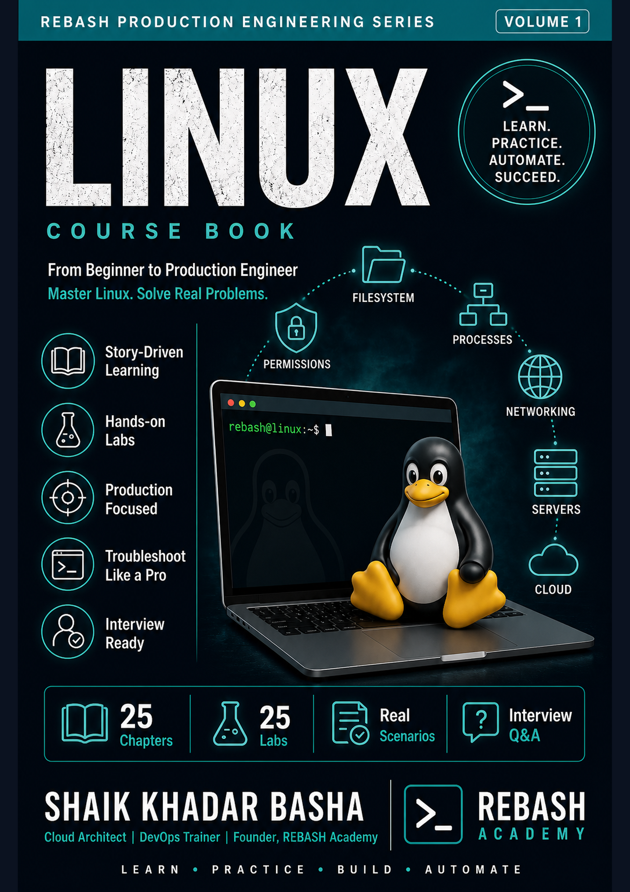

# Free Linux course book

Register with your email to download the REBASH Academy **Linux** course book as PDF or EPUB. No payment. Occasional academy updates only — unsubscribe any time.

<section class="rebash-books__gate" id="rebash-books-gate" aria-labelledby="rebash-books-register-title">
  <h2 id="rebash-books-register-title">Free registration</h2>
  
Enter your details to unlock the Linux PDF and EPUB downloads.

  <form id="rebash-books-form" class="rebash-books__form" novalidate>
    

      <label class="rebash-books__field">
        Full name
        <input type="text" name="name" autocomplete="name" required maxlength="120" placeholder="Your name">
      </label>
      <label class="rebash-books__field">
        Email
        <input type="email" name="email" autocomplete="email" required maxlength="200" placeholder="you@example.com">
      </label>
    

    <input type="hidden" name="book_interest" value="linux">
    <label class="rebash-books__consent">
      <input type="checkbox" name="consent" value="yes" required>
      I agree to receive the free Linux book download and occasional REBASH Academy updates. I can unsubscribe any time. See the <a href="../legal/privacy-policy/">Privacy Policy</a>.
    </label>
    <input type="text" name="_gotcha" class="rebash-books__hp" tabindex="-1" autocomplete="off" aria-hidden="true">
    

    <button type="submit" class="md-button md-button--primary rebash-books__submit">Unlock free download</button>
  </form>
</section>

<section class="rebash-books__downloads" id="rebash-books-downloads" hidden aria-labelledby="rebash-books-downloads-title">
  <h2 id="rebash-books-downloads-title">Your download</h2>
  
Thanks for registering. Choose PDF for print-ready reading, or EPUB for phones and e-readers.

  

    <article class="rebash-books__card">
      
      

        <h3>Linux for Cloud &amp; DevOps</h3>
        
Volume 1 — distributions, CLI, systemd, storage, security, and production ops.

        

          <a class="md-button md-button--primary" href="../assets/books/linux/linux.pdf" download>Download PDF</a>
          <a class="md-button" href="../assets/books/linux/linux.epub" download>Download EPUB</a>
        

      

    </article>

  

  
This browser will remember your unlock. Prefer reading on the site? Start the <a href="../linux/">Linux course</a>.

</section>

