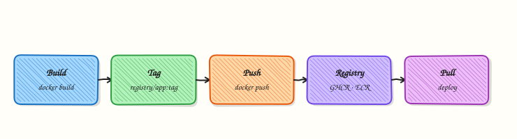

# Container Registries and Distribution

## Overview

Tag and push an image to a registry workflow you can repeat in CI — understand Hub vs cloud registries (GHCR, ECR, ACR, GAR).

Registries store and distribute images. Production uses private registries, immutable tags, and retention policies.

This is a core tutorial in **Module 10 · Registries** of the REBASH Academy **Docker for Cloud & DevOps Engineers** series — written for Cloud, DevOps, Platform, and SRE engineers.

## Prerequisites

- [Docker Compose Fundamentals](docker-compose-fundamentals.md)
- [Working with Docker Images](working-with-docker-images.md)

## Learning Objectives

By the end of this tutorial, you will be able to:

- [ ] Tag for `registry/org/image:tag`  
- [ ] Login and push (or dry-run the commands)  
- [ ] Compare Hub, GHCR, ECR, ACR, GAR  
- [ ] Prefer digest pins for deploys

## Architecture

This topic’s control points and relationships are shown below.



## Theory

### What

A **container registry** stores and serves OCI images. Public defaults include Docker Hub; cloud options include GitHub Container Registry (GHCR), Amazon Elastic Container Registry (ECR), Azure Container Registry (ACR), and Google Artifact Registry. Enterprises also run Harbor or distribution. Clients authenticate, then `pull`/`push` by tag or digest.

### Why

Images must leave the build machine to reach CI promotion paths and clusters. Rate limits, access control, and vulnerability scanning at the registry gate are production concerns. Choosing a registry near your cloud reduces pull latency and aligns Identity and Access Management (IAM).

### How it works

`docker login` (or cloud CLI helpers) stores credentials via a helper. CI should prefer short-lived **OIDC** tokens over long-lived passwords. Tag images with registry prefixes (`ghcr.io/org/app:1.2.0`) and push. Promotion often retags digests across repositories or environments without rebuilding. Enable vulnerability scanning and immutable tags where the product supports them.

| Registry | Notes |
|----------|-------|
| Docker Hub | Public default; rate limits |
| GHCR | Tight GitHub Actions integration |
| Amazon ECR | IAM / OIDC from AWS |
| Azure ACR | Entra ID / tokens |
| Google Artifact Registry | GCP IAM |
| Self-hosted | Harbor, distribution |

### Key concepts

- **Namespace and permissions** — who can push/pull  
- **Immutable tags / digests** — promotion safety  
- **Rate limits** — authenticate pulls even for public images when needed  
- **Replication** — multi-region pull performance  


Document who owns each registry namespace and how break-glass credentials are rotated. Prefer pull-through caches or mirrored bases in constrained networks so builds do not depend on public rate limits during an incident. Record the digest in release notes or GitOps manifests so auditors can answer “what ran?” without guesswork.

### Common pitfalls

- Building once per environment instead of promoting a digest  
- Storing registry passwords in plaintext CI variables forever  
- Pushing untagged or `:latest`-only images  
- Forgetting cleanup policies until storage bills spike

## Hands-on Lab

Create a workspace for this tutorial.

```bash
mkdir -p ~/rebash-docker/module-10 && cd ~/rebash-docker/module-10
```

**Focus:** hands-on practice for Container Registries and Distribution

### Step 1 – Skeleton

```bash
cat > lab.sh << 'EOF'
#!/usr/bin/env bash
set -euo pipefail
echo "lab: Container Registries and Distribution"
EOF
chmod +x lab.sh
./lab.sh
```

### Step 2 – Core exercise

```bash
mkdir -p ~/rebash-docker/module-10 && cd ~/rebash-docker/module-10
docker build -t rebash-reg:0.1.0 - <<'EOF'
FROM alpine:3.20
CMD ["echo", "registry-lab"]
EOF
# Replace with your registry (example GHCR)
# docker tag rebash-reg:0.1.0 ghcr.io/<user>/rebash-reg:0.1.0
# echo $GITHUB_TOKEN | docker login ghcr.io -u USER --password-stdin
# docker push ghcr.io/<user>/rebash-reg:0.1.0
docker images rebash-reg
cat > registry-plan.md << 'EOF'
Target registry:
Auth method:
Tag strategy: app:gitsha / app:1.2.3
Retention:
EOF
```

### Final step – Cleanup note

```bash
# Keep ~/rebash-docker/ for later labs; destroy cloud resources you created
./lab.sh || true
```

## Validation

- [ ] Lab commands run under `~/rebash-docker/module-10/`
- [ ] You can explain each Theory section in your own words
- [ ] You used modern tooling where it applies to this topic
- [ ] You can describe one production failure mode for this topic

## Code Walkthrough

Production practice for **Container Registries and Distribution** always combines:

1. Inspect before you change (status, plan, logs, dry-run)
2. Prefer reversible, documented changes (Git, IaC, drop-ins, version pins)
3. Capture evidence (command output, pipeline logs) for handovers
4. Prefer current tools and APIs over legacy shortcuts
5. Least privilege — escalate credentials only when required

Keep runbooks short enough to follow under pressure. Automate checks; keep humans for judgement.

## Security Considerations

- Treat credentials and tokens for docker as privileged — never commit them
- Prefer short-lived auth (OIDC, roles, SSO) over long-lived keys
- Validate blast radius before apply/deploy/delete operations
- Restrict who can approve production changes
- Collect audit logs; limit who can read sensitive traces

## Common Mistakes

!!! warning "Building once per environment instead of promoting a digest  "
    Validate assumptions against the Theory section and official docs before changing production.

!!! warning "Storing registry passwords in plaintext CI variables forever  "
    Lab shortcuts (open security groups, admin roles, skip approvals) must not ship unchanged.

!!! warning "Changing production without a rollback path"
    Always know how to revert (previous artefact, prior release, state rollback, DNS failback).

## Best Practices

- Encode Container Registries and Distribution changes as code and review them in pull requests
- Pin versions (images, modules, actions, provider plugins)
- Separate environments with clear promotion gates
- Alert on symptoms with runbooks attached
- Destroy lab resources; tag everything with owner and expiry where possible

## Troubleshooting

| Symptom | Likely cause | Fix |
|---------|--------------|-----|
| Auth / permission denied | Wrong identity, policy, or scope | Check caller identity, roles, and least-privilege policies |
| Timeout / no route | Network, DNS, security group, or endpoint | Trace path, DNS, and allow-lists before retrying |
| Drift / unexpected plan | Manual change or wrong state/workspace | Reconcile desired vs actual; avoid click-ops on managed resources |
| Pipeline/job red | Flaky step, cache, or missing secret | Read failing step logs; bisect recent workflow/config changes |
| Cost spike | Idle load balancer, NAT, oversized compute | Inventory billable resources; stop/delete labs promptly |

## Summary

**Container Registries and Distribution** is essential for Cloud and DevOps engineers working with docker. Practise the lab until the inspection and change path is muscle memory, then continue the track.

## Interview Questions

1. How does **Container Registries and Distribution** show up when operating Cloud or production platforms?
2. What would you check first if this area misbehaves in production?
3. Which modern tools or APIs replace older equivalents here?
4. What security control should accompany this capability?
5. How would you automate verification of this topic in CI?

!!! tip "Sample answer — question 2"
    Start with blast radius and recent changes, gather evidence (logs, status, plan/diff), then fix forward with a known rollback path — not guesswork.

## Related Tutorials

- [Course overview](index.md)
- - [Docker Security Hardening](docker-security-hardening.md)

## References

- [GHCR](https://docs.github.com/en/packages/working-with-a-github-packages-registry/working-with-the-container-registry) · [ECR](https://docs.aws.amazon.com/ecr/)
