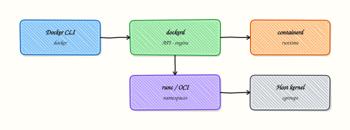

# Docker Architecture and Components

## Overview


Describe the Docker client–daemon path and the roles of `dockerd`, `containerd`, and the OCI runtime so you can debug “where did my request fail?”

You talk to the **Docker CLI**; it calls the **Docker Engine API** on `dockerd`. The daemon uses **containerd** and **runc** to create containers on the host kernel.

This is a core tutorial in **Module 1 · Container Fundamentals** of the REBASH Academy **Docker for Cloud & DevOps Engineers** series — written for Cloud, DevOps, Platform, and SRE engineers.

## Prerequisites


- [Introduction to Containers and Docker](introduction-to-containers-and-docker.md)

## Learning Objectives


By the end of this tutorial, you will be able to:

- [ ] Trace CLI → dockerd → containerd → runc  
- [ ] Distinguish image, container, and registry  
- [ ] Know what `docker context` selects  
- [ ] Relate namespaces/cgroups to isolation

## Architecture


This topic’s control points and relationships are shown below.



## Theory


### What

Docker’s architecture separates the **CLI**, the **Engine (`dockerd`)**, **containerd**, and an **OCI runtime** such as `runc`, all sitting on the **host kernel**. Images, containers, networks, and volumes are API objects the daemon manages. Registries store images remotely.

### Why

Troubleshooting “Docker is broken” means knowing which layer failed: CLI talking to the wrong context, daemon down, pull failing in containerd, or runtime/kernel limits. Production platforms (and Kubernetes) reuse pieces of this stack — especially containerd and OCI — so the mental model transfers.

### How it works

You type `docker` commands; the CLI calls the Engine API (local Unix socket or TCP). `dockerd` orchestrates networks, volumes, and higher-level UX. It delegates image pull and container lifecycle to **containerd**, which invokes **runc** to start the process in namespaces/cgroups. An **image** is immutable layers plus config; a **container** adds a writable layer and process state; a **registry** (Docker Hub, GitHub Container Registry, Amazon Elastic Container Registry) is the remote store.

| Component | Role |
|-----------|------|
| Docker CLI | User interface (`docker`) |
| dockerd | Engine API, networks, volumes |
| containerd | Image pull, container lifecycle |
| runc | OCI runtime — starts the process |
| Host kernel | Namespaces, cgroups, filesystems |

### Key concepts

- **Client–daemon** — CLI is not the container runtime  
- **Contexts** — CLI can point at remote engines  
- **Rootful vs rootless** — privilege model of the daemon  
- **Shim / supervisors** — keep containers reparented correctly after daemon restarts  

### Common pitfalls

- Exposing the Docker socket without understanding it is root-equivalent  
- Debugging inside the CLI when `dockerd` is the failing component  
- Assuming Desktop networking equals Linux Engine networking  
- Confusing image ID, digest, and tag

## Hands-on Lab


### Objective

Build or run a real Docker solution for **Docker Architecture and Components** and prove it with inspect/logs/HTTP.

### Prerequisites

- Docker Engine or Docker Desktop
- Permission to run containers

### Lab environment

Workspace: `~/rebash-docker/module-01-arch`

Local Docker daemon. Clean up containers/images after the lab.

```bash
mkdir -p ~/rebash-docker/module-01-arch && cd ~/rebash-docker/module-01-arch
```

### Real-world scenario

You are validating **Docker Architecture and Components** before it lands in CI. The change must be reproducible with copy-paste commands and leave no orphan containers.

### Step-by-step tasks

#### Task 1 – Run and inspect a container

Start from a known image, publish a port, and verify HTTP.

```bash
docker run -d --name rebash-lab -p 18080:80 nginx:alpine
docker ps --filter name=rebash-lab
curl -sI http://127.0.0.1:18080 | head -n 5 | tee headers.txt
docker logs rebash-lab 2>&1 | head -n 10 | tee logs.txt
```

**Expected output:** Container Up; HTTP 200 in headers.txt.

#### Task 2 – Inspect runtime config

Use inspect for status — production debugging rarely starts with guesswork.

```bash
docker inspect rebash-lab --format '{{ "{{" }}.State.Status{{ "}}" }} {{ "{{" }}.Config.Image{{ "}}" }}' | tee inspect.txt
test -s inspect.txt
```

**Expected output:** inspect.txt shows `running` and the nginx image.

### Validation steps

- [ ] Container or image behaves as Expected output describes
- [ ] Ports respond or command output matches
- [ ] Cleanup removes lab resources

### Common errors and fixes

| Error | Cause | Fix |
|-------|-------|-----|
| port is already allocated | Previous lab left a container | `docker rm -f` the old name or change port |
| permission denied | User not in docker group | Use rootless Docker or fix group membership |
| manifest unknown | Bad tag | Pin a real tag such as `nginx:alpine` |

### Challenge exercise

Add a non-root USER (or Compose healthcheck) and prove it with inspect.

### Learning outcomes

- Executed a real Docker workflow
- Captured evidence files
- Removed disposable resources

### Cleanup

```bash
docker rm -f rebash-lab 2>/dev/null || true
docker rmi rebash-lab:local 2>/dev/null || true
docker compose down -v 2>/dev/null || true
```

## Validation


- [ ] Lab commands run under `~/rebash-docker/module-01-arch/`
- [ ] You can explain each Theory section in your own words
- [ ] You used modern tooling where it applies to this topic
- [ ] You can describe one production failure mode for this topic

## Code Walkthrough


Production practice for **Docker Architecture and Components** always combines:

1. Inspect before you change (status, plan, logs, dry-run)
2. Prefer reversible, documented changes (Git, IaC, drop-ins, version pins)
3. Capture evidence (command output, pipeline logs) for handovers
4. Prefer current tools and APIs over legacy shortcuts
5. Least privilege — escalate credentials only when required

Keep runbooks short enough to follow under pressure. Automate checks; keep humans for judgement.

## Security Considerations


- Treat credentials and tokens for docker as privileged — never commit them
- Prefer short-lived auth (OIDC, roles, SSO) over long-lived keys
- Validate blast radius before apply/deploy/delete operations
- Restrict who can approve production changes
- Collect audit logs; limit who can read sensitive traces

## Common Mistakes


!!! warning "Exposing the Docker socket without understanding it is root-equivalent  "
    Validate assumptions against the Theory section and official docs before changing production.

!!! warning "Debugging inside the CLI when `dockerd` is the failing component  "
    Lab shortcuts (open security groups, admin roles, skip approvals) must not ship unchanged.

!!! warning "Changing production without a rollback path"
    Always know how to revert (previous artefact, prior release, state rollback, DNS failback).

## Best Practices


- Encode Docker Architecture and Components changes as code and review them in pull requests
- Pin versions (images, modules, actions, provider plugins)
- Separate environments with clear promotion gates
- Alert on symptoms with runbooks attached
- Destroy lab resources; tag everything with owner and expiry where possible

## Troubleshooting


| Symptom | Likely cause | Fix |
|---------|--------------|-----|
| Auth / permission denied | Wrong identity, policy, or scope | Check caller identity, roles, and least-privilege policies |
| Timeout / no route | Network, DNS, security group, or endpoint | Trace path, DNS, and allow-lists before retrying |
| Drift / unexpected plan | Manual change or wrong state/workspace | Reconcile desired vs actual; avoid click-ops on managed resources |
| Pipeline/job red | Flaky step, cache, or missing secret | Read failing step logs; bisect recent workflow/config changes |
| Cost spike | Idle load balancer, NAT, oversized compute | Inventory billable resources; stop/delete labs promptly |

## Summary


**Docker Architecture and Components** is essential for Cloud and DevOps engineers working with docker. Practise the lab until the inspection and change path is muscle memory, then continue the track.

## Interview Questions


1. Role of dockerd versus the CLI?
2. What storage driver concerns matter on Linux?
3. How do containerd/runc fit the stack?
4. Why does architecture knowledge help troubleshooting?
5. What is the difference between create and run?

!!! tip "Sample answer — question 2"
    Use docker info and inspect to see driver/runtime details.

!!! tip "Sample answer — question 4"
    Limit who can talk to the daemon socket.

## Related Tutorials


- [Course overview](index.md)
- [Docker Installation and Setup](docker-installation-and-setup.md)

## References


- [Docker Engine architecture](https://docs.docker.com/engine/)
