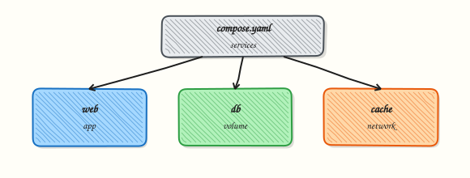

# Docker Compose Fundamentals

## Overview


Author a `compose.yaml` with services, a shared network, a volume, environment variables, and a health check — then bring the stack up and down.

**Compose** declares multi-container apps as code. Ideal for local DevOps stacks and simple single-host deploys before Kubernetes.

This is a core tutorial in **Module 9 · Docker Compose** of the REBASH Academy **Docker for Cloud & DevOps Engineers** series — written for Cloud, DevOps, Platform, and SRE engineers.

## Prerequisites


- [Docker Networking Fundamentals](docker-networking-fundamentals.md)

## Learning Objectives


By the end of this tutorial, you will be able to:

- [ ] Define services, networks, volumes  
- [ ] Pass env vars / `env_file`  
- [ ] Add health checks  
- [ ] Use profiles for optional services  
- [ ] `compose up` / `down` / `logs`

## Architecture


This topic’s control points and relationships are shown below.



## Theory


### What

**Docker Compose** defines multi-container applications as YAML (`compose.yaml`). Compose v2 is the `docker compose` CLI plugin (space, not hyphen). Services, networks, and volumes are declared together; `up` creates them as a project. On the default project network, **service names become DNS names**.

### Why

Real systems need an app plus database, cache, or sidecar. Running five independent `docker run` commands is brittle. Compose is the standard local and small-server orchestration file format and a stepping stone to Kubernetes manifests.

### How it works

A Compose file lists `services:` with images or build contexts, environment, ports, volumes, and `depends_on`. `docker compose up -d` creates a project-prefixed network and starts containers. `docker compose logs -f`, `ps`, `exec`, and `down` manage the stack. Profiles and multiple compose files (`-f`) specialise environments. Prefer explicit healthchecks over blind `depends_on` for readiness. Secrets and env files keep configuration out of images.

Compose v2 command shape:

``` {.bash .ra-terminal title="Terminal"}
docker compose version
docker compose -f compose.yaml up -d
```

### Key concepts

| Idea | Detail |
|------|--------|
| Project name | Prefixes resources; set via folder or `-p` |
| Service DNS | `http://api:8080` from another service |
| Build vs image | Local Dockerfile or registry image |
| Override files | `compose.override.yaml` for local deltas |


Keep Compose files readable: one service per concern, explicit image tags or digests, and comments only where behaviour is non-obvious. Use `.env` for local non-secret defaults and never commit production credentials beside `compose.yaml`. When a stack grows beyond a single host, treat Compose as the development contract and plan the Kubernetes translation deliberately.

### Common pitfalls

- Using obsolete `docker-compose` v1 behaviour docs blindly  
- Publishing database ports to the world on shared networks  
- Relying on `depends_on` without health conditions  
- Hard-coding hostpaths that only exist on one laptop

## Hands-on Lab

### Objective

Define a two-service Compose stack with a named volume, start it detached, verify with `curl`, and tear down including volumes.

### Prerequisites

- Docker Engine with Compose plugin (`docker compose version`)
- `curl` on the host

### Lab environment

Workspace: `~/rebash-docker/module-09`

Host port **18087** maps to the web service.

``` {.bash .ra-terminal title="Terminal"}
mkdir -p ~/rebash-docker/module-09 && cd ~/rebash-docker/module-09
```

### Real-world scenario

Locally you replicate a minimal production pair: nginx serves a static page while Redis holds session keys. Compose wires service DNS, mounts a volume for Redis data, publishes only the web port, and lets you run the same file in CI with `docker compose up -d`.

### Step-by-step tasks

#### Task 1 – Create Compose file and static page

Create `html/index.html`:

```html title="index.html"
<!DOCTYPE html>
<html lang="en">
<head><meta charset="utf-8"><title>REBASH mod09</title></head>
<body><h1>compose stack ok</h1></body>
</html>
```

Create `compose.yaml`:

```yaml title="compose.yaml"
services:
  web:
    image: nginx:1.27-alpine
    ports:
      - "18087:80"
    depends_on:
      - redis
    volumes:
      - ./html:/usr/share/nginx/html:ro
  redis:
    image: redis:7.4-alpine
    volumes:
      - redis-data:/data
    command: ["redis-server", "--save", "", "--appendonly", "no"]

volumes:
  redis-data:
```

!!! example "Expected output"
    `compose.yaml` and `html/index.html` exist in the lab directory.


#### Task 2 – Start stack and check status

``` {.bash .ra-terminal title="Terminal"}
cd ~/rebash-docker/module-09
docker compose up -d
docker compose ps | tee compose-ps.txt
grep -E 'web|redis' compose-ps.txt
curl -s http://127.0.0.1:18087/ | tee compose-curl.txt
grep -q 'compose stack ok' compose-curl.txt
```

!!! example "Expected output"
    `compose-ps.txt` shows web and redis running; curl returns the custom heading.


#### Task 3 – Prove Redis volume and fetch logs

``` {.bash .ra-terminal title="Terminal"}
cd ~/rebash-docker/module-09
docker compose exec redis redis-cli PING | tee redis-ping.txt
grep -q 'PONG' redis-ping.txt
docker compose logs --tail=10 web | tee compose-web-logs.txt
test -s compose-web-logs.txt
```

!!! example "Expected output"
    `redis-ping.txt` is `PONG`; web logs captured.


### Validation steps

- [ ] `docker compose ps` shows web and redis services up
- [ ] `compose-curl.txt` serves custom HTML on port 18087
- [ ] `redis-ping.txt` confirms Redis responds inside the stack

### Common errors and fixes

| Error | Cause | Fix |
|-------|-------|-----|
| port is already allocated | 18087 in use | Edit host port in `compose.yaml` |
| service "web" depends on undefined service | Typo in `depends_on` | Match service names exactly |
| bind mount not found | Missing `html/` | Create `html/index.html` before `up` |

### Challenge exercise

Scale web to two replicas is not valid with static published ports — instead add a healthcheck to web and prove Compose reports healthy state:

Add under `web:` in `compose.yaml`:

```yaml
    healthcheck:
      test: ["CMD", "wget", "-qO-", "http://127.0.0.1/"]
      interval: 5s
      timeout: 3s
      retries: 5
```

Reconcile and verify:

``` {.bash .ra-terminal title="Terminal"}
cd ~/rebash-docker/module-09
docker compose up -d
docker compose ps | tee compose-ps-health.txt
grep -i 'healthy\|running' compose-ps-health.txt
```

!!! example "Expected output"
    After a short wait, `compose-ps-health.txt` shows web as healthy or running with healthcheck configured.


### Learning outcomes

- Authored a multi-service `compose.yaml` with pinned images
- Started and inspected a stack with `docker compose ps` and logs
- Verified HTTP and Redis connectivity before teardown

### Cleanup

``` {.bash .ra-terminal title="Terminal"}
cd ~/rebash-docker/module-09
docker compose down -v
docker rmi nginx:1.27-alpine redis:7.4-alpine 2>/dev/null || true
```

## Validation

- [ ] Lab commands run under `~/rebash-docker/module-09/`
- [ ] `compose-ps.txt` and `compose-curl.txt` prove the stack ran correctly
- [ ] You can explain each Theory section in your own words
- [ ] You can describe one production failure mode for this topic

## Code Walkthrough


Production practice for **Docker Compose Fundamentals** always combines:

1. Inspect before you change (status, plan, logs, dry-run)
2. Prefer reversible, documented changes (Git, IaC, drop-ins, version pins)
3. Capture evidence (command output, pipeline logs) for handovers
4. Prefer current tools and APIs over legacy shortcuts
5. Least privilege — escalate credentials only when required

Keep runbooks short enough to follow under pressure. Automate checks; keep humans for judgement.

## Security Considerations


- Treat credentials and tokens for docker as privileged — never commit them
- Prefer short-lived auth (OIDC, roles, SSO) over long-lived keys
- Validate blast radius before apply/deploy/delete operations
- Restrict who can approve production changes
- Collect audit logs; limit who can read sensitive traces

## Common Mistakes


!!! warning "Using obsolete `docker-compose` v1 behaviour docs blindly  "
    Validate assumptions against the Theory section and official docs before changing production.

!!! warning "Publishing database ports to the world on shared networks  "
    Lab shortcuts (open security groups, admin roles, skip approvals) must not ship unchanged.

!!! warning "Changing production without a rollback path"
    Always know how to revert (previous artefact, prior release, state rollback, DNS failback).

## Best Practices


- Encode Docker Compose Fundamentals changes as code and review them in pull requests
- Pin versions (images, modules, actions, provider plugins)
- Separate environments with clear promotion gates
- Alert on symptoms with runbooks attached
- Destroy lab resources; tag everything with owner and expiry where possible

## Troubleshooting


| Symptom | Likely cause | Fix |
|---------|--------------|-----|
| Auth / permission denied | Wrong identity, policy, or scope | Check caller identity, roles, and least-privilege policies |
| Timeout / no route | Network, DNS, security group, or endpoint | Trace path, DNS, and allow-lists before retrying |
| Drift / unexpected plan | Manual change or wrong state/workspace | Reconcile desired vs actual; avoid click-ops on managed resources |
| Pipeline/job red | Flaky step, cache, or missing secret | Read failing step logs; bisect recent workflow/config changes |
| Cost spike | Idle load balancer, NAT, oversized compute | Inventory billable resources; stop/delete labs promptly |

## Summary


**Docker Compose Fundamentals** is essential for Cloud and DevOps engineers working with docker. Practise the lab until the inspection and change path is muscle memory, then continue the track.

## Interview Questions


1. What problem does Compose solve locally?
2. How do you tear down including volumes?
3. Service DNS names in Compose?
4. Compose versus Swarm/Kubernetes for production?
5. How do you override config per environment?

!!! tip "Sample answer — question 2"
    Run docker compose ps and docker compose logs for the failing service.

!!! tip "Sample answer — question 4"
    Do not commit .env secrets.

## Related Tutorials


- [Course overview](index.md)
- [Container Registries and Distribution](container-registries-and-distribution.md)

## References


- [Compose specification](https://docs.docker.com/compose/compose-file/)
