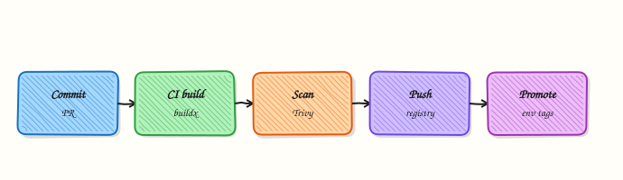

# Docker in CI/CD Pipelines

## Overview


Design a build → scan → push → promote pipeline using Buildx for multi-architecture images and immutable tags.

CI builds images from Git; never “docker build on a laptop then scp.” **Buildx** enables `linux/amd64` + `linux/arm64`. Promote by retagging digests across environments.

This is a core tutorial in **Module 15 · Docker in CI/CD** of the REBASH Academy **Docker for Cloud & DevOps Engineers** series — written for Cloud, DevOps, Platform, and SRE engineers.

## Prerequisites


- [Docker Performance and Resource Limits](docker-performance-and-resource-limits.md)
- [Container Scanning and SBOM](container-scanning-and-sbom.md)

## Learning Objectives


By the end of this tutorial, you will be able to:

- [ ] Sketch build/scan/push stages  
- [ ] Use Buildx multi-platform builds  
- [ ] Tag with git SHA  
- [ ] Outline GitHub Actions / GitLab CI jobs

## Architecture


This topic’s control points and relationships are shown below.



## Theory


### What

CI/CD pipelines **build**, **scan**, **push**, and **promote** container images. Typical steps use `docker buildx build`, a vulnerability gate (for example Trivy), push to a registry, then retag an immutable digest for staging and production. Authentication should prefer **OIDC** to cloud registries over long-lived passwords.

### Why

Images are the deployable unit for most cloud-native systems. Building on laptops and copying tarballs does not scale or audit. Pipelines encode the quality gates that protect production and make promotions repeatable.

### How it works

On pull request, build (and optionally scan) without necessarily pushing production tags. On main, build once, push by digest, record provenance. Promotion moves the same digest across environments — do not rebuild differently “for prod”. GitHub Actions and similar systems need careful permissions: least-privilege `packages: write`, ephemeral credentials, and pinned actions. Cache layers with registry or BuildKit caches to keep feedback fast.

| Stage | Action |
|-------|--------|
| Build | `docker buildx build` |
| Scan | Trivy (or equivalent) gate |
| Push | Registry |
| Promote | Retag digest to staging/prod |

In workflow docs, wrap GitHub Actions expressions in raw Jinja blocks when embedding examples in MkDocs so macros do not parse them.

### Key concepts

- **Build once, promote many** — environment parity  
- **OIDC federation** — short-lived cloud auth  
- **Provenance / attestations** — advanced supply chain  
- **Ephemeral runners** — clean build hosts  


Keep pipeline YAML next to the Dockerfile so reviewers see build and gate changes together. Fail closed on CRITICAL vulnerabilities for images destined to production, with a documented exception path. Emit the image digest as a pipeline output so GitOps commits and release notes can reference it automatically.

### Common pitfalls

- Storing Docker Hub passwords forever in CI secrets  
- Pushing `:latest` as the only promotion signal  
- Using privileged DinD without understanding risks  
- Different Dockerfiles per environment that drift

## Hands-on Lab

### Objective

Create a GitHub Actions workflow stub for Docker CI, a local `build-ci.sh` that mimics the pipeline build step, and validate YAML with Python before building the image.

### Prerequisites

- Docker Engine or Docker Desktop
- `python3` with PyYAML (`pip install pyyaml`)
- Git optional (workflow file is validated locally)

### Lab environment

Workspace: `~/rebash-docker/module-15`

```bash title="Terminal"
mkdir -p ~/rebash-docker/module-15/.github/workflows && cd ~/rebash-docker/module-15
```

### Real-world scenario

Your team wants Docker builds gated in CI before merge. You add a workflow that builds on pull requests, mirror the build locally with a shell script, and prove the YAML parses and the image builds with a pinned tag.

### Step-by-step tasks

#### Task 1 – Create application Dockerfile

Create `Dockerfile`:

```dockerfile title="Dockerfile"
FROM alpine:3.20
ARG APP_VERSION=dev
RUN echo "rebash-cicd-lab ${APP_VERSION}" > /version.txt
CMD ["cat", "/version.txt"]
```

Create `.github/workflows/docker-ci.yml`:


```yaml
name: Docker CI
on:
  pull_request:
    paths:
      - 'Dockerfile'
      - '.github/workflows/docker-ci.yml'
jobs:
  build:
    runs-on: ubuntu-latest
    steps:
      - uses: actions/checkout@v4
      - name: Build image
        run: docker build --build-arg APP_VERSION=${{ github.sha }} -t rebash-cicd-lab:ci .
      - name: Smoke test
        run: docker run --rm rebash-cicd-lab:ci
```


Validate YAML locally:

```bash title="Terminal"
cd ~/rebash-docker/module-15
python3 -c "import yaml, pathlib; yaml.safe_load(pathlib.Path('.github/workflows/docker-ci.yml').read_text()); print('yaml_ok')" | tee yaml-check.txt
grep -q yaml_ok yaml-check.txt
```

!!! example "Expected output"
    `yaml-check.txt` contains `yaml_ok`.


#### Task 2 – Local CI build script

Create `build-ci.sh`:

```bash title="build-ci.sh"
#!/usr/bin/env bash
set -euo pipefail
ROOT="$(cd "$(dirname "$0")" && pwd)"
cd "$ROOT"
VERSION="${1:-local}"
docker build --build-arg "APP_VERSION=${VERSION}" -t rebash-cicd-lab:"${VERSION}" .
docker run --rm rebash-cicd-lab:"${VERSION}" | tee build-output.txt
grep -q 'rebash-cicd-lab' build-output.txt
echo "build-ci ok"
```

Run the local pipeline:

```bash title="Terminal"
cd ~/rebash-docker/module-15
chmod +x build-ci.sh
./build-ci.sh pr-local | tee ci-local.txt
grep -q 'build-ci ok' ci-local.txt
```

!!! example "Expected output"
    `ci-local.txt` ends with `build-ci ok`; `build-output.txt` shows the version string.


#### Task 3 – Tag and inspect build artefact

Prove the image exists with expected metadata:


```bash title="Terminal"
cd ~/rebash-docker/module-15
docker images rebash-cicd-lab --format '{{ "{{" }}.Repository{{ "}}" }}:{{ "{{" }}.Tag{{ "}}" }} {{ "{{" }}.ID{{ "}}" }}' | tee ci-images.txt
grep -q 'rebash-cicd-lab:pr-local' ci-images.txt
docker inspect rebash-cicd-lab:pr-local --format 'Id={{ "{{" }}.Id{{ "}}" }}' | tee ci-id.txt
test -s ci-id.txt
```


!!! example "Expected output"
    `ci-images.txt` lists `rebash-cicd-lab:pr-local`; `ci-id.txt` contains `Id=sha256:…`.


### Validation steps

- [ ] Workflow YAML parses with Python
- [ ] `build-ci.sh` builds and smoke-tests the image
- [ ] Image tag `rebash-cicd-lab:pr-local` exists
- [ ] Cleanup removes images and evidence files

### Common errors and fixes

| Error | Cause | Fix |
|-------|-------|-----|
| `ModuleNotFoundError: yaml` | PyYAML missing | `pip install pyyaml` |
| MkDocs build breaks on Actions expressions | Macro collision | Keep workflow YAML inside raw Jinja blocks in the tutorial only |
| Build arg empty | Script called without version | Pass `pr-local` as shown |
| Docker permission denied | User not in docker group | Use sudo or add user to `docker` group |

### Challenge exercise

Extend `build-ci.sh` to run Trivy when installed and fail on CRITICAL findings before tagging `release`.

### Learning outcomes

- Authored a minimal GitHub Actions Docker build workflow
- Mirrored CI build steps locally with a shell script
- Validated workflow YAML before pushing
- Tagged and inspected the resulting image artefact

### Cleanup

```bash title="Terminal"
cd ~/rebash-docker/module-15
docker rmi rebash-cicd-lab:pr-local rebash-cicd-lab:ci 2>/dev/null || true
rm -f *.txt build-ci.sh Dockerfile
rm -rf .github
```

## Validation


- [ ] Lab commands run under `~/rebash-docker/module-15/.github/workflows/`
- [ ] You can explain each Theory section in your own words
- [ ] You used modern tooling where it applies to this topic
- [ ] You can describe one production failure mode for this topic

## Code Walkthrough


Production practice for **Docker in CI/CD Pipelines** always combines:

1. Inspect before you change (status, plan, logs, dry-run)
2. Prefer reversible, documented changes (Git, IaC, drop-ins, version pins)
3. Capture evidence (command output, pipeline logs) for handovers
4. Prefer current tools and APIs over legacy shortcuts
5. Least privilege — escalate credentials only when required

Keep runbooks short enough to follow under pressure. Automate checks; keep humans for judgement.

## Security Considerations


- Treat credentials and tokens for docker as privileged — never commit them
- Prefer short-lived auth (OIDC, roles, SSO) over long-lived keys
- Validate blast radius before apply/deploy/delete operations
- Restrict who can approve production changes
- Collect audit logs; limit who can read sensitive traces

## Common Mistakes


!!! warning "Storing Docker Hub passwords forever in CI secrets  "
    Validate assumptions against the Theory section and official docs before changing production.

!!! warning "Pushing `:latest` as the only promotion signal  "
    Lab shortcuts (open security groups, admin roles, skip approvals) must not ship unchanged.

!!! warning "Changing production without a rollback path"
    Always know how to revert (previous artefact, prior release, state rollback, DNS failback).

## Best Practices


- Encode Docker in CI/CD Pipelines changes as code and review them in pull requests
- Pin versions (images, modules, actions, provider plugins)
- Separate environments with clear promotion gates
- Alert on symptoms with runbooks attached
- Destroy lab resources; tag everything with owner and expiry where possible

## Troubleshooting


| Symptom | Likely cause | Fix |
|---------|--------------|-----|
| Auth / permission denied | Wrong identity, policy, or scope | Check caller identity, roles, and least-privilege policies |
| Timeout / no route | Network, DNS, security group, or endpoint | Trace path, DNS, and allow-lists before retrying |
| Drift / unexpected plan | Manual change or wrong state/workspace | Reconcile desired vs actual; avoid click-ops on managed resources |
| Pipeline/job red | Flaky step, cache, or missing secret | Read failing step logs; bisect recent workflow/config changes |
| Cost spike | Idle load balancer, NAT, oversized compute | Inventory billable resources; stop/delete labs promptly |

## Summary


**Docker in CI/CD Pipelines** is essential for Cloud and DevOps engineers working with docker. Practise the lab until the inspection and change path is muscle memory, then continue the track.

## Interview Questions


1. Why tag CI images with git SHA?
2. DinD versus Kaniko/Buildah trade-offs?
3. How do you cache layers safely in CI?
4. What should not be in CI build contexts?
5. How do you prove provenance of an image?

!!! tip "Sample answer — question 2"
    Check Dockerfile path/context, registry login, and whether the job ran on the expected commit SHA.

!!! tip "Sample answer — question 4"
    Never use long-lived registry passwords in clear logs. Prefer OIDC.

## Related Tutorials


- [Course overview](index.md)
- [Troubleshooting Docker Containers](troubleshooting-docker-containers.md)

## References


- [Buildx](https://docs.docker.com/build/building/multi-platform/) · [build-push-action](https://github.com/docker/build-push-action)
