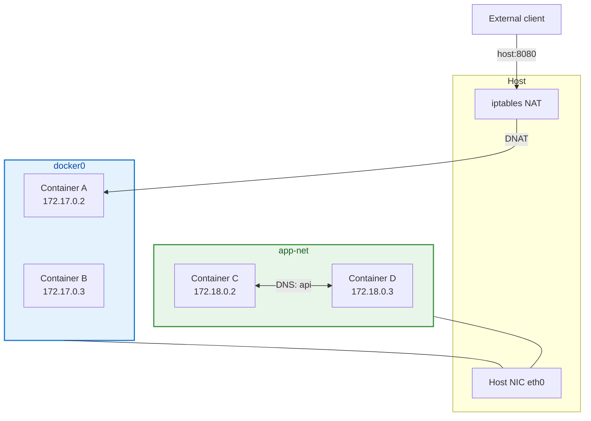

# Docker Networking Fundamentals

## Overview

Containers need to talk to each other, the host, and the outside world. Docker's networking model isolates container networks while providing controlled connectivity through **virtual bridges**, **NAT**, **port publishing**, and **embedded DNS**. Misunderstanding these mechanics causes the classic failures: "connection refused between containers," "works on my machine but not in CI," and "cannot reach service on localhost."

This tutorial is **Tutorial 10** in **Module 4: Networking & Registry** of the REBASH Academy Docker series. You will work with **bridge**, **host**, and **user-defined bridge** networks, publish ports, inspect routing, and debug connectivity. For registry and image distribution, continue to [Container Registries and Distribution](container-registries-and-distribution.md).

## Prerequisites

- Completed [Running Your First Container](running-your-first-container.md)
- Completed [Docker Compose Fundamentals](docker-compose-fundamentals.md) — helpful for multi-service DNS context
- Linux host recommended (macOS/Windows Docker Desktop uses a VM — some routing differs)
- Basic TCP/IP: IP addresses, ports, DNS names
- [Networking fundamentals](../networking/introduction-to-networking.md) helpful but not required

## Learning Objectives

By the end of this tutorial, you will be able to:

- [ ] Describe Docker's default bridge network and its limitations
- [ ] Create and attach containers to user-defined bridge networks
- [ ] Explain the difference between bridge, host, and none network drivers
- [ ] Publish container ports with `-p` and understand NAT behavior
- [ ] Use container names and aliases for DNS-based discovery
- [ ] Inspect networks with `docker network` commands and diagnose connectivity issues

## Architecture Diagram



User-defined networks add automatic DNS between connected containers.

## Theory

### Docker Network Drivers

| Driver | Scope | Use case |
|--------|-------|----------|
| **bridge** | Single host | Default container-to-container on same host |
| **host** | Single host | Container shares host network stack — no isolation |
| **none** | Single host | Disable networking — `--network none` |
| **overlay** | Multi-host (Swarm) | Cross-node service mesh |
| **macvlan** | Single host | Container gets MAC address on physical LAN |
| **ipvlan** | Single host | Container shares MAC, unique IP |

This tutorial focuses on **bridge** and **host** — the drivers you use daily before Kubernetes.

### Default Bridge vs User-Defined Bridge

**Default bridge (`docker0`):**

- Created automatically at Docker daemon start
- Containers get IP on `172.17.0.0/16` typically
- **No automatic DNS** between containers by name (legacy behavior)
- All default-bridge containers share one L2 domain

**User-defined bridge:**

- Created with `docker network create`
- **Embedded DNS** resolves container names and network aliases
- Better isolation — separate broadcast domains per network
- Recommended for multi-container applications

```bash
docker network create app-net
docker run -d --name api --network app-net myapi
docker run -d --name web --network app-net nginx
# web can curl http://api:8080
```

### How Port Publishing Works

```bash
docker run -p 8080:80 nginx
```

| Segment | Meaning |
|---------|---------|
| `8080` | Host port (what clients connect to) |
| `80` | Container port (what process listens on) |

Docker installs **iptables DNAT** rules forwarding host:8080 → container IP:80. Binding `127.0.0.1:8080:80` restricts to localhost.

**`-P` (publish all)** maps all `EXPOSE`d ports to random high host ports.

Inside a container, `localhost` refers to **the container itself**, not the host. To reach host services from container:

- Linux: `host.docker.internal` (recent Docker) or host gateway IP
- Use `host` network mode for special cases (monitoring agents)

### Host Network Mode

```bash
docker run --network host nginx
```

Container processes bind directly to host interfaces — **no port mapping needed**. Performance benefit for high-throughput workloads; **security and port conflict trade-offs**. Container sees host `localhost`, `eth0`, etc.

Not available the same way on Docker Desktop macOS/Windows (VM layer).

### Container DNS

Docker runs an **embedded DNS server** at `127.0.0.11` inside containers on user-defined networks. It resolves:

- Container names → container IP on shared network
- Network **aliases** (additional names)
- External names → upstream host resolver

Custom DNS servers per container:

```bash
docker run --dns 8.8.8.8 myapp
```

### Network Isolation Patterns

| Pattern | Configuration |
|---------|---------------|
| Frontend + backend split | Two networks; proxy on both, API only on backend |
| Database internal only | No published ports; only app network attachment |
| Compose default | One network per project; all services connected |

```yaml
networks:
  frontend:
  backend:
    internal: true
```

`internal: true` blocks external routing from that network — outbound internet disabled for attached containers.

### Inspecting Networking State

| Command | Shows |
|---------|-------|
| `docker network ls` | All networks |
| `docker network inspect app-net` | Subnet, gateway, connected containers |
| `docker inspect container` | IPAddress, Networks section |
| `docker port container` | Published port mappings |
| `ip addr show docker0` | Host bridge interface (Linux) |

Inside container debugging:

```bash
docker exec container ip addr
docker exec container cat /etc/resolv.conf
docker exec container wget -qO- http://other-service:8080/
```

### Common Connectivity Scenarios

| From | To | Requirement |
|------|-----|-------------|
| Host | Container | `-p` port publish or host network |
| Container A | Container B (same user network) | Shared network; use name `B` |
| Container A | Container B (default bridge) | Use IP address or link (legacy) |
| Container | Internet | NAT via host (unless `internal` network) |
| External | Container | Host firewall allows published port |

## Hands-on Lab

Run on Linux with Docker Engine. Adjust paths if using Docker Desktop.

### Step 1 – List existing networks

**Command:**

```bash
docker network ls
docker network inspect bridge | head -40
```

**Explanation:** Every installation has `bridge`, `host`, and `none` built-in networks. Default `bridge` shows gateway and subnet.

**Expected output:**

```text
NETWORK ID     NAME      DRIVER
...
               bridge    bridge
               host      host
               none      null
```

### Step 2 – Default bridge — no DNS by name

**Command:**

```bash
docker run -d --name net-alpine-1 alpine:3.20 sleep 3600
docker run -d --name net-alpine-2 alpine:3.20 sleep 3600

docker inspect net-alpine-1 | grep -A3 '"IPAddress"'
docker inspect net-alpine-2 | grep -A3 '"IPAddress"'

docker exec net-alpine-1 ping -c 2 net-alpine-2
```

**Explanation:** On default bridge, name resolution typically fails — ping by name shows unknown host. Use IP from inspect instead.

**Expected output:** Ping by name fails; ping by IP succeeds.

### Step 3 – User-defined network with DNS

**Command:**

```bash
docker network create rebash-app-net

docker rm -f net-alpine-1 net-alpine-2

docker run -d --name net-a --network rebash-app-net alpine:3.20 sleep 3600
docker run -d --name net-b --network rebash-app-net alpine:3.20 sleep 3600

docker exec net-a ping -c 2 net-b
docker network inspect rebash-app-net
```

**Explanation:** User-defined bridge enables automatic DNS — container name `net-b` resolves from `net-a`.

**Expected output:** Successful ping to `net-b` by hostname.

### Step 4 – Network aliases

**Command:**

```bash
docker run -d \
  --name net-api \
  --network rebash-app-net \
  --network-alias api \
  --network-alias backend \
  alpine:3.20 sleep 3600

docker exec net-a ping -c 1 api
docker exec net-a ping -c 1 backend
```

**Explanation:** Aliases provide stable service names independent of container name — useful when replacing containers without changing client config.

**Expected output:** Both `api` and `backend` resolve and respond to ping.

### Step 5 – Port publishing and host access

**Command:**

```bash
docker run -d --name net-nginx -p 8080:80 nginx:alpine
curl -sI http://localhost:8080/ | head -5
docker port net-nginx
```

**Explanation:** Host port 8080 forwards to container port 80. `docker port` shows mapping.

**Expected output:**

```text
HTTP/1.1 200 OK
...
80/tcp -> 0.0.0.0:8080
```

### Step 6 – Container cannot reach host via localhost

**Command:**

```bash
docker exec net-a wget -qO- http://localhost:80 2>&1 | head -3
```

**Explanation:** Inside `net-a`, `localhost` is the alpine container — not the host nginx. Demonstrates common misconception.

**Expected output:** Connection refused or failed (nothing listening on port 80 in alpine).

### Step 7 – Container-to-container on published service

**Command:**

```bash
docker network connect rebash-app-net net-nginx
docker exec net-a wget -qO- http://net-nginx:80/ | head -3
```

**Explanation:** Attach nginx to app network. Now `net-a` reaches nginx by container name on internal port 80 without host publish.

**Expected output:** HTML from nginx welcome page.

### Step 8 – Host network mode

**Command:**

```bash
docker run -d --name net-host-demo --network host nginx:alpine
curl -sI http://127.0.0.1:80/ | head -3
docker rm -f net-host-demo
```

**Explanation:** Host mode binds nginx directly to host port 80. Conflicts if host already uses port 80 — stop conflicting service or skip if occupied.

**Expected output:** HTTP 200 from nginx on host port 80 (if port free).

### Step 9 – Clean up

**Command:**

```bash
docker rm -f net-a net-b net-api net-nginx 2>/dev/null || true
docker network rm rebash-app-net 2>/dev/null || true
```

**Explanation:** Remove lab containers and custom networks.

## Commands & Code

| Command | Description | Example |
|---------|-------------|---------|
| `docker network create` | Create user-defined network | `docker network create app-net` |
| `docker network ls` | List networks | `docker network ls` |
| `docker network inspect` | Network details | `docker network inspect app-net` |
| `docker network connect` | Attach running container | `docker network connect app-net web` |
| `docker network disconnect` | Detach container | `docker network disconnect app-net web` |
| `docker network rm` | Delete unused network | `docker network rm app-net` |
| `docker run -p` | Publish port | `docker run -p 8080:80 nginx` |
| `docker run --network` | Select network | `docker run --network host app` |

### Compose multi-network example

```yaml
services:
  proxy:
    image: nginx:alpine
    ports:
      - "8080:80"
    networks:
      - frontend
      - backend

  api:
    image: myapi:1.0
    networks:
      - backend

  db:
    image: postgres:16-alpine
    networks:
      - backend

networks:
  frontend:
  backend:
    internal: true
```

### Bind to specific host interface

```bash
docker run -p 127.0.0.1:8080:80 nginx
```

Only localhost can connect — useful for dev security.

## Common Mistakes

!!! warning "Using default bridge and expecting DNS by container name"
    Create a user-defined network for automatic name resolution.

!!! warning "curl localhost inside container expecting host service"
    `localhost` inside container is the container. Use service name, host IP, or `host.docker.internal`.

!!! warning "Publishing database ports to 0.0.0.0 in production"
    Exposes Postgres/Redis to the internet. Keep DB on internal network only.

!!! warning "Host network mode without understanding port conflicts"
    Multiple host-mode containers cannot bind same port.

!!! warning "Forgetting firewall rules outside Docker"
    iptables DNAT works but host firewalld/ufw may still block published ports.

## Best Practices

!!! tip "One user-defined network per application stack"
    Compose does this automatically — replicate pattern for manual `docker run` stacks.

!!! tip "Do not publish ports for internal services"
    Only edge proxies (nginx, traefik) need host port mapping.

!!! tip "Use network aliases for logical service names"
    Decouple DNS name from container name for zero-downtime replacements.

!!! tip "Segment with internal networks"
    Databases and message queues on networks without external routing.

!!! tip "Document published ports and dependencies"
    Include network diagram in README — saves hours during incidents.

## Troubleshooting

| Issue | Cause | Solution |
|-------|-------|----------|
| Connection refused container-to-container | Different networks | `docker network connect` or shared network at create |
| Name resolution fails | Default bridge or typo | User-defined network; verify container name |
| Host cannot reach container | Port not published | Add `-p host:container` |
| Published port works locally not remotely | Bound to 127.0.0.1 | Use `0.0.0.0:port` or specific interface |
| Works in Compose, fails in run | Missing network config | Match Compose network names and aliases |
| External internet fails from container | Internal network or DNS | Check `--internal`; inspect `/etc/resolv.conf` |
| Port already in use | Host conflict | `ss -tlnp`; change host port or stop service |

## Summary

- Docker provides **bridge**, **host**, and **none** drivers for single-host networking
- **User-defined bridge networks** enable **DNS-based discovery** by container name and alias
- **Port publishing (`-p`)** uses host iptables NAT — required for external host access
- **`localhost` inside a container** refers to that container, not the Docker host
- **Host network mode** removes network isolation — use sparingly
- **Multi-network attachment** enables gateway/proxy patterns and backend isolation

## Interview Questions

1. What is the difference between the default bridge and a user-defined bridge network?
2. How does Docker container DNS work on user-defined networks?
3. Explain what `docker run -p 8080:80` does at a high level.
4. When would you use `--network host`?
5. Why can't container A on `frontend` network reach container B on `backend` network?
6. What is the purpose of `--network-alias`?
7. What does `internal: true` on a Compose network do?
8. Why does `curl localhost` inside a container not reach a service on the host?
9. What network drivers exist beyond bridge and host?
10. How would you debug container-to-container connectivity failures?

??? tip "Sample Answers (Questions 1, 3, and 8)"

    **Q1 — Default vs user-defined bridge:** Default bridge (`docker0`) is auto-created; containers share it but lack automatic DNS by name. User-defined bridges are explicitly created, provide embedded DNS resolution for container names/aliases, and offer better isolation between application stacks.

    **Q3 — Port publishing:** Maps host port 8080 to container port 80 via iptables DNAT. Traffic arriving at the host on 8080 forwards to the container's IP on port 80. Without `-p`, the service is reachable only from containers on shared Docker networks, not from external clients on the host LAN.

    **Q8 — localhost scope:** Each container has its own network namespace. `localhost` (127.0.0.1) inside a container loops back to that container's interfaces only. Host services listening on host localhost are unreachable via container localhost — use the host gateway IP, `host.docker.internal`, or attach both to a shared user-defined network.

## Related Tutorials

- [Docker – Category Overview](index.md)
- [Docker Compose Fundamentals](docker-compose-fundamentals.md) *(previous module)*
- [Container Registries and Distribution](container-registries-and-distribution.md) *(next in Module 4)*
- [Networking – Introduction](../networking/introduction-to-networking.md)
- [Networking – NAT and Port Forwarding](../networking/nat-and-port-forwarding.md)

## References

- [Docker network overview](https://docs.docker.com/network/)
- [Bridge network driver](https://docs.docker.com/network/drivers/bridge/)
- [Host network driver](https://docs.docker.com/network/drivers/host/)
- [Embedded DNS server](https://docs.docker.com/config/containers/container-networking/#dns-services)
- [Publish ports](https://docs.docker.com/network/port-publishing/)
- [REBASH Academy – NAT Tutorial](../networking/nat-and-port-forwarding.md)
