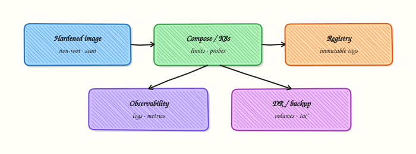

# Docker Security Hardening

## Overview


Run a container as non-root with a read-only root filesystem, dropped capabilities, and no secrets in the image layers.

Default containers often run as root with a writable filesystem — fine for demos, risky in production. Defence in depth: user, capabilities, seccomp/AppArmor, read-only FS, secrets mounts.

This is a core tutorial in **Module 11 · Security** of the REBASH Academy **Docker for Cloud & DevOps Engineers** series — written for Cloud, DevOps, Platform, and SRE engineers.

## Prerequisites


- [Container Registries and Distribution](container-registries-and-distribution.md)

## Learning Objectives


By the end of this tutorial, you will be able to:

- [ ] Build/run as non-root `USER`  
- [ ] Drop Linux capabilities  
- [ ] Use `--read-only` + writable tmp mounts  
- [ ] Outline seccomp / AppArmor roles  
- [ ] Keep secrets out of `ENV` in images

## Architecture


This topic’s control points and relationships are shown below.



## Theory


### What

**Container hardening** reduces privilege and blast radius: non-root users, dropped Linux capabilities, read-only root filesystems, secret handling outside the image, and optionally **rootless** Engine. Orchestrators add further controls (Pod Security, seccomp), but image and runtime defaults still matter on Docker hosts.

### Why

Containers share a kernel. A process running as root with the Docker socket mounted can compromise the host. DevOps images often start from convenience bases that run as UID 0 — fine for demos, unsafe as a production default.

### How it works

Set `USER` in the Dockerfile to a non-root UID and align Kubernetes `runAsNonRoot` later. Start with `--cap-drop=ALL` and add back only required capabilities. Use `--read-only` plus `tmpfs` for `/tmp` when apps allow it. Never `COPY` production secrets into layers; inject at runtime via environment (carefully), files, or orchestrator secret stores. Prefer rootless Engine on locked-down laptops; understand its networking limits. Keep the daemon and hosts patched.

| Control | Practice |
|---------|----------|
| Non-root | `USER` in Dockerfile + `runAsNonRoot` |
| Capabilities | `--cap-drop=ALL` then add minimal |
| Read-only FS | `--read-only` + `tmpfs` for `/tmp` |
| Rootless engine | Reduce daemon privilege |
| Secrets | Runtime mounts — not `COPY secret` |

### Key concepts

- **Docker socket** — treat as root  
- **Seccomp / AppArmor** — default profiles block dangerous syscalls  
- **Supply chain** — signed bases and scanned images complement runtime hardening  
- **Break-glass** — debug images may relax rules temporarily  

### Common pitfalls

- Mounting `docker.sock` into random utility containers  
- Running privileged (`--privileged`) to “make it work”  
- Baking cloud keys into images  
- Dropping capabilities without testing startup (then disabling all hardening)

## Hands-on Lab

### Objective

Build a hardened image with a non-root user, drop Linux capabilities, and run with a read-only root filesystem — then prove `User` and `CapDrop` via `docker inspect`.

### Prerequisites

- Docker Engine or Docker Desktop
- Permission to build and run containers
- Basic familiarity with Dockerfile `USER` directive

### Lab environment

Workspace: `~/rebash-docker/module-11`

```bash
mkdir -p ~/rebash-docker/module-11 && cd ~/rebash-docker/module-11
```

### Real-world scenario

Security review flagged a legacy container running as root with full capabilities. You ship a hardened replacement: non-root UID, dropped `NET_RAW`, read-only root with a writable `/tmp` mount, and runtime flags that enforce the policy.

### Step-by-step tasks

#### Task 1 – Create a hardened Dockerfile

Create `Dockerfile`:

```dockerfile
FROM alpine:3.20
RUN apk add --no-cache netcat-openbsd \
    && addgroup -S app && adduser -S app -G app \
    && mkdir -p /app /tmp/app \
    && chown -R app:app /app /tmp/app
WORKDIR /app
COPY --chown=app:app server.sh .
RUN chmod +x server.sh
USER app
EXPOSE 8080
CMD ["./server.sh"]
```

Create `server.sh`:

```bash
#!/bin/sh
set -eu
echo "rebash-sec-lab listening on 8080 as $(id -un)"
while true; do printf 'HTTP/1.0 200 OK\r\nContent-Length: 2\r\n\r\nok' | nc -l -p 8080 -q 1; done
```

Build the image:

```bash
cd ~/rebash-docker/module-11
docker build -t rebash-sec-lab:1.0.0 .
docker images rebash-sec-lab:1.0.0 | tee build-proof.txt
grep -q rebash-sec-lab build-proof.txt
```

**Expected output:** Image `rebash-sec-lab:1.0.0` appears in `build-proof.txt`.

#### Task 2 – Run with capability drop and read-only rootfs

Run with production-style runtime hardening:

```bash
cd ~/rebash-docker/module-11
docker run -d --name rebash-sec-18110 \
  --read-only \
  --tmpfs /tmp:rw,noexec,nosuid,size=16m \
  --cap-drop ALL \
  --cap-add NET_BIND_SERVICE \
  -p 18110:8080 \
  rebash-sec-lab:1.0.0
docker ps --filter name=rebash-sec-18110 --format '{{ "{{" }}.Names{{ "}}" }} {{ "{{" }}.Status{{ "}}" }}' | tee run-status.txt
curl -sS http://127.0.0.1:18110/ | tee curl-sec.txt
```

**Expected output:** Container is Up; `curl-sec.txt` contains `ok`.

#### Task 3 – Prove User and CapDrop with inspect

Capture security-relevant fields:

```bash
cd ~/rebash-docker/module-11
docker inspect rebash-sec-18110 --format 'User={{ "{{" }}.Config.User{{ "}}" }} CapDrop={{ "{{" }}.HostConfig.CapDrop{{ "}}" }} ReadonlyRootfs={{ "{{" }}.HostConfig.ReadonlyRootfs{{ "}}" }}' | tee inspect-sec.txt
grep -q 'User=app' inspect-sec.txt
grep -q 'ReadonlyRootfs=true' inspect-sec.txt
docker exec rebash-sec-18110 id | tee id-in-container.txt
grep -q 'uid=100(app)' id-in-container.txt
```

**Expected output:** `inspect-sec.txt` shows `User=app`, `CapDrop=[all]`, `ReadonlyRootfs=true`; `id-in-container.txt` shows non-root UID.

### Validation steps

- [ ] Dockerfile sets `USER app` before `CMD`
- [ ] Container runs with `--read-only` and writable `/tmp`
- [ ] `CapDrop` includes `ALL` with only `NET_BIND_SERVICE` added
- [ ] HTTP responds on port `18110`
- [ ] Cleanup removes container and image

### Common errors and fixes

| Error | Cause | Fix |
|-------|-------|-----|
| `Permission denied` writing to `/app` | Read-only root without tmpfs | Mount `--tmpfs /tmp` or a volume for writable paths |
| `bind: permission denied` on port 8080 | Non-root cannot bind <1024 | Use `-p 18110:8080` (lab port) or `--cap-add NET_BIND_SERVICE` |
| `exec user process caused: no such file` | Missing shebang or CRLF | Ensure `server.sh` uses LF and `chmod +x` in Dockerfile if needed |
| Container exits immediately | `nc` missing in alpine | Add `RUN apk add --no-cache netcat-openbsd` to Dockerfile |

### Challenge exercise

Add `HEALTHCHECK` using `wget` or a shell probe, rebuild, and capture `docker inspect --format '{{ "{{" }}.State.Health.Status{{ "}}" }}'` after 30 seconds in `health-sec.txt`.

### Learning outcomes

- Built an image that runs as a dedicated non-root user
- Applied `--cap-drop ALL` with minimal capability adds
- Ran with read-only root filesystem and tmpfs for writes
- Verified hardening with `docker inspect` and in-container `id`

### Cleanup

```bash
docker rm -f rebash-sec-18110 2>/dev/null || true
docker rmi rebash-sec-lab:1.0.0 2>/dev/null || true
rm -f ~/rebash-docker/module-11/*.txt
```

## Validation


- [ ] Lab commands run under `~/rebash-docker/module-11/`
- [ ] You can explain each Theory section in your own words
- [ ] You used modern tooling where it applies to this topic
- [ ] You can describe one production failure mode for this topic

## Code Walkthrough


Production practice for **Docker Security Hardening** always combines:

1. Inspect before you change (status, plan, logs, dry-run)
2. Prefer reversible, documented changes (Git, IaC, drop-ins, version pins)
3. Capture evidence (command output, pipeline logs) for handovers
4. Prefer current tools and APIs over legacy shortcuts
5. Least privilege — escalate credentials only when required

Keep runbooks short enough to follow under pressure. Automate checks; keep humans for judgement.

## Security Considerations


- Treat credentials and tokens for docker as privileged — never commit them
- Prefer short-lived auth (OIDC, roles, SSO) over long-lived keys
- Validate blast radius before apply/deploy/delete operations
- Restrict who can approve production changes
- Collect audit logs; limit who can read sensitive traces

## Common Mistakes


!!! warning "Mounting `docker.sock` into random utility containers  "
    Validate assumptions against the Theory section and official docs before changing production.

!!! warning "Running privileged (`--privileged`) to “make it work”  "
    Lab shortcuts (open security groups, admin roles, skip approvals) must not ship unchanged.

!!! warning "Changing production without a rollback path"
    Always know how to revert (previous artefact, prior release, state rollback, DNS failback).

## Best Practices


- Encode Docker Security Hardening changes as code and review them in pull requests
- Pin versions (images, modules, actions, provider plugins)
- Separate environments with clear promotion gates
- Alert on symptoms with runbooks attached
- Destroy lab resources; tag everything with owner and expiry where possible

## Troubleshooting


| Symptom | Likely cause | Fix |
|---------|--------------|-----|
| Auth / permission denied | Wrong identity, policy, or scope | Check caller identity, roles, and least-privilege policies |
| Timeout / no route | Network, DNS, security group, or endpoint | Trace path, DNS, and allow-lists before retrying |
| Drift / unexpected plan | Manual change or wrong state/workspace | Reconcile desired vs actual; avoid click-ops on managed resources |
| Pipeline/job red | Flaky step, cache, or missing secret | Read failing step logs; bisect recent workflow/config changes |
| Cost spike | Idle load balancer, NAT, oversized compute | Inventory billable resources; stop/delete labs promptly |

## Summary


**Docker Security Hardening** is essential for Cloud and DevOps engineers working with docker. Practise the lab until the inspection and change path is muscle memory, then continue the track.

## Interview Questions


1. List three hardening flags you use on docker run.
2. Why drop capabilities?
3. Read-only root filesystem — when it breaks apps?
4. Risks of privileged containers?
5. How do user namespaces help?

!!! tip "Sample answer — question 2"
    Inspect HostConfig for privileged, capabilities, and mounts.

!!! tip "Sample answer — question 4"
    Default deny: non-root, cap-drop ALL, no privileged, minimal mounts.

## Related Tutorials


- [Course overview](index.md)
- [Container Scanning and SBOM](container-scanning-and-sbom.md)
- Depth: [Environment Variables and Secrets](environment-variables-and-secrets.md)

## References


- [Docker security](https://docs.docker.com/engine/security/)
