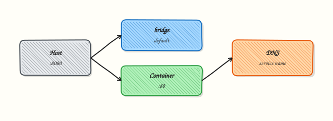

# Docker Swarm Orchestration Basics

## Overview


**Docker Swarm** turns a pool of Docker engines into a single virtual cluster. You declare desired state — which image, how many replicas, which network — and Swarm schedules tasks, restarts failures, and rolling-updates services. Swarm is built into Docker Engine, simpler than Kubernetes, and ideal for small-to-medium deployments or edge clusters.

This is **Tutorial 18** in **Module 6: Production & Beyond** of the REBASH Academy Docker track.


## Prerequisites


- [Production Docker Patterns](production-docker-patterns.md)
- [Docker Compose Fundamentals](docker-compose-fundamentals.md)
- [Docker Networking Fundamentals](docker-networking-fundamentals.md)
- Three Linux VMs or local machines with Docker Engine 24+ (one manager, two workers minimum for lab)
- Open ports: TCP 2377 (cluster management), 7946 TCP/UDP (node communication), 4789 UDP (overlay network)


## Learning Objectives


By the end of this tutorial, you will be able to:

- [ ] Initialize a Swarm and join worker nodes securely
- [ ] Deploy replicated and global services with `docker service`
- [ ] Configure overlay networks, published ports, and service discovery
- [ ] Perform rolling updates and rollbacks
- [ ] Manage secrets and configs in Swarm
- [ ] Deploy a multi-service stack from a Compose file with `docker stack deploy`


## Architecture





## Theory


### Swarm vs single-host Docker

| Capability | Single host | Swarm cluster |
|------------|-------------|---------------|
| Scheduling | Manual | Automatic across nodes |
| Failover | Restart policy only | Reschedule tasks on healthy nodes |
| Scaling | Manual duplicate runs | `docker service scale api=5` |
| Updates | Stop/start manually | Rolling update with parallelism |
| Secrets | Files/env on host | Encrypted raft store, mounted in tasks |
| Networking | Bridge per host | Multi-host overlay networks |

### Core terminology

| Term | Definition |
|------|------------|
| **Node** | A Docker engine participating in the Swarm (manager or worker) |
| **Manager** | Runs raft consensus; schedules services; typically 3 or 5 for HA |
| **Worker** | Executes tasks assigned by managers |
| **Service** | Desired state: image, replicas, update policy |
| **Task** | A running container slot assigned to a node |
| **Stack** | Group of services deployed from a Compose file |

### Service modes

| Mode | Behaviour | Example |
|------|----------|---------|
| **replicated** | N identical tasks across cluster | Web API with 3 replicas |
| **global** | One task per node | Log agent, monitoring exporter |

### Raft and manager quorum

Swarm managers use **Raft** for cluster state. Loss of quorum (majority of managers) halts scheduling.

| Managers | Tolerated failures |
|----------|-------------------|
| 1 | 0 (dev/lab only) |
| 3 | 1 |
| 5 | 2 |

Never run an even number of managers — use 1, 3, or 5.

### Overlay networks

**Overlay** driver creates a VXLAN network spanning all Swarm nodes. Services on the same overlay resolve each other by **service name** via embedded DNS.

```bash
docker network create -d overlay mynet
```

Attach services to `mynet`; tasks communicate without publishing host ports internally.

### Secrets and configs

| Object | Mutable | Use case |
|--------|---------|----------|
| **Secret** | No (immutable) | Passwords, TLS keys, API tokens |
| **Config** | Version by replace | nginx.conf, app.yml |

Secrets mount as files in `/run/secrets/` inside tasks — never in image layers or env vars for sensitive data.

### Compose vs stack deploy

`docker compose up` targets one host. **`docker stack deploy`** targets Swarm — interprets Compose v3 `deploy:` keys (replicas, placement, update_config). Not all Compose features work in stacks (e.g., `build:` is ignored — push images to a registry first).


### When Swarm still makes sense

Docker Swarm remains useful for small teams that want orchestration without operating a full Kubernetes control plane. Managers maintain desired state for services; workers run tasks. Overlay networks provide multi-host DNS similar in spirit to Kubernetes Services, while Swarm secrets encrypt data at rest on manager nodes and mount into tasks at runtime.

Prefer Swarm when you already standardised on Docker Engine, need rolling updates with a short learning curve, and accept that the ecosystem (operators, CRDs, wide CNCF tooling) is thinner than Kubernetes. For greenfield platforms expecting many teams, autoscaling policies, and GitOps-at-scale, plan an exit path to Kubernetes early — map Swarm services to Deployments/Services conceptually before you are under pressure.

### Field notes for docker swarm orchestration basics

Re-read the Architecture diagram alongside the Hands-on Lab: each lab step should map to a box or arrow in that picture. If you cannot point to where a command fits, pause and revisit Theory before continuing — that habit prevents cargo-cult YAML and Compose snippets in production reviews.


### Practice mindset

As you work through this tutorial, narrate *why* each control or command exists — not only *how* to type it. Production incidents are rarely solved by memorising flags; they are solved by connecting symptoms to the architecture (daemon vs kubelet, image vs running container, Service vs Endpoints, volume vs writable layer). After the lab, write three bullet notes in your own words: what you verified, what would break in production if skipped, and what you would monitor next.


### Connecting the lab to production reviews

When a teammate asks “is this ready?”, answer with evidence from this tutorial’s controls: image provenance, privilege level, network exposure, health signals, and teardown/rollback. Copy-pasting a working lab snippet into production without those answers is how quiet misconfigurations become incidents. Prefer small, reviewable changes — one Dockerfile improvement, one RBAC binding, one probe — over large untested stacks.

### Observability while you learn

Get into the habit of watching state while commands run: `docker events` / `kubectl get events`, resource usage, and logs in a second pane. Many failures are timing issues (probes, readiness, volume attach) that disappear if you only look at the final steady state. Capturing a short timeline of what you saw will also make your Troubleshooting section notes far more valuable later.


### Checklist before you leave the lab

1. Resources created in this tutorial are deleted or clearly labelled for retention.
2. No secrets, kubeconfigs, or registry passwords were written into Git.
3. You can explain the Architecture diagram without reading the caption.
4. Validation pass criteria in this page are satisfied on your machine.
5. You noted one question to revisit in the next tutorial of the series.

### Common production failure modes this topic prevents

Misconfiguration here usually shows up as intermittent outages rather than clean errors: restart loops without log shipping, services that listen but never become Ready, volumes that work on one node only, or credentials that leak into image history. Use the Hands-on Lab as a rehearsal for the failure mode — break something on purpose, watch the signal, then apply the fix documented in Troubleshooting.


### Further reading posture

After finishing **docker swarm orchestration basics**, skim the Related Links once with a production lens: which linked tutorial closes the biggest gap in your current environment (security, networking, storage, or CI/CD)? Schedule that next — series order is a suggestion, risk order is a better personal syllabus.

### Lab evidence to keep

Keep a short note of the exact commands that proved the happy path and the failure path. Interviewers and future incident responders both benefit when you can show *how you knew* the system was healthy — not only that you followed a script.


## Hands-on Lab


Create a workspace for this tutorial.

```bash
mkdir -p ~/rebash-docker/docker-swarm-orchestration-basics && cd ~/rebash-docker/docker-swarm-orchestration-basics
```

**Focus:** inspect Swarm mode availability without leaving a manager up

### Step 1 – Swarm awareness

```bash
docker info --format 'swarm={{ "{{" }}.Swarm.LocalNodeState{{ "}}" }}'
tee swarm-notes.txt << 'EOF'
Prefer Kubernetes for most new orchestration. If you init Swarm in a lab, leave with: docker swarm leave --force
EOF
cat swarm-notes.txt
docker run --rm alpine:3.20 echo 'orchestration-agnostic container still runs'
```

### Final step – Cleanup note

```bash
# Do not leave Swarm enabled on shared machines
```


## Validation


Confirm the lab before moving on:

1. Re-run the critical commands from the Hands-on Lab and compare them to the expected output in each step.
2. Check that you can explain *why* each successful result matters (not only that it printed).
3. Note any warnings or unexpected output — resolve them using Troubleshooting before continuing.

| Check | Pass criteria |
|-------|----------------|
| Swarm mode | `docker info` shows Swarm active (or lab documents single-node init) |
| Service | Service replicas reach running state |
| Update/rollback | Rolling update or rollback path demonstrated |
| Cleanup | Services removed; leave Swarm only if you intend to keep it |


## Code Walkthrough


### Essential Swarm commands

```bash
# Cluster
docker swarm init | join | leave
docker node ls | inspect | update | rm

# Services
docker service create | ls | ps | inspect | update | scale | rm | logs

# Stacks
docker stack deploy | ls | ps | services | rm

# Secrets & configs
docker secret create | ls | rm
docker config create | ls | rm

# Networks
docker network create -d overlay NAME
```

### Drain a node for maintenance

```bash
docker node update --availability drain node-worker-2
docker node ps node-worker-2    # tasks rescheduled elsewhere
# perform maintenance
docker node update --availability active node-worker-2
```

### Service discovery test

From any task on the overlay network:

```bash
docker exec -it TASK_ID sh
wget -qO- http://api:3000/health
```

Service name `api` resolves to all healthy task IPs (VIP load balancing).


## Security Considerations


- Enable Swarm with TLS mutual authentication between managers and workers
- Store Swarm secrets in Docker secrets — not as service environment variables
- Restrict manager node access; managers hold cluster control-plane material
- Rotate node join tokens after labs and never commit tokens to Git
- Prefer overlay networks with encryption for sensitive multi-host traffic when required
- Limit published ports on ingress and remove unused services promptly


## Common Mistakes


!!! warning "Single manager in production"
    Manager loss means no orchestration. Run 3 managers across failure domains.

!!! warning "Using docker compose up on Swarm nodes"
    Compose ignores `deploy:` keys without Swarm mode. Use `docker stack deploy`.

!!! warning "Building images in stack files"
    Stack deploy ignores `build:`. CI must push images; stack references registry tags.

!!! warning "Publishing every service port"
    Only edge services need published ports. Internal services use overlay DNS.

!!! warning "Ignoring placement constraints"
    Stateful workloads (DB) on random nodes lose data on reschedule. Use labels and volumes with backup strategy.


## Best Practices


!!! tip "Odd number of managers"
    Maintain raft quorum — 3 managers for most production Swarm clusters.

!!! tip "Pin images by tag or digest"
    Same discipline as CI/CD — avoid `latest` in service specs.

!!! tip "Use health checks in service definition"
    Unhealthy tasks are replaced automatically during updates and runtime.

!!! tip "Centralize logs and metrics"
    Swarm does not include full observability. Integrate Prometheus, Loki, or ELK.

!!! tip "Plan exit strategy"
    Swarm maintenance mode is real — know when to migrate to [Kubernetes](from-docker-to-kubernetes.md).


## Troubleshooting


| Issue | Cause | Solution |
|-------|-------|----------|
| `docker swarm init` fails | Wrong advertise-addr | Use reachable IP, not 127.0.0.1 |
| Tasks pending | No worker capacity | Add nodes; check `docker node ls` |
| Overlay network isolated | Firewall blocks 4789/7946 | Open UDP 4789, TCP/UDP 7946 |
| Service not reachable | Wrong publish mode | Use `ingress` mode; verify port |
| Secret not mounted | Service not updated after secret create | Recreate service with `--secret` |
| Quorum lost | Too many managers down | Restore from backup or rebuild cluster |


## Summary


- **Docker Swarm** provides native clustering with services, tasks, and overlay networking
- **Managers** run Raft consensus; use **3 or 5** for production quorum
- **`docker service`** declares replicated or global workloads with rolling updates
- **Secrets and configs** distribute sensitive and static data without baking into images
- **`docker stack deploy`** maps Compose files to Swarm with `deploy:` semantics
- Swarm bridges single-host Docker and full orchestration — next step: [From Docker to Kubernetes](from-docker-to-kubernetes.md)


## Interview Questions


1. What production problem does **Docker Swarm Orchestration Basics** address in container platforms?
2. A container restarts continually — how do you triage?
3. Why are mutable `latest` tags risky in production?
4. Which container security controls do you insist on before prod?
5. How do you keep images small and builds fast in CI?

!!! tip "Sample answer — question 2"
    Check `docker ps -a`, logs, exit code, and `inspect` for OOM/restarts. Confirm command/entrypoint and volume permissions.

!!! tip "Sample answer — question 4"
    Non-root, minimal base, no secrets in layers, scanning, read-only rootfs where possible, and least capabilities.


## Related Tutorials


- [Production Docker Patterns](production-docker-patterns.md) *(previous)*
- [From Docker to Kubernetes](from-docker-to-kubernetes.md) *(next)*
- [Docker Compose Fundamentals](docker-compose-fundamentals.md)
- [Docker Networking Fundamentals](docker-networking-fundamentals.md)
- [Environment Variables and Secrets](environment-variables-and-secrets.md)
- [Docker – Category Overview](index.md)
- Cheat sheet: [Docker Cheat Sheet](../cheatsheets/docker.md)
- Interview prep: [Docker Interview Prep](../interview/docker.md)
- Learning path: [DevOps Engineer](../learning-paths/devops-engineer.md)


## References


- [Docker – Swarm mode overview](https://docs.docker.com/engine/swarm/)
- [Docker – Create a service](https://docs.docker.com/engine/swarm/services/)
- [Docker – Manage swarm security](https://docs.docker.com/engine/swarm/swarm_manager_locking/)
- [Docker – Secrets](https://docs.docker.com/engine/swarm/secrets/)
- [Docker – Stack deploy](https://docs.docker.com/engine/swarm/stack_deploy/)
- [Compose – Deploy specification](https://docs.docker.com/compose/compose-file/deploy/)
