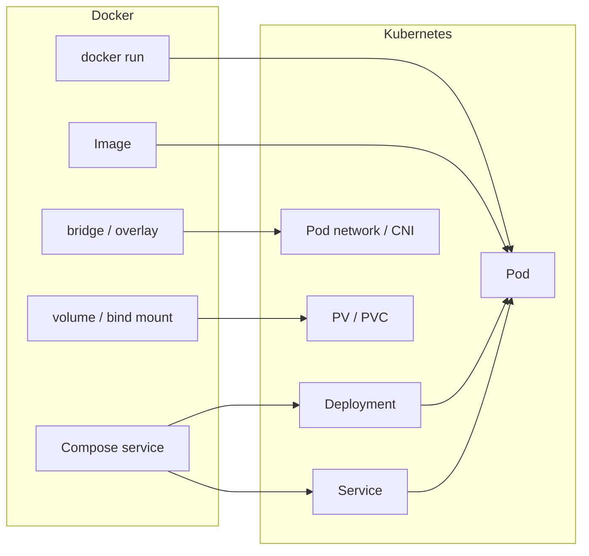

# From Docker to Kubernetes

## Overview

If you understand Docker, you already know half of Kubernetes. Containers become **Pods**, `docker run` flags become **Pod specs**, Compose services become **Deployments** and **Services**, and Swarm overlay networks become **ClusterIP** routing. This tutorial builds a explicit concept map so you can read Kubernetes manifests confidently and migrate workloads incrementally.

This is **Tutorial 19** in **Module 6: Production & Beyond** of the REBASH Academy Docker track.

## Prerequisites

- [Docker Swarm Orchestration Basics](docker-swarm-orchestration-basics.md)
- [Docker Compose Fundamentals](docker-compose-fundamentals.md)
- [Production Docker Patterns](production-docker-patterns.md)
- [Docker Networking Fundamentals](docker-networking-fundamentals.md)
- Optional: local cluster via [minikube](https://minikube.sigs.k8s.io/) or [kind](https://kind.sigs.k8s.io/)

## Learning Objectives

By the end of this tutorial, you will be able to:

- [ ] Map Docker primitives to Kubernetes API objects
- [ ] Explain Pods, Deployments, Services, and Namespaces in Docker terms
- [ ] Translate a Compose file into equivalent Kubernetes manifests
- [ ] Understand how health checks, env vars, volumes, and secrets differ in K8s
- [ ] Plan an incremental migration path from Docker Compose to Kubernetes
- [ ] Know when to continue with the [Kubernetes track](../kubernetes/index.md)

## Architecture Diagram



## Theory

### The big picture

| Docker mental model | Kubernetes equivalent |
|---------------------|----------------------|
| Container | Container inside a **Pod** |
| `docker run` | `kubectl run` or Pod manifest (prefer Deployment) |
| Image | Same OCI image — pulled from same registries |
| `docker compose` service | **Deployment** + **Service** (+ **Ingress**) |
| Bridge network | Pod network (CNI plugin) |
| `--publish 8080:80` | Service `type: NodePort/LoadBalancer` + Ingress |
| Named volume | **PersistentVolumeClaim** |
| Bind mount | `hostPath` or ConfigMap/Secret volume |
| Env file / `-e` | ConfigMap, Secret, or env in manifest |
| HEALTHCHECK | `livenessProbe`, `readinessProbe`, `startupProbe` |
| `--restart unless-stopped` | Deployment `restartPolicy: Always` |
| Swarm service | Deployment + Service |
| Swarm secret | Secret object |
| Swarm stack | Helm chart or Kustomize overlay |

Kubernetes adds a **control plane** that continuously reconciles desired state — similar to Swarm managers, but richer and ecosystem-backed.

### Pod — the atomic unit

A **Pod** is the smallest deployable unit in Kubernetes. Usually one Pod runs one primary container (sometimes sidecars share the network namespace).

Docker equivalent:

```bash
docker run -d --name api --network backend -e DB_HOST=db myapi:1.2.0
```

Kubernetes Pod (simplified):

```yaml
apiVersion: v1
kind: Pod
metadata:
  name: api
  labels:
    app: api
spec:
  containers:
    - name: api
      image: myapi:1.2.0
      env:
        - name: DB_HOST
          value: db
      ports:
        - containerPort: 3000
  restartPolicy: Always
```

!!! note "Do not deploy bare Pods in production"
    Pods are ephemeral. Use a **Deployment** (or StatefulSet for stable identity) to manage Pod lifecycle.

### Deployment — desired replica count and rollouts

A **Deployment** owns ReplicaSets and Pods. It provides scaling and rolling updates — the closest match to a Swarm **replicated service** or a Compose service with `deploy.replicas`.

```yaml
apiVersion: apps/v1
kind: Deployment
metadata:
  name: api
spec:
  replicas: 3
  selector:
    matchLabels:
      app: api
  template:
    metadata:
      labels:
        app: api
    spec:
      containers:
        - name: api
          image: registry.example.com/myapi:1.2.0
          ports:
            - containerPort: 3000
          resources:
            limits:
              memory: "256Mi"
              cpu: "500m"
          livenessProbe:
            httpGet:
              path: /health
              port: 3000
            initialDelaySeconds: 10
            periodSeconds: 15
          readinessProbe:
            httpGet:
              path: /ready
              port: 3000
            periodSeconds: 5
```

| Deployment field | Docker/Swarm analog |
|------------------|---------------------|
| `replicas: 3` | `--replicas 3` / scale 3 |
| `strategy.rollingUpdate` | `docker service update --update-parallelism` |
| `resources.limits` | `--memory`, `--cpus` |
| Probes | HEALTHCHECK with separate liveness/readiness |

### Service — stable network identity

Pods get new IPs on restart. A **Service** provides a stable ClusterIP and DNS name (`api.default.svc.cluster.local`) that load-balances to healthy Pod endpoints.

```yaml
apiVersion: v1
kind: Service
metadata:
  name: api
spec:
  selector:
    app: api
  ports:
    - port: 80
      targetPort: 3000
  type: ClusterIP
```

| Service type | Docker analog |
|--------------|---------------|
| **ClusterIP** | Internal overlay DNS (default) |
| **NodePort** | `--publish` on every node IP |
| **LoadBalancer** | Cloud LB in front of NodePort |
| **Ingress** | nginx/Traefik routing rules (no direct Docker equivalent) |

### Namespace — logical isolation

**Namespaces** partition objects (`dev`, `staging`, `prod`). Docker has no direct match — closest is separate Compose project names or Swarm stack names.

```bash
kubectl create namespace staging
kubectl get pods -n staging
```

### ConfigMap and Secret

| Docker | Kubernetes |
|--------|------------|
| `-e KEY=val` | env from ConfigMap/Secret |
| `--env-file` | ConfigMap keys |
| Swarm secret file | Secret volume mount |
| Bind mount config | ConfigMap volume |

### Volumes

| Docker | Kubernetes |
|--------|------------|
| Named volume | PersistentVolumeClaim |
| Bind mount | hostPath (avoid in prod), ConfigMap, emptyDir |
| tmpfs | emptyDir with medium: Memory |

```yaml
volumes:
  - name: data
    persistentVolumeClaim:
      claimName: postgres-pvc
containers:
  - name: db
    volumeMounts:
      - name: data
        mountPath: /var/lib/postgresql/data
```

### Health checks — three probes

Kubernetes improves on Docker's single HEALTHCHECK:

| Probe | Maps to | Failure action |
|-------|---------|----------------|
| **startupProbe** | Extended boot grace | Kill container if boot never succeeds |
| **livenessProbe** | Liveness HEALTHCHECK | Restart container |
| **readinessProbe** | Readiness check | Remove from Service endpoints |

See [Production Docker Patterns](production-docker-patterns.md) for probe design principles.

## Hands-on Lab

### Lab 1 — Compose to Kubernetes translation

Start with `compose.yml`:

```yaml
services:
  api:
    image: myapi:1.2.0
    ports:
      - "3000:3000"
    environment:
      REDIS_URL: redis://redis:6379
    depends_on:
      - redis
    healthcheck:
      test: ["CMD", "curl", "-sf", "http://localhost:3000/health"]
      interval: 15s

  redis:
    image: redis:7-alpine
    volumes:
      - redis-data:/data

volumes:
  redis-data:
```

Equivalent Kubernetes resources (minimal):

**deployment-api.yaml**

```yaml
apiVersion: apps/v1
kind: Deployment
metadata:
  name: api
spec:
  replicas: 2
  selector:
    matchLabels:
      app: api
  template:
    metadata:
      labels:
        app: api
    spec:
      containers:
        - name: api
          image: myapi:1.2.0
          ports:
            - containerPort: 3000
          env:
            - name: REDIS_URL
              value: redis://redis:6379
          livenessProbe:
            httpGet:
              path: /health
              port: 3000
            periodSeconds: 15
---
apiVersion: v1
kind: Service
metadata:
  name: api
spec:
  selector:
    app: api
  ports:
    - port: 3000
      targetPort: 3000
  type: NodePort
```

**deployment-redis.yaml** — Deployment + Service + PVC (abbreviated; use StatefulSet for production Redis).

Apply:

```bash
kubectl apply -f deployment-redis.yaml
kubectl apply -f deployment-api.yaml
kubectl get pods,svc
kubectl port-forward svc/api 3000:3000
curl localhost:3000/health
```

### Lab 2 — Imperative vs declarative

```bash
# Docker imperative
docker run -d --name web -p 8080:80 nginx:1.27-alpine

# Kubernetes declarative equivalent
kubectl create deployment web --image=nginx:1.27-alpine --replicas=2
kubectl expose deployment web --port=80 --type=NodePort
kubectl get deployments,pods,services
```

Commit YAML to Git for GitOps — avoid kubectl from laptops to production.

### Lab 3 — Migration checklist

For each Compose service, document the target Deployment, Service type, storage, and secrets. Migrate **stateless services first** (api, web, worker); plan StatefulSet or managed DB for postgres and redis.

## Commands & Code

### kubectl ↔ docker cheat sheet

| Operation | Docker | Kubernetes |
|-----------|--------|------------|
| List running | `docker ps` | `kubectl get pods` |
| Logs | `docker logs CONTAINER` | `kubectl logs POD` |
| Exec shell | `docker exec -it C sh` | `kubectl exec -it POD -- sh` |
| Inspect | `docker inspect C` | `kubectl describe pod POD` |
| Remove | `docker rm -f C` | `kubectl delete pod POD` |
| Scale | `docker service scale` | `kubectl scale deployment D --replicas=5` |
| Update image | `docker service update --image` | `kubectl set image deployment/D c=img:tag` |
| Rollout status | service ps | `kubectl rollout status deployment/D` |
| Rollback | service rollback | `kubectl rollout undo deployment/D` |

Ingress replaces manual nginx routing in Compose stacks — see the [Kubernetes track](../kubernetes/index.md).

## Common Mistakes

!!! warning "Running one Pod per deployment without probes"
    Silent failures stay in load rotation. Port Docker HEALTHCHECK to liveness and readiness probes.

!!! warning "Using latest tag in manifests"
    Same anti-pattern as Docker — pin SHA or semver; use imagePullPolicy: IfNotPresent thoughtfully.

!!! warning "Lift-and-shift stateful containers as Deployments"
    Postgres in a Deployment loses data on reschedule. Use StatefulSet + PVC + backup.

!!! warning "Assuming kubectl apply from laptop is production CD"
    Use CI/CD or GitOps — same lesson as [Docker in CI/CD Pipelines](docker-in-ci-cd-pipelines.md).

!!! warning "Ignoring resource requests"
    Without requests, scheduler overcommits nodes — worse than missing Docker `--memory` limits.

## Best Practices

!!! tip "Migrate stateless services first"
    API, workers, frontends — then tackle databases with proper operators.

!!! tip "Keep images unchanged"
    Kubernetes runs the same OCI images you built for Docker — reuse CI pipelines.

!!! tip "Use Helm or Kustomize for environments"
    Like Compose overrides — base chart + staging/prod values.

!!! tip "Learn one local cluster tool"
    kind or minikube plus kubectl beats Docker Desktop alone for K8s-specific learning.

!!! tip "Continue on the Kubernetes track"
    This tutorial maps concepts — [Kubernetes](../kubernetes/index.md) tutorials go deep on operations.

## Troubleshooting

| Issue | Cause | Solution |
|-------|-------|----------|
| ImagePullBackOff | Private registry auth | imagePullSecrets |
| CrashLoopBackOff | App exits on boot | kubectl logs; fix config |
| Pod pending | Insufficient resources | Check requests; add nodes |
| Service no traffic | Selector mismatch | Labels on Pod template must match Service selector |
| Probe failures | Wrong port/path | Align with HEALTHCHECK from Docker image |
| PVC pending | No storage class | Define StorageClass or use hostPath in lab only |

## Summary

- **Pods** wrap containers; **Deployments** manage replica count and rollouts (like Swarm services)
- **Services** provide stable DNS and load balancing (like overlay service names + VIP)
- **ConfigMaps/Secrets**, **PVCs**, and **probes** map directly from Compose and Dockerfile patterns
- Migration is incremental: same images, new orchestration API, stronger production primitives
- Continue learning on the [Kubernetes track](../kubernetes/index.md)
- Finish the Docker series with [Docker Capstone and Next Steps](docker-capstone-and-next-steps.md)

## Interview Questions

1. What is a Pod, and how does it relate to a Docker container?
2. What Kubernetes object replaces a Docker Compose web service with 3 replicas?
3. How do liveness and readiness probes differ from a single Docker HEALTHCHECK?
4. What problem does a Kubernetes Service solve that container names on one host do not?
5. How would you migrate a Compose volume to Kubernetes?
6. What is the difference between a Deployment and a StatefulSet?
7. Name three docker CLI commands and their kubectl equivalents.
8. Why should production databases not run as standard Deployments?
9. What is an Ingress, and what Docker pattern does it replace?
10. When is Docker Swarm enough, and when should you adopt Kubernetes?

??? tip "Sample Answers (Questions 2 and 4)"

    **Q2 — Compose to K8s:** A Compose service with replicas maps to a **Deployment** (manages Pod replicas and rolling updates) plus a **Service** (stable network endpoint). External access adds **Ingress** or LoadBalancer Service. Config and secrets become ConfigMap and Secret objects referenced in the Pod template.

    **Q4 — Why Services:** Containers (Pods) get ephemeral IPs when restarted or rescheduled. A Service selects Pods by label and provides a stable virtual IP and DNS name, load-balancing traffic to healthy endpoints — essential in a cluster where Pods move across nodes, unlike a single Docker host where you might publish ports directly.

## Related Tutorials

- [Docker Swarm Orchestration Basics](docker-swarm-orchestration-basics.md) *(previous)*
- [Docker Capstone and Next Steps](docker-capstone-and-next-steps.md) *(next)*
- [Docker Compose Fundamentals](docker-compose-fundamentals.md)
- [Production Docker Patterns](production-docker-patterns.md)
- [Kubernetes – Category Overview](../kubernetes/index.md)
- [Docker – Category Overview](index.md)

## References

- [Kubernetes – Concepts](https://kubernetes.io/docs/concepts/)
- [Kubernetes – Pods](https://kubernetes.io/docs/concepts/workloads/pods/)
- [Kubernetes – Deployments](https://kubernetes.io/docs/concepts/workloads/controllers/deployment/)
- [Kubernetes – Services](https://kubernetes.io/docs/concepts/services-networking/service/)
- [Kompose – User guide](https://kompose.io/user-guide/)
- [CNCF – Kubernetes the Hard Way](https://github.com/kelseyhightower/kubernetes-the-hard-way) *(advanced)*
