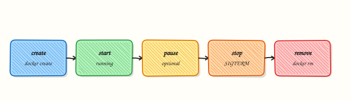

# Introduction to Containers and Docker

## Overview


Explain containers vs virtual machines (VMs), name the Open Container Initiative (OCI) pieces, and state why Docker matters for Cloud and DevOps delivery.

Containers package an application with its dependencies and share the host kernel. Teams get portable builds from laptop → CI → cloud. This course is **Docker for Cloud & DevOps Engineers** — production packaging, not Docker trivia.

This is a core tutorial in **Module 1 · Container Fundamentals** of the REBASH Academy **Docker for Cloud & DevOps Engineers** series — written for Cloud, DevOps, Platform, and SRE engineers.


## Prerequisites


- [Linux Fundamentals](../linux/index.md)
- Comfort with a terminal; [Git](../git/index.md) helpful


## Learning Objectives


By the end of this tutorial, you will be able to:

- [ ] Define a container and an image  
- [ ] Compare VMs and containers for ops trade-offs  
- [ ] Outline Docker’s brief history and ecosystem role  
- [ ] Name OCI image and runtime standards  
- [ ] Sketch create → start → stop → remove


## Architecture


This topic’s control points and relationships are shown below.




## Theory


### What

A **container** packages an application with its libraries and runtime configuration so it runs consistently on a laptop, in Continuous Integration (CI), and in the cloud. Containers share the **host kernel** and isolate processes with Linux **namespaces** and **control groups (cgroups)**. An **image** is the immutable template; a **container** is a running (or stopped) instance with a writable layer. **Docker** popularised this workflow with a Dockerfile → image → registry → run loop.

### Why

Virtual machines (VMs) give strong isolation but are heavy: each guest carries a full operating system. Containers start in seconds, pack densely on a host, and produce portable artefacts for DevOps pipelines. The same Open Container Initiative (OCI) images later run under Kubernetes. Teams adopt Docker to remove “works on my machine” drift and to standardise delivery.

### How it works

You build or pull an image (layered filesystem plus config), then create a container that adds a thin writable layer and starts the configured process. Networking, volumes, and resource limits are attached at runtime. Under the hood Docker Engine speaks OCI image and runtime standards (`runc` is a common runtime). Lifecycle is create → start → stop → remove; ephemeral containers use `--rm` so cleanup is automatic.

| | Virtual machine | Container |
|--|-----------------|-----------|
| Isolation | Hardware + guest OS | Namespaces + cgroups |
| Footprint | Gigabytes, minutes | Megabytes, seconds |
| Kernel | Guest kernel each | Shared host kernel |
| Ops fit | Strong isolation, legacy | Dense packing, CI/CD |

### Key concepts

- **OCI image** — layered filesystem + config, portable across engines  
- **OCI runtime** — how a bundle becomes a running process  
- **Registry** — stores and distributes images  
- **Docker’s role** — developer UX and ecosystem; not the only engine  

### Common pitfalls

- Equating containers with perfect security isolation (kernel is shared)  
- Treating containers as tiny VMs that need full systemd stacks  
- Ignoring OCI portability and locking into non-standard image formats  
- Skipping the image vs container distinction in incidents


## Hands-on Lab


Create a workspace for this tutorial.

```bash
mkdir -p ~/rebash-docker/module-01 && cd ~/rebash-docker/module-01
```

**Focus:** run a container, inspect it, and clean up completely

### Step 1 – Run and inspect

```bash
docker version
docker run -d --name rebash-intro -p 18080:80 nginx:alpine
docker ps --filter name=rebash-intro
curl -sI http://127.0.0.1:18080 | head -n 5
docker logs rebash-intro 2>&1 | head -n 20
docker inspect rebash-intro --format '{{ "{{" }}.State.Status{{ "}}" }} {{ "{{" }}.Config.Image{{ "}}" }}'
```

### Step 2 – Exec and cleanup

```bash
docker exec rebash-intro nginx -v
docker stop rebash-intro
docker rm rebash-intro
docker ps -a --filter name=rebash-intro
```

### Final step – Cleanup note

```bash
docker rm -f rebash-intro 2>/dev/null || true
# Keep ~/rebash-docker/ for later tutorials
```


## Validation


- [ ] Lab commands run under `~/rebash-docker/module-01/`
- [ ] You can explain each Theory section in your own words
- [ ] You used modern tooling where it applies to this topic
- [ ] You can describe one production failure mode for this topic


## Code Walkthrough


Production practice for **Introduction to Containers and Docker** always combines:

1. Inspect before you change (status, plan, logs, dry-run)
2. Prefer reversible, documented changes (Git, IaC, drop-ins, version pins)
3. Capture evidence (command output, pipeline logs) for handovers
4. Prefer current tools and APIs over legacy shortcuts
5. Least privilege — escalate credentials only when required

Keep runbooks short enough to follow under pressure. Automate checks; keep humans for judgement.


## Security Considerations


- Treat credentials and tokens for docker as privileged — never commit them
- Prefer short-lived auth (OIDC, roles, SSO) over long-lived keys
- Validate blast radius before apply/deploy/delete operations
- Restrict who can approve production changes
- Collect audit logs; limit who can read sensitive traces


## Common Mistakes


!!! warning "Equating containers with perfect security isolation (kernel is shared)  "
    Validate assumptions against the Theory section and official docs before changing production.

!!! warning "Treating containers as tiny VMs that need full systemd stacks  "
    Lab shortcuts (open security groups, admin roles, skip approvals) must not ship unchanged.

!!! warning "Changing production without a rollback path"
    Always know how to revert (previous artefact, prior release, state rollback, DNS failback).


## Best Practices


- Encode Introduction to Containers and Docker changes as code and review them in pull requests
- Pin versions (images, modules, actions, provider plugins)
- Separate environments with clear promotion gates
- Alert on symptoms with runbooks attached
- Destroy lab resources; tag everything with owner and expiry where possible


## Troubleshooting


| Symptom | Likely cause | Fix |
|---------|--------------|-----|
| Auth / permission denied | Wrong identity, policy, or scope | Check caller identity, roles, and least-privilege policies |
| Timeout / no route | Network, DNS, security group, or endpoint | Trace path, DNS, and allow-lists before retrying |
| Drift / unexpected plan | Manual change or wrong state/workspace | Reconcile desired vs actual; avoid click-ops on managed resources |
| Pipeline/job red | Flaky step, cache, or missing secret | Read failing step logs; bisect recent workflow/config changes |
| Cost spike | Idle load balancer, NAT, oversized compute | Inventory billable resources; stop/delete labs promptly |


## Summary


**Introduction to Containers and Docker** is essential for Cloud and DevOps engineers working with docker. Practise the lab until the inspection and change path is muscle memory, then continue the track.


## Interview Questions


1. How does a container differ from a virtual machine?
2. Container exits immediately — what do you check first?
3. What is an image versus a container?
4. Why is cleanup (docker rm) part of every lab?
5. Where do containers fit in Cloud/DevOps workflows?

!!! tip "Sample answer — question 2"
    Check docker ps -a for exit code, then docker logs and the container command.

!!! tip "Sample answer — question 4"
    Prefer official images, avoid privileged mode, and never put secrets in image layers.


## Related Tutorials


- [Course overview](index.md)
- [Docker Architecture and Components](docker-architecture-and-components.md)


## References


- [OCI](https://opencontainers.org/) · [Docker overview](https://docs.docker.com/get-started/overview/)
