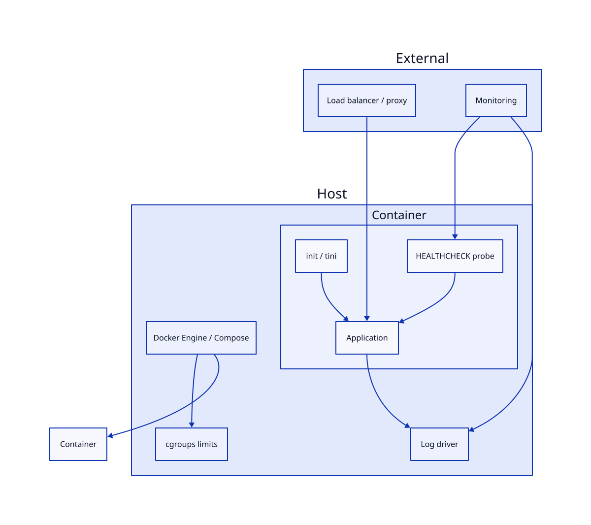

# Production Docker Patterns

## Overview

Building an image is half the job. Production requires containers that **start reliably**, **stay healthy**, **respect resource boundaries**, and **shut down gracefully** under load. This tutorial covers the runtime patterns operators use daily: HEALTHCHECK directives, restart policies, CPU and memory limits, ulimits, init processes, and Compose production overrides.

This is **Tutorial 17** in **Module 6: Production & Beyond** of the REBASH Academy Docker track.

## Prerequisites

- [Docker in CI/CD Pipelines](docker-in-ci-cd-pipelines.md)
- [Container Logging and Monitoring](container-logging-and-monitoring.md)
- [Docker Security Hardening](docker-security-hardening.md)
- [Docker Compose Fundamentals](docker-compose-fundamentals.md)
- A Linux host or VM with Docker Engine 24+

## Learning Objectives

By the end of this tutorial, you will be able to:

- [ ] Configure Dockerfile and runtime health checks for liveness and readiness semantics
- [ ] Apply restart policies appropriate to service criticality
- [ ] Set CPU, memory, and PIDs limits to prevent noisy-neighbor failures
- [ ] Implement graceful shutdown with stop signals and timeouts
- [ ] Structure Compose files for dev vs production with overrides
- [ ] Validate production container configuration before deployment

## Architecture



## Theory

### Production readiness layers

| Layer | Concern | Mechanism |
|-------|---------|-----------|
| **Build** | Minimal attack surface | Multi-stage, non-root user |
| **Start** | Dependency order | `depends_on` + health condition |
| **Run** | Stability | Restart policy, resource limits |
| **Observe** | Failure detection | HEALTHCHECK, structured logs |
| **Stop** | Zero-downtime deploy | SIGTERM, drain, timeout |

Production patterns apply whether you run `docker run` on a VM, Compose on a single host, or hand off images to Swarm or Kubernetes.

### Health checks — liveness vs readiness

Docker's built-in **HEALTHCHECK** reports container status: `starting`, `healthy`, or `unhealthy`. Orchestrators and load balancers use this differently:

| Type | Question | Failure action |
|------|----------|----------------|
| **Liveness** | Is the process alive? | Restart the container |
| **Readiness** | Can it accept traffic? | Remove from load balancer |
| **Startup** | Has boot finished? | Delay liveness checks |

Docker Engine exposes one HEALTHCHECK per container. In Kubernetes you define separate probes; in Docker Compose v2+ you can use `healthcheck` with `depends_on: condition: service_healthy`.

Example Dockerfile health check:

```dockerfile
HEALTHCHECK --interval=30s --timeout=5s --start-period=40s --retries=3 \
  CMD curl -f http://localhost:8080/health || exit 1
```

| Flag | Meaning |
|------|---------|
| `--interval` | Time between probes |
| `--timeout` | Max wait for probe command |
| `--start-period` | Grace period after start (failures ignored) |
| `--retries` | Consecutive failures before `unhealthy` |

!!! tip "Keep probes cheap"
    Hit a lightweight `/health` or `/ready` endpoint — not a full database query on every tick unless necessary.

### Restart policies

Control what Docker does when a container exits:

| Policy | Behaviour | Typical use |
|--------|----------|-------------|
| `no` | Never restart (default) | Batch jobs, one-shot tasks |
| `on-failure[:max-retries]` | Restart on non-zero exit | Apps that may crash transiently |
| `always` | Always restart unless manually stopped | Single-node critical services |
| `unless-stopped` | Like `always`, but not after daemon restart if manually stopped | **Recommended default for prod** |

```bash
docker run -d --restart unless-stopped --name api myapp:1.2.0
```

Restart policies do **not** replace orchestration — they help on single hosts. Swarm and Kubernetes have their own restart controllers.

### Resource limits

Without limits, one container can exhaust host CPU, memory, or PIDs.

#### Memory

```bash
docker run -d \
  --memory=512m \
  --memory-swap=512m \
  --memory-reservation=256m \
  myapp:1.2.0
```

| Flag | Effect |
|------|--------|
| `--memory` | Hard limit; OOM kill if exceeded |
| `--memory-swap` | Total memory + swap (equal to memory disables swap) |
| `--memory-reservation` | Soft limit for scheduling pressure |

#### CPU

```bash
docker run -d \
  --cpus=1.5 \
  --cpu-shares=512 \
  myapp:1.2.0
```

| Flag | Effect |
|------|--------|
| `--cpus` | Maximum CPU cores (fractional OK) |
| `--cpu-shares` | Relative weight under contention (default 1024) |
| `--cpuset-cpus` | Pin to specific cores |

#### PIDs limit

Prevent fork bombs:

```bash
docker run -d --pids-limit=200 myapp:1.2.0
```

### Graceful shutdown

When stopping a container, Docker sends **SIGTERM** to PID 1, waits **stop timeout** (default 10s), then **SIGKILL**.

| Setting | Purpose |
|---------|---------|
| `--stop-signal SIGTERM` | Override signal (some apps need SIGINT) |
| `--stop-timeout 30` | Allow in-flight requests to complete |
| Init process (`--init` or tini) | Reap zombies; forward signals correctly |

Applications must handle SIGTERM: stop accepting new work, drain connections, flush buffers, exit.

### Logging in production

Use the `json-file` driver with rotation or ship to centralized logging:

```json
{
  "log-driver": "json-file",
  "log-opts": {
    "max-size": "10m",
    "max-file": "5"
  }
}
```

Set in `/etc/docker/daemon.json` or per container with `--log-opt`.


### Production means operable under failure

Production container patterns assume failure: healthchecks detect it, restart policies recover it, resource limits contain it, and graceful shutdown drains traffic before exit. Structured logs and metrics make the failure visible without `docker exec`. If your Compose stack cannot answer “what happens when the dependency is slow?” it is not yet a production pattern — only a happy-path demo.


### Practice mindset

As you work through this tutorial, narrate *why* each control or command exists — not only *how* to type it. Production incidents are rarely solved by memorising flags; they are solved by connecting symptoms to the architecture (daemon vs kubelet, image vs running container, Service vs Endpoints, volume vs writable layer). After the lab, write three bullet notes in your own words: what you verified, what would break in production if skipped, and what you would monitor next.


### Connecting the lab to production reviews

When a teammate asks “is this ready?”, answer with evidence from this tutorial’s controls: image provenance, privilege level, network exposure, health signals, and teardown/rollback. Copy-pasting a working lab snippet into production without those answers is how quiet misconfigurations become incidents. Prefer small, reviewable changes — one Dockerfile improvement, one RBAC binding, one probe — over large untested stacks.

### Observability while you learn

Get into the habit of watching state while commands run: `docker events` / `kubectl get events`, resource usage, and logs in a second pane. Many failures are timing issues (probes, readiness, volume attach) that disappear if you only look at the final steady state. Capturing a short timeline of what you saw will also make your Troubleshooting section notes far more valuable later.


### Checklist before you leave the lab

1. Resources created in this tutorial are deleted or clearly labelled for retention.
2. No secrets, kubeconfigs, or registry passwords were written into Git.
3. You can explain the Architecture diagram without reading the caption.
4. Validation pass criteria in this page are satisfied on your machine.
5. You noted one question to revisit in the next tutorial of the series.

### Common production failure modes this topic prevents

Misconfiguration here usually shows up as intermittent outages rather than clean errors: restart loops without log shipping, services that listen but never become Ready, volumes that work on one node only, or credentials that leak into image history. Use the Hands-on Lab as a rehearsal for the failure mode — break something on purpose, watch the signal, then apply the fix documented in Troubleshooting.


### Further reading posture

After finishing **production docker patterns**, skim the Related Links once with a production lens: which linked tutorial closes the biggest gap in your current environment (security, networking, storage, or CI/CD)? Schedule that next — series order is a suggestion, risk order is a better personal syllabus.

### Lab evidence to keep

Keep a short note of the exact commands that proved the happy path and the failure path. Interviewers and future incident responders both benefit when you can show *how you knew* the system was healthy — not only that you followed a script.

## Hands-on Lab

### Lab 1 — Health-checked web API

Use the API pattern from [Production Docker Patterns](production-docker-patterns.md) — `/health` and `/ready` endpoints with SIGTERM handling. Dockerfile excerpt:

```dockerfile
FROM node:22-alpine
WORKDIR /app
COPY server.js .
RUN apk add --no-cache curl
USER node
EXPOSE 8080
HEALTHCHECK --interval=10s --timeout=3s --start-period=8s --retries=3 \
  CMD curl -sf http://127.0.0.1:8080/health || exit 1
CMD ["node", "server.js"]
```

Build and run:

```bash
docker build -t prod-api:v1 .
docker run -d --name prod-api \
  --restart unless-stopped \
  --memory=256m --cpus=0.5 \
  --pids-limit=100 \
  --stop-timeout 15 \
  prod-api:v1

# Watch health transition
watch -n1 'docker inspect prod-api | jq -r ".[0].State.Health.Status"'
```

**Expected result:** The commands succeed and produce the outcomes described in this step.


Observe: `starting` → `healthy` after start period.

### Lab 2 — Production Compose stack

`compose.yml`:

```yaml
services:
  api:
    image: prod-api:v1
    restart: unless-stopped
    deploy:
      resources:
        limits:
          cpus: "0.50"
          memory: 256M
        reservations:
          memory: 128M
    healthcheck:
      test: ["CMD", "curl", "-sf", "http://127.0.0.1:8080/health"]
      interval: 15s
      timeout: 5s
      retries: 3
      start_period: 10s
    stop_grace_period: 15s
    logging:
      driver: json-file
      options:
        max-size: "10m"
        max-file: "3"
    ports:
      - "8080:8080"

  redis:
    image: redis:7-alpine
    restart: unless-stopped
    healthcheck:
      test: ["CMD", "redis-cli", "ping"]
      interval: 10s
      timeout: 3s
      retries: 5
    deploy:
      resources:
        limits:
          memory: 128M

  nginx:
    image: nginx:1.27-alpine
    restart: unless-stopped
    depends_on:
      api:
        condition: service_healthy
    ports:
      - "80:80"
    volumes:
      - ./nginx.conf:/etc/nginx/conf.d/default.conf:ro
```

`nginx.conf` proxies only when API is healthy (Compose waits via `depends_on`).

Production override `compose.prod.yml`:

```yaml
services:
  api:
    image: registry.example.com/prod-api:${APP_VERSION}
    ports: []   # no direct host exposure in prod
    environment:
      NODE_ENV: production
```

Deploy:

```bash
docker compose -f compose.yml -f compose.prod.yml up -d
docker compose ps
```

**Expected result:** The commands succeed and produce the outcomes described in this step.


### Lab 3 — OOM and init process behaviour

```bash
# OOM: tight memory limit triggers restart with on-failure policy
docker run -d --name memtest-limited --restart on-failure:3 --memory=100m \
  progrium/stress --vm 1 --vm-bytes 200M
docker inspect memtest-limited | jq -r '.[0].RestartCount'

# Init: compare stop time with and without --init
docker run -d --name noinit prod-api:v1 && docker stop noinit
docker run -d --init --name withinit prod-api:v1 && docker stop withinit
```

**Expected result:** The commands succeed and produce the outcomes described in this step.


Use `--init` when your app is not PID 1-aware or spawns child processes.

## Validation

Confirm the lab before moving on:

1. Re-run the critical commands from the Hands-on Lab and compare them to the expected output in each step.
2. Check that you can explain *why* each successful result matters (not only that it printed).
3. Note any warnings or unexpected output — resolve them using Troubleshooting before continuing.

| Check | Pass criteria |
|-------|----------------|
| Healthcheck | Container health transitions to `healthy` |
| Limits | Memory/CPU/pids limits visible in inspect |
| Compose stack | Production-pattern compose services become healthy |
| Cleanup | `prod-api` / compose stack removed |

## Code Walkthrough

### Production run checklist (single container)

```bash
docker run -d \
  --name myservice \
  --restart unless-stopped \
  --memory=512m --memory-swap=512m \
  --cpus=1.0 \
  --pids-limit=300 \
  --read-only \
  --tmpfs /tmp:rw,noexec,nosuid,size=64m \
  --security-opt no-new-privileges:true \
  --cap-drop ALL \
  --init \
  --stop-timeout 30 \
  --health-cmd "curl -sf http://127.0.0.1:8080/health || exit 1" \
  --health-interval 30s \
  --health-retries 3 \
  --health-start-period 60s \
  --log-opt max-size=10m \
  --log-opt max-file=5 \
  -e NODE_ENV=production \
  myapp:1.4.2
```

### Inspect runtime state

```bash
docker ps
docker stats --no-stream
docker inspect myservice | jq -r '.[0] | "Memory: \(.HostConfig.Memory) Restart: \(.HostConfig.RestartPolicy.Name)"'
```

### Update with minimal downtime (single host)

```bash
docker pull myapp:1.4.3
docker stop -t 30 myservice
docker rm myservice
docker run -d ... myapp:1.4.3   # same flags as before
```

For zero-downtime on one host, use a reverse proxy and blue/green containers on different ports — or move to Swarm/Kubernetes.

## Security Considerations

- Enforce healthchecks, resource limits, and restart policies before calling a stack “production”
- Run as non-root with read-only rootfs and explicit writable paths
- Separate build and runtime images; never ship toolchains to production registries
- Handle SIGTERM and drain connections; abrupt kills hide data-loss bugs
- Keep configuration and secrets out of images — inject at runtime
- Observe health, logs, and metrics before widening blast radius with more replicas


## Common Mistakes

!!! warning "Health check hits external dependencies"
    A database blip marks the app unhealthy and triggers restarts. Keep liveness local; use readiness for dependency checks.

!!! warning "No memory limit on Java/Node apps"
    JVM and V8 heap grow until OOM kills neighbor containers. Set limits and tune heap (`NODE_OPTIONS=--max-old-space-size`).

!!! warning "restart: always on batch workers"
    Completed jobs restart forever. Use `on-failure` or `no` for Job-style workloads.

!!! warning "Default 10s stop timeout for long requests"
    Increase `--stop-timeout` and implement graceful shutdown in the app.

!!! warning "Running as root in production"
    Combine [Docker Security Hardening](docker-security-hardening.md) patterns with resource limits.

## Best Practices

!!! tip "Define SLO-driven probes"
    Align health check interval and timeout with your latency SLO and load balancer poll rate.

!!! tip "Use unless-stopped for long-running services"
    Survives daemon reboots without restarting intentionally stopped containers.

!!! tip "Document run flags in Compose or systemd"
    Ad-hoc `docker run` history is not reproducible. Version control all production flags.

!!! tip "Test failure modes in staging"
    Kill containers, fill disks, and simulate OOM before production.

!!! tip "Pair limits with monitoring"
    Alert on restart count, OOM events, and health check failures — limits alone do not notify anyone.

## Troubleshooting

| Issue | Cause | Solution |
|-------|-------|----------|
| Stuck in `starting` | `start-period` too short | Increase `--health-start-period` |
| Flapping unhealthy | Timeout too aggressive | Increase timeout; optimise probe |
| Container restart loop | App crashes on boot | Check logs; fix config; use `on-failure` max |
| OOMKilled | Memory limit too low | Raise limit or reduce app heap |
| Slow stop | App ignores SIGTERM | Fix signal handler; use `--init`; increase stop timeout |
| depends_on starts too early | No health condition | Add `condition: service_healthy` |

## Summary

- **HEALTHCHECK** enables Docker to mark containers healthy or unhealthy — design cheap liveness probes
- **Restart policies** like `unless-stopped` keep services running across failures and daemon restarts
- **Resource limits** on CPU, memory, and PIDs protect the host from runaway containers
- **Graceful shutdown** requires SIGTERM handling, adequate stop timeout, and often an init process
- **Compose overrides** separate dev convenience from production hardening
- Next: scale across nodes with [Docker Swarm Orchestration Basics](docker-swarm-orchestration-basics.md)

## Interview Questions

1. What is the difference between liveness and readiness health checks?
2. When would you use `restart: on-failure` vs `unless-stopped`?
3. What happens when a container exceeds its memory limit?
4. How does Docker stop a container, and how do you customize that behaviour?
5. Why run containers with `--init` or tini?
6. How do Compose health checks interact with `depends_on`?
7. What resource limits would you set for a Node.js API using 512MB RAM?
8. Why should health checks avoid calling external services for liveness?
9. How do you rotate logs for long-running containers?
10. What production gaps remain when using Docker on a single host vs orchestration?

??? tip "Sample Answers (Questions 3 and 4)"

    **Q3 — Memory limit exceeded:** The Linux kernel OOM killer terminates processes in the container's cgroup when usage hits the hard memory limit. Docker marks the container as exited (often exit code 137). With a restart policy, Docker starts a new instance — potentially causing a restart loop if the limit is too low for normal operation.

    **Q4 — Stop sequence:** Docker sends SIGTERM to PID 1, waits for the configured stop timeout (default 10 seconds), then sends SIGKILL if the process remains. Customize with `--stop-signal` and `--stop-timeout`. The application should trap SIGTERM, stop accepting new connections, finish in-flight work, and exit cleanly.

## Related Tutorials

- [Docker in CI/CD Pipelines](docker-in-ci-cd-pipelines.md) *(previous)*
- [Docker Swarm Orchestration Basics](docker-swarm-orchestration-basics.md) *(next)*
- [Container Logging and Monitoring](container-logging-and-monitoring.md)
- [Docker Security Hardening](docker-security-hardening.md)
- [Troubleshooting Docker Containers](troubleshooting-docker-containers.md)
- [Docker – Category Overview](index.md)
- Cheat sheet: [Docker Cheat Sheet](../cheatsheets/docker.md)
- Interview prep: [Docker Interview Prep](../interview/docker.md)
- Learning path: [DevOps Engineer](../learning-paths/devops-engineer.md)

## References

- [Docker – Runtime metrics and resource constraints](https://docs.docker.com/config/containers/resource_constraints/)
- [Docker – Healthcheck instruction](https://docs.docker.com/reference/dockerfile/#healthcheck)
- [Docker – Configure logging drivers](https://docs.docker.com/config/containers/logging/configure/)
- [Compose – Deploy resources](https://docs.docker.com/compose/compose-file/deploy/)
- [Compose – depends_on with condition](https://docs.docker.com/compose/how-tos/dependency/)
- [The Twelve-Factor App – Disposability](https://12factor.net/disposibility)
