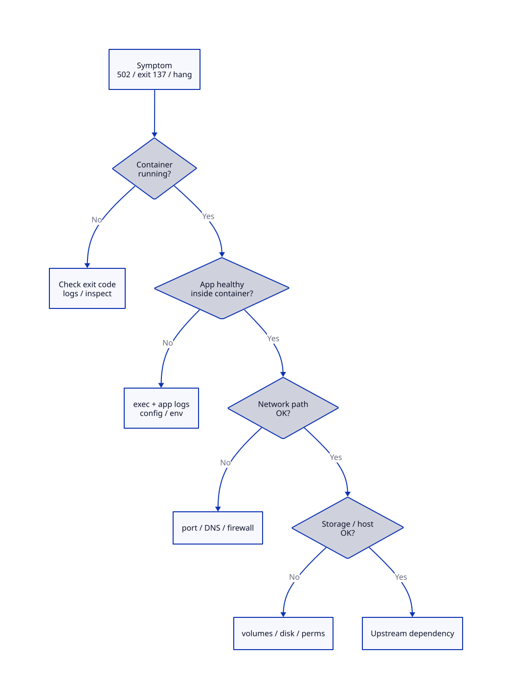

# Troubleshooting Docker Containers

## Overview

Production incidents rarely announce themselves as "Docker problems." You see **502 Bad Gateway**, **CrashLoopBackOff**, or **connection refused** — and the container layer is where you prove whether the app, the image, the network, or the host is at fault. This tutorial teaches a **repeatable troubleshooting methodology**: observe symptoms, classify the failure domain, use CLI tools to gather evidence, and apply fixes without guessing.

This is **Tutorial 15** in **Module 5: Operations** of the REBASH Academy Docker series. Combine this with [Container Logging and Monitoring](container-logging-and-monitoring.md) for observability and [Docker Security Hardening](docker-security-hardening.md) when failures involve permissions or seccomp.

## Prerequisites

- Completed [Running Your First Container](running-your-first-container.md)
- Completed [Docker Networking Fundamentals](docker-networking-fundamentals.md)
- Completed [Volumes and Persistent Storage](volumes-and-persistent-storage.md)
- Familiarity with [Network Troubleshooting Methodology](../networking/network-troubleshooting-methodology.md)
- Linux CLI tools: `curl`, `ss`, `grep`, and basic process concepts

## Learning Objectives

By the end of this tutorial, you will be able to:

- [ ] Apply a layered troubleshooting model for container failures
- [ ] Diagnose exit codes, OOM kills, and restart loops
- [ ] Use `docker logs`, `docker inspect`, `docker exec`, and `docker events`
- [ ] Debug port publishing, DNS, and inter-container connectivity
- [ ] Resolve volume permission and mount path issues
- [ ] Identify image architecture mismatches and missing dependencies
- [ ] Document findings in incident runbooks suitable for on-call engineers

## Architecture



Work top-down: container lifecycle → application → network → storage → external services.

## Theory

### The Troubleshooting Mindset

Effective container debugging separates **symptoms** from **root causes**:

| Symptom | Possible layers |
|---------|-----------------|
| Container exits immediately | Wrong CMD, missing binary, config error, failed health check |
| Container running but unreachable | Port mapping, bind address, firewall, wrong network |
| Intermittent failures | OOM, disk full, race on startup, dependency timeout |
| Slow responses | CPU throttling, I/O wait, network latency, missing cache |

Always capture: **timestamp**, **container ID/name**, **image tag/digest**, **host**, and **recent changes** (deploy, config, kernel update).

### Exit Codes and Signals

| Exit code | Common meaning |
|-----------|----------------|
| **0** | Clean shutdown |
| **1** | Generic application error |
| **126** | Command invoked cannot execute (permissions) |
| **127** | Command not found |
| **137** | SIGKILL — often OOM killer (128 + 9) |
| **139** | Segmentation fault (128 + 11) |
| **143** | SIGTERM graceful stop (128 + 15) |

Inspect exit details with `jq` (avoids Go template syntax in shell):

```bash
docker inspect mycontainer | jq '.[0].State | {ExitCode, OOMKilled, Error, Status}'
```

Or with Go templates at the shell (double-brace `.State` fields — standard Docker format syntax):

```bash
docker inspect mycontainer --format '{{ "{{" }}.State.ExitCode{{ "}}" }} {{ "{{" }}.State.OOMKilled{{ "}}" }}'
```

### Container States

| State | Debug action |
|-------|--------------|
| **restarting** | Check logs from previous run; inspect restart policy |
| **exited** | Inspect exit code; run interactively without `-d` |
| **paused** | `docker unpause` or investigate who paused |
| **dead** | Rare — remove and recreate; check dockerd logs |

### Logging First

Logs are the fastest signal:

```bash
docker logs --tail 100 mycontainer
docker logs --since 10m -f mycontainer
docker logs mycontainer 2>&1 | grep -i error
```

If logs are empty:

- App may log to files inside container (not stdout)
- Log driver may ship elsewhere (journald, syslog, fluentd)
- Container may exit before logging starts

See [Container Logging and Monitoring](container-logging-and-monitoring.md).

### Inspect Metadata

`docker inspect` returns JSON covering config, network, mounts, and state:

```bash
docker inspect mycontainer | jq '.[0] | {
  State: .State,
  Image: .Config.Image,
  Env: .Config.Env,
  Mounts: .Mounts,
  NetworkSettings: .NetworkSettings.Networks
}'
```

Key fields for incidents:

- `State.Health` — health check failures
- `HostConfig.Memory` — memory limits
- `Mounts` — volume paths and options
- `NetworkSettings.Ports` — published port bindings

### Exec and Debug Shells

Enter a running container:

```bash
docker exec -it mycontainer sh
# or bash if available
docker exec mycontainer ps aux
docker exec mycontainer cat /etc/resolv.conf
```

If the container exits too fast for exec:

```bash
docker run --rm -it --entrypoint sh myimage:tag
```

Distroless images have no shell — use debug sidecar pattern or copy static debug binary.

### Networking Checks

From host:

```bash
docker port mycontainer
curl -v http://127.0.0.1:8080/health
ss -tlnp | grep 8080
```

From another container on same network:

```bash
docker run --rm --network mynet alpine sh -c \
  'wget -qO- http://mycontainer:80/ || nc -zv mycontainer 80'
```

DNS inside container uses `127.0.0.11` (Docker embedded DNS). See [Docker Networking Fundamentals](docker-networking-fundamentals.md).

### Storage and Permissions

| Issue | Indicator | Fix |
|-------|-----------|-----|
| Wrong mount path | Empty directory in app | Verify `-v` target matches app expectation |
| Permission denied | EACCES in logs | Match UID/GID; fix host ownership |
| Read-only FS | Write failures | Remove `:ro` or mount writable volume |
| Disk full | No space errors | `docker system df`; prune or expand disk |

### Resource Limits

Containers inherit host resources unless limited:

```bash
docker run --memory 256m --cpus 0.5 myapp
```

Symptoms of limits:

- **OOMKilled: true** in inspect — increase memory or fix leak
- Throttled CPU — slow responses under load
- PID limit — cannot fork (Java, shell scripts)

### Image and Platform Issues

```bash
docker inspect myimage | jq '.[0].Architecture'
uname -m
```

`exec format error` usually means arm64/amd64 mismatch. Rebuild for target platform or use multi-arch images.

### docker events Stream

Real-time lifecycle events:

```bash
docker events --filter container=mycontainer &
docker restart mycontainer
```

Useful for correlating restarts with deploy scripts or health check failures.


### A calm diagnostic order

Start with `docker ps -a`, `docker logs`, and `docker inspect` before deleting evidence. Exit codes, OOMKilled, and health status usually explain crash loops faster than rebuilding images. For networking, test DNS and connectivity from a throwaway client on the same user-defined network. Reproduce on a clean name/port before assuming the daemon is corrupt — most “Docker is broken” tickets are port conflicts, restart policies, or bad entrypoints.


### Practice mindset

As you work through this tutorial, narrate *why* each control or command exists — not only *how* to type it. Production incidents are rarely solved by memorising flags; they are solved by connecting symptoms to the architecture (daemon vs kubelet, image vs running container, Service vs Endpoints, volume vs writable layer). After the lab, write three bullet notes in your own words: what you verified, what would break in production if skipped, and what you would monitor next.


### Connecting the lab to production reviews

When a teammate asks “is this ready?”, answer with evidence from this tutorial’s controls: image provenance, privilege level, network exposure, health signals, and teardown/rollback. Copy-pasting a working lab snippet into production without those answers is how quiet misconfigurations become incidents. Prefer small, reviewable changes — one Dockerfile improvement, one RBAC binding, one probe — over large untested stacks.

### Observability while you learn

Get into the habit of watching state while commands run: `docker events` / `kubectl get events`, resource usage, and logs in a second pane. Many failures are timing issues (probes, readiness, volume attach) that disappear if you only look at the final steady state. Capturing a short timeline of what you saw will also make your Troubleshooting section notes far more valuable later.


### Checklist before you leave the lab

1. Resources created in this tutorial are deleted or clearly labelled for retention.
2. No secrets, kubeconfigs, or registry passwords were written into Git.
3. You can explain the Architecture diagram without reading the caption.
4. Validation pass criteria in this page are satisfied on your machine.
5. You noted one question to revisit in the next tutorial of the series.

### Common production failure modes this topic prevents

Misconfiguration here usually shows up as intermittent outages rather than clean errors: restart loops without log shipping, services that listen but never become Ready, volumes that work on one node only, or credentials that leak into image history. Use the Hands-on Lab as a rehearsal for the failure mode — break something on purpose, watch the signal, then apply the fix documented in Troubleshooting.

## Hands-on Lab

### Step 1 – Reproduce a crash loop

**Command:**

```bash
docker run -d --name rebash-crash --restart unless-stopped alpine sh -c 'exit 1'
sleep 3
docker ps -a --filter name=rebash-crash
docker logs rebash-crash
```

**Explanation:** Exit code 1 with restart policy creates a restart loop. `docker ps` shows Restarting status.


**Expected result:** Commands complete successfully and match the lab intent described above.

### Step 2 – Diagnose exit code

**Command:**

```bash
docker inspect rebash-crash | jq '.[0].State | {Status, ExitCode, OOMKilled, FinishedAt}'
docker rm -f rebash-crash
```

**Expected:** ExitCode 1, OOMKilled false.

### Step 3 – Port mapping failure

**Command:**

```bash
docker run -d --name rebash-web -p 8090:80 nginx:alpine
curl -sf http://127.0.0.1:8090/ >/dev/null && echo OK
docker run -d --name rebash-web2 -p 8090:80 nginx:alpine 2>&1 || true
docker rm -f rebash-web rebash-web2 2>/dev/null || true
```

**Explanation:** Second container fails with port conflict — classic production error when old container still holds the port.


**Expected result:** Commands complete successfully and match the lab intent described above.

### Step 4 – Network connectivity between containers

**Command:**

```bash
docker network create rebash-debug-net
docker run -d --name rebash-srv --network rebash-debug-net nginx:alpine
docker run --rm --network rebash-debug-net alpine \
  wget -qO- http://rebash-srv/ | head -3
docker rm -f rebash-srv
docker network rm rebash-debug-net
```

**Explanation:** Embedded DNS resolves container name on user-defined bridge network.


**Expected result:** Commands complete successfully and match the lab intent described above.

### Step 5 – Volume permission simulation

**Command:**

```bash
mkdir -p /tmp/rebash-vol-lab
docker run --rm -v /tmp/rebash-vol-lab:/data:ro alpine sh -c 'echo test > /data/file.txt' 2>&1 || echo "Expected: read-only failure"
docker run --rm -v /tmp/rebash-vol-lab:/data alpine sh -c 'echo test > /data/file.txt && cat /data/file.txt'
rm -rf /tmp/rebash-vol-lab
```

**Explanation:** Read-only mount produces write error — match mount options to app requirements.


**Expected result:** Commands complete successfully and match the lab intent described above.

### Step 6 – Simulate OOM (optional, use small limit)

**Command:**

```bash
docker run --rm --name rebash-oom --memory 32m alpine sh -c \
  'dd if=/dev/zero of=/dev/shm/big bs=1M count=64' 2>&1 || true
docker inspect rebash-oom 2>/dev/null | jq '.[0].State.OOMKilled' || echo "Container already removed"
```

**Explanation:** Low memory limit triggers OOM kill — exit code often 137.

**Expected result:** Commands complete successfully and match the lab intent described above.

## Validation

Confirm the lab before moving on:

1. Re-run the critical commands from the Hands-on Lab and compare them to the expected output in each step.
2. Check that you can explain *why* each successful result matters (not only that it printed).
3. Note any warnings or unexpected output — resolve them using Troubleshooting before continuing.

| Check | Pass criteria |
|-------|----------------|
| Crash loop | You reproduced and diagnosed a restarting container via ps/inspect |
| Exit code | Inspect shows the expected ExitCode / OOMKilled fields |
| Port conflict | Second publish attempt fails as documented |
| Cleanup | All `rebash-*` debug containers and networks removed |

## Code Walkthrough

| Command | Description | Example |
|---------|-------------|---------|
| `docker logs` | Application stdout/stderr | `docker logs -f --tail 50 web` |
| `docker inspect` | Full container JSON | `docker inspect web \| jq .` |
| `docker exec` | Run debug commands | `docker exec web ps aux` |
| `docker top` | Host PIDs for container | `docker top web` |
| `docker stats` | Live CPU/memory | `docker stats web --no-stream` |
| `docker events` | Lifecycle event stream | `docker events --since 1h` |
| `docker port` | Published port mapping | `docker port web 80` |
| `docker diff` | Filesystem changes | `docker diff web` |
| `docker cp` | Copy files from container | `docker cp web:/var/log/app.log .` |

### Troubleshooting checklist script

Save as `~/bin/docker-triage.sh`:

```bash
#!/usr/bin/env bash
# docker-triage.sh — quick container health report
set -euo pipefail

CONTAINER="${1:?Usage: docker-triage.sh CONTAINER_NAME_OR_ID}"

section() { printf '\n=== %s ===\n' "$1"; }

section "Basic Status"
docker ps -a --filter "id=$CONTAINER" --filter "name=$CONTAINER" 2>/dev/null \
  || docker ps -a | grep -E "$CONTAINER" || { echo "Container not found"; exit 1; }

section "State (jq)"
docker inspect "$CONTAINER" | jq '.[0].State'

section "Last 30 Log Lines"
docker logs --tail 30 "$CONTAINER" 2>&1 || echo "No logs available"

section "Port Mappings"
docker port "$CONTAINER" 2>/dev/null || echo "No published ports"

section "Mounts"
docker inspect "$CONTAINER" | jq '.[0].Mounts'

section "Resource Stats"
docker stats "$CONTAINER" --no-stream 2>/dev/null || echo "Not running"
```

Make executable: `chmod +x ~/bin/docker-triage.sh`

**Note:** The triage script uses `docker ps --format` with Go templates inside a bash file — safe for execution. Prefer `jq` in documentation examples to avoid Jinja macro conflicts with double-brace syntax.

## Security Considerations

- Prefer non-destructive diagnostics (`logs`, `inspect`, `events`) before `rm -f` on unknown workloads
- Do not paste production secrets from `docker inspect` into tickets or chat
- Avoid `--privileged` debug containers on shared hosts; use targeted `docker exec` instead
- Capture exit codes and OOM flags carefully — misread signals lead to unsafe “fixes”
- Isolate reproduction on a lab network; do not attach debug containers to production overlays
- Clean up crash-loop and port-conflict lab containers so the next engineer is not debugging your leftovers


## Common Mistakes

!!! warning "Restarting without reading previous logs"
    `docker logs` after restart may show only the latest attempt. Use `docker logs --since` or logging driver retention to capture prior crashes.

!!! warning "Debugging from host without checking in-container"
    `curl localhost:8080` succeeding does not prove the app works behind a reverse proxy inside the container. Exec in and test `localhost:80` directly.

!!! warning "Assuming latest image was deployed"
    Verify running image: `docker inspect container | jq '.[0].Image'` and compare to expected digest.

!!! warning "Fixing symptoms with --privileged"
    Granting privileged mode to bypass permission issues creates security debt. Fix root cause: capabilities, seccomp, or correct user mapping.

## Best Practices

!!! tip "Run broken containers interactively once"
    `docker run --rm -it --entrypoint sh image:tag` reproduces startup without restart noise.

!!! tip "Pin images during incident response"
    Roll back to last known good digest, not `:latest`.

!!! tip "Document a triage order in runbooks"
    Logs → inspect state → exec → network → volumes → host — same sequence every time reduces cognitive load on-call.

!!! tip "Integrate with centralized logging"
    Local `docker logs` does not scale. Ship logs to Loki, ELK, or CloudWatch before production.

## Troubleshooting

| Issue | Cause | Solution |
|-------|-------|----------|
| Empty logs | App logs to file; wrong log driver | Exec and read log files; fix logging config |
| exec format error | Architecture mismatch | Pull/build correct platform image |
| Permission denied on volume | UID mismatch | chown host dir or use named volume |
| Connection refused between containers | Different networks | Attach to shared user-defined network |
| Health check failing | Wrong endpoint or slow startup | Adjust interval; fix health CMD |
| Cannot remove container | Still running or in use | `docker stop` then `docker rm -f` |
| dockerd unresponsive | Daemon overload or bug | Check `journalctl -u docker`; restart docker |

## Summary

- Use a **layered model**: lifecycle → application → network → storage → dependencies
- **Exit codes** (especially 137/OOM) and **inspect State** pinpoint crash causes
- **`docker logs`**, **`exec`**, and **`inspect`** are the core triage trio
- **Network** issues often involve port conflicts, wrong network, or DNS — test from a sibling container
- **Volume permissions** and **read-only mounts** cause subtle production failures
- Document procedures in runbooks; pair CLI skills with [Container Logging and Monitoring](container-logging-and-monitoring.md)

## Interview Questions

1. What does exit code 137 typically indicate for a Docker container?
2. How do you debug a container that exits immediately after start?
3. What is the difference between debugging with `docker logs` vs exec into the container?
4. How do you verify which ports a container publishes?
5. How do you test connectivity between two containers by name?
6. What causes "exec format error" when starting a container?
7. How do you determine if a container was OOM killed?
8. What information does `docker inspect` provide that `docker ps` does not?
9. How would you troubleshoot "port is already allocated"?
10. Why is `--privileged` a poor default fix for permission errors?

??? tip "Sample Answers (Questions 1, 5, and 7)"

    **Q1 — Exit 137:** Exit code 137 means the container process received SIGKILL (128 + 9). The most common cause is the Linux OOM killer terminating the process when memory exceeds cgroup limits or the host is out of memory. Check `OOMKilled` in inspect state.

    **Q5 — Container-to-container connectivity:** Ensure both containers attach to the same user-defined bridge network. From a debug container: `wget http://targetname:port/` or `nc -zv targetname port`. Docker embedded DNS resolves container names on that network.

    **Q7 — OOM killed:** Run `docker inspect container | jq '.[0].State.OOMKilled'`. True means cgroup memory limit was exceeded. Also check host `dmesg` for OOM killer messages and review `HostConfig.Memory` limits.

## Related Tutorials

- [Docker – Category Overview](index.md)
- [Container Logging and Monitoring](container-logging-and-monitoring.md) — observability stack
- [Docker Networking Fundamentals](docker-networking-fundamentals.md) — network layer deep dive
- [Network Troubleshooting Methodology](../networking/network-troubleshooting-methodology.md) — general network debug framework
- [Docker Capstone and Next Steps](docker-capstone-and-next-steps.md) *(next in Module 6)*
- Cheat sheet: [Docker Cheat Sheet](../cheatsheets/docker.md)
- Interview prep: [Docker Interview Prep](../interview/docker.md)
- Learning path: [DevOps Engineer](../learning-paths/devops-engineer.md)

## References

- [Docker debug guide](https://docs.docker.com/engine/daemon/troubleshoot/)
- [Docker inspect reference](https://docs.docker.com/reference/cli/docker/inspect/)
- [Container exit codes](https://tldp.org/LDP/abs/html/exitcodes.html)
- [REBASH Academy – Networking Troubleshooting](../networking/network-troubleshooting-methodology.md)
- [REBASH Academy – Linux Overview](../linux/index.md)
