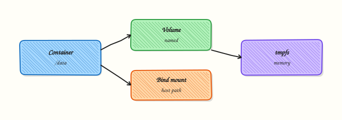

# Volumes and Persistent Storage

## Overview


Persist data with named volumes, use bind mounts for live code, know when `tmpfs` fits, and back up a volume.

Container filesystems are ephemeral. **Volumes** survive container removal; **bind mounts** map host paths; **tmpfs** keeps data in memory.

This is a core tutorial in **Module 7 · Volumes & Storage** of the REBASH Academy **Docker for Cloud & DevOps Engineers** series — written for Cloud, DevOps, Platform, and SRE engineers.


## Prerequisites


- [Dockerfile Best Practices and Multi-Stage Builds](dockerfile-best-practices-and-multi-stage-builds.md)


## Learning Objectives


By the end of this tutorial, you will be able to:

- [ ] Create and mount a named volume  
- [ ] Contrast volume vs bind mount  
- [ ] Use `tmpfs` for scratch data  
- [ ] Backup/restore a volume with a helper container


## Architecture


This topic’s control points and relationships are shown below.




## Theory


### What

Containers are ephemeral by default: the writable layer disappears when the container is removed. **Volumes**, **bind mounts**, and **tmpfs** mounts persist or isolate data differently. Named volumes are managed by Docker; bind mounts map host paths; tmpfs keeps data in memory.

### Why

Databases, queues, and CI caches need durable or shared storage. Bind-mounting source code enables live development. Choosing the wrong mount type causes permission errors, data loss on recreate, or accidental exposure of host files.

### How it works

Declare mounts with `docker run -v` / `--mount` or Compose `volumes:`. Named volumes live under Docker’s volume directory and survive container recreation. Bind mounts use an absolute host path — ideal for code, risky for production config if paths differ. tmpfs is useful for scratch space and sensitive temporary files that must not touch disk. Volume drivers can back remote storage; local is the default. Permissions inside the container depend on user IDs (UID/GID) matching ownership on the volume.

| Type | Use |
|------|-----|
| Named volume | Databases, durable app data |
| Bind mount | Dev source, host configs |
| tmpfs | Secrets scratch, caches (lost on stop) |

### Key concepts

- **Lifecycle** — volumes persist after `docker rm` unless removed explicitly  
- **UID mapping** — non-root containers often need chowned volumes  
- **Backup** — treat volumes as stateful; plan snapshots  
- **Compose namespacing** — project prefixes on volume names  

### Common pitfalls

- Storing production data only in the container writable layer  
- Bind-mounting `/var/run/docker.sock` without understanding host takeover risk  
- Permission denied after switching `USER` in the image  
- Deleting volumes with `docker volume prune` without checking labels


## Hands-on Lab


Create a workspace for this tutorial.

```bash
mkdir -p ~/rebash-docker/module-07/host-data && cd ~/rebash-docker/module-07/host-data
```

**Focus:** persist data with a named volume

### Step 1 – Volume round-trip

```bash
docker volume create rebash-vol
docker run --rm -v rebash-vol:/data alpine:3.20 sh -c 'echo persist > /data/note.txt'
docker run --rm -v rebash-vol:/data alpine:3.20 cat /data/note.txt | tee note.txt
docker volume inspect rebash-vol | tee vol.json
```

### Final step – Cleanup note

```bash
docker volume rm rebash-vol 2>/dev/null || true
```


## Validation


- [ ] Lab commands run under `~/rebash-docker/module-07/host-data/`
- [ ] You can explain each Theory section in your own words
- [ ] You used modern tooling where it applies to this topic
- [ ] You can describe one production failure mode for this topic


## Code Walkthrough


Production practice for **Volumes and Persistent Storage** always combines:

1. Inspect before you change (status, plan, logs, dry-run)
2. Prefer reversible, documented changes (Git, IaC, drop-ins, version pins)
3. Capture evidence (command output, pipeline logs) for handovers
4. Prefer current tools and APIs over legacy shortcuts
5. Least privilege — escalate credentials only when required

Keep runbooks short enough to follow under pressure. Automate checks; keep humans for judgement.


## Security Considerations


- Treat credentials and tokens for docker as privileged — never commit them
- Prefer short-lived auth (OIDC, roles, SSO) over long-lived keys
- Validate blast radius before apply/deploy/delete operations
- Restrict who can approve production changes
- Collect audit logs; limit who can read sensitive traces


## Common Mistakes


!!! warning "Storing production data only in the container writable layer  "
    Validate assumptions against the Theory section and official docs before changing production.

!!! warning "Bind-mounting `/var/run/docker.sock` without understanding host takeover risk  "
    Lab shortcuts (open security groups, admin roles, skip approvals) must not ship unchanged.

!!! warning "Changing production without a rollback path"
    Always know how to revert (previous artefact, prior release, state rollback, DNS failback).


## Best Practices


- Encode Volumes and Persistent Storage changes as code and review them in pull requests
- Pin versions (images, modules, actions, provider plugins)
- Separate environments with clear promotion gates
- Alert on symptoms with runbooks attached
- Destroy lab resources; tag everything with owner and expiry where possible


## Troubleshooting


| Symptom | Likely cause | Fix |
|---------|--------------|-----|
| Auth / permission denied | Wrong identity, policy, or scope | Check caller identity, roles, and least-privilege policies |
| Timeout / no route | Network, DNS, security group, or endpoint | Trace path, DNS, and allow-lists before retrying |
| Drift / unexpected plan | Manual change or wrong state/workspace | Reconcile desired vs actual; avoid click-ops on managed resources |
| Pipeline/job red | Flaky step, cache, or missing secret | Read failing step logs; bisect recent workflow/config changes |
| Cost spike | Idle load balancer, NAT, oversized compute | Inventory billable resources; stop/delete labs promptly |


## Summary


**Volumes and Persistent Storage** is essential for Cloud and DevOps engineers working with docker. Practise the lab until the inspection and change path is muscle memory, then continue the track.


## Interview Questions


1. What production problem does **Volumes and Persistent Storage** address in container platforms?
2. A container restarts continually — how do you triage?
3. Why are mutable `latest` tags risky in production?
4. Which container security controls do you insist on before prod?
5. How do you keep images small and builds fast in CI?

!!! tip "Sample answer — question 2"
    Check `docker ps -a`, logs, exit code, and `inspect` for OOM/restarts. Confirm command/entrypoint and volume permissions.

!!! tip "Sample answer — question 4"
    Non-root, minimal base, no secrets in layers, scanning, read-only rootfs where possible, and least capabilities.


## Related Tutorials


- [Course overview](index.md)
- [Docker Networking Fundamentals](docker-networking-fundamentals.md)


## References


- [Manage data in Docker](https://docs.docker.com/storage/)
