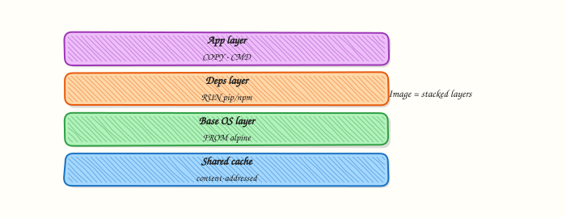

# Working with Docker Images

## Overview


Manage images end to end: pull, inspect layers, tag for a registry, save/load for air-gapped moves, and prune safely.

Images are layered, content-addressed artefacts. Tags (`:latest`, `:1.2.3`) are mutable pointers — production prefers digests or immutable tags.

This is a core tutorial in **Module 4 · Images** of the REBASH Academy **Docker for Cloud & DevOps Engineers** series — written for Cloud, DevOps, Platform, and SRE engineers.

## Prerequisites


- [Running Your First Container](running-your-first-container.md)

## Learning Objectives


By the end of this tutorial, you will be able to:

- [ ] `docker pull` / `images` / `history`  
- [ ] Tag for a target registry  
- [ ] Explain layers and cache reuse  
- [ ] `docker save` / `load`  
- [ ] Prune unused images carefully

## Architecture


This topic’s control points and relationships are shown below.



## Theory


### What

**Images** are immutable, layered packages identified by name, tag, and content **digest**. You pull them from registries, tag them for promotion, inspect layer history, save/load tarballs for air-gapped moves, and prune unused images to reclaim disk.

### Why

Deployments should promote digests, not floating tags. Understanding layers explains cache behaviour and image size. Disk-full CI runners are often unpruned images and build cache — operational hygiene is part of image literacy.

### How it works

`docker pull nginx:alpine` downloads missing layers. `docker images` (or `docker image ls`) lists local images. `docker history` shows how layers were created. `docker tag` adds a new name pointing at the same image ID — tagging does not create a new filesystem. `docker push` uploads to a registry after login. `save`/`load` move image tarballs without a registry. Digests (`repo@sha256:…`) pin exact content; tags like `:latest` can move.

| Action | Command |
|--------|---------|
| Pull | `docker pull nginx:alpine` |
| List | `docker images` |
| Layers | `docker history <image>` |
| Tag | `docker tag src registry/app:1.0.0` |
| Save/load | `docker save` / `docker load` |
| Remove | `docker rmi` / `docker image prune` |

### Key concepts

- **Tag vs digest** — human label vs immutable content address  
- **Shared layers** — storage deduplication across images  
- **Multi-arch manifests** — one name, several platform variants  
- **Prune carefully** — do not delete images still needed by stopped containers you care about  

### Common pitfalls

- Promoting only `:latest` through environments  
- Retagging without rebuilding and assuming content changed  
- Leaving dangling images until the disk fills  
- Trusting a tag on a public registry without pinning a digest in production

## Hands-on Lab

### Objective

Pull a pinned image, retag it, inspect layers and digest metadata, then export and reload the image via a tar archive with evidence files.

### Prerequisites

- Docker Engine or Docker Desktop
- Network access to pull from Docker Hub (or a mirror)

### Lab environment

Workspace: `~/rebash-docker/module-04`

Enough disk for one small image tar (~10 MB for Alpine).

``` {.bash .ra-terminal title="Terminal"}
mkdir -p ~/rebash-docker/module-04 && cd ~/rebash-docker/module-04
```

### Real-world scenario

Your team mirrors images to an air-gapped registry. Before promoting `alpine:3.20` to staging, you document its layer history, tag it for your namespace, capture Id and RepoDigests from inspect, and prove `docker save` / `docker load` works for offline transfer.

### Step-by-step tasks

#### Task 1 – Pull, tag, and list


``` {.bash .ra-terminal title="Terminal"}
cd ~/rebash-docker/module-04
docker pull alpine:3.20 | tee pull-alpine.txt
docker tag alpine:3.20 rebash/alpine-lab:3.20
docker image ls --format 'table {{ "{{" }}.Repository{{ "}}" }}\t{{ "{{" }}.Tag{{ "}}" }}\t{{ "{{" }}.ID{{ "}}" }}' | grep -E 'alpine|rebash' | tee image-ls.txt
grep -q 'rebash/alpine-lab' image-ls.txt
```


!!! example "Expected output"
    `pull-alpine.txt` shows pull progress; `image-ls.txt` lists both `alpine` and `rebash/alpine-lab` tags.


#### Task 2 – History and inspect Id/Digest


``` {.bash .ra-terminal title="Terminal"}
cd ~/rebash-docker/module-04
docker image history alpine:3.20 --no-trunc=false | tee image-history.txt
docker image inspect alpine:3.20 --format 'Id={{ "{{" }}.Id{{ "}}" }} Digest={{ "{{" }}index .RepoDigests 0{{ "}}" }}' | tee image-id-digest.txt
grep -q 'Id=sha256:' image-id-digest.txt
test -s image-history.txt
```


!!! example "Expected output"
    `image-history.txt` shows layer steps; `image-id-digest.txt` includes a sha256 Id and a RepoDigests entry.


#### Task 3 – Save, remove local tag, and load

``` {.bash .ra-terminal title="Terminal"}
cd ~/rebash-docker/module-04
docker save rebash/alpine-lab:3.20 -o rebash-alpine-lab-3.20.tar
ls -lh rebash-alpine-lab-3.20.tar | tee tar-ls.txt
docker rmi rebash/alpine-lab:3.20
docker load -i rebash-alpine-lab-3.20.tar | tee load-output.txt
docker image ls rebash/alpine-lab:3.20 | tee reload-ls.txt
grep -q 'rebash/alpine-lab' reload-ls.txt
```

!!! example "Expected output"
    Tar file is non-empty; after load, `reload-ls.txt` shows `rebash/alpine-lab:3.20` again.


### Validation steps

- [ ] `image-ls.txt` shows original and retagged names
- [ ] `image-history.txt` and `image-id-digest.txt` capture layers and digest metadata
- [ ] `load-output.txt` proves save/load round-trip succeeded

### Common errors and fixes

| Error | Cause | Fix |
|-------|-------|-----|
| manifest unknown | Wrong tag | Use pinned `alpine:3.20` |
| Error response from daemon: No such image | Tag removed before save | Re-pull and retag before `docker save` |
| open rebash-alpine-lab-3.20.tar: permission denied | Wrong directory | Run from `~/rebash-docker/module-04` |

### Challenge exercise

Load the tar on a “clean” name only, then compare digests before and after:


``` {.bash .ra-terminal title="Terminal"}
cd ~/rebash-docker/module-04
docker tag alpine:3.20 rebash/alpine-lab:3.20
DIGEST_BEFORE="$(docker image inspect alpine:3.20 --format '{{ "{{" }}index .RepoDigests 0{{ "}}" }}')"
docker save alpine:3.20 -o alpine-only.tar
docker rmi alpine:3.20 rebash/alpine-lab:3.20 2>/dev/null || true
docker load -i alpine-only.tar
DIGEST_AFTER="$(docker image inspect alpine:3.20 --format '{{ "{{" }}index .RepoDigests 0{{ "}}" }}')"
printf 'before=%s\nafter=%s\n' "$DIGEST_BEFORE" "$DIGEST_AFTER" | tee digest-compare.txt
grep -q 'before=sha256:' digest-compare.txt
```


!!! example "Expected output"
    `digest-compare.txt` shows matching sha256 digests before and after reload.


### Learning outcomes

- Pulled and retagged images with explicit repository names
- Read layer history and digest metadata for promotion checks
- Exported and imported images with `docker save` and `docker load`

### Cleanup

``` {.bash .ra-terminal title="Terminal"}
cd ~/rebash-docker/module-04
docker rmi rebash/alpine-lab:3.20 alpine:3.20 2>/dev/null || true
rm -f rebash-alpine-lab-3.20.tar alpine-only.tar 2>/dev/null || true
```

## Validation

- [ ] Lab commands run under `~/rebash-docker/module-04/`
- [ ] `image-id-digest.txt` and `load-output.txt` prove inspect and save/load workflow
- [ ] You can explain each Theory section in your own words
- [ ] You can describe one production failure mode for this topic

## Code Walkthrough


Production practice for **Working with Docker Images** always combines:

1. Inspect before you change (status, plan, logs, dry-run)
2. Prefer reversible, documented changes (Git, IaC, drop-ins, version pins)
3. Capture evidence (command output, pipeline logs) for handovers
4. Prefer current tools and APIs over legacy shortcuts
5. Least privilege — escalate credentials only when required

Keep runbooks short enough to follow under pressure. Automate checks; keep humans for judgement.

## Security Considerations


- Treat credentials and tokens for docker as privileged — never commit them
- Prefer short-lived auth (OIDC, roles, SSO) over long-lived keys
- Validate blast radius before apply/deploy/delete operations
- Restrict who can approve production changes
- Collect audit logs; limit who can read sensitive traces

## Common Mistakes


!!! warning "Promoting only `:latest` through environments  "
    Validate assumptions against the Theory section and official docs before changing production.

!!! warning "Retagging without rebuilding and assuming content changed  "
    Lab shortcuts (open security groups, admin roles, skip approvals) must not ship unchanged.

!!! warning "Changing production without a rollback path"
    Always know how to revert (previous artefact, prior release, state rollback, DNS failback).

## Best Practices


- Encode Working with Docker Images changes as code and review them in pull requests
- Pin versions (images, modules, actions, provider plugins)
- Separate environments with clear promotion gates
- Alert on symptoms with runbooks attached
- Destroy lab resources; tag everything with owner and expiry where possible

## Troubleshooting


| Symptom | Likely cause | Fix |
|---------|--------------|-----|
| Auth / permission denied | Wrong identity, policy, or scope | Check caller identity, roles, and least-privilege policies |
| Timeout / no route | Network, DNS, security group, or endpoint | Trace path, DNS, and allow-lists before retrying |
| Drift / unexpected plan | Manual change or wrong state/workspace | Reconcile desired vs actual; avoid click-ops on managed resources |
| Pipeline/job red | Flaky step, cache, or missing secret | Read failing step logs; bisect recent workflow/config changes |
| Cost spike | Idle load balancer, NAT, oversized compute | Inventory billable resources; stop/delete labs promptly |

## Summary


**Working with Docker Images** is essential for Cloud and DevOps engineers working with docker. Practise the lab until the inspection and change path is muscle memory, then continue the track.

## Interview Questions


1. What does an image tag represent?
2. How do save/load help air-gapped environments?
3. Why pin digests in production?
4. What does docker images not tell you about vulnerabilities?
5. How do you delete dangling images safely?

!!! tip "Sample answer — question 2"
    Verify tags with docker image inspect and confirm the digest you expect.

!!! tip "Sample answer — question 4"
    Only pull from trusted registries; scan before promoting.

## Related Tutorials


- [Course overview](index.md)
- [Building Images with Dockerfile](building-images-with-dockerfile.md)

## References


- [Docker images](https://docs.docker.com/get-started/docker-concepts/the-basics/what-is-an-image/)
