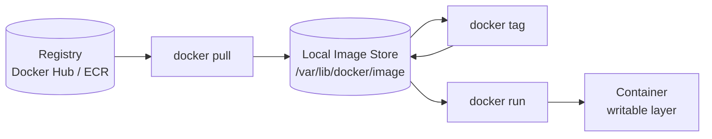

# Working with Docker Images

## Overview

A **Docker image** is the immutable artifact that CI pipelines build, security scanners analyze, and production orchestrators deploy. Unlike containers — which are ephemeral running instances — images are **versioned, shareable, and cached**. When a deployment fails, rolling back means pulling a previous image tag. When a CVE is announced, identifying affected services starts with `docker images` and registry digests.

This tutorial covers the complete image workflow: **pull** from registries, **tag** for environment promotion, **inspect** metadata and layers, **remove** unused images safely, and understand how **layers** and **digests** enable reproducible DevOps pipelines.

This is **Tutorial 5** in **Module 2: Images & Dockerfile** of the REBASH Academy Docker series. Complete [Running Your First Container](running-your-first-container.md) first. [Git](../git/index.md) tagging concepts parallel Docker tag strategies; [Linux filesystem](../linux/index.md) knowledge helps you interpret layer storage on disk.

## Prerequisites

- Docker Engine installed and working
- Successful completion of [Running Your First Container](running-your-first-container.md)
- Outbound access to Docker Hub or a configured registry mirror
- At least 2 GB free disk under `/var/lib/docker`
- Familiarity with [Docker Architecture and Components](docker-architecture-and-components.md) — especially layers and overlay2

## Learning Objectives

By the end of this tutorial, you will be able to:

- [ ] Pull images from registries with specific tags and digests
- [ ] List, filter, and interpret local images with `docker images`
- [ ] Tag images for environments (`dev`, `staging`, `prod`) and registries
- [ ] Inspect image metadata, layers, environment variables, and exposed ports
- [ ] Remove images safely with `docker rmi` and understand dependency errors
- [ ] Explain the difference between tags and immutable digests
- [ ] Use `docker history` and `docker image inspect` for troubleshooting and supply-chain audits
- [ ] Apply disk hygiene practices without breaking running containers

## Architecture Diagram

Images flow from registries to local storage, where layers are deduplicated across tags. Containers add a writable layer on top without modifying the image.



## Theory

### What Is a Docker Image?

An image is a **read-only template** containing:

- **Filesystem layers** — stacked diffs from Dockerfile instructions or imported tarballs
- **Metadata** — environment variables, default command, exposed ports, labels, author
- **Config** — architecture (amd64/arm64), OS (linux), user to run as

Images do not run. Containers are instantiated from images. One image can spawn unlimited containers; each container gets its own writable layer.

### Tags vs Digests

| Identifier | Format | Mutability | Use case |
|------------|--------|------------|----------|
| **Tag** | `nginx:1.25-alpine` | Mutable — tag can be repointed | Human-readable versions |
| **Digest** | `nginx@sha256:abc123...` | Immutable — content-addressed | Reproducible deploys, security audits |

**Production rule:** Pin by **digest** in Kubernetes manifests and Terraform when reproducibility matters. Use tags for developer convenience (`latest` is convenient but dangerous in prod).

```bash
docker pull nginx:1.25-alpine
docker inspect nginx:1.25-alpine | grep -i digest
```

### Image Layers and Caching

Each Dockerfile instruction typically creates a **layer**:

```dockerfile
FROM alpine:3.19        # layer 1 — base
RUN apk add curl        # layer 2 — package install
COPY app /app           # layer 3 — application code
CMD ["/app/start.sh"]   # metadata — may not add layer
```

Properties:

- Layers are **content-addressed** by SHA256 hash
- Identical layers are **shared** across images on the same host
- Rebuilds **cache** unchanged layers — critical for CI speed
- Order matters: put rarely changing instructions first

`docker history` shows layer sizes and creation commands — essential for slimming bloated images.

### Registries and Repositories

| Term | Meaning | Example |
|------|---------|---------|
| **Registry** | Server storing images | Docker Hub, Amazon ECR, Google GAR |
| **Repository** | Collection of related image tags | `library/nginx`, `myorg/payment-api` |
| **Tag** | Label within a repository | `1.25`, `latest`, `sha-a1b2c3d4` |

Full reference format:

```text
registry.example.com:5000/myorg/app:v2.1.0
└──── registry ────┘ └─ repo ─┘ └tag┘
```

Docker Hub's official images use the `library/` namespace implicitly: `nginx` equals `docker.io/library/nginx`.

### Pull Policy and Storage

When you `docker run` or `docker pull`:

1. Docker checks local cache for the tag
2. If missing or `--pull always` specified, contacts registry
3. Downloads missing layers (parallel downloads)
4. Verifies checksums and unpacks to `/var/lib/docker`

Storage consumption is layer-based — deleting one tag may not free disk if layers are shared with other images.

### Tagging Strategies for DevOps

Common tagging patterns:

| Pattern | Example | Purpose |
|---------|---------|---------|
| **Semantic version** | `myapp:2.4.1` | Release tracking |
| **Git SHA** | `myapp:sha-a1b2c3d4` | CI/CD traceability |
| **Environment** | `myapp:staging` | Promotion workflow (mutable) |
| **Branch** | `myapp:feature-auth` | Preview deployments |
| **Date** | `myapp:2026-07-27` | Scheduled batch releases |

Align Docker tags with [Git](../git/index.md) tags and CI pipeline variables. GitLab CI uses `$CI_COMMIT_SHA`; GitHub Actions uses `$GITHUB_SHA` for immutable build references.

### Image Removal and Garbage Collection

| Command | Scope |
|---------|-------|
| `docker rmi IMAGE` | Remove one image (fails if containers reference it) |
| `docker rmi -f IMAGE` | Force remove (dangerous if containers running) |
| `docker image prune` | Remove dangling images (untagged layers) |
| `docker system prune -a` | Remove unused images, containers, networks (careful!) |

**Dangling images** appear when rebuilds produce new layer sets but old untagged layers remain — common in CI without prune policies.

## Hands-on Lab

Work through these steps on your Docker host. Requires network access to pull images.

### Step 1 – Pull an image with an explicit tag

**Command:**

```bash
docker pull nginx:1.25-alpine
docker images nginx --digests
```

**Explanation:** Pinning to `1.25-alpine` avoids surprise changes from `latest`. `--digests` shows the immutable content hash.

**Expected output:**

```text
1.25-alpine: Pulling from library/nginx
...
Digest: sha256:abc123...
```

### Step 2 – Pull by digest (immutable reference)

**Command:**

```bash
DIGEST=$(docker images nginx:1.25-alpine --digests | awk 'NR==2 {print $3}')
echo "Digest: $DIGEST"
docker pull "nginx@${DIGEST}"
```

**Explanation:** Digest pulls guarantee exact content regardless of tag changes. Production deploys should reference digests in manifests.

**Expected output:**

```text
Digest: sha256:...
Status: Image is up to date for nginx@sha256:...
```

### Step 3 – Tag an image for a custom registry workflow

**Command:**

```bash
docker tag nginx:1.25-alpine localhost:5000/demo/web:v1
docker tag nginx:1.25-alpine demo/web:staging
docker images | grep -E 'nginx|demo/web'
```

**Explanation:** `docker tag` creates a new reference to the same image ID — no data copied. Simulates promoting an image to a private registry namespace.

**Expected output:**

```text
demo/web        staging    same_id   ...
localhost:5000/demo/web   v1   same_id   ...
nginx           1.25-alpine   same_id   ...
```

### Step 4 – Inspect image metadata

**Command:**

```bash
docker image inspect nginx:1.25-alpine | grep -E '"Architecture"|"Os"|"ExposedPorts"|"Cmd"' | head -8
docker image inspect demo/web:staging | grep '"Id"' | head -1
```

**Explanation:** Inspect reveals architecture, default command, env vars, and labels. Verify multi-arch before deploying to arm64 nodes.

**Expected output:**

```text
"Architecture": "amd64",
"Os": "linux",
"ExposedPorts": { "80/tcp": {} },
"Cmd": [ "nginx", "-g", "daemon off;" ],
"Id": "sha256:..."
```

Extract a short image ID with Python when scripting:

```bash
docker image inspect demo/web:staging | python3 -c "import sys,json; print(json.load(sys.stdin)[0]['Id'][:12])"
```

### Step 5 – Examine layer history

**Command:**

```bash
docker history nginx:1.25-alpine
docker history nginx:1.25-alpine --human=true | head -8
```

**Explanation:** History maps layers to build steps. Large layers indicate optimization opportunities (covered in Dockerfile tutorials).

**Expected output:**

```text
IMAGE       CREATED        CREATED BY                                      SIZE
<missing>   2 weeks ago    CMD ["nginx" "-g" "daemon off;"]                0B
<missing>   2 weeks ago    EXPOSE map[80/tcp:{}]                           0B
...
```

### Step 6 – Compare image sizes

**Command:**

```bash
docker pull alpine:3.19
docker images nginx alpine
```

**Explanation:** Base image choice dramatically affects pull time, attack surface, and storage. Alpine variants are typically smaller than Debian-based images.

**Expected output:**

```text
REPOSITORY   TAG           SIZE
nginx        1.25-alpine   45MB
alpine       3.19          7MB
```

### Step 7 – Run a container and attempt image removal

**Command:**

```bash
docker run -d --name img-lab nginx:1.25-alpine
docker rmi nginx:1.25-alpine
```

**Explanation:** Removal fails while a container references the image — Docker protects running workloads.

**Expected output:**

```text
Error response from daemon: conflict: unable to remove repository reference "nginx:1.25-alpine" ...
```

### Step 8 – Remove container, then remove unused tags

**Command:**

```bash
docker stop img-lab && docker rm img-lab
docker rmi demo/web:staging localhost:5000/demo/web:v1
docker image prune -f
docker images | grep -E 'nginx|demo'
```

**Explanation:** Remove containers before images they reference. `image prune` cleans dangling layers from rebuilds. The nginx:1.25-alpine image remains if still tagged.

**Expected output:**

```text
Untagged: demo/web:staging
Deleted: sha256:...
Total reclaimed space: ...
nginx    1.25-alpine   ...
```

## Commands & Code

| Command | Description | Example |
|---------|-------------|---------|
| `docker pull` | Download image from registry | `docker pull redis:7-alpine` |
| `docker images` | List local images | `docker images --digests` |
| `docker tag` | Create tag alias for image | `docker tag app:v1 reg.io/app:v1` |
| `docker rmi` | Remove image | `docker rmi app:old` |
| `docker image inspect` | Detailed image JSON metadata | `docker image inspect nginx` |
| `docker history` | Show layer build history | `docker history --no-trunc app` |
| `docker image prune` | Remove dangling images | `docker image prune -f` |
| `docker save` / `docker load` | Export/import image tarballs | `docker save -o app.tar app:v1` |

### Image audit script for CI/CD

Save as `~/bin/docker-image-audit.sh`:

```bash
#!/usr/bin/env bash
# docker-image-audit.sh — summarize local images for supply-chain review
set -euo pipefail

section() { printf '\n=== %s ===\n' "$1"; }

section "Local Images"
docker images --digests | head -20

section "Dangling Images"
DANGLING=$(docker images -f dangling=true -q | wc -l | tr -d ' ')
echo "Dangling count: $DANGLING"

section "Disk Usage"
docker system df

section "Sample Inspect — first nginx tag"
IMG=$(docker images nginx --no-trunc | awk 'NR==2 {print $1":"$2}')
if [ -n "$IMG" ] && [ "$IMG" != "REPOSITORY:TAG" ]; then
  docker image inspect "$IMG" | grep -E '"Architecture"|"Os"|"RootFS"' | head -5
else
  echo "No nginx image found — run: docker pull nginx:alpine"
fi
```

Make executable: `chmod +x ~/bin/docker-image-audit.sh`

In GitLab CI, tag images with `$CI_REGISTRY_IMAGE:$CI_COMMIT_SHA`. For GitHub Actions, inject registry credentials via the platform's secrets mechanism — never hard-code tokens in workflow YAML committed to docs.

## Common Mistakes

!!! warning "Using latest in production"
    `latest` is a moving target. A redeploy without code changes can pull a different image. Pin semver tags or digests in production manifests.

!!! warning "Assuming docker rmi frees all disk space"
    Shared layers persist while other images reference them. Use `docker system df` to understand actual usage before aggressive pruning.

!!! warning "Tagging without pushing to registry"
    Local tags do not survive host failure. CI must **push** to ECR/GCR/Harbor for artifacts to be durable and deployable on other nodes.

!!! warning "Ignoring image architecture"
    Pulling `amd64` images on `arm64` hosts fails or runs through slow emulation. Use `docker buildx` for multi-arch builds in later tutorials.

## Best Practices

!!! tip "Tag every CI build with the Git commit SHA"
    Traceability from production back to source requires matching image tags to [Git](../git/index.md) commits. Store the mapping in your deployment records.

!!! tip "Scan images before deployment"
    Integrate Trivy, Grype, or Snyk in CI. Image size and layer count matter less than known CVEs in production paths.

!!! tip "Prefer minimal base images"
    Start from `alpine`, `distroless`, or `slim` variants. Smaller images pull faster, reduce attack surface, and save registry storage costs.

!!! tip "Schedule controlled prune jobs on build agents"
    CI runners accumulate layers. Automate `docker system prune --filter until=168h` (7 days) rather than manual `-a` prunes that delete cached dependencies.

## Troubleshooting

| Issue | Cause | Solution |
|-------|-------|----------|
| `manifest not found` | Wrong tag or deleted image | Verify tag on registry UI; check typos |
| `no space left on device` during pull | Disk full under `/var/lib/docker` | `docker system df`; prune unused images; expand volume |
| `conflict: unable to remove` on rmi | Container still references image | Stop/rm container first; use `docker ps -a` |
| Pull is slow | Large image or distant registry | Use registry mirror; slim base images; pre-pull on nodes |
| `exec format error` at runtime | Architecture mismatch | Pull/build correct arch or enable buildx multi-platform |
| Unexpected image content after pull | Tag was repushed by maintainer | Pin by digest; verify signatures (Cosign) |
| Dangling images accumulate | CI rebuilds without prune | Schedule `docker image prune`; use `--rm` in CI |

## Summary

- **Images** are immutable, layered templates; **containers** are running instances with writable layers
- **Tags** are human-readable and mutable; **digests** are immutable content hashes for reproducible deploys
- **`docker pull`**, **`tag`**, **`inspect`**, **`history`**, and **`rmi`** form the core local image workflow
- Layers are shared and cached — order Dockerfile instructions from least to most frequently changing
- Remove containers before images; use **`docker system df`** and controlled **prune** policies for disk hygiene
- Next: build your own images in [Building Images with Dockerfile](building-images-with-dockerfile.md)

## Interview Questions

1. What is the difference between a Docker image and a Docker container?
2. Explain the difference between an image tag and a digest.
3. Why should you avoid using `latest` in production deployments?
4. What happens when you `docker tag` an existing image?
5. How do image layers affect build speed and disk usage?
6. Why does `docker rmi` fail when a container still exists?
7. What is a dangling image, and how do you remove it?
8. How would you audit what packages are inside an image without running it?
9. What is the full image reference format including registry and repository?
10. How do Docker image tags relate to Git commit SHAs in CI/CD?

??? tip "Sample Answers (Questions 2, 6, and 10)"

    **Q2 — Tag vs digest:** A tag (e.g., `nginx:1.25-alpine`) is a mutable label pointing to an image. Maintainers can repush the same tag with updated content. A digest (e.g., `nginx@sha256:abc123...`) is a SHA256 hash of the manifest — immutable and content-addressed. Pinning by digest guarantees the exact same bits deploy every time.

    **Q6 — rmi failure:** Docker tracks which containers reference each image. If any container (running or stopped) was created from that image, `docker rmi` refuses to delete it to prevent breaking container inspection, restart, and layer integrity. Remove or retag containers first, then remove the image.

    **Q10 — Tags and Git SHAs:** CI pipelines build an image from a Dockerfile at a specific Git commit, then tag the image with the commit SHA (e.g., `myapp:sha-a1b2c3d4`) and push to a registry. Deployments reference that tag, creating a direct link from production runtime to source code. Git tags (v2.1.0) often map to release image tags for human-friendly promotion.

## Related Tutorials

- [Docker – Category Overview](index.md)
- [Running Your First Container](running-your-first-container.md) *(previous in Module 2)*
- [Building Images with Dockerfile](building-images-with-dockerfile.md) *(next in Module 2)*
- [Container Registries and Distribution](container-registries-and-distribution.md) *(Module 4)*
- [Introduction to Git and Version Control](../git/introduction-to-git-and-version-control.md)

## References

- [Docker pull reference](https://docs.docker.com/engine/reference/commandline/pull/)
- [Docker tag reference](https://docs.docker.com/engine/reference/commandline/tag/)
- [Docker image inspect reference](https://docs.docker.com/engine/reference/commandline/image_inspect/)
- [Dockerfile best practices — layer caching](https://docs.docker.com/build/building/best-practices/)
- [OCI Image Specification](https://github.com/opencontainers/image-spec)
- [REBASH Academy – Linux Overview](../linux/index.md)
- [REBASH Academy – Git Overview](../git/index.md)
