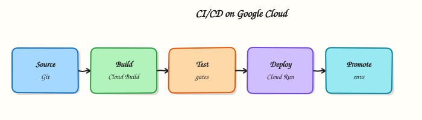

# CI/CD on Google Cloud

## Overview

**CI/CD** means **Continuous Integration** and **Continuous Delivery/Deployment**: every change is built and tested automatically, then shipped through a controlled path to an environment. On Google Cloud, **Cloud Build** runs the builds, **Artifact Registry** stores images, **Cloud Run** (or GKE) receives deploys, and **Cloud Deploy** can orchestrate progressive delivery across targets.

This is **Tutorial 1** in **Module 13: CI/CD** of the REBASH Academy **Google Cloud for Cloud & DevOps Engineers** series. The lab runs a Cloud Build pipeline that builds a container, pushes to Artifact Registry, deploys Cloud Run, proves the URL, then tears it down.

!!! warning "Cost hygiene"
    Cloud Build minutes and Cloud Run requests are usually small for this lab. Still delete the service, images/repo, and any triggers you create. Do not leave a trigger firing on every fork push to a public repo.

## Prerequisites

- [Infrastructure as Code on Google Cloud](infrastructure-as-code-on-gcp.md)
- [Serverless on Google Cloud](serverless-on-gcp.md) — Cloud Run deploy comfort
- Permission to run Cloud Build and deploy Cloud Run (Owner sandbox is fine)

## Learning Objectives

By the end of this tutorial, you will be able to:

- [ ] Explain CI vs CD in plain English
- [ ] Author a `cloudbuild.yaml` that builds, pushes, and deploys
- [ ] Run the pipeline with `gcloud builds submit` and prove SUCCESS
- [ ] Curl the deployed Cloud Run URL
- [ ] Contrast Cloud Build with GitHub Actions / GitLab CI at a high level

## Architecture

Developer submit / git push → **Cloud Build** steps (build, push, deploy) → image in **Artifact Registry** → revision on **Cloud Run** → HTTPS URL. Optional **Cloud Deploy** sits between build and production targets for promotions.



## Theory

### What it is

**Cloud Build** executes a series of containerised steps defined in `cloudbuild.yaml` (or Dockerfile-only builds). Each step runs in order (or with waitFor parallelism). Substitutions inject project/region values.

### Why it matters

Manual `docker build && gcloud run deploy` does not scale and leaves no audit trail. Interviews expect pipeline shape, least-privilege build SAs, and “build once, promote many”.

### How it works

1. Enable Cloud Build, Artifact Registry, Cloud Run APIs.
2. Grant the Cloud Build service account permission to push and deploy.
3. Define steps: `docker build` / `buildx`, `docker push`, `gcloud run deploy`.
4. Submit from local dir or connect a repository trigger.
5. Prove build SUCCESS and service URL.

### Cloud Build vs other CI

| Tool | When you hear it |
|------|------------------|
| Cloud Build | Native Google Cloud builds, tight AR/Run/GKE IAM |
| GitHub Actions | Repo-native; often federates into GCP via WIF |
| GitLab CI | Same idea in GitLab; can still deploy to GCP |
| Cloud Deploy | Progressive delivery across Cloud Run/GKE targets |

### Common pitfalls

- Cloud Build SA missing `run.admin` / `iam.serviceAccountUser`
- Using `:latest` without immutable tags in production
- Triggers on the wrong branch
- Storing plaintext secrets in `cloudbuild.yaml`

## Hands-on Lab

### Objective

Create a small app + `cloudbuild.yaml`, grant Cloud Build deploy rights, submit a build that pushes to Artifact Registry and deploys Cloud Run, prove SUCCESS + curl, then delete lab resources.

### Prerequisites

| Tool | Notes |
|------|--------|
| APIs | `cloudbuild`, `artifactregistry`, `run` |
| IAM | Ability to bind roles on the Cloud Build SA |

### Lab environment

``` {.bash .ra-terminal title="Terminal"}
mkdir -p ~/rebash-gcp/module-13 && cd ~/rebash-gcp/module-13
export PROJECT_ID="${PROJECT_ID:-$(gcloud config get-value project)}"
export REGION="${REGION:-europe-west2}"
export REPO="rebash-m13"
export SERVICE="rebash-m13"
export PROJECT_NUMBER=$(gcloud projects describe "$PROJECT_ID" --format='value(projectNumber)')
export CB_SA="${PROJECT_NUMBER}@cloudbuild.gserviceaccount.com"
gcloud config set project "$PROJECT_ID"
gcloud services enable \
  cloudbuild.googleapis.com \
  artifactregistry.googleapis.com \
  run.googleapis.com \
  --project="$PROJECT_ID"
```

### Real-world scenario

Platform wants a “merge to main ships a Cloud Run revision” proof without wiring GitHub yet. You demonstrate the same steps a trigger would run, with SUCCESS logs and a live URL, then clean up.

### Step-by-step tasks

#### Task 1 – App files

Create `Dockerfile` in your editor:

```dockerfile title="Dockerfile"
FROM nginx:1.27-alpine
RUN printf '%s\n' 'rebash-m13 pipeline ok' > /usr/share/nginx/html/index.html
```

Create `cloudbuild.yaml` in your editor:

```yaml title="cloudbuild.yaml"
substitutions:
  _REGION: europe-west2
  _REPO: rebash-m13
  _SERVICE: rebash-m13
  _TAG: v1

steps:
  - name: gcr.io/cloud-builders/docker
    args:
      - build
      - -t
      - ${_REGION}-docker.pkg.dev/$PROJECT_ID/${_REPO}/hello:${_TAG}
      - .

  - name: gcr.io/cloud-builders/docker
    args:
      - push
      - ${_REGION}-docker.pkg.dev/$PROJECT_ID/${_REPO}/hello:${_TAG}

  - name: gcr.io/google.com/cloudsdktool/cloud-sdk
    entrypoint: gcloud
    args:
      - run
      - deploy
      - ${_SERVICE}
      - --image=${_REGION}-docker.pkg.dev/$PROJECT_ID/${_REPO}/hello:${_TAG}
      - --region=${_REGION}
      - --port=80
      - --allow-unauthenticated
      - --max-instances=2

images:
  - ${_REGION}-docker.pkg.dev/$PROJECT_ID/${_REPO}/hello:${_TAG}
```

!!! note "Substitutions"
    `_REGION` defaults above — override on submit if your home region differs.

#### Task 2 – Registry + IAM for Cloud Build

``` {.bash .ra-terminal title="Terminal"}
cd ~/rebash-gcp/module-13
gcloud artifacts repositories create "$REPO" \
  --repository-format=docker \
  --location="$REGION" \
  --description="REBASH Module 13" 2>/dev/null || true
gcloud projects add-iam-policy-binding "$PROJECT_ID" \
  --member="serviceAccount:${CB_SA}" \
  --role="roles/run.admin" \
  --condition=None --quiet
gcloud projects add-iam-policy-binding "$PROJECT_ID" \
  --member="serviceAccount:${CB_SA}" \
  --role="roles/iam.serviceAccountUser" \
  --condition=None --quiet
gcloud projects add-iam-policy-binding "$PROJECT_ID" \
  --member="serviceAccount:${CB_SA}" \
  --role="roles/artifactregistry.writer" \
  --condition=None --quiet
echo "$CB_SA" | tee cb-sa.txt
```

#### Task 3 – Submit pipeline and prove

``` {.bash .ra-terminal title="Terminal"}
cd ~/rebash-gcp/module-13
gcloud builds submit --config=cloudbuild.yaml \
  --substitutions=_REGION="$REGION",_REPO="$REPO",_SERVICE="$SERVICE",_TAG=v1 \
  --format=json | tee build.json
grep -q '"status": "SUCCESS"' build.json || grep -q SUCCESS build.json
SERVICE_URL=$(gcloud run services describe "$SERVICE" --region="$REGION" \
  --format='value(status.url)')
echo "$SERVICE_URL" | tee service-url.txt
curl -fsS "${SERVICE_URL}/" | tee curl-ok.txt
grep -q "rebash-m13 pipeline ok" curl-ok.txt
echo "cloud build pipeline OK" | tee evidence.txt
```

!!! example "Expected output"
    Build status SUCCESS; curl returns `rebash-m13 pipeline ok`.

#### Task 4 – Break/fix a pipeline step (Dockerfile)

``` {.bash .ra-terminal title="Terminal"}
cd ~/rebash-gcp/module-13
cp Dockerfile Dockerfile.good
printf '%s\n' 'FROM nginx:1.27-alpine' 'RUN /bin/false' > Dockerfile
set +e
gcloud builds submit --config=cloudbuild.yaml \
  --substitutions=_REGION="$REGION",_REPO="$REPO",_SERVICE="$SERVICE",_TAG=bad \
  2>&1 | tee build-fail.txt
FAIL_RC=$?
set -e
test "$FAIL_RC" -ne 0
cp Dockerfile.good Dockerfile
gcloud builds submit --config=cloudbuild.yaml \
  --substitutions=_REGION="$REGION",_REPO="$REPO",_SERVICE="$SERVICE",_TAG=v2 \
  --format=json | tee build-restore.json
grep -qi success build-restore.json
```

### Validation steps

- [ ] `build.json` shows SUCCESS
- [ ] Curl proves Cloud Run content
- [ ] Failed build evidence captured, then restore SUCCESS

### Common errors and fixes

| Error you see | Plain meaning | What to do |
|---------------|---------------|------------|
| Permission denied on deploy | CB SA roles missing | Re-run Task 2 bindings |
| Repository not found | AR missing | Create `$REPO` in `$REGION` |
| Build FAILED in docker step | Dockerfile error | Read step logs in Console / `gcloud builds log` |
| Unauthenticated blocked | Org policy | Deploy with IAM invoker instead for the lab |

### Challenge exercise

Write `wif-notes.txt` (six lines): how GitHub Actions would call this same deploy using Workload Identity Federation instead of a JSON key.

``` {.bash .ra-terminal title="Terminal"}
cd ~/rebash-gcp/module-13
test -s wif-notes.txt
wc -l wif-notes.txt | tee challenge.txt
```

### Learning outcomes

- You ran a real Cloud Build → AR → Cloud Run path
- You can grant least-privilege-ish deploy rights to the build SA
- You practised reading a failed build and restoring green

### Cleanup

``` {.bash .ra-terminal title="Terminal"}
cd ~/rebash-gcp/module-13
export PROJECT_ID="${PROJECT_ID:-$(gcloud config get-value project)}"
export REGION="${REGION:-europe-west2}"
export SERVICE="rebash-m13"
export REPO="rebash-m13"
gcloud run services delete "$SERVICE" --region="$REGION" --quiet 2>/dev/null || true
gcloud artifacts repositories delete "$REPO" --location="$REGION" --quiet 2>/dev/null || true
# Optional: remove elevated CB SA roles if this project is shared training
rm -f build.json build-fail.txt build-restore.json service-url.txt curl-ok.txt \
  evidence.txt cb-sa.txt challenge.txt Dockerfile.good
```

## Validation

- [ ] Lab folder `~/rebash-gcp/module-13` used
- [ ] Cloud Run service deleted
- [ ] You can sketch the pipeline on a whiteboard

## Code Walkthrough

1. **`cloudbuild.yaml` steps** — build, push, deploy as code.
2. **Cloud Build SA IAM** — pipelines need explicit deploy rights.
3. **Substitutions** — one config, many regions/tags.
4. **Failed build** — logs are the source of truth.
5. **Delete service + repo** — finish the change.

## Security Considerations

- Prefer Workload Identity Federation from GitHub/GitLab over downloaded keys.
- Scope AR writer and Run deploy per project/environment.
- Scan images in the pipeline before production promote.
- Avoid `--allow-unauthenticated` outside demos.

## Common Mistakes

!!! warning "Build on the laptop is the same as CI"
    CI provides consistency, IAM audit, and review gates. Laptop-only ship does not.

!!! warning "SUCCESS means production is fine"
    SUCCESS means the pipeline steps passed. You still need probes, SLOs, and progressive delivery for real prod.

!!! warning "One SA for all environments"
    Separate deploy identities for dev/stage/prod reduce blast radius.

## Best Practices

- Immutable tags / digests
- Plan+apply Terraform in a separate pipeline with approvals
- Cloud Deploy or traffic splits for canaries
- Cache dependencies thoughtfully
- Keep `cloudbuild.yaml` reviewed like app code

## Troubleshooting

| Symptom | Likely cause | Fix |
|---------|--------------|-----|
| Stuck QUEUED | Quota / workers | Check Cloud Build quotas; retry |
| Push DENIED | AR IAM | Grant `artifactregistry.writer` to CB SA |
| Run deploy 403 | Missing `iam.serviceAccountUser` on runtime SA | Bind Task 2 roles |

## Summary

**Cloud Build** + **Artifact Registry** + **Cloud Run** is the default Google-native container CI/CD path. Grant the build identity deliberately, prove SUCCESS with URL evidence, and delete lab pipelines’ outputs. Next: **cost optimisation**.

## Interview Questions

**1. What is CI vs CD?**

??? success "Reveal answer"
    CI continuously integrates and tests changes (build/test on every commit). CD continuously delivers or deploys those artefacts to environments through an automated, controlled path.

**2. What does Cloud Build do?**

??? success "Reveal answer"
    It runs defined build steps in Google Cloud — commonly compile, test, build container images, push to Artifact Registry, and deploy to Cloud Run or GKE.

**3. Why push to Artifact Registry instead of only Docker Hub?**

??? success "Reveal answer"
    Private IAM, regional control, tighter Google Cloud integration, and better supply-chain governance than relying on public tags alone.

**4. What identity runs Cloud Build steps by default?**

??? success "Reveal answer"
    The Cloud Build service account for the project (`PROJECT_NUMBER@cloudbuild.gserviceaccount.com`), unless you configure a custom worker pool / SA.

**5. How does GitHub Actions fit with Google Cloud?**

??? success "Reveal answer"
    Actions can build/test in GitHub and deploy to GCP using Workload Identity Federation so Google issues short-lived tokens without a long-lived JSON key.

**6. What is Cloud Deploy?**

??? success "Reveal answer"
    A managed continuous delivery service that promotes releases across targets (for example staging then production) with delivery pipelines, often fed by Cloud Build artefacts.

**7. How do you debug a failed Cloud Build?**

??? success "Reveal answer"
    Open the failed build in Console or `gcloud builds log`, identify the failing step, reproduce locally if needed, fix Dockerfile/config/IAM, and re-submit.

**8. Why is `--allow-unauthenticated` risky in pipelines?**

??? success "Reveal answer"
    It makes the Cloud Run URL publicly invokable. Fine for same-day demos; production should require authenticated invokers.

## Related Tutorials

- Previous: [Infrastructure as Code on Google Cloud](infrastructure-as-code-on-gcp.md)
- Next: [Cost Optimisation on Google Cloud](cost-optimisation-on-gcp.md)
- [Serverless on Google Cloud](serverless-on-gcp.md)
- [GitHub Actions](../github-actions/index.md)

## References

- [Cloud Build](https://cloud.google.com/build/docs)
- [cloudbuild.yaml schema](https://cloud.google.com/build/docs/build-config-file-schema)
- [Deploying to Cloud Run with Cloud Build](https://cloud.google.com/build/docs/deploying-builds/deploy-cloud-run)
- [Cloud Deploy](https://cloud.google.com/deploy/docs)
- [Workload Identity Federation](https://cloud.google.com/iam/docs/workload-identity-federation)
