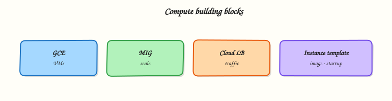

# Compute Engine, MIGs, and Load Balancing

## Overview

**Compute Engine** is Google Cloud’s virtual machine service. You choose a machine type, disk, network, and identity, then run the same kind of Linux (or Windows) workloads you would run in a data centre — with cloud APIs for create, resize, snapshot, and delete.

This module focuses on the operator skills interviews expect: launch a VM with a **startup script**, prove the service from outside, understand **Managed Instance Groups (MIGs)** and **load balancing** as the path from one VM to a resilient service, and **always clean up**.

This is **Tutorial 1** in **Module 4: Compute** of the REBASH Academy **Google Cloud for Cloud & DevOps Engineers** series — practical Google Cloud for Cloud and DevOps work.

!!! warning "Cost hygiene"
    VMs bill while they exist (and sometimes for disks after delete if you keep them). Use `e2-micro` / Free Trial friendly shapes. **Cleanup is mandatory** — a forgotten VM is a classic student invoice.

## Prerequisites

- [VPC Networking on Google Cloud](vpc-networking-on-gcp.md) — custom VPC optional; this lab can use `default` **or** recreate a tiny custom network
- Module 1 budget alert recommended
- Comfortable editing a shell script in a text editor

## Learning Objectives

By the end of this tutorial, you will be able to:

- [ ] Explain Compute Engine machine types, disks, and zones in plain English
- [ ] Launch a VM with a startup script and prove HTTP from your laptop
- [ ] Break and fix a simple service failure (process/firewall style triage)
- [ ] Describe instance templates, MIGs, and autoscaling at interview depth
- [ ] Contrast external passthrough vs HTTP(S) load balancing at a high level
- [ ] Delete lab compute resources without leaving disks behind

## Architecture

A VM runs in a zone on a subnet. Metadata can carry a startup script. For production scale, an **instance template** defines the VM shape; a **MIG** keeps N healthy instances; a **load balancer** provides a stable frontend IP or HTTP VIP.



## Theory

### What it is

Compute Engine provides **virtual machines** (VMs): vCPU, memory, disks, and network interfaces you control. You are responsible for the guest operating system and the app on it (shared responsibility).

### Why it matters

Even in a Kubernetes-heavy shop, engineers still debug GCE nodes, bastions, and legacy VMs. MIGs and load balancers are the bridge between “I can start nginx” and “I can keep a service up across a zone failure”.

### How it works

1. Pick **zone** (and therefore region).
2. Pick **machine type** (for example `e2-micro`).
3. Attach disks (boot disk from a public image family).
4. Attach network interface + optional external IP.
5. Attach a **service account** (prefer least privilege).
6. Optionally pass **metadata** such as `startup-script`.
7. For fleets: template → MIG → backend service → load balancer.

### Machine types and disks

| Idea | Practical note |
|------|----------------|
| **E2 / N2 / …** | Families trade price, performance, and features |
| **e2-micro** | Good student shape; watch Always Free regional limits |
| **Boot disk** | Usually auto-delete on VM delete — still verify |
| **Persistent Disk** | Network-attached block storage; snapshots for backup drills |

### Startup scripts and metadata

Startup scripts run on boot (and on every boot unless you guard them). They are perfect for lab bootstrap and terrible as your only configuration management for large fleets — later you will want images, Ansible, or containerisation.

``` {.bash .ra-terminal title="Terminal"}
gcloud compute instances add-metadata VM_NAME --zone=ZONE \
  --metadata-from-file=startup-script=startup.sh
```

### Managed Instance Groups (MIGs)

A **MIG** maintains a desired number of VMs from an **instance template**.

| Feature | Why teams use it |
|---------|------------------|
| Autohealing | Recreate unhealthy VMs |
| Autoscaling | Grow/shrink on CPU or load-balancer signals |
| Rolling updates | Replace template versions safely |
| Multi-zone MIG | Survive a single zone failure |

You will not build a full autoscaled MIG in this lab (cost and time). You **must** be able to explain the template → MIG → LB chain in an interview.

### Load balancing (map for later labs)

| Type | Typical use |
|------|-------------|
| **External HTTP(S)** | Web apps, URL maps, Google-managed certs |
| **External passthrough (Network LB)** | Preserve client IP, non-HTTP protocols |
| **Internal TCP/UDP** | East-west inside VPC |
| **Regional vs global** | Availability and anycast design trade-offs |

Creating production HTTPS LBs can be expensive and fiddly (health checks, firewalls, backends). Module 4 proves the **VM data plane**; treat LB as architecture knowledge plus a challenge sketch.

### Common pitfalls

- Wrong zone when describing/deleting
- Startup script failures visible only in serial logs
- Leaving static external IPs reserved
- Using `roles/editor` on the VM service account
- Calling one VM in one zone “highly available”

## Hands-on Lab

### Objective

Create a disposable VPC path (or reuse defaults carefully), launch an `e2-micro` with a startup script that serves nginx, prove curl, break nginx and restore it, then delete the VM and network resources.

### Prerequisites

| Tool | Notes |
|------|--------|
| Modules 1–3 | `gcloud` project/region/zone pinned |
| Compute Engine API | Enabled |
| Editor for `startup.sh` | No heredocs |

### Lab environment

``` {.bash .ra-terminal title="Terminal"}
mkdir -p ~/rebash-gcp/module-04 && cd ~/rebash-gcp/module-04
export PROJECT_ID="${PROJECT_ID:-$(gcloud config get-value project)}"
export REGION="${REGION:-europe-west2}"
export ZONE="${ZONE:-europe-west2-a}"
export NETWORK="rebash-m04-vpc"
export SUBNET="rebash-m04-subnet"
export VM="rebash-m04-web"
gcloud config set project "$PROJECT_ID"
gcloud config set compute/region "$REGION"
gcloud config set compute/zone "$ZONE"
gcloud services enable compute.googleapis.com --project="$PROJECT_ID"
```

### Real-world scenario

Onboarding week: you must bring up a small web VM with automated bootstrap, prove it from the public internet, show you can recover when the process dies, and leave zero billable compute behind. Your mentor will ask how you would wrap this in a MIG next.

### Step-by-step tasks

#### Task 1 – Network + firewall for the lab VM

``` {.bash .ra-terminal title="Terminal"}
cd ~/rebash-gcp/module-04
gcloud compute networks create "$NETWORK" --subnet-mode=custom --format=json | tee network.json
gcloud compute networks subnets create "$SUBNET" \
  --network="$NETWORK" --region="$REGION" --range="10.20.0.0/24" \
  --format=json | tee subnet.json
gcloud compute firewall-rules create "${NETWORK}-allow-ssh" \
  --network="$NETWORK" --allow=tcp:22 --target-tags=rebash-lab \
  --source-ranges=0.0.0.0/0
gcloud compute firewall-rules create "${NETWORK}-allow-http" \
  --network="$NETWORK" --allow=tcp:80 --target-tags=rebash-lab \
  --source-ranges=0.0.0.0/0
```

#### Task 2 – Startup script + create VM

Create `startup.sh` with your editor (no laptop-shell heredoc):

```bash title="startup.sh"
#!/bin/bash
set -euo pipefail
apt-get update -y
apt-get install -y nginx
printf '%s\n' \
  '<!doctype html><title>rebash-m04</title>' \
  '<h1>rebash-m04 ok</h1>' \
  "<p>host: $(hostname)</p>" \
  > /var/www/html/index.html
systemctl enable --now nginx
```

``` {.bash .ra-terminal title="Terminal"}
cd ~/rebash-gcp/module-04
chmod +x startup.sh
gcloud compute instances create "$VM" \
  --zone="$ZONE" \
  --machine-type=e2-micro \
  --network-interface="network=${NETWORK},subnet=${SUBNET}" \
  --tags=rebash-lab \
  --image-family=debian-12 \
  --image-project=debian-cloud \
  --boot-disk-size=10GB \
  --metadata-from-file=startup-script=startup.sh \
  --format=json | tee vm.json
EXTERNAL_IP=$(gcloud compute instances describe "$VM" --zone="$ZONE" \
  --format='get(networkInterfaces[0].accessConfigs[0].natIP)')
echo "$EXTERNAL_IP" | tee external-ip.txt
for i in $(seq 1 12); do
  if curl -fsS --max-time 5 "http://${EXTERNAL_IP}/" | tee curl-ok.txt; then
    break
  fi
  sleep 15
done
grep -q "rebash-m04 ok" curl-ok.txt
```

!!! example "Expected output"
    `curl-ok.txt` contains `rebash-m04 ok` and a hostname line.

#### Task 3 – Break/fix the guest service

``` {.bash .ra-terminal title="Terminal"}
cd ~/rebash-gcp/module-04
EXTERNAL_IP=$(cat external-ip.txt)
gcloud compute ssh "$VM" --zone="$ZONE" --command='sudo systemctl stop nginx'
set +e
curl -fsS --max-time 5 "http://${EXTERNAL_IP}/" 2>&1 | tee curl-down.txt
DOWN_RC=$?
set -e
test "$DOWN_RC" -ne 0
gcloud compute ssh "$VM" --zone="$ZONE" --command='sudo systemctl start nginx'
sleep 2
curl -fsS --max-time 5 "http://${EXTERNAL_IP}/" | tee curl-up.txt
grep -q "rebash-m04 ok" curl-up.txt
echo "compute break/fix OK" | tee evidence.txt
```

!!! example "Expected output"
    Curl fails while nginx is stopped, then succeeds after start. This is guest-service triage — different from Module 3’s firewall break.

#### Task 4 – Capture instance facts for interviews

``` {.bash .ra-terminal title="Terminal"}
cd ~/rebash-gcp/module-04
gcloud compute instances describe "$VM" --zone="$ZONE" \
  --format="yaml(name,zone,machineType,status,tags,disks[0].autoDelete,serviceAccounts)" \
  | tee instance-facts.txt
test -s instance-facts.txt
```

### Validation steps

- [ ] HTTP proof succeeded before break/fix
- [ ] Stop/start nginx demonstrated service vs network failure modes
- [ ] `instance-facts.txt` shows machine type and tags
- [ ] You can explain how a MIG would wrap this VM

### Common errors and fixes

| Error you see | Plain meaning | What to do |
|---------------|---------------|------------|
| SSH prompt / connection refused | OS Login still settling or firewall | Wait; confirm allow-ssh tag |
| curl fails after 3 minutes | Startup apt failure | `gcloud compute instances get-serial-port-output` |
| `QUOTA_EXCEEDED` | Too many CPUs/IPs | Delete leftovers; try another region |
| No external IP | Access config missing | Recreate with default access config / network-tier |

### Challenge exercise

Write `mig-plan.txt` (editor) with eight short lines: instance template contents you would freeze, MIG size = 2 across two zones, health check path `/`, and why a single VM is not enough for an interview HA answer.

``` {.bash .ra-terminal title="Terminal"}
cd ~/rebash-gcp/module-04
test -s mig-plan.txt
wc -l mig-plan.txt | tee challenge.txt
```

### Learning outcomes

- You automated VM bootstrap with a startup script
- You proved and restored a guest service failure
- You can narrate MIG + load balancer as the next production step
- You deleted billable compute as part of the job

### Cleanup

``` {.bash .ra-terminal title="Terminal"}
cd ~/rebash-gcp/module-04
export ZONE="${ZONE:-europe-west2-a}"
export REGION="${REGION:-europe-west2}"
export NETWORK="rebash-m04-vpc"
export SUBNET="rebash-m04-subnet"
export VM="rebash-m04-web"
gcloud compute instances delete "$VM" --zone="$ZONE" --delete-disks=all --quiet 2>/dev/null || true
gcloud compute firewall-rules delete "${NETWORK}-allow-http" --quiet 2>/dev/null || true
gcloud compute firewall-rules delete "${NETWORK}-allow-ssh" --quiet 2>/dev/null || true
gcloud compute networks subnets delete "$SUBNET" --region="$REGION" --quiet 2>/dev/null || true
gcloud compute networks delete "$NETWORK" --quiet 2>/dev/null || true
# If a static IP was reserved accidentally:
# gcloud compute addresses list
rm -f network.json subnet.json vm.json external-ip.txt curl-ok.txt curl-down.txt \
  curl-up.txt evidence.txt instance-facts.txt challenge.txt
```

## Validation

- [ ] Lab folder `~/rebash-gcp/module-04` used
- [ ] Evidence of HTTP up → down → up captured before cleanup
- [ ] No VM named `rebash-m04-web` remains
- [ ] You can explain template → MIG → LB without reading notes

## Code Walkthrough

1. **Custom VPC again** — keeps the lab isolated from `default` clutter.
2. **`--metadata-from-file=startup-script`** — bootstrap without logging into install packages manually first.
3. **Guest stop/start** — separates “process down” from “firewall down”.
4. **`--delete-disks=all`** — avoids orphan boot disks on the bill.
5. **MIG plan as challenge** — architecture without paying for a full LB stack yet.

## Security Considerations

- Attach a dedicated least-privilege service account (not Editor) in real apps.
- Prefer OS Login and IAP over open SSH to `0.0.0.0/0`.
- Do not put secrets in startup scripts or instance metadata.
- Harden images; patch regularly; prefer immutable images for fleets.

## Common Mistakes

!!! warning "Startup script ran, so the app is safe forever"
    Scripts can fail halfway. Serial logs and health checks exist because bootstrap is fragile.

!!! warning "MIG = high availability automatically"
    Multi-zone MIG + healthy load balancing + correct session/data design is HA. A one-zone MIG is still a zone failure risk.

!!! warning "Machine type is just a label"
    Wrong sizing causes throttle or waste. Know how to describe and resize deliberately.

## Best Practices

- Golden images or config management over ever-growing startup scripts
- MIGs for anything user-facing on VMs
- Explicit auto-delete disk policy
- Labels: `env`, `owner`, `tutorial=rebash-m04`
- Clean up in the same change window you create

## Troubleshooting

| Symptom | Likely cause | Fix |
|---------|--------------|-----|
| Serial log shows apt lock errors | Parallel package ops | Retry / wait; simplify script |
| HTTP 403 from nginx | Wrong root or SELinux-like policies | Check `/var/www/html` and nginx status |
| `RESOURCE_NOT_FOUND` on delete | Wrong zone | List instances without zone filter |
| Bill after cleanup | Reserved IP or leftover disk | `gcloud compute disks list` / `addresses list` |

## Summary

**Compute Engine** runs your VMs; **startup scripts** bootstrap them; **MIGs** keep fleets healthy; **load balancers** provide stable frontends. This lab proved a real HTTP VM and a guest-service recovery. Cleanup is part of competence. Next: **storage** — disks, snapshots, and Cloud Storage.

## Interview Questions

**1. What is Compute Engine?**

??? success "Reveal answer"
    Compute Engine is Google Cloud’s infrastructure-as-a-service virtual machine product. You choose machine type, disk, network, and identity, then run guest operating systems and applications you manage.

**2. What is a startup script useful for?**

??? success "Reveal answer"
    It runs on VM boot to install packages, write config, and start services so the instance becomes useful without a manual SSH install session. For large fleets, prefer images and config management; keep scripts small and idempotent when possible.

**3. What is an instance template?**

??? success "Reveal answer"
    A reusable VM definition (machine type, disk image, network, metadata, service account) used to create many identical instances, especially inside managed instance groups.

**4. What problem does a Managed Instance Group solve?**

??? success "Reveal answer"
    A MIG keeps a target number of VMs healthy based on a template, and can autoheal, autoscale, and roll out updates. It turns “one snowflake VM” into a managed fleet.

**5. Is one VM in one zone highly available?**

??? success "Reveal answer"
    No. Zone failures can take it down. Use multi-zone MIGs and a suitable load balancer, and design data layers for failover.

**6. How do you triage a VM that pings but does not serve HTTP?**

??? success "Reveal answer"
    Check process/listeners (`systemctl`, ports), local firewall inside the guest, VPC firewall rules and tags, load balancer health checks if used, and startup/serial logs for bootstrap failures.

**7. External HTTP(S) load balancing vs a single VM external IP — why prefer LB in production?**

??? success "Reveal answer"
    A load balancer provides a stable frontend, health-checked backends, often better availability across instances/zones, and features such as URL maps and managed certificates. A single VM IP is a lab or low-criticality pattern.

**8. What do you delete to stop Compute charges after a lab?**

??? success "Reveal answer"
    Delete the VM (with disks if appropriate), unused snapshots, reserved external IPs, and any load balancers/forwarding rules you created. Verify with list commands after delete.

## Related Tutorials

- Previous: [VPC Networking on Google Cloud](vpc-networking-on-gcp.md)
- Next: [Cloud Storage, Persistent Disk, and Filestore](storage-gcs-persistent-disk-and-filestore.md)
- Parallel: [Compute on AWS](../aws/compute-ec2-asg-and-load-balancing.md)

## References

- [Compute Engine documentation](https://cloud.google.com/compute/docs)
- [Startup scripts](https://cloud.google.com/compute/docs/instances/startup-scripts)
- [Managed instance groups](https://cloud.google.com/compute/docs/instance-groups)
- [Cloud Load Balancing](https://cloud.google.com/load-balancing/docs)
- [gcloud compute instances create](https://cloud.google.com/sdk/gcloud/reference/compute/instances/create)
