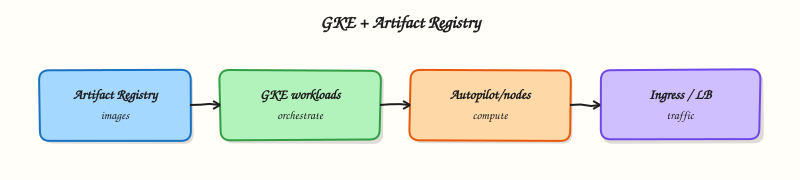

# Containers — GKE and Artifact Registry

## Overview

Containers package your app with its runtime so it runs the same in CI, on your laptop, and in the cloud. On Google Cloud you store images in **Artifact Registry**, then run them on **Google Kubernetes Engine (GKE)** — or on **Cloud Run** when you do not need a full Kubernetes control plane (Module 8).

This module focuses on the operator path interviews expect: create a Docker repository, build/push an image, deploy a tiny workload to **GKE Autopilot**, prove the pod is healthy, and delete the cluster so it does not drain your Free Trial.

This is **Tutorial 1** in **Module 7: Containers** of the REBASH Academy **Google Cloud for Cloud & DevOps Engineers** series.

!!! warning "Cost hygiene"
    GKE Autopilot bills for running pods and cluster overhead. **Delete the cluster in Cleanup the same day.** If you cannot create a cluster, complete the Artifact Registry path plus the documented alternate — do not leave a half-created cluster overnight.

## Prerequisites

- [Databases on Google Cloud](databases-on-gcp.md)
- [Docker](../docker/index.md) fundamentals (image = filesystem + metadata)
- [Kubernetes](../kubernetes/index.md) recommended (`kubectl`, Pod, Deployment, Service)
- Billing linked; Kubernetes Engine API allowed in your project

## Learning Objectives

By the end of this tutorial, you will be able to:

- [ ] Explain Artifact Registry vs a random Docker Hub tag for production
- [ ] Create a Docker repository and push an image (Cloud Build or Docker)
- [ ] Contrast GKE Standard vs Autopilot in plain English
- [ ] Deploy a workload to Autopilot **or** complete the alternate proof path
- [ ] Decide when Cloud Run is enough instead of GKE

## Architecture

Developers build images → **Artifact Registry** stores them → **GKE** schedules Pods on nodes (Autopilot manages nodes for you) → Services expose workloads. Cloud Run is the simpler serverless container lane for many HTTP APIs.



## Theory

### What it is

**Artifact Registry** is Google Cloud’s managed repository for container images and other artefacts. **GKE** is managed Kubernetes: Google runs the control plane; you run workloads (and in Standard mode, node pools).

### Why it matters

Production teams rarely pull unpinned `latest` from the public internet for deploy. They push to a private registry, scan images, and deploy with Kubernetes manifests or Helm. Interviews ask Autopilot vs Standard and “why not only Cloud Run?”.

### How it works

1. Enable Artifact Registry + Kubernetes Engine APIs.
2. Create a `docker` repository in your region.
3. Build and push `REGION-docker.pkg.dev/PROJECT/REPO/IMAGE:TAG`.
4. Create a GKE cluster (`create-auto` for Autopilot).
5. `kubectl apply` Deployment + Service.
6. Prove Ready pods; delete cluster when done.

### Autopilot vs Standard

| Mode | You manage | Pick when |
|------|------------|-----------|
| **Autopilot** | Workloads mostly; Google manages nodes | Most new teams; less node ops |
| **Standard** | Node pools, machine types, upgrades more directly | Special networking, GPUs, tight node control |

### When Cloud Run instead of GKE

Choose **Cloud Run** (Module 8) for request-driven HTTP/container services with minimal Kubernetes API surface. Choose **GKE** when you need broad Kubernetes ecosystem features, complex service meshes, DaemonSets, or multi-workload platforms.

### Common pitfalls

- Forgetting `gcloud container clusters get-credentials`
- Pushing to `gcr.io` legacy host by habit (Artifact Registry is current)
- Leaving Autopilot clusters for “just one more day”
- Using `:latest` with no digest in production
- Confusing registry IAM with Kubernetes RBAC

## Hands-on Lab

### Objective

Create an Artifact Registry Docker repository, build/push a tiny nginx-based image with Cloud Build, deploy it to GKE Autopilot (preferred) or complete the alternate path, prove the pod, then delete the cluster and repository resources you no longer need.

### Prerequisites

| Tool | Notes |
|------|--------|
| `gcloud` + `kubectl` | `kubectl version --client` |
| APIs | `artifactregistry`, `container`, `cloudbuild` |

### Lab environment

``` {.bash .ra-terminal title="Terminal"}
mkdir -p ~/rebash-gcp/module-07 && cd ~/rebash-gcp/module-07
export PROJECT_ID="${PROJECT_ID:-$(gcloud config get-value project)}"
export REGION="${REGION:-europe-west2}"
export REPO="rebash-m07"
export IMAGE="hello"
export TAG="v1"
export CLUSTER="rebash-m07-auto"
export IMAGE_URI="${REGION}-docker.pkg.dev/${PROJECT_ID}/${REPO}/${IMAGE}:${TAG}"
gcloud config set project "$PROJECT_ID"
gcloud config set compute/region "$REGION"
gcloud services enable \
  artifactregistry.googleapis.com \
  container.googleapis.com \
  cloudbuild.googleapis.com \
  --project="$PROJECT_ID"
```

### Real-world scenario

Platform asks you to prove the minimum golden path: private image in Artifact Registry, one Deployment on Autopilot, evidence the pod is Ready, and zero cluster left behind after the spike.

### Step-by-step tasks

#### Task 1 – Artifact Registry repository

``` {.bash .ra-terminal title="Terminal"}
cd ~/rebash-gcp/module-07
gcloud artifacts repositories create "$REPO" \
  --repository-format=docker \
  --location="$REGION" \
  --description="REBASH Module 7" \
  --format=json | tee repo.json
gcloud artifacts repositories describe "$REPO" --location="$REGION" \
  --format=json | tee repo-describe.json
```

#### Task 2 – Build and push with Cloud Build

Create `Dockerfile` in your editor:

```dockerfile title="Dockerfile"
FROM nginx:1.27-alpine
RUN printf '%s\n' 'rebash-m07 ok' > /usr/share/nginx/html/index.html
```

``` {.bash .ra-terminal title="Terminal"}
cd ~/rebash-gcp/module-07
gcloud builds submit --tag="$IMAGE_URI" .
gcloud artifacts docker images list "${REGION}-docker.pkg.dev/${PROJECT_ID}/${REPO}/${IMAGE}" \
  --format="table(package,version,createTime)" | tee images.txt
grep -q "$TAG\|sha256\|${IMAGE}" images.txt
echo "$IMAGE_URI" | tee image-uri.txt
```

!!! example "Expected output"
    Cloud Build succeeds; `images.txt` lists your image.

#### Task 3 – Autopilot cluster + deploy (preferred)

``` {.bash .ra-terminal title="Terminal"}
cd ~/rebash-gcp/module-07
gcloud container clusters create-auto "$CLUSTER" \
  --region="$REGION" \
  --release-channel=regular
gcloud container clusters get-credentials "$CLUSTER" --region="$REGION"
kubectl get nodes -o wide | tee nodes.txt
```

Create `deploy.yaml` in your editor (replace the image line if needed — or use envsubst pattern carefully). Prefer writing the full URI you saved:

```yaml title="deploy.yaml"
apiVersion: apps/v1
kind: Deployment
metadata:
  name: rebash-m07
spec:
  replicas: 1
  selector:
    matchLabels:
      app: rebash-m07
  template:
    metadata:
      labels:
        app: rebash-m07
    spec:
      containers:
        - name: web
          image: IMAGE_URI_PLACEHOLDER
          ports:
            - containerPort: 80
          readinessProbe:
            httpGet:
              path: /
              port: 80
---
apiVersion: v1
kind: Service
metadata:
  name: rebash-m07
spec:
  selector:
    app: rebash-m07
  ports:
    - port: 80
      targetPort: 80
  type: ClusterIP
```

``` {.bash .ra-terminal title="Terminal"}
cd ~/rebash-gcp/module-07
IMAGE_URI=$(cat image-uri.txt)
# Write deploy.ready.yaml from the template (sed; no shell heredoc for the manifest)
sed "s|IMAGE_URI_PLACEHOLDER|${IMAGE_URI}|g" deploy.yaml > deploy.ready.yaml
kubectl apply -f deploy.ready.yaml | tee apply.txt
kubectl rollout status deployment/rebash-m07 --timeout=180s
kubectl get pods -l app=rebash-m07 -o wide | tee pods.txt
grep -q Running pods.txt
kubectl port-forward svc/rebash-m07 8080:80 >/tmp/rebash-m07-pf.log 2>&1 &
PF_PID=$!
sleep 3
curl -fsS http://127.0.0.1:8080/ | tee curl-ok.txt
kill "$PF_PID" 2>/dev/null || true
grep -q "rebash-m07 ok" curl-ok.txt
echo "gke+ar proof OK" | tee evidence.txt
```

!!! note "Why port-forward?"
    It proves the Service/Pod data plane without waiting on an external LoadBalancer IP (faster and cheaper for this lab).

#### Task 3b – Alternate if Autopilot is blocked

Complete Tasks 1–2, keep `deploy.yaml` with a real `IMAGE_URI`, then:

``` {.bash .ra-terminal title="Terminal"}
cd ~/rebash-gcp/module-07
kubectl apply --dry-run=client -f deploy.yaml | tee dry-run.txt
grep -q Deployment dry-run.txt
printf '%s\n' "alternate: AR push + kubectl client dry-run; cluster deferred" | tee evidence.txt
test -s images.txt
```

Write `cluster-blocker.txt` with the error message and whether it was quota, org policy, or billing.

### Validation steps

- [ ] Repository and image exist in Artifact Registry
- [ ] Preferred: Pod Running + `curl-ok.txt` **or** alternate dry-run evidence
- [ ] You can explain Autopilot vs Standard

### Common errors and fixes

| Error you see | Plain meaning | What to do |
|---------------|---------------|------------|
| `DENIED` push/pull | Missing Artifact Registry IAM | Ensure Cloud Build SA can write; your user can read |
| Autopilot create denied | Org policy / quota | Task 3b; ask mentor |
| ImagePullBackOff | Wrong URI or IAM on nodes | Check `IMAGE_URI`; Autopilot uses node SA permissions |
| Rollout timeout | Readiness failing | `kubectl describe pod`; fix probe/image |

### Challenge exercise

Write `run-vs-gke.txt` (eight lines): three reasons to pick GKE and three to pick Cloud Run for an internal HTTP API.

``` {.bash .ra-terminal title="Terminal"}
cd ~/rebash-gcp/module-07
test -s run-vs-gke.txt
wc -l run-vs-gke.txt | tee challenge.txt
```

### Learning outcomes

- You pushed a private image with Cloud Build
- You deployed to Autopilot or documented a clean alternate
- You can narrate registry → cluster → workload

### Cleanup

``` {.bash .ra-terminal title="Terminal"}
cd ~/rebash-gcp/module-07
export PROJECT_ID="${PROJECT_ID:-$(gcloud config get-value project)}"
export REGION="${REGION:-europe-west2}"
export CLUSTER="rebash-m07-auto"
export REPO="rebash-m07"
kubectl delete -f deploy.ready.yaml --ignore-not-found 2>/dev/null || true
kubectl delete -f deploy.yaml --ignore-not-found 2>/dev/null || true
gcloud container clusters delete "$CLUSTER" --region="$REGION" --quiet 2>/dev/null || true
# Optional: delete images/repo after you finish Module 8 if you want to reuse the image
# gcloud artifacts repositories delete "$REPO" --location="$REGION" --quiet
rm -f repo.json repo-describe.json images.txt apply.txt nodes.txt pods.txt \
  curl-ok.txt evidence.txt dry-run.txt challenge.txt deploy.ready.yaml
```

## Validation

- [ ] Lab folder `~/rebash-gcp/module-07` used
- [ ] Cluster deleted (or never created on alternate path)
- [ ] Image URI recorded for Module 8 optional reuse

## Code Walkthrough

1. **Artifact Registry first** — private images before orchestrators.
2. **Cloud Build submit** — no local Docker daemon required.
3. **Autopilot** — less node babysitting for the first GKE lab.
4. **port-forward proof** — faster than external LB for a training spike.
5. **Cluster delete** — the most important command in the module.

## Security Considerations

- Restrict who can push/pull repositories.
- Prefer digest pins in production deploys.
- Use Workload Identity for Pod→GCP API access (not JSON keys in Pods).
- Keep the Kubernetes API endpoint restricted in production (authorised networks / private clusters).

## Common Mistakes

!!! warning "Docker Hub latest is fine for production"
    Tags move; networks fail; supply chain risk rises. Use your registry and pinned digests.

!!! warning "Autopilot means zero cost when idle"
    Control plane / Autopilot overhead and leftover workloads still cost. Delete labs.

!!! warning "GKE and Cloud Run are the same"
    Both run containers; the ops model differs. Know when Kubernetes API surface is worth it.

## Best Practices

- One repo per product or team with clear IAM
- Build in CI; promote images by digest
- Autopilot by default unless you need Standard features
- Resource requests/limits on every container
- NetworkPolicies and namespaces as you mature

## Troubleshooting

| Symptom | Likely cause | Fix |
|---------|--------------|-----|
| `kubectl` wrong cluster | Kubeconfig context | `kubectl config get-contexts` |
| Build fails on Dockerfile | Base pull / syntax | Check Cloud Build logs |
| Cluster delete stuck | Finalisers / quota ops | Describe operations; wait; support if orphaned |

## Summary

**Artifact Registry** stores container images; **GKE** runs them on Kubernetes. Autopilot reduces node operations for first deployments. Cloud Run remains the simpler HTTP path — next module. Always delete training clusters.

## Interview Questions

**1. What is Artifact Registry?**

??? success "Reveal answer"
    Google Cloud’s managed artefact repository service. For containers it stores Docker images in regional repositories with IAM controls, scanning integrations, and CI/CD friendly URLs under `*.pkg.dev`.

**2. Autopilot vs Standard GKE?**

??? success "Reveal answer"
    Autopilot manages node infrastructure for you; you focus on Pods. Standard gives you control of node pools and machine configuration at the cost of more operations work.

**3. Why not pull everything from Docker Hub in production?**

??? success "Reveal answer"
    Availability, rate limits, tag mutability, and supply-chain trust. Teams mirror or build into a private registry they control.

**4. When choose Cloud Run over GKE?**

??? success "Reveal answer"
    When you have request-driven container services and do not need the full Kubernetes API (custom controllers, DaemonSets, complex cluster networking). Cloud Run reduces platform overhead.

**5. What does `ImagePullBackOff` usually mean?**

??? success "Reveal answer"
    The node cannot pull the image — wrong URI/tag, registry auth/IAM failure, or network policy blocking the registry.

**6. What is Workload Identity in one sentence?**

??? success "Reveal answer"
    A way for Kubernetes service accounts to impersonate Google service accounts so Pods call Google APIs without downloaded JSON keys.

**7. How do you prove a Deployment worked without an external load balancer?**

??? success "Reveal answer"
    Check `kubectl rollout status` / Ready pods, then `kubectl port-forward` to the Service and curl locally — same technique as this lab.

**8. What is the first cleanup step after a GKE lab?**

??? success "Reveal answer"
    Delete the workloads if needed, then delete the cluster, and verify with `gcloud container clusters list`. Orphan clusters are a common bill shock.

## Related Tutorials

- Previous: [Databases on Google Cloud](databases-on-gcp.md)
- Next: [Serverless on Google Cloud](serverless-on-gcp.md)
- [Kubernetes course](../kubernetes/index.md)
- Parallel: [AWS containers](../aws/containers-ecs-eks-ecr.md)

## References

- [Artifact Registry](https://cloud.google.com/artifact-registry/docs)
- [GKE Autopilot](https://cloud.google.com/kubernetes-engine/docs/concepts/autopilot-overview)
- [gcloud container clusters create-auto](https://cloud.google.com/sdk/gcloud/reference/container/clusters/create-auto)
- [Cloud Build](https://cloud.google.com/build/docs)
