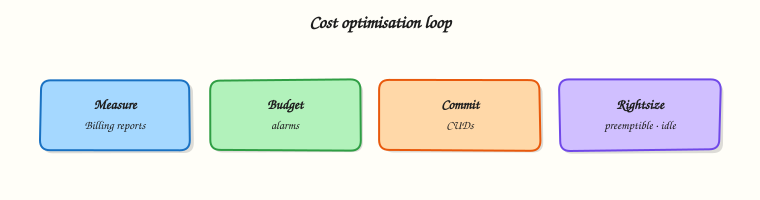

# Cost Optimisation on Google Cloud

## Overview

Cloud bills grow quietly: idle VMs, forgotten Cloud SQL, Autopilot clusters “for a quick test”, unlabelled shared projects. **FinOps** is the practice of making cloud spend visible, attributable, and intentional.

This is **Tutorial 1** in **Module 14: Cost Optimisation** of the REBASH Academy **Google Cloud for Cloud & DevOps Engineers** series. You will review budgets, apply labels, hunt idle compute, capture recommender-style evidence, and leave the project cleaner than you found it.

!!! warning "Cost hygiene"
    This module should **reduce** spend. Do not create large instances to “generate” billing data. Prefer listing, labelling, and deleting leftovers from earlier modules.

## Prerequisites

- [CI/CD on Google Cloud](cicd-on-gcp.md)
- Module 1 budget alert (still ideal)
- Billing Viewer / Project Editor on a sandbox

## Learning Objectives

By the end of this tutorial, you will be able to:

- [ ] Explain unit cost drivers for Compute Engine, Cloud SQL, GKE, and Cloud Run
- [ ] List and apply resource labels for attribution
- [ ] Review budgets and export a billing-linked project check
- [ ] Find and delete idle lab resources
- [ ] Describe CUDs, sustained use, and Recommender at interview depth

## Architecture

Usage meters into a **billing account**. **Budgets** alert on thresholds. **Labels** attribute spend to teams. **Recommender** suggests rightsizing and idle cleanup. Engineers act — labels alone do not save money.



## Theory

### What it is

Cost optimisation is continuous: observe → attribute → optimise → govern. Google Cloud tools include Billing reports, Budgets, labels, quotas, and active Assist / Recommender insights.

### Why it matters

Students and startups get surprised by NAT, load balancers, and SQL. Professionals who cannot explain last month’s bill do not get trusted with production accounts.

### How it works

1. Link projects to billing (Module 1).
2. Label resources (`env`, `owner`, `tutorial`).
3. Set budgets with thresholds.
4. Review idle VMs, unattached disks, old IPs, empty clusters.
5. Commit use discounts (CUDs) only when usage is steady — not for labs.

### Cost drivers (interview table)

| Service | Common waste |
|---------|----------------|
| Compute Engine | Idle VMs, oversized machine types, orphan disks/IPs |
| Cloud SQL | Left running after demos |
| GKE Autopilot | Clusters forgotten for days |
| Cloud Run | Usually fine; watch min instances |
| Cloud NAT / LB | Always-on charges |
| BigQuery | Wide scans, long-lived datasets |

### Common pitfalls

- No labels → “whose VM is this?”
- Budgets without humans who act
- Buying CUDs for spiky student workloads
- Deleting production “idle” without change windows

## Hands-on Lab

### Objective

Confirm billing link and budgets, label a disposable bucket, hunt idle compute/SQL/GKE leftovers from earlier modules, delete what is safe, and write a short cost review artefact.

### Prerequisites

| Tool | Notes |
|------|--------|
| Project Owner/Editor | Sandbox only for deletes |
| Module history | Leftovers from Modules 4–13 are the hunt targets |

### Lab environment

``` {.bash .ra-terminal title="Terminal"}
mkdir -p ~/rebash-gcp/module-14 && cd ~/rebash-gcp/module-14
export PROJECT_ID="${PROJECT_ID:-$(gcloud config get-value project)}"
export REGION="${REGION:-europe-west2}"
gcloud config set project "$PROJECT_ID"
```

### Real-world scenario

FinOps asks for a Friday hygiene pass: show the budget still exists, label one shared artefact store, list idle candidates, and delete confirmed lab leftovers before the weekend.

### Step-by-step tasks

#### Task 1 – Billing + budget review

``` {.bash .ra-terminal title="Terminal"}
cd ~/rebash-gcp/module-14
gcloud billing projects describe "$PROJECT_ID" --format=json | tee billing-link.json
BILLING_ACCOUNT=$(gcloud billing projects describe "$PROJECT_ID" \
  --format='value(billingAccountName)' | sed 's#.*/##')
echo "$BILLING_ACCOUNT" | tee billing-account.txt
gcloud billing budgets list --billing-account="$BILLING_ACCOUNT" \
  --format="table(displayName,amount.specifiedAmount)" 2>/dev/null | tee budgets.txt \
  || printf '%s\n' 'budgets-list-denied-use-console' | tee budgets.txt
test -s billing-link.json
```

#### Task 2 – Labels on a disposable bucket

``` {.bash .ra-terminal title="Terminal"}
cd ~/rebash-gcp/module-14
BUCKET="rebash-m14-${PROJECT_ID}"
gcloud storage buckets create "gs://${BUCKET}" --location="$REGION" \
  --uniform-bucket-level-access 2>/dev/null || true
gcloud storage buckets update "gs://${BUCKET}" \
  --update-labels=tutorial=rebash-m14,owner=student,env=lab
gcloud storage buckets describe "gs://${BUCKET}" --format=json | tee bucket.json
grep -q rebash-m14 bucket.json
echo "gs://${BUCKET}" | tee labelled-bucket.txt
```

#### Task 3 – Idle resource hunt

``` {.bash .ra-terminal title="Terminal"}
cd ~/rebash-gcp/module-14
gcloud compute instances list --format="table(name,zone,status,machineType)" | tee vms.txt
gcloud compute disks list --format="table(name,zone,sizeGb,users)" | tee disks.txt
gcloud compute addresses list --format="table(name,region,status,address)" | tee addresses.txt
gcloud sql instances list --format="table(name,region,state)" 2>/dev/null | tee sql.txt || true
gcloud container clusters list --format="table(name,location,status)" 2>/dev/null | tee gke.txt || true
gcloud run services list --format="table(metadata.name,status.url)" 2>/dev/null | tee run.txt || true
# Save a hunt summary (editor): idle-hunt.md with what you will delete vs keep
test -s idle-hunt.md
```

Create `idle-hunt.md` in your editor listing each leftover `rebash-m*` resource and **delete** or **keep** with a one-line reason.

#### Task 4 – Safe deletes + recommender glance

``` {.bash .ra-terminal title="Terminal"}
cd ~/rebash-gcp/module-14
# Delete ONLY resources you own from earlier REBASH labs (examples — uncomment as needed)
# gcloud compute instances delete NAME --zone=ZONE --quiet
# gcloud sql instances delete NAME --quiet
# gcloud container clusters delete NAME --region=REGION --quiet
# gcloud run services delete NAME --region=REGION --quiet
gcloud recommender insights list --project="$PROJECT_ID" \
  --location=global \
  --insight-type=google.compute.diagnostics.IdleResourceInsight \
  --format="table(name,severity)" 2>/dev/null | tee recommender.txt \
  || printf '%s\n' 'recommender-unavailable-or-empty' | tee recommender.txt
gcloud storage rm -r "gs://rebash-m14-${PROJECT_ID}" 2>/dev/null || true
echo "cost hygiene pass OK" | tee evidence.txt
```

### Validation steps

- [ ] Billing link evidence saved
- [ ] Labels visible on the lab bucket (before delete)
- [ ] `idle-hunt.md` completed
- [ ] Obvious `rebash-*` leftovers removed or explicitly kept with reason

### Common errors and fixes

| Error you see | Plain meaning | What to do |
|---------------|---------------|------------|
| Budgets permission denied | Not Billing Admin | Use Console screenshot note in `budgets.txt` |
| Recommender empty | No insights yet | Fine for new projects — hunt manually |
| Delete denied | Org policy / IAM | Stop; ask mentor — do not force production |

### Challenge exercise

Write `cud-notes.txt`: when Committed Use Discounts help, and why they are a bad fit for a one-week training spike.

``` {.bash .ra-terminal title="Terminal"}
cd ~/rebash-gcp/module-14
test -s cud-notes.txt
wc -l cud-notes.txt | tee challenge.txt
```

### Learning outcomes

- You attributed a resource with labels
- You practised an idle hunt with evidence files
- You can talk FinOps without only saying “use spot VMs”

### Cleanup

``` {.bash .ra-terminal title="Terminal"}
cd ~/rebash-gcp/module-14
gcloud storage rm -r "gs://rebash-m14-${PROJECT_ID}" 2>/dev/null || true
rm -f billing-link.json budgets.txt bucket.json labelled-bucket.txt \
  vms.txt disks.txt addresses.txt sql.txt gke.txt run.txt recommender.txt \
  evidence.txt challenge.txt
# Keep idle-hunt.md and cud-notes.txt for your portfolio
```

## Validation

- [ ] Lab folder `~/rebash-gcp/module-14` used
- [ ] No unintentional production deletes
- [ ] Budget story ready for interviews

## Code Walkthrough

1. **Billing describe first** — unlinked projects fail mysteriously and still surprise later.
2. **Labels** — attribution before optimisation debates.
3. **List-wide hunt** — VMs, disks, IPs, SQL, GKE, Run.
4. **Recommender optional** — automation helps; ownership still decides.
5. **Delete the lab bucket** — do not leave Module 14 artefacts forever.

## Security Considerations

- Billing data is sensitive — restrict Billing Viewer.
- Do not grant broad delete to every engineer without change control.
- Labels can leak internal structure — avoid secret data in label values.

## Common Mistakes

!!! warning "Labels reduce the bill by themselves"
    Labels enable attribution. Deleting idle resources and rightsizing reduce the bill.

!!! warning "Free Trial means FinOps is optional"
    Habits formed on Free Trial prevent expensive production mistakes.

!!! warning "Kill anything with low CPU"
    Batch jobs and warm standbys can look idle. Confirm purpose before delete.

## Best Practices

- Budget + alert from day one
- Mandatory labels via policy where possible
- Weekly idle hunt in non-prod
- Separate projects per environment for blast radius and bills
- Review BigQuery bytes and Run min instances monthly

## Troubleshooting

| Symptom | Likely cause | Fix |
|---------|--------------|-----|
| Bill high, lists empty | Other projects on billing account | Filter Billing reports by project |
| Cannot label | IAM | Need resource update permission |
| Recommender API denied | API/IAM | Enable Recommender; or skip |

## Summary

FinOps on Google Cloud is budgets, labels, idle hunts, and deliberate architecture choices — not only discounts. Next: **production landing zones** — how organisations structure projects and guardrails.

## Interview Questions

**1. What is FinOps in one sentence?**

??? success "Reveal answer"
    A practice that brings engineering, finance, and product together to make cloud spend visible, attributable, and optimised against business value.

**2. Why label resources?**

??? success "Reveal answer"
    Labels attribute cost and ownership (team, env, app) so reports and cleanup are possible. Without labels, shared projects become ungovernable.

**3. What should a student budget alert do?**

??? success "Reveal answer"
    Notify humans when spend crosses a small threshold so forgotten labs are caught early — ideally set in Module 1 before compute.

**4. Name three idle resources that often waste money.**

??? success "Reveal answer"
    Stopped-but-disk-retained patterns, unused external IPs, forgotten Cloud SQL instances, leftover GKE clusters, and orphan persistent disks are common examples.

**5. What is a Committed Use Discount (CUD)?**

??? success "Reveal answer"
    A pricing commitment for steady usage over a term in exchange for lower unit prices. Poor fit for spiky short training workloads.

**6. How does Cloud Run cost differently from a VM?**

??? success "Reveal answer"
    Cloud Run often charges mainly for request time/allocated CPU/memory (and can scale to zero). A VM charges while allocated even if idle.

**7. What is Recommender for?**

??? success "Reveal answer"
    Google Cloud insights that suggest actions such as idle VM cleanup or rightsizing. Humans still verify and apply changes safely.

**8. How do you approach a sudden bill spike?**

??? success "Reveal answer"
    Identify the project and service in Billing reports, correlate with recent deploys or leaked keys, stop bleeding resources, then add budgets/labels/guards to prevent recurrence.

## Related Tutorials

- Previous: [CI/CD on Google Cloud](cicd-on-gcp.md)
- Next: [Production GCP Landing Zones](production-gcp-landing-zones.md)
- [Fundamentals](google-cloud-fundamentals-and-global-infrastructure.md)
- Parallel: [AWS cost optimisation](../aws/cost-optimisation-on-aws.md)

## References

- [Cloud Billing](https://cloud.google.com/billing/docs)
- [Budgets and alerts](https://cloud.google.com/billing/docs/how-to/budgets)
- [Labels](https://cloud.google.com/resource-manager/docs/creating-managing-labels)
- [Recommender](https://cloud.google.com/recommender/docs)
- [Committed use discounts](https://cloud.google.com/docs/cuds)
