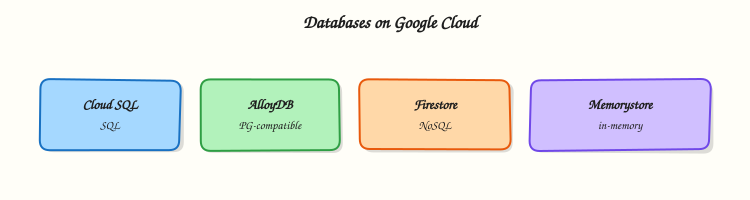

# Databases on Google Cloud

## Overview

When object storage is not enough — you need queries, transactions, and indexes — you pick a **database**. Google Cloud offers several managed options. For most Cloud and DevOps interviews, **Cloud SQL** (managed MySQL / PostgreSQL / SQL Server) is the first service to master. Then you should map **Firestore**, **Spanner**, **Bigtable**, **AlloyDB**, and **Memorystore** to the right problems.

This is **Tutorial 1** in **Module 6: Databases** of the REBASH Academy **Google Cloud for Cloud & DevOps Engineers** series. The lab creates the smallest practical Cloud SQL instance, proves a SQL connection, and deletes it. If billing or quota blocks Cloud SQL, use the documented fallback so you still finish with evidence.

!!! warning "Cost hygiene"
    Cloud SQL is **not** a free playground. Prefer `db-f1-micro` / shared-core tiers where available, never leave instances running overnight, and run **Cleanup** even if the lab fails halfway. Creation and deletion can each take several minutes.

## Prerequisites

- [Cloud Storage module](storage-gcs-persistent-disk-and-filestore.md)
- Sandbox Owner (or Cloud SQL Admin) permissions
- Optional: `mysql` or `psql` client locally; `gcloud sql connect` also works

## Learning Objectives

By the end of this tutorial, you will be able to:

- [ ] Map Cloud SQL, Firestore, Spanner, Bigtable, AlloyDB, and Memorystore to use cases
- [ ] Create a small Cloud SQL instance (or complete the fallback path)
- [ ] Prove connectivity with a simple SQL statement
- [ ] Explain private IP vs authorised networks at interview depth
- [ ] Delete the instance and verify it is gone

## Architecture

Applications talk to a managed database endpoint. Cloud SQL runs MySQL/PostgreSQL/SQL Server with Google-managed patching and backups. Other services specialise: Firestore for document/app data, Spanner for global relational scale, Bigtable for wide-column analytics/IoT, Memorystore for Redis/Memcached caches.



## Theory

### What it is

**Cloud SQL** is managed relational database as a service. You still choose engine version, tier, storage size, and network access — Google runs the VM fleet, failover options, and backup plumbing.

### Why it matters

“Just install MySQL on a VM” fails interviews when the topic is operations: backups, patching, high availability, and private networking. DevOps engineers provision Cloud SQL with Terraform, wire IAM and secrets, and keep instances off the public internet in production.

### How it works

1. Enable the SQL Admin API.
2. Create an instance (engine + tier + region).
3. Create a database and user (or use root carefully in labs).
4. Connect via Cloud SQL Auth Proxy (preferred) or authorised networks (lab shortcut).
5. Backups / PITR settings for production; delete for labs.

### Database map (interview table)

| Service | Shape | Pick when |
|---------|-------|-----------|
| **Cloud SQL** | Managed MySQL / PostgreSQL / SQL Server | Familiar relational apps, modest scale |
| **AlloyDB** | PostgreSQL-compatible, performance-focused | Heavier PG workloads on Google Cloud |
| **Spanner** | Globally distributed relational | Horizontal scale + strong consistency across regions |
| **Firestore** | Document / realtime app data | Mobile/web app state, flexible documents |
| **Bigtable** | Wide-column | Large analytical/time-series/IoT keys |
| **Memorystore** | Redis / Memcached | Cache and session speed layers |

### Networking choices

| Pattern | Lab? | Production note |
|---------|------|-----------------|
| Authorised networks + public IP | OK for short lab | Avoid long-lived `0.0.0.0/0` |
| Cloud SQL Auth Proxy | Better | Common with GKE/Cloud Run |
| Private IP + VPC peering / PSA | Best | Landing-zone default |

### Common pitfalls

- Leaving `db-n1-standard-*` running after class
- Public IP open to the world for months
- No automated backups in production
- Using Cloud SQL when the workload is a cache (use Memorystore)
- Forgetting deletion takes time — students create a second instance “because the first is stuck”

## Hands-on Lab

### Objective

Enable Cloud SQL, create a tiny PostgreSQL (or MySQL) instance, prove `SELECT 1`, then delete the instance. If create is blocked, complete Task 3b fallback with API + tiers + desired-state evidence.

### Prerequisites

| Tool | Notes |
|------|--------|
| Billing linked | Module 1 |
| Patience | Create/delete can take 5–15 minutes |

### Lab environment

``` {.bash .ra-terminal title="Terminal"}
mkdir -p ~/rebash-gcp/module-06 && cd ~/rebash-gcp/module-06
export PROJECT_ID="${PROJECT_ID:-$(gcloud config get-value project)}"
export REGION="${REGION:-europe-west2}"
export INSTANCE="rebash-m06-pg"
gcloud config set project "$PROJECT_ID"
gcloud services enable sqladmin.googleapis.com --project="$PROJECT_ID"
```

### Real-world scenario

A team wants a disposable PostgreSQL for an integration test weekend. You must show: instance exists, SQL works, network is intentionally constrained for the lab, and the instance is destroyed before Monday’s bill lands.

### Step-by-step tasks

#### Task 1 – Create a small Cloud SQL PostgreSQL instance

Set a lab password in your shell (do not commit it):

``` {.bash .ra-terminal title="Terminal"}
cd ~/rebash-gcp/module-06
export DB_PASSWORD='RebashLab_ChangeMe_06'
# Prefer generating your own: openssl rand -base64 18
gcloud sql instances create "$INSTANCE" \
  --database-version=POSTGRES_15 \
  --tier=db-f1-micro \
  --region="$REGION" \
  --root-password="$DB_PASSWORD" \
  --storage-size=10GB \
  --storage-auto-increase \
  --assign-ip \
  --authorized-networks=0.0.0.0/0 \
  --format=json | tee instance-create.json
```

!!! warning "Authorised networks"
    `0.0.0.0/0` is **lab-only** so `gcloud sql connect` works quickly. Production uses private IP + Auth Proxy and never leaves world-open SQL.

!!! example "Expected output"
    Operation completes; `gcloud sql instances describe` shows `RUNNABLE`.

If `db-f1-micro` is unavailable in your region/engine, retry with `--tier=db-g1-small` **only if you accept higher cost**, or jump to Task 3b.

#### Task 2 – Prove SQL connectivity

``` {.bash .ra-terminal title="Terminal"}
cd ~/rebash-gcp/module-06
gcloud sql instances describe "$INSTANCE" --format=json | tee instance.json
grep -q RUNNABLE instance.json
# Interactive-friendly connect (enter DB_PASSWORD when prompted)
printf 'SELECT 1 AS rebash_ok;\n\\q\n' | \
  gcloud sql connect "$INSTANCE" --user=postgres --quiet \
  2>&1 | tee sql-proof.txt
grep -Eq 'rebash_ok| 1' sql-proof.txt
echo "cloud sql proof OK" | tee evidence.txt
```

!!! tip "If connect hangs"
    Confirm instance is `RUNNABLE`, authorised networks include your client, and you are not blocked by corporate egress. Alternative: install [Cloud SQL Auth Proxy](https://cloud.google.com/sql/docs/postgres/sql-proxy) and connect via `127.0.0.1`.

#### Task 3b – Fallback if Cloud SQL create is denied

``` {.bash .ra-terminal title="Terminal"}
cd ~/rebash-gcp/module-06
gcloud services list --enabled --filter='name:sqladmin' --format=json | tee sqladmin-enabled.json
gcloud sql tiers list --format="table(tier,region,RAM,DiskQuota)" | tee tiers.txt
# Create desired-state notes in your editor (no heredoc):
# instance-intent.txt — engine, tier, region, private IP plan, backup flag
test -s instance-intent.txt
printf '%s\n' '{"fallback":"cloud-sql-create-blocked","project":"'"$PROJECT_ID"'"}' \
  | tee evidence.txt
```

Also answer in `instance-intent.txt`: which service you would pick instead for a mobile app document store (**Firestore**) and for a global relational ledger (**Spanner**).

### Validation steps

- [ ] Primary: instance `RUNNABLE` and `sql-proof.txt` shows success **or** fallback evidence complete
- [ ] You know why `0.0.0.0/0` is unacceptable in production
- [ ] Cleanup plan understood before you walk away

### Common errors and fixes

| Error you see | Plain meaning | What to do |
|---------------|---------------|------------|
| InvalidTier / not available | Tier/region combo missing | Try another region or Task 3b |
| Quota exceeded | Too many CPUs/instances | Delete leftovers; Request quota |
| Password auth failed | Wrong user/password | Reset with `gcloud sql users set-password` |
| Operation still running | Normal for SQL | `gcloud sql operations list` and wait |

### Challenge exercise

Write `db-choice.txt` mapping five app types to one Google Cloud database each (e-commerce orders, session cache, IoT telemetry, mobile chat docs, multi-region banking ledger).

``` {.bash .ra-terminal title="Terminal"}
cd ~/rebash-gcp/module-06
test -s db-choice.txt
wc -l db-choice.txt | tee challenge.txt
```

### Learning outcomes

- You can provision and destroy Cloud SQL (or document the blocker professionally)
- You can defend database choices beyond “just Postgres”
- You treat SQL network exposure as a security decision

### Cleanup

``` {.bash .ra-terminal title="Terminal"}
cd ~/rebash-gcp/module-06
export INSTANCE="${INSTANCE:-rebash-m06-pg}"
gcloud sql instances delete "$INSTANCE" --quiet 2>/dev/null || true
# Confirm gone (may take several minutes)
gcloud sql instances list --format="table(name,region,status)" | tee instances-after.txt || true
rm -f instance-create.json instance.json sql-proof.txt evidence.txt challenge.txt
unset DB_PASSWORD
```

## Validation

- [ ] Lab folder `~/rebash-gcp/module-06` used
- [ ] No `rebash-m06-*` instance left (or deletion in progress noted)
- [ ] Password not written into git

## Code Walkthrough

1. **Smallest tier first** — labs should not default to production shapes.
2. **Authorised networks as a conscious risk** — call it out, then remove via delete.
3. **`SELECT 1` proof** — connectivity before schema work.
4. **Fallback path** — operators document blockers; they do not fake success.
5. **Delete is part of the change** — Cloud SQL leftovers dominate student bills.

## Security Considerations

- Prefer Auth Proxy / private IP; rotate passwords; use Secret Manager in real apps.
- Least-privilege database users (not only `postgres` / `root`).
- Encrypt at rest is default; manage SSL/TLS for clients in production.
- Automated backups + tested restore beats “we have snapshots somewhere”.

## Common Mistakes

!!! warning "Cloud SQL is serverless like Cloud Run"
    It is managed, but you still choose capacity and pay for the instance hours.

!!! warning "Spanner for every relational app"
    Spanner shines at global scale and specific patterns; Cloud SQL is the default for ordinary apps.

!!! warning "Open SQL to the world for convenience"
    That convenience is how data gets stolen. Labs delete the instance the same day.

## Best Practices

- Private IP + Auth Proxy for app runtimes
- Separate instances per environment
- Backup retention and restore drills
- Monitor CPU, storage, connections
- IaC for instance settings (Module 12)

## Troubleshooting

| Symptom | Likely cause | Fix |
|---------|--------------|-----|
| Create stuck | Regional capacity / quota | Check operations; try region; fallback |
| Connect timeout | Network / auth networks | Verify public IP and client egress |
| Out of disk | Storage full | Resize storage; enable auto increase carefully |

## Summary

**Cloud SQL** is the relational workhorse; the other Google Cloud databases exist for document, global relational, wide-column, and cache problems. This lab proved a tiny instance (or a professional fallback) and emphasised cleanup. Next: **containers** — Artifact Registry and GKE.

## Interview Questions

**1. What is Cloud SQL?**

??? success "Reveal answer"
    Cloud SQL is Google Cloud’s managed relational database service for MySQL, PostgreSQL, and SQL Server. Google manages the underlying infrastructure, patching, and optional high availability while you manage schema, users, and access patterns.

**2. Cloud SQL vs installing Postgres on a VM?**

??? success "Reveal answer"
    Self-managed VMs give full control but you own patching, backups, failover, and disk growth. Cloud SQL trades some control for managed operations. Interviews expect you to know which responsibilities move to Google.

**3. When would you choose Spanner over Cloud SQL?**

??? success "Reveal answer"
    When you need horizontal scale and strong consistency across regions for relational data, and you accept Spanner’s data model and cost model. Ordinary single-region apps usually start on Cloud SQL.

**4. What is Memorystore for?**

??? success "Reveal answer"
    Managed Redis or Memcached for low-latency caching and ephemeral data — not the system of record for durable business transactions.

**5. Why is `0.0.0.0/0` on authorised networks a bad production setting?**

??? success "Reveal answer"
    It allows connection attempts from the entire internet to your database port. Attackers scan for open databases. Prefer private IP and Auth Proxy, and restrict sources tightly if public IP is unavoidable.

**6. What is the Cloud SQL Auth Proxy?**

??? success "Reveal answer"
    A client-side proxy that creates a secure connection to Cloud SQL using IAM and Google encryption, commonly used from GKE, Compute Engine, or laptops without broad authorised-network exposure.

**7. Firestore vs Cloud SQL — how do you choose?**

??? success "Reveal answer"
    Firestore fits document-oriented application data and realtime sync patterns. Cloud SQL fits relational schemas, joins, and existing SQL tooling. Choose based on data shape and access patterns, not popularity.

**8. What do you check before leaving a Cloud SQL lab?**

??? success "Reveal answer"
    Instance deleted (or deletion in progress), no orphan replicas, passwords cleared from shell history when possible, and `gcloud sql instances list` no longer shows the lab name.

## Related Tutorials

- Previous: [Cloud Storage, Persistent Disk, and Filestore](storage-gcs-persistent-disk-and-filestore.md)
- Next: [Containers — GKE and Artifact Registry](containers-gke-and-artifact-registry.md)
- Parallel: [Databases on AWS](../aws/databases-on-aws.md)

## References

- [Cloud SQL overview](https://cloud.google.com/sql/docs)
- [Cloud SQL Auth Proxy](https://cloud.google.com/sql/docs/postgres/sql-proxy)
- [Database services on Google Cloud](https://cloud.google.com/products/databases)
- [Firestore](https://cloud.google.com/firestore/docs)
- [Spanner](https://cloud.google.com/spanner/docs)
