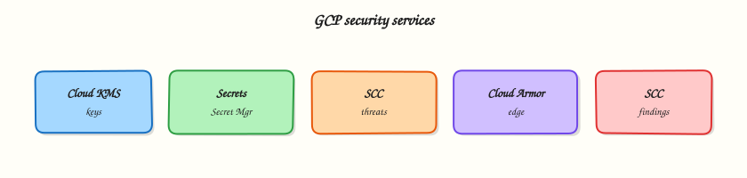

# Google Cloud Security Services

## Overview

IAM (Module 2) answers who can call APIs. This module covers the services that protect **secrets**, **keys**, and **guardrails**: **Secret Manager**, **Cloud KMS**, **Security Command Center** (awareness), **Binary Authorization** (awareness), and **organisation policies**.

This is **Tutorial 1** in **Module 11: Security** of the REBASH Academy **Google Cloud for Cloud & DevOps Engineers** series. The lab stores a secret, grants a service account access, proves read via impersonation, removes access (deny), restores it, and deletes the secret.

!!! warning "Safety"
    Never put real production passwords in this lab. Never commit secret payloads or key files to Git. Delete lab secrets in Cleanup.

## Prerequisites

- [Monitoring and Observability](monitoring-and-observability-on-gcp.md)
- [IAM](iam-identity-access-and-resource-hierarchy.md) — impersonation comfort
- Permission to create secrets and bind IAM on them

## Learning Objectives

By the end of this tutorial, you will be able to:

- [ ] Explain Secret Manager vs environment variables in plain English
- [ ] Create a secret version and prove authorised read
- [ ] Demonstrate deny by removing `secretAccessor` and restore access
- [ ] Describe Cloud KMS and organisation policies at interview depth
- [ ] Delete lab secrets and service accounts

## Architecture

Applications fetch secrets at runtime from **Secret Manager** using IAM. **Cloud KMS** manages encryption keys (CMEK). Organisation policies constrain what projects may create. Binary Authorization can require signed images before GKE admission.



## Theory

### What it is

**Secret Manager** stores sensitive strings (API keys, DB passwords) with versioning and IAM. **Cloud KMS** is key management for encryption. **Organisation policies** are constraints (for example “no public Cloud Storage”). **Security Command Center** centralises findings. **Binary Authorization** enforces deploy-time image trust on GKE.

### Why it matters

“Password in the GitHub Actions variable screenshot” still fails interviews and audits. Secret Manager + least-privilege accessors is the baseline story. CMEK and org policies show up in landing-zone designs.

### How it works

1. Create a secret resource.
2. Add a secret version (payload).
3. Grant `roles/secretmanager.secretAccessor` to a runtime identity.
4. Application (or `gcloud`) accesses the latest version.
5. Rotate by adding a new version; disable old versions.

### Comparisons

| Approach | Risk |
|----------|------|
| Secret in source code | Highest — forever in git history |
| Plain env var in Cloud Run UI | Better, still broad visibility |
| Secret Manager + IAM | Auditable, rotatable, least privilege |
| KMS-encrypted envelopes | When you need explicit key control |

### Common pitfalls

- Granting `secretmanager.admin` to apps
- Logging secret values
- Leaving disabled versions forever without policy
- Confusing Secret Manager with KMS (secrets vs keys)

## Hands-on Lab

### Objective

Create a Secret Manager secret, grant a lab service account accessor, prove read with impersonation, remove the binding and prove deny, restore, then delete everything.

### Prerequisites

| Tool | Notes |
|------|--------|
| Secret Manager API | Enabled in lab |
| IAM Token Creator | On the lab SA for your user |

### Lab environment

``` {.bash .ra-terminal title="Terminal"}
mkdir -p ~/rebash-gcp/module-11 && cd ~/rebash-gcp/module-11
export PROJECT_ID="${PROJECT_ID:-$(gcloud config get-value project)}"
export SECRET="rebash-m11-demo"
export SA_ID="rebash-m11-reader"
export SA_EMAIL="${SA_ID}@${PROJECT_ID}.iam.gserviceaccount.com"
gcloud config set project "$PROJECT_ID"
gcloud services enable secretmanager.googleapis.com --project="$PROJECT_ID"
```

### Real-world scenario

A Cloud Run service needs a demo API token. You must show: secret stored outside the image, only the runtime SA can read it, and removing IAM breaks reads immediately — the same story as production credential hygiene.

### Step-by-step tasks

#### Task 1 – Create secret and first version

``` {.bash .ra-terminal title="Terminal"}
cd ~/rebash-gcp/module-11
printf '%s' 'rebash-m11-not-a-real-password' > secret.payload
gcloud secrets create "$SECRET" --replication-policy="automatic" --format=json | tee secret-create.json
gcloud secrets versions add "$SECRET" --data-file=secret.payload --format=json | tee version.json
shred -u secret.payload 2>/dev/null || rm -f secret.payload
gcloud secrets describe "$SECRET" --format=json | tee secret.json
```

!!! example "Expected output"
    Secret exists; version add succeeds. The payload file is removed from disk.

#### Task 2 – SA + accessor binding + prove read

``` {.bash .ra-terminal title="Terminal"}
cd ~/rebash-gcp/module-11
gcloud iam service-accounts create "$SA_ID" --display-name="M11 secret reader" 2>/dev/null || true
CALLER=$(gcloud config get-value account)
gcloud iam service-accounts add-iam-policy-binding "$SA_EMAIL" \
  --member="user:${CALLER}" --role="roles/iam.serviceAccountTokenCreator" --quiet
gcloud secrets add-iam-policy-binding "$SECRET" \
  --member="serviceAccount:${SA_EMAIL}" \
  --role="roles/secretmanager.secretAccessor" \
  --format=json | tee bind.json
gcloud secrets versions access latest --secret="$SECRET" \
  --impersonate-service-account="$SA_EMAIL" | tee allow-read.txt
grep -q "rebash-m11-not-a-real-password" allow-read.txt
```

#### Task 3 – Deny / restore

``` {.bash .ra-terminal title="Terminal"}
cd ~/rebash-gcp/module-11
gcloud secrets remove-iam-policy-binding "$SECRET" \
  --member="serviceAccount:${SA_EMAIL}" \
  --role="roles/secretmanager.secretAccessor" --quiet
set +e
gcloud secrets versions access latest --secret="$SECRET" \
  --impersonate-service-account="$SA_EMAIL" 2>&1 | tee deny-read.txt
DENY_RC=$?
set -e
test "$DENY_RC" -ne 0
grep -Ei 'PERMISSION_DENIED|denied|403' deny-read.txt
gcloud secrets add-iam-policy-binding "$SECRET" \
  --member="serviceAccount:${SA_EMAIL}" \
  --role="roles/secretmanager.secretAccessor" --quiet
gcloud secrets versions access latest --secret="$SECRET" \
  --impersonate-service-account="$SA_EMAIL" | tee restore-read.txt
grep -q "rebash-m11-not-a-real-password" restore-read.txt
echo "secret manager break/fix OK" | tee evidence.txt
```

#### Task 4 – KMS / org policy notes

Create `security-map.txt` in your editor (six+ lines): when you would use Cloud KMS CMEK, what an organisation policy might block (public buckets / external IPs), and what Binary Authorization checks at deploy time.

``` {.bash .ra-terminal title="Terminal"}
cd ~/rebash-gcp/module-11
test -s security-map.txt
wc -l security-map.txt | tee challenge.txt
```

### Validation steps

- [ ] Secret version created
- [ ] Impersonated allow → deny → restore evidence files
- [ ] Payload file not left on disk
- [ ] `security-map.txt` present

### Common errors and fixes

| Error you see | Plain meaning | What to do |
|---------------|---------------|------------|
| API not enabled | Secret Manager off | Enable `secretmanager.googleapis.com` |
| Impersonation denied | Missing Token Creator | Re-bind on SA |
| Access denied after grant | Propagation delay | Wait 30s; retry |
| `shred` missing | macOS | `rm -f secret.payload` is fine for lab |

### Challenge exercise

List three places secrets commonly leak (CI logs, container env dumps, chat apps) and one control for each in `leak-controls.txt`.

``` {.bash .ra-terminal title="Terminal"}
cd ~/rebash-gcp/module-11
test -s leak-controls.txt
```

### Learning outcomes

- You operated Secret Manager with least-privilege IAM
- You can explain KMS vs secrets vs org policies
- You practised deny/restore for credentials — interview gold

### Cleanup

``` {.bash .ra-terminal title="Terminal"}
cd ~/rebash-gcp/module-11
export PROJECT_ID="${PROJECT_ID:-$(gcloud config get-value project)}"
export SECRET="rebash-m11-demo"
export SA_EMAIL="rebash-m11-reader@${PROJECT_ID}.iam.gserviceaccount.com"
gcloud secrets delete "$SECRET" --quiet 2>/dev/null || true
gcloud iam service-accounts delete "$SA_EMAIL" --quiet 2>/dev/null || true
rm -f secret-create.json version.json secret.json bind.json allow-read.txt \
  deny-read.txt restore-read.txt evidence.txt challenge.txt secret.payload
```

## Validation

- [ ] Lab folder `~/rebash-gcp/module-11` used
- [ ] Secret deleted
- [ ] No secret values committed to git

## Code Walkthrough

1. **Secret then version** — resource vs payload.
2. **Accessor role only** — apps should not administer secrets.
3. **Impersonation** — test runtime identity without keys.
4. **Deny/restore** — proves IAM is the control plane.
5. **Delete secret** — versions go with it; confirm with list.

## Security Considerations

- Prefer Secret Manager mounts/env from Cloud Run/GKE integrations over custom curl glue when available.
- Audit `secretmanager.versions.access` in logs for unusual readers.
- Separate secrets per environment.
- Combine with VPC Service Controls in high-sensitivity orgs (advanced).

## Common Mistakes

!!! warning "Base64 in a ConfigMap is encryption"
    It is encoding, not security. Use Secret Manager or Kubernetes secrets with careful IAM — still prefer GSM for cloud credentials.

!!! warning "One SA can read all secrets"
    Scope bindings per secret or per prefix via careful design.

!!! warning "KMS deletes are casual"
    Key destruction is catastrophic by design. Labs should rarely create irreversible key states.

## Best Practices

- Rotate on a schedule and on incident
- Least privilege accessors
- No secrets in images or git
- Org policies for public exposure baselines
- SCC Premium/Standard findings triaged like bugs

## Troubleshooting

| Symptom | Likely cause | Fix |
|---------|--------------|-----|
| Version access fails for user but works for SA | Wrong identity tested | Match the runtime SA |
| Cannot delete secret | Replication / IAM | Need secretmanager.admin; check links |
| Replication policy errors | Org constraint | Use automatic or allowed locations |

## Summary

**Secret Manager** keeps credentials out of code; IAM decides who can read versions. **KMS**, **org policies**, and **Binary Authorization** complete the broader security story. Next: **Infrastructure as Code** with Terraform on Google Cloud.

## Interview Questions

**1. What is Secret Manager?**

??? success "Reveal answer"
    A managed service to store sensitive strings as versioned secrets with IAM controls, so applications fetch credentials at runtime instead of baking them into code or images.

**2. Secret Manager vs Cloud KMS?**

??? success "Reveal answer"
    Secret Manager stores secret payloads. Cloud KMS manages cryptographic keys used to encrypt data (including optionally CMEK for other services). Related, but not the same API.

**3. Why not put DB passwords in git?**

??? success "Reveal answer"
    Git history retains secrets even after deletion from HEAD, and clones spread them. Use Secret Manager (or a vault) and inject at runtime.

**4. Which role should a Cloud Run runtime use to read one secret?**

??? success "Reveal answer"
    Typically `roles/secretmanager.secretAccessor` on that secret (or a carefully scoped custom role), not project-wide admin roles.

**5. What is an organisation policy example?**

??? success "Reveal answer"
    A constraint such as preventing public IP on Cloud SQL or enforcing public access prevention on Cloud Storage across the organisation.

**6. What does Binary Authorization do?**

??? success "Reveal answer"
    It can require that container images are signed/attested before GKE (or supported platforms) will run them, reducing unsigned image risk.

**7. How do you rotate a secret in Secret Manager?**

??? success "Reveal answer"
    Add a new secret version with the new payload, point applications at latest (or a specific version), then disable/destroy old versions after cutover.

**8. How did this lab prove least privilege?**

??? success "Reveal answer"
    The lab SA could read when granted `secretAccessor`, failed with permission denied when the binding was removed, and succeeded again after restore — with evidence files.

## Related Tutorials

- Previous: [Monitoring and Observability on Google Cloud](monitoring-and-observability-on-gcp.md)
- Next: [Infrastructure as Code on Google Cloud](infrastructure-as-code-on-gcp.md)
- [IAM](iam-identity-access-and-resource-hierarchy.md)
- Parallel: [AWS security services](../aws/aws-security-services.md)

## References

- [Secret Manager](https://cloud.google.com/secret-manager/docs)
- [Cloud KMS](https://cloud.google.com/kms/docs)
- [Organisation policy](https://cloud.google.com/resource-manager/docs/organization-policy/overview)
- [Binary Authorization](https://cloud.google.com/binary-authorization/docs)
- [Security Command Center](https://cloud.google.com/security-command-center/docs)
