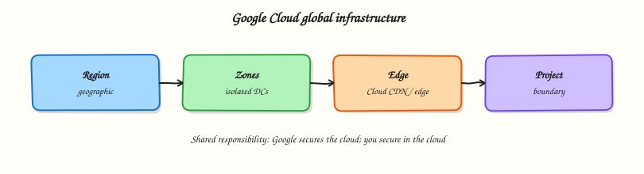

# Google Cloud Fundamentals and Global Infrastructure

## Overview

Google Cloud is a set of rented building blocks — compute, storage, networking, data, and managed services — that run in Google’s data centres. You create a **project**, choose a **region** (and usually a **zone**), and pay mainly for what you use.

This module answers four practical questions before you launch anything expensive:

1. Where your stuff runs in the world (**regions** and **zones**)
2. How resources are organised (**organisation → folder → project**)
3. How you talk to Google Cloud from a terminal (**`gcloud`**)
4. How you stop a student lab from creating a surprise bill (**budget alert**)

This is **Tutorial 1** in **Module 1: Google Cloud Fundamentals** of the REBASH Academy **Google Cloud for Cloud & DevOps Engineers** series — practical Google Cloud for Cloud and DevOps work.

!!! warning "Cost hygiene (read this before any lab)"
    Google Cloud is not a free playground by default. Prefer Free Trial credits and Always Free limits. Create a budget alert in this module **before** you launch virtual machines later. Always run **Cleanup** at the end of each lab.

## Prerequisites

- [Linux](../linux/index.md) — comfortable with a terminal
- [Networking](../networking/index.md) — IP address and CIDR at a basic level
- [Git](../git/index.md) — you will not commit secrets
- A Google Cloud account you control (Free Trial is fine)
- Google Cloud SDK / `gcloud` installed ([install guide](https://cloud.google.com/sdk/docs/install))

## Learning Objectives

By the end of this tutorial, you will be able to:

- [ ] Explain region vs zone with a simple building analogy
- [ ] Describe organisation → folder → project → billing account in plain English
- [ ] Authenticate with `gcloud` and show the active project and account
- [ ] List regions and zones for your project with the CLI
- [ ] Create a small budget alert (or a documented billing fallback)
- [ ] State shared responsibility for Google Cloud with one example

## Architecture

Google Cloud runs in geographic **regions**. Inside a region, **zones** are isolated failure domains (separate buildings with independent power and networking). Your resources live in a **project**. Billing attaches to a **billing account**. You manage everything with the Console, Cloud Shell, or `gcloud`.



## Theory

### What it is

**Google Cloud** (often still called GCP) is Google’s public cloud. You rent services over the internet instead of only buying physical servers. Common services you will meet in this course: Compute Engine (virtual machines), Cloud Storage (object files), Virtual Private Cloud (VPC) networking, Google Kubernetes Engine (GKE), and Cloud Run.

### Why it matters

Cloud and DevOps interviews expect you to place workloads correctly (region for latency and data residency; multi-zone for availability), name the right control plane (`gcloud` / Console), and prove you will not burn money. Day-one engineers who skip project/billing hygiene create outages and invoices.

### How it works

1. You sign in as a Google identity (user or service account later).
2. You select a **project** — the hard boundary for APIs, quotas, and IAM.
3. You enable APIs (Compute, Billing Budgets, and so on).
4. You create resources in a region/zone (or multi-region for some services).
5. Usage meters against the **billing account** linked to the project.

### Regions and zones

**Analogy:** A **region** is a city. A **zone** is a separate building in that city with its own power and networking. If one building has a power cut, another building can keep working — *if* you designed your app to use both.

| Term | Meaning | Example |
|------|---------|---------|
| **Region** | Geographic area with multiple zones | `europe-west2`, `asia-south1` |
| **Zone** | Isolated location inside a region | `europe-west2-a`, `asia-south1-b` |
| **Multi-region** | Wider placement used by some storage/data services | `eu`, `us` |

**Why interviews ask this:** “Is one VM in one zone highly available?” → **No.** High availability usually means at least two zones (and a design that can fail over).

**Practical tip:** Pick **one home region** for all labs (for example `europe-west2` or `asia-south1`) and stick to it. Beginners often create a VM in `us-central1`, then open the Console filtered to another region and panic because “Google deleted my instance”. It is still there — wrong filter.

### Projects, organisations, folders, billing

| Concept | Plain meaning |
|---------|----------------|
| **Organisation** | Company root in Resource Manager (often tied to a Cloud Identity / Workspace domain) |
| **Folder** | Grouping for teams or environments under the organisation |
| **Project** | Where you enable APIs and create almost all resources |
| **Billing account** | Who pays; linked to one or more projects |

Personal Free Trial accounts often look like: one billing account + one (or few) projects, with no organisation. That is fine for this course. Production companies almost always use organisations and folders.

### Shared responsibility

Google secures the physical buildings, hypervisors, and the managed service control planes. **You** secure identities, firewall rules, data classification, encryption choices you control, and application configuration.

| Example | Google | You |
|---------|--------|-----|
| Compute Engine VM | Host hardware + hypervisor | Guest OS patches, SSH keys, firewall tags |
| Cloud Storage | Durable object service | Public access, IAM, encryption settings |
| Credentials | Provides IAM and Secret Manager | No keys in GitHub, least privilege |

### `gcloud` and Cloud Shell

**`gcloud`** is the primary CLI. **Cloud Shell** is a browser terminal with `gcloud` already authenticated to your user — useful when your laptop SDK is broken. Professionals still install the SDK locally for real work.

Key habit — run this before every lab and every incident change:

``` {.bash .ra-terminal title="Terminal"}
gcloud config list
gcloud auth list
```

### Common pitfalls

- Treating Free Trial as “everything is free forever”
- Creating resources in the wrong project
- Console region filter ≠ CLI default region/zone
- Leaving billing unlinked, then wondering why APIs fail
- Skipping budget alerts before Compute Engine labs

## Hands-on Lab

### Objective

Prove you can authenticate, set a project and home region/zone, list where Google Cloud can place resources, and create a real budget alert — the same hygiene a good junior engineer shows in week one.

### Prerequisites

| Tool | Notes |
|------|--------|
| Google Cloud project | Free Trial fine; billing must be linked |
| `gcloud` SDK | `gcloud --version` works |
| Billing Admin (or Owner) | Needed to create budgets on the billing account |

### Lab environment

``` {.bash .ra-terminal title="Terminal"}
mkdir -p ~/rebash-gcp/module-01 && cd ~/rebash-gcp/module-01
# Set these to YOUR values once, then reuse in later modules
export PROJECT_ID="${PROJECT_ID:-YOUR_PROJECT_ID}"
export REGION="${REGION:-europe-west2}"
export ZONE="${ZONE:-europe-west2-a}"
gcloud config set project "$PROJECT_ID"
gcloud config set compute/region "$REGION"
gcloud config set compute/zone "$ZONE"
```

!!! tip "Choose your region"
    If you live in India, `asia-south1` is a common lab choice. If in the UK/EU, `europe-west2` is common. Keep `REGION` and `ZONE` consistent for the whole course.

### Real-world scenario

Your mentor will not let you launch servers until you can show: (1) which identity and project the CLI uses, (2) which region/zone you work in, and (3) that a budget alert will fire if spend crosses a small limit. That is this lab.

### Step-by-step tasks

#### Task 1 – Who am I, and where can I run resources?

``` {.bash .ra-terminal title="Terminal"}
cd ~/rebash-gcp/module-01
gcloud auth list --format=json | tee auth.json
gcloud config list --format=json | tee config.json
test -s auth.json
grep -q account auth.json
gcloud projects describe "$PROJECT_ID" --format=json | tee project.json
gcloud compute regions list --format="table(name,status,zones)" | tee regions.txt
gcloud compute zones list --filter="region:($REGION)" \
  --format="table(name,status)" | tee zones.txt
```

!!! example "Expected output"
    `auth.json` shows an active account. `project.json` includes your `projectId`. `zones.txt` lists at least two zones for your home region (for example `…-a` and `…-b`) in `UP` state.

**What to notice:** If `gcloud` says you are not authenticated, run `gcloud auth login` (and for local apps later, `gcloud auth application-default login`) before anything else.

#### Task 2 – Confirm billing is linked

``` {.bash .ra-terminal title="Terminal"}
cd ~/rebash-gcp/module-01
gcloud billing projects describe "$PROJECT_ID" --format=json | tee billing-link.json
BILLING_ACCOUNT=$(gcloud billing projects describe "$PROJECT_ID" \
  --format='value(billingAccountName)' | sed 's#.*/##')
echo "$BILLING_ACCOUNT" | tee billing-account.txt
test -n "$BILLING_ACCOUNT"
test "$BILLING_ACCOUNT" != ""
```

!!! example "Expected output"
    `billing-link.json` shows `billingEnabled: true` (or equivalent) and `billing-account.txt` holds a billing account ID such as `0X0X0X-0X0X0X-0X0X0X`.

#### Task 3 – Create a small monthly budget alert

Enable the Billing Budgets API, then create a £/$5-style budget filtered to this project:

``` {.bash .ra-terminal title="Terminal"}
cd ~/rebash-gcp/module-01
gcloud services enable billingbudgets.googleapis.com --project="$PROJECT_ID"
BILLING_ACCOUNT=$(cat billing-account.txt)
gcloud billing budgets create \
  --billing-account="$BILLING_ACCOUNT" \
  --display-name="rebash-m01-monthly" \
  --budget-amount=5USD \
  --threshold-rule=percent=0.5 \
  --threshold-rule=percent=0.9 \
  --threshold-rule=percent=1.0 \
  --filter-projects="projects/${PROJECT_ID}" \
  --format=json | tee create-budget.json
gcloud billing budgets list --billing-account="$BILLING_ACCOUNT" \
  --format="table(displayName,amount.specifiedAmount)" | tee budgets.txt
```

!!! example "Expected output"
    `create-budget.json` is non-empty. `budgets.txt` includes `rebash-m01-monthly`. Billing Account Admins receive threshold emails by default unless disabled.

#### Task 3b – Fallback if Budgets is denied

Some student or organisation accounts block budget create. Prove billing hygiene another way and keep the evidence:

``` {.bash .ra-terminal title="Terminal"}
cd ~/rebash-gcp/module-01
gcloud billing accounts list --format=json | tee billing-accounts.json
gcloud billing projects describe "$PROJECT_ID" --format=json | tee billing-link.json
# In Console: Billing → Budgets & alerts → create a 5 USD budget for this project
# Then list again if your mentor grants permission later:
gcloud billing budgets list --billing-account="$(cat billing-account.txt)" \
  --format=json 2>/dev/null | tee budgets-fallback.json || \
  printf '%s\n' '{"fallback":"console-budget-or-mentor-required","project":"'"$PROJECT_ID"'"}' \
    | tee budgets-fallback.json
test -s budgets-fallback.json
```

### Validation steps

- [ ] You can explain project / region / zone without looking at notes
- [ ] `auth.json` matches the account you expect
- [ ] You listed zones for your home region
- [ ] Billing is linked to the project
- [ ] A budget named `rebash-m01-monthly` exists (or fallback evidence is saved)

### Common errors and fixes

| Error you see | Plain meaning | What to do |
|---------------|---------------|------------|
| Not authenticated / Reauthentication required | CLI not logged in | `gcloud auth login` |
| Permission denied on budgets | Missing Billing Admin | Use Task 3b or ask mentor |
| API not enabled | Service disabled on project | `gcloud services enable billingbudgets.googleapis.com` |
| Empty zones list | Wrong region variable | `echo $REGION` and set compute/region |
| Billing disabled | Project not linked | Link a billing account in Console |

### Challenge exercise

Write `region-choice.txt` with five short lines: which region you chose and why (latency, data residency, or mentor guidance). Use your editor — do not use a shell heredoc.

``` {.bash .ra-terminal title="Terminal"}
cd ~/rebash-gcp/module-01
test -s region-choice.txt
wc -l region-choice.txt | tee challenge.txt
```

### Learning outcomes

- You used the same identity/project checks professionals use in outages
- You can draw region vs zone on paper
- You created a real cost safety net (or documented the fallback)
- You pinned `PROJECT_ID`, `REGION`, and `ZONE` for later modules

### Cleanup

``` {.bash .ra-terminal title="Terminal"}
cd ~/rebash-gcp/module-01
BILLING_ACCOUNT=$(cat billing-account.txt 2>/dev/null || true)
if [[ -n "${BILLING_ACCOUNT:-}" ]]; then
  BUDGET_NAME=$(gcloud billing budgets list --billing-account="$BILLING_ACCOUNT" \
    --filter='displayName:rebash-m01-monthly' --format='value(name)' | head -n1)
  if [[ -n "${BUDGET_NAME:-}" ]]; then
    gcloud billing budgets delete "$BUDGET_NAME" --billing-account="$BILLING_ACCOUNT" --quiet || true
  fi
fi
rm -f auth.json config.json project.json regions.txt zones.txt \
  billing-link.json create-budget.json budgets.txt budgets-fallback.json \
  billing-accounts.json challenge.txt
# Keep billing-account.txt and region-choice.txt for revision if you want
```

!!! tip "Optional: keep the budget"
    Many students keep `rebash-m01-monthly` for the rest of the course. That is fine — skip delete in that case.

## Validation

- [ ] Lab folder `~/rebash-gcp/module-01` used
- [ ] You can teach region vs zone to a classmate in two minutes
- [ ] Budget created (and deleted, or kept on purpose)
- [ ] No service-account keys committed to Git

## Code Walkthrough

1. **`gcloud auth list` + `config list` first** — stops “wrong project” mistakes before they cost money.
2. **Pin `REGION` / `ZONE`** — one pair prevents Console/CLI confusion.
3. **Budget before Compute Engine** — juniors who care about cost get trusted faster.
4. **Billing link check** — many “API failed” errors are really “no billing”.
5. **Cleanup is part of the lab** — leaving resources running is a real junior failure mode.

## Security Considerations

- Prefer organisation login / 2-Step Verification on the Google account.
- Do not download service-account JSON keys for daily labs unless a module requires it — prefer user ADC or Workload Identity later.
- Treat `~/.config/gcloud/` like a credentials directory.
- Never paste access tokens into GitHub, chat, or resume PDFs.

## Common Mistakes

!!! warning "One zone = highly available"
    One virtual machine in one building is not highly available. Say “single point of failure” and propose a second zone.

!!! warning "Free Trial means I cannot get a bill"
    Credits and Always Free have limits. Budgets exist because overages happen to students.

!!! warning "Project ID vs project name vs project number"
    Scripts need the **project ID**. The pretty name is for humans. The number appears in some resource names.

## Best Practices

- One documented home region for learning
- Enable only the APIs you need
- Budget + labels + cleanup habit from week one
- Prefer CLI evidence files (`auth.json`, `project.json`) when you practise explaining incidents
- Read Google’s shared responsibility / security foundations pages once after this lab

## Troubleshooting

| Symptom | Likely cause | Fix |
|---------|--------------|-----|
| CLI works, Console empty | Console project/region filter differs | Match project and region |
| `PERMISSION_DENIED` on compute list | Compute API off or IAM missing | Enable `compute.googleapis.com`; need Viewer+ |
| Budget create denied | Not Billing Admin | Task 3b or mentor grant |
| Zone list shorter than a blog post | Normal — regions differ | Design for the region you use |

## Summary

Google Cloud is rented cloud building blocks inside a **project** and **region**. **Zones** are separate buildings for reliability. **Shared responsibility** means Google secures the platform and you secure how you use it. The habit pair **`gcloud config list`** + a **budget alert** is your first professional baseline. Next you will learn **who is allowed to do what** — IAM.

## Interview Questions

**1. What is Google Cloud, in simple words?**

??? success "Reveal answer"
    Google Cloud is a public cloud platform where companies rent computing, storage, networking, and managed services over the internet instead of only owning physical servers. You work inside a project, choose regions and zones, and pay mainly based on usage.

**2. What is the difference between a region and a zone?**

??? success "Reveal answer"
    A region is a geographic area (for example London or Mumbai). A zone is an isolated location inside that region — think separate data-centre buildings with independent power and networking. You choose a region for latency and data residency; you use multiple zones for higher availability.

**3. Is one Compute Engine VM in one zone “highly available”? Why or why not?**

??? success "Reveal answer"
    No. If that zone has a serious failure, your only VM can go down. High availability designs place capacity in at least two zones (and often use a load balancer). Interviewers want you to separate “it is running on Google Cloud” from “it survives a zone failure”.

**4. Explain organisation, folder, project, and billing account.**

??? success "Reveal answer"
    The organisation is the company root in Resource Manager. Folders group projects (teams or environments). Projects are where APIs and resources live. A billing account is who pays and can be linked to one or more projects. Personal labs may only show a project plus billing account.

**5. Why might someone “lose” a resource in the Console?**

??? success "Reveal answer"
    The Console has project and region filters. Resources created in `asia-south1` do not appear when the Console is set to `europe-west2`. Check the project picker and region, then confirm with `gcloud` using your pinned `PROJECT_ID` and `REGION`.

**6. What do `gcloud auth list` and `gcloud config list` tell you?**

??? success "Reveal answer"
    `auth list` shows which Google accounts the SDK knows and which is active. `config list` shows the active project and defaults such as compute region/zone. Use both at the start of every lab and during incidents before you change anything.

**7. Why should a student create a budget alert before launching VMs?**

??? success "Reveal answer"
    Labs can leave billable resources running (VMs, load balancers, Cloud SQL). A small budget emails billing admins when spend crosses thresholds so a learning mistake does not become a large invoice. It also shows interviewers you think about cost.

**8. Give one shared-responsibility example on Google Cloud.**

??? success "Reveal answer"
    For Compute Engine, Google secures the physical host and hypervisor; you patch the guest operating system, manage SSH access, and configure VPC firewall rules. For Cloud Storage, Google provides the durable service; you decide IAM, public access, and encryption settings you control.

## Related Tutorials

- Next: [IAM, Identity Access, and Resource Hierarchy](iam-identity-access-and-resource-hierarchy.md)
- Parallel track: [AWS Fundamentals](../aws/aws-fundamentals-and-global-infrastructure.md)
- Later in this course: Cost Optimisation · Troubleshooting Google Cloud

## References

- [Google Cloud global locations](https://cloud.google.com/about/locations)
- [Resource hierarchy](https://cloud.google.com/resource-manager/docs/cloud-platform-resource-hierarchy)
- [Install the Google Cloud CLI](https://cloud.google.com/sdk/docs/install)
- [gcloud billing budgets create](https://cloud.google.com/sdk/gcloud/reference/billing/budgets/create)
- [Google Cloud Free Program](https://cloud.google.com/free)
