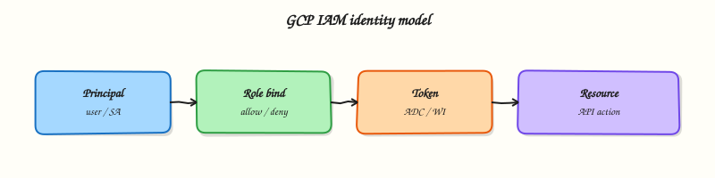

# IAM, Identity Access, and Resource Hierarchy

## Overview

After Module 1 you know *where* things run on Google Cloud. This module answers a simpler question every company cares about:

**Who is allowed to do what?**

**IAM** means **Identity and Access Management**. On Google Cloud it covers:

- **Identity** — proving who is calling (you, a service account, later a workload)
- **Access** — allowing or denying actions via **roles** bound to resources

Treat IAM like the security desk of a company office:

- Your **ID card** = principal (user or service account)
- The **door permissions** on the card = role (what you may open)
- The **building hierarchy** (organisation → folder → project) = where the badge applies
- **Deny policies** / organisation constraints (advanced) = head-office rules that override casual grants

Bad IAM is how outages happen (`PERMISSION_DENIED` when a deploy cannot read a secret) and how breaches happen (one over-privileged service account key opens everything).

This is **Tutorial 1** in **Module 2: Identity & Access Management** of the REBASH Academy **Google Cloud for Cloud & DevOps Engineers** series — practical Google Cloud for Cloud and DevOps work.

!!! warning "Safety for students"
    Prefer user login + `gcloud` for labs. If you create a service-account key, delete it in Cleanup. Never paste keys into GitHub or chat apps. Do not grant `roles/owner` to lab service accounts.

## Prerequisites

- [Google Cloud Fundamentals](google-cloud-fundamentals-and-global-infrastructure.md) — project, region, `gcloud` auth
- Permission to create service accounts and change project IAM (Owner or Project IAM Admin in a sandbox)
- You can edit a small text file in an editor

## Learning Objectives

By the end of this tutorial, you will be able to:

- [ ] Explain IAM with an office / ID-card analogy
- [ ] Tell the difference between principal, role, and binding
- [ ] Contrast basic, predefined, and custom roles in plain English
- [ ] Create a service account and grant a least-privilege role
- [ ] Demonstrate `PERMISSION_DENIED` on a forbidden action and success on an allowed action
- [ ] Explain resource hierarchy inheritance and why companies avoid user keys on VMs

## Architecture

A principal presents credentials. IAM checks role bindings on the resource (and parents in the hierarchy) and decides allow or deny. Service accounts are identities for applications. Later modules add Workload Identity so pods and pipelines need no downloaded JSON keys.



## Theory

### What it is

Google Cloud IAM answers: **who** can perform **which actions** on **which resources**. Permissions are almost never granted one-by-one in daily work — they are bundled into **roles**, and roles are **bound** to principals on a resource.

### Why it matters

Every outage story that starts with “the pipeline could not deploy” and every breach story that starts with “the key was in the repo” is an IAM story. Interviews drill least privilege, service accounts vs users, and why `roles/owner` on a shared project is a career-limiting shortcut.

### How it works

1. Identify the **principal** (`user:`, `serviceAccount:`, `group:`, and others).
2. Choose a **role** (`roles/viewer`, `roles/storage.objectViewer`, custom roles).
3. Create a **binding** on a resource (usually the project for labs).
4. When an API call arrives, IAM evaluates bindings (and deny policies if present).

### Principals, roles, bindings

| Term | Plain meaning | Example |
|------|----------------|---------|
| **Principal** | Who is asking | `user:you@example.com`, `serviceAccount:app@PROJECT.iam.gserviceaccount.com` |
| **Permission** | Atomic API action | `compute.instances.get` |
| **Role** | Bundle of permissions | `roles/compute.viewer` |
| **Binding** | Principal + role on a resource | Grant viewer on project `lab-123` |

### Role types

| Type | When to use |
|------|-------------|
| **Basic** (`viewer`, `editor`, `owner`) | Break-glass / early labs only — too wide for production apps |
| **Predefined** | Default choice — Google-maintained, service-scoped |
| **Custom** | When predefined is still too wide and you can maintain the permission list |

### Service accounts

A **service account** is an identity for software, not a human. Compute Engine VMs, Cloud Run services, and pipelines should run as service accounts with least privilege.

**Keys vs no keys:** Downloading a JSON key is easy and dangerous (keys leak). Prefer:

- Attached service account on a VM (metadata server)
- Workload Identity Federation for GitHub / AWS / on-prem
- Workload Identity for GKE

This lab creates a service account and uses **impersonation** (or `gcloud` with `--impersonate-service-account`) so you practise identity switching without leaving a long-lived key on disk when possible.

### Resource hierarchy and inheritance

Bindings on a parent apply to children unless a deny policy blocks them. That is why an organisation-level `roles/viewer` grant is powerful — and why production teams push grants down to the smallest resource that still works.

```
Organisation
└── Folder (optional)
    └── Project  ← most student labs bind here
        └── Resources (VMs, buckets, …)
```

### Common pitfalls

- Granting `roles/editor` because “it worked”
- Creating JSON keys for every lab “just in case”
- Binding roles to personal users instead of groups in companies
- Forgetting that removing a binding can break a running deploy
- Confusing “I am Owner” with “the service account is Owner”

## Hands-on Lab

### Objective

Create a least-privilege lab service account, grant it Cloud Storage object viewer on the project, prove it can list buckets but cannot create a Compute Engine VM, then clean up.

### Prerequisites

| Tool | Notes |
|------|--------|
| Module 1 complete | `PROJECT_ID` set; `gcloud` authenticated as a user who can change IAM |
| APIs | IAM and Cloud Resource Manager (usually already on) |

### Lab environment

``` {.bash .ra-terminal title="Terminal"}
mkdir -p ~/rebash-gcp/module-02 && cd ~/rebash-gcp/module-02
export PROJECT_ID="${PROJECT_ID:-$(gcloud config get-value project)}"
export REGION="${REGION:-europe-west2}"
export SA_ID="rebash-m02-reader"
export SA_EMAIL="${SA_ID}@${PROJECT_ID}.iam.gserviceaccount.com"
test -n "$PROJECT_ID"
gcloud config set project "$PROJECT_ID"
```

### Real-world scenario

A teammate wants a “read storage only” identity for a reporting job. Your mentor asks you to prove least privilege: the identity can list buckets, but if someone steals that identity they still cannot launch VMs.

### Step-by-step tasks

#### Task 1 – Create the service account

``` {.bash .ra-terminal title="Terminal"}
cd ~/rebash-gcp/module-02
gcloud iam service-accounts create "$SA_ID" \
  --display-name="REBASH Module 2 reader" \
  --description="Lab SA — storage object viewer only" \
  --format=json | tee sa-create.json
gcloud iam service-accounts describe "$SA_EMAIL" --format=json | tee sa.json
grep -q "$SA_EMAIL" sa.json
```

!!! example "Expected output"
    `sa.json` includes the service account email ending in `.iam.gserviceaccount.com`.

#### Task 2 – Bind least-privilege Storage role

``` {.bash .ra-terminal title="Terminal"}
cd ~/rebash-gcp/module-02
gcloud projects add-iam-policy-binding "$PROJECT_ID" \
  --member="serviceAccount:${SA_EMAIL}" \
  --role="roles/storage.objectViewer" \
  --condition=None \
  --format=json | tee bind-storage.json
gcloud projects get-iam-policy "$PROJECT_ID" \
  --flatten="bindings[].members" \
  --filter="bindings.members:serviceAccount:${SA_EMAIL}" \
  --format="table(bindings.role)" | tee sa-roles.txt
grep -q "roles/storage.objectViewer" sa-roles.txt
```

!!! example "Expected output"
    `sa-roles.txt` lists `roles/storage.objectViewer` for your lab service account.

#### Task 3 – Allow yourself to impersonate the service account

So you can test as the SA without downloading a key:

``` {.bash .ra-terminal title="Terminal"}
cd ~/rebash-gcp/module-02
CALLER=$(gcloud config get-value account)
gcloud iam service-accounts add-iam-policy-binding "$SA_EMAIL" \
  --member="user:${CALLER}" \
  --role="roles/iam.serviceAccountTokenCreator" \
  --format=json | tee bind-impersonate.json
```

#### Task 4 – Prove allow (Storage) and deny (Compute create)

Ensure APIs exist, create a tiny proof bucket with your **user** identity, then impersonate:

``` {.bash .ra-terminal title="Terminal"}
cd ~/rebash-gcp/module-02
gcloud services enable storage.googleapis.com compute.googleapis.com --project="$PROJECT_ID"
BUCKET="rebash-m02-${PROJECT_ID}"
gcloud storage buckets create "gs://${BUCKET}" --location="$REGION" --uniform-bucket-level-access
printf 'rebash-m02-ok\n' > proof-object.txt
gcloud storage cp proof-object.txt "gs://${BUCKET}/proof-object.txt"

# ALLOW: impersonated SA can list / read objects
gcloud storage ls "gs://${BUCKET}/" \
  --impersonate-service-account="$SA_EMAIL" | tee allow-list.txt
grep -q proof-object.txt allow-list.txt

# DENY: impersonated SA must not create a VM
set +e
gcloud compute instances create "rebash-m02-should-fail" \
  --zone="${ZONE:-europe-west2-a}" \
  --machine-type=e2-micro \
  --impersonate-service-account="$SA_EMAIL" \
  2>&1 | tee deny-compute.txt
DENY_RC=$?
set -e
test "$DENY_RC" -ne 0
grep -Ei 'PERMISSION_DENIED|Required .* permission|not authorized|denied' deny-compute.txt
echo "allow+deny proof OK" | tee evidence.txt
```

!!! example "Expected output"
    `allow-list.txt` shows `proof-object.txt`. `deny-compute.txt` contains a permission error. No VM named `rebash-m02-should-fail` remains.

**What to notice:** Least privilege is not a slogan — you watched the same identity succeed and fail on purpose. That is the interview story.

### Validation steps

- [ ] Service account exists and is described in `sa.json`
- [ ] Only the intended Storage role shows in `sa-roles.txt` (plus any org defaults you cannot remove)
- [ ] Impersonated list of the bucket succeeded
- [ ] Impersonated VM create failed with permission denied
- [ ] `evidence.txt` exists

### Common errors and fixes

| Error you see | Plain meaning | What to do |
|---------------|---------------|------------|
| Impersonation denied | Missing Token Creator on the SA | Re-run Task 3 with your user |
| Storage list denied | Binding missing or wrong member spelling | Check `serviceAccount:` prefix and email |
| Bucket already exists | Name globally taken / leftover | Change `BUCKET` suffix and retry |
| Compute create unexpectedly succeeded | SA inherited Editor/Owner | Inspect IAM; remove wide roles; use a clean sandbox project |

### Challenge exercise

Using your editor, create `least-privilege.txt` with six lines answering: which role you granted, which permission class it covers, and what you would grant next if the job also needed to write objects (name the role — do not grant it yet).

``` {.bash .ra-terminal title="Terminal"}
cd ~/rebash-gcp/module-02
test -s least-privilege.txt
wc -l least-privilege.txt | tee challenge.txt
```

### Learning outcomes

- You created a real service account and role binding
- You proved allow and deny with evidence files
- You practised impersonation instead of downloading keys
- You can explain hierarchy and least privilege in an interview

### Cleanup

``` {.bash .ra-terminal title="Terminal"}
cd ~/rebash-gcp/module-02
export PROJECT_ID="${PROJECT_ID:-$(gcloud config get-value project)}"
export SA_EMAIL="${SA_EMAIL:-rebash-m02-reader@${PROJECT_ID}.iam.gserviceaccount.com}"
BUCKET="rebash-m02-${PROJECT_ID}"
gcloud storage rm -r "gs://${BUCKET}" 2>/dev/null || true
gcloud projects remove-iam-policy-binding "$PROJECT_ID" \
  --member="serviceAccount:${SA_EMAIL}" \
  --role="roles/storage.objectViewer" --quiet 2>/dev/null || true
gcloud iam service-accounts delete "$SA_EMAIL" --quiet 2>/dev/null || true
gcloud compute instances delete "rebash-m02-should-fail" \
  --zone="${ZONE:-europe-west2-a}" --quiet 2>/dev/null || true
rm -f sa-create.json sa.json bind-storage.json sa-roles.txt bind-impersonate.json \
  allow-list.txt deny-compute.txt evidence.txt proof-object.txt challenge.txt
```

## Validation

- [ ] Lab folder `~/rebash-gcp/module-02` used
- [ ] You can explain principal / role / binding without notes
- [ ] Deny proof captured in `deny-compute.txt` before cleanup
- [ ] No service-account JSON key files left behind

## Code Walkthrough

1. **Create SA before bindings** — the member email must exist.
2. **Predefined role over Editor** — `roles/storage.objectViewer` matches the job story.
3. **Impersonate to test** — avoids key sprawl while still proving the identity.
4. **Deny is a feature** — failing Compute create is the point of Task 4.
5. **Cleanup removes bindings and the SA** — leftover lab identities confuse the next exercise.

## Security Considerations

- Never commit `*.json` key files.
- Prefer groups in production bindings, not individual users.
- Treat `roles/owner` and `roles/editor` as break-glass.
- Review who has `roles/iam.serviceAccountTokenCreator` — impersonation is powerful.
- Rotate or delete keys immediately if a lab required one.

## Common Mistakes

!!! warning "Editor is fine for apps"
    It is not. Apps should use predefined or custom roles scoped to the APIs they call.

!!! warning "Service account key = temporary convenience"
    Keys get copied into CI variables and forgotten. Prefer attachment and federation.

!!! warning "Project Owner means the SA can do everything I can"
    Only if you bind Owner to the SA. Your user identity and the SA identity are different principals.

## Best Practices

- Least privilege by default; widen only with a ticket and expiry plan
- One service account per app or pipeline purpose
- Bind at the lowest resource that still works
- Use impersonation or federation for humans testing SA permissions
- Document why each binding exists

## Troubleshooting

| Symptom | Likely cause | Fix |
|---------|--------------|-----|
| `PERMISSION_DENIED` on add-iam-policy-binding | You are not Project IAM Admin/Owner | Use a sandbox where you are Owner |
| Impersonation fails with Token Creator missing | Binding on SA identity missing | Task 3 |
| Storage allow fails | Uniform bucket access / wrong role | Confirm objectViewer and bucket exists |
| Deny test creates a VM | SA too privileged | Inspect IAM inheritance; switch project |

## Summary

IAM is who can do what on which resource. **Roles** bundle permissions; **bindings** attach roles to **principals** on the resource hierarchy. **Service accounts** are app identities — grant them least privilege and prefer impersonation or federation over downloaded keys. Next you will build the private network those identities and VMs live in — **VPC networking**.

## Interview Questions

**1. What is IAM on Google Cloud?**

??? success "Reveal answer"
    Identity and Access Management controls who (principals) can perform which actions (permissions via roles) on which resources. You grant access mainly by binding roles to users, groups, or service accounts on projects or other resources.

**2. What is the difference between a permission, a role, and a binding?**

??? success "Reveal answer"
    A permission is an atomic action such as `compute.instances.get`. A role is a named bundle of permissions. A binding attaches a role to a principal on a specific resource (for example granting `roles/viewer` to a group on a project).

**3. Why prefer predefined roles over basic roles for applications?**

??? success "Reveal answer"
    Basic roles (`viewer`, `editor`, `owner`) are broad. Predefined roles are scoped to a service and closer to least privilege, which reduces blast radius if an identity is abused.

**4. What is a service account, and when do you use one?**

??? success "Reveal answer"
    A service account is an identity for software rather than a human. Use one for VMs, Cloud Run services, pipelines, and other workloads that call Google APIs so you can grant only the permissions that workload needs.

**5. Why are downloaded service-account JSON keys risky?**

??? success "Reveal answer"
    Keys are long-lived credentials that are easy to leak into Git repositories, CI logs, and laptops. Prefer attached service accounts, Workload Identity, or Workload Identity Federation so workloads obtain short-lived tokens instead.

**6. How does the resource hierarchy affect IAM?**

??? success "Reveal answer"
    Bindings on organisations and folders are inherited by child projects and resources. A wide grant high in the tree can accidentally authorize many projects. Production teams usually grant at the lowest practical level.

**7. How would you prove least privilege in an interview demo?**

??? success "Reveal answer"
    Create an identity with a narrow role, show a permitted action succeeding, then show a sensitive action failing with `PERMISSION_DENIED`, and keep command evidence. That matches the lab in this module.

**8. What is impersonation used for?**

??? success "Reveal answer"
    Impersonation lets an authorised user or SA obtain short-lived credentials for another service account to test or operate as that identity without distributing a JSON key. It still requires IAM permission such as Service Account Token Creator.

## Related Tutorials

- Previous: [Google Cloud Fundamentals](google-cloud-fundamentals-and-global-infrastructure.md)
- Next: [VPC Networking on Google Cloud](vpc-networking-on-gcp.md)
- Parallel: [AWS IAM](../aws/iam-identity-access-and-organizations.md)
- Later: Google Cloud Security Services

## References

- [IAM overview](https://cloud.google.com/iam/docs/overview)
- [Understanding roles](https://cloud.google.com/iam/docs/understanding-roles)
- [Service accounts](https://cloud.google.com/iam/docs/service-account-overview)
- [Resource hierarchy](https://cloud.google.com/resource-manager/docs/cloud-platform-resource-hierarchy)
- [Impersonating a service account](https://cloud.google.com/docs/authentication/use-service-account-impersonation)
