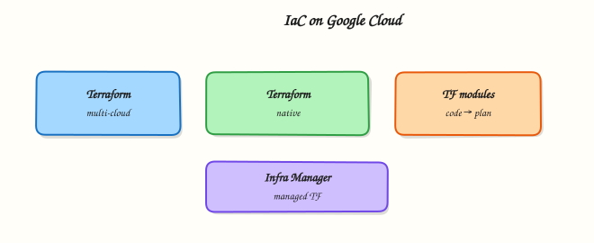

# Infrastructure as Code on Google Cloud

## Overview

**Infrastructure as Code (IaC)** means you define cloud resources in files, review them like application code, and apply changes through automation. On Google Cloud, **Terraform** with the **`google` / `google-beta` providers** is the common choice for Cloud and DevOps teams. Deployment Manager is legacy; Infrastructure Manager is Google’s managed Terraform offering (awareness).

This is **Tutorial 1** in **Module 12: Infrastructure as Code** of the REBASH Academy **Google Cloud for Cloud & DevOps Engineers** series. It is **not** a second full Terraform course — it proves the Google Cloud patterns: provider auth, a small VPC + bucket module-shaped root, `plan` / `apply` / `destroy`.

!!! warning "Cost hygiene"
    Always `terraform destroy` (or delete state-tracked resources) before you stop. Orphan networks and buckets from failed applies still cost or clutter projects.

## Prerequisites

- [Google Cloud Security Services](gcp-security-services.md)
- [Terraform course](../terraform/index.md) recommended (state, plan, apply basics)
- Terraform CLI 1.5+ installed (`terraform version`)
- `gcloud auth application-default login` completed for local applies

## Learning Objectives

By the end of this tutorial, you will be able to:

- [ ] Explain why IaC beats ClickOps for Google Cloud changes
- [ ] Configure the `google` provider with project/region
- [ ] Apply a VPC, subnet, and Cloud Storage bucket with Terraform
- [ ] Prove resources with `gcloud` and destroy them cleanly
- [ ] Describe remote state and Infrastructure Manager at interview depth

## Architecture

Engineers write `.tf` files → Terraform builds a plan against Google APIs using Application Default Credentials (ADC) → apply creates VPC/subnet/bucket → state tracks IDs → destroy removes them. Production adds remote state (GCS backend) and CI plans.



## Theory

### What it is

Terraform declares desired resources. The **google** provider maps resources such as `google_compute_network` and `google_storage_bucket` to Google Cloud APIs.

### Why it matters

Console-only changes drift, lack review, and do not reproduce. Interviews expect: state, plan before apply, destroy for labs, and “never commit credentials”.

### How it works

1. Authenticate (ADC user or SA in CI).
2. `terraform init` downloads providers.
3. `terraform plan` shows create/change/destroy.
4. `terraform apply` mutates the cloud.
5. State file remembers real IDs for future plans.

### Google Cloud IaC options

| Tool | Note |
|------|------|
| Terraform (`google`) | Default for multi-cloud / most teams |
| Infrastructure Manager | Google-managed Terraform deployments |
| Deployment Manager | Legacy — know the name, avoid new work |
| Config Connector / Pulumi / CDKTF | Alternatives — out of v1 lab scope |

### Common pitfalls

- Local state lost → orphan resources
- Wrong project in provider → surprises in another bill
- `apply` without reading plan
- Forgetting `force_destroy` on non-empty buckets when destroying labs

## Hands-on Lab

### Objective

Create a Terraform root that provisions a custom VPC, subnet, and Cloud Storage bucket; apply; prove with `gcloud`; destroy everything.

### Prerequisites

| Tool | Notes |
|------|--------|
| Terraform | `terraform version` |
| ADC | `gcloud auth application-default login` |
| APIs | `compute.googleapis.com`, `storage.googleapis.com` |

### Lab environment

``` {.bash .ra-terminal title="Terminal"}
mkdir -p ~/rebash-gcp/module-12 && cd ~/rebash-gcp/module-12
export PROJECT_ID="${PROJECT_ID:-$(gcloud config get-value project)}"
export REGION="${REGION:-europe-west2}"
gcloud config set project "$PROJECT_ID"
gcloud services enable compute.googleapis.com storage.googleapis.com --project="$PROJECT_ID"
gcloud auth application-default login # if not already done
```

### Real-world scenario

A teammate asks for a disposable network + artefact bucket defined in Git, not clicked together. You must show plan → apply → prove → destroy with no leftovers.

### Step-by-step tasks

#### Task 1 – Terraform files

Create these files with your editor (no shell heredocs).

`versions.tf`:

```hcl title="versions.tf"
terraform {
  required_version = ">= 1.5.0"
  required_providers {
    google = {
      source  = "hashicorp/google"
      version = "~> 5.0"
    }
  }
}
```

`providers.tf`:

```hcl title="providers.tf"
provider "google" {
  project = var.project_id
  region  = var.region
}
```

`variables.tf`:

```hcl title="variables.tf"
variable "project_id" {
  type        = string
  description = "Google Cloud project ID"
}

variable "region" {
  type        = string
  description = "Default region"
}

variable "name_prefix" {
  type        = string
  description = "Prefix for lab resources"
  default     = "rebash-m12"
}
```

`main.tf`:

```hcl title="main.tf"
resource "google_compute_network" "lab" {
  name                    = "${var.name_prefix}-vpc"
  auto_create_subnetworks = false
}

resource "google_compute_subnetwork" "lab" {
  name          = "${var.name_prefix}-subnet"
  ip_cidr_range = "10.30.0.0/24"
  region        = var.region
  network       = google_compute_network.lab.id
}

resource "google_storage_bucket" "lab" {
  name                        = "${var.name_prefix}-${var.project_id}"
  location                    = var.region
  uniform_bucket_level_access = true
  public_access_prevention    = "enforced"
  force_destroy               = true

  labels = {
    tutorial = "rebash-m12"
  }
}
```

`outputs.tf`:

```hcl title="outputs.tf"
output "network_name" {
  value = google_compute_network.lab.name
}

output "subnet_name" {
  value = google_compute_subnetwork.lab.name
}

output "bucket_name" {
  value = google_storage_bucket.lab.name
}
```

`terraform.tfvars` (your values — do not commit real secrets; project id is OK for a private sandbox):

```hcl title="terraform.tfvars"
project_id  = "YOUR_PROJECT_ID"
region      = "europe-west2"
name_prefix = "rebash-m12"
```

#### Task 2 – Init, plan, apply

``` {.bash .ra-terminal title="Terminal"}
cd ~/rebash-gcp/module-12
# Fix project_id in terraform.tfvars before continuing
terraform init | tee init.txt
terraform plan -out=tfplan | tee plan.txt
terraform apply tfplan | tee apply.txt
terraform output -json | tee outputs.json
grep -q bucket_name outputs.json
```

!!! example "Expected output"
    Plan creates 3 resources; apply succeeds; outputs list network, subnet, bucket.

#### Task 3 – Prove with gcloud + break/fix mindset

``` {.bash .ra-terminal title="Terminal"}
cd ~/rebash-gcp/module-12
NETWORK=$(terraform output -raw network_name)
BUCKET=$(terraform output -raw bucket_name)
gcloud compute networks describe "$NETWORK" --format=json | tee network.json
gcloud storage buckets describe "gs://${BUCKET}" --format=json | tee bucket.json
grep -q "$NETWORK" network.json
printf 'rebash-m12\n' > prove.txt
gcloud storage cp prove.txt "gs://${BUCKET}/prove.txt"
gcloud storage cat "gs://${BUCKET}/prove.txt" | tee prove-read.txt
grep -q rebash-m12 prove-read.txt
# Intentional drift note: do NOT hand-edit the VPC in Console without a plan
echo "terraform gcp proof OK" | tee evidence.txt
```

### Validation steps

- [ ] `terraform apply` created network, subnet, bucket
- [ ] `gcloud` describe matches outputs
- [ ] Object upload/read works
- [ ] `terraform destroy` completed in cleanup

### Common errors and fixes

| Error you see | Plain meaning | What to do |
|---------------|---------------|------------|
| 403 / billing | ADC or API | `application-default login`; enable APIs |
| Bucket name taken | Global namespace | Prefix already includes project; change `name_prefix` |
| Provider project empty | tfvars wrong | Set `project_id` correctly |
| Destroy fails on bucket | Objects remain / force_destroy false | Empty bucket; ensure `force_destroy = true` |

### Challenge exercise

Write `remote-state.txt` explaining why a GCS backend is better than local `terraform.tfstate` for a team of three, and name the bucket/prefix pattern you would use (do not create it unless you already know the cost).

``` {.bash .ra-terminal title="Terminal"}
cd ~/rebash-gcp/module-12
test -s remote-state.txt
wc -l remote-state.txt | tee challenge.txt
```

### Learning outcomes

- You applied Google provider resources end-to-end
- You proved cloud state with `gcloud`, not only Terraform output
- You destroyed lab infra as part of the job

### Cleanup

``` {.bash .ra-terminal title="Terminal"}
cd ~/rebash-gcp/module-12
terraform destroy -auto-approve | tee destroy.txt
gcloud compute networks list --filter="name~rebash-m12" --format=json | tee networks-after.json
gcloud storage buckets list --filter="name~rebash-m12" --format=json | tee buckets-after.json
# Expect empty lists (or only unrelated resources)
rm -f tfplan init.txt plan.txt apply.txt destroy.txt outputs.json network.json \
  bucket.json prove.txt prove-read.txt evidence.txt challenge.txt
# Keep .tf files for your portfolio; delete local state if you want a clean folder:
# rm -rf .terraform terraform.tfstate terraform.tfstate.backup .terraform.lock.hcl
```

## Validation

- [ ] Lab folder `~/rebash-gcp/module-12` used
- [ ] No `rebash-m12` VPC/bucket left
- [ ] Local state not committed to a public git repo

## Code Walkthrough

1. **Pinned provider** — reproducible plans.
2. **Custom VPC** — `auto_create_subnetworks = false` matches Module 3 habits.
3. **`force_destroy` on lab bucket** — destroy does not strand on one object.
4. **Outputs** — feed CI or humans without scraping JSON state.
5. **Destroy evidence** — list filters after destroy.

## Security Considerations

- Prefer workload identity / SA keys in CI over long-lived user ADC on shared runners.
- Remote state in GCS with IAM + optional customer-managed encryption.
- Never commit `terraform.tfvars` with secrets; project id alone is usually OK.
- Use least-privilege deploy SAs (not Owner) in real pipelines.

## Common Mistakes

!!! warning "Terraform apply from a laptop is the only workflow"
    Teams need remote state, code review, and CI plans. Laptops are for learning and break-glass.

!!! warning "State file is disposable"
    State maps real resources. Losing it causes duplicates or blocked destroys.

!!! warning "This module replaces the Terraform course"
    It does not. Use [Terraform](../terraform/index.md) for depth; this module is Google Cloud application of IaC.

## Best Practices

- One root per environment or use modules carefully
- `terraform fmt` / `validate` in CI
- Plan on PR; apply on merge with protection
- Label all resources
- Import sparingly; prefer recreate in labs

## Troubleshooting

| Symptom | Likely cause | Fix |
|---------|--------------|-----|
| Provider 400 on network | Naming / duplicate | Change prefix; import or destroy leftover |
| ADC token expired | Login aged out | Re-run application-default login |
| State lock (remote) | Concurrent apply | Wait or break lock with care |

## Summary

Terraform on the **google** provider turns Google Cloud builds into reviewable code. This lab applied a VPC and bucket, proved them, and destroyed them. Next (Phase E): **CI/CD**, cost, landing zones, and troubleshooting.

## Interview Questions

**1. What is Infrastructure as Code?**

??? success "Reveal answer"
    Defining and managing infrastructure through machine-readable files and automation instead of only clicking in a console, so changes are reviewable, repeatable, and auditable.

**2. Why use Terraform on Google Cloud?**

??? success "Reveal answer"
    The `google` provider covers most resources, state tracks real IDs, plans show diffs before apply, and the same workflow spans clouds and tools many teams already know.

**3. What is Terraform state?**

??? success "Reveal answer"
    A snapshot mapping configuration resources to real cloud object IDs and attributes so Terraform knows what to change on the next plan.

**4. Local state vs GCS backend?**

??? success "Reveal answer"
    Local state lives on one machine and does not share locks well. A GCS backend shares state with the team, supports locking, and survives laptop loss.

**5. What is Infrastructure Manager?**

??? success "Reveal answer"
    Google Cloud’s managed service for deploying infrastructure defined with Terraform, reducing some DIY orchestration of Terraform runs.

**6. Why set `force_destroy` on a lab bucket?**

??? success "Reveal answer"
    So `terraform destroy` can delete the bucket even if it still contains objects. Use carefully in production.

**7. How do you authenticate Terraform to Google Cloud locally?**

??? success "Reveal answer"
    Commonly Application Default Credentials via `gcloud auth application-default login`, or a service account in CI with workload identity federation.

**8. What should you do before every apply?**

??? success "Reveal answer"
    Read the plan. Confirm project/region, resource counts, and destroys. Accidental destroys are how IaC incidents happen.

## Related Tutorials

- Previous: [Google Cloud Security Services](gcp-security-services.md)
- Next: [CI/CD on Google Cloud](cicd-on-gcp.md)
- [Terraform course](../terraform/index.md)
- Parallel: [IaC on AWS](../aws/infrastructure-as-code-on-aws.md)

## References

- [Terraform Google provider](https://registry.terraform.io/providers/hashicorp/google/latest/docs)
- [google_compute_network](https://registry.terraform.io/providers/hashicorp/google/latest/docs/resources/compute_network)
- [google_storage_bucket](https://registry.terraform.io/providers/hashicorp/google/latest/docs/resources/storage_bucket)
- [Infrastructure Manager](https://cloud.google.com/infrastructure-manager/docs)
- [ADC](https://cloud.google.com/docs/authentication/application-default-credentials)
