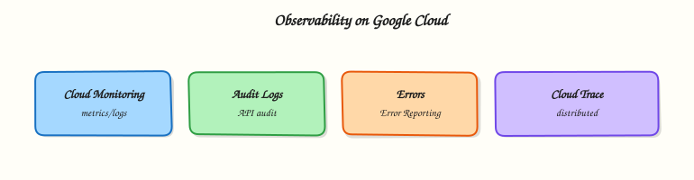

# Monitoring and Observability on Google Cloud

## Overview

You cannot fix what you cannot see. When a service is “slow” or “down”, engineers look at **metrics** (numbers over time), **logs** (events), and **traces** (request paths).

On Google Cloud, **Cloud Logging** stores logs, **Cloud Monitoring** stores metrics and alerts, and **Cloud Trace** / **Profiler** / **Error Reporting** deepen application visibility. **Managed Service for Prometheus** appears in Kubernetes-heavy shops.

This is **Tutorial 1** in **Module 10: Monitoring & Observability** of the REBASH Academy **Google Cloud for Cloud & DevOps Engineers** series. You will write and query a log, create a log-based metric and alert policy (with a console/CLI-friendly path), prove the pieces exist, and clean up.

!!! warning "Cost hygiene"
    Logs and metrics have free tiers and retention costs. Do not set 1-second scrapes on huge cardinalities. Delete lab alert policies and uptime checks in Cleanup.

## Prerequisites

- [Data and Analytics on Google Cloud](data-and-analytics-on-gcp.md)
- Permission to write logs and create Monitoring alert policies (Owner sandbox is fine)

## Learning Objectives

By the end of this tutorial, you will be able to:

- [ ] Explain logs vs metrics vs traces in plain English
- [ ] Write a log entry and query it with `gcloud logging read`
- [ ] Create a log-based metric and an alert policy (or documented fallback)
- [ ] Describe uptime checks and Managed Prometheus at interview depth
- [ ] Delete lab monitoring resources

## Architecture

Applications and Google services emit **logs** to Cloud Logging and **metrics** to Cloud Monitoring. **Alert policies** evaluate metrics (including log-based metrics) and notify via channels. Uptime checks probe URLs from Google’s probes.



## Theory

### What it is

**Observability** is the ability to understand system state from external outputs. Google Cloud’s operations suite (formerly Stackdriver) is the default toolkit: Logging, Monitoring, Error Reporting, Trace, Profiler.

### Why it matters

On-call without logs/metrics is guessing. Interviews expect: golden signals (latency, traffic, errors, saturation), alert fatigue awareness, and “what do you page on vs dashboard?”.

### How it works

1. Resources emit logs/metrics automatically; apps can add custom ones.
2. You query logs with filters.
3. Log-based metrics turn filter matches into time series.
4. Alert policies threshold those series and notify.
5. Uptime checks add synthetic probes from outside the VM.

### Signals

| Signal | Example |
|--------|---------|
| Metrics | CPU, request count, custom `rebash/heartbeat` |
| Logs | `textPayload` / structured JSON errors |
| Traces | Span waterfall across Cloud Run services |
| Profiles | CPU hotspots in production binaries |

### Common pitfalls

- Alerting on noisy metrics → pages nobody trusts
- No log labels → cannot filter by `tutorial=rebash-m10`
- Infinite log retention “just in case”
- Forgetting to delete uptime checks hitting deleted Cloud Run URLs

## Hands-on Lab

### Objective

Write a labelled log entry, query it back, create a log-based counter metric for that entry, attach a simple alert policy (or fallback evidence), then delete lab monitoring objects.

### Prerequisites

| Tool | Notes |
|------|--------|
| Monitoring / Logging APIs | Enabled in lab |
| Optional notification channel | Email channel in Console if you want a real page |

### Lab environment

``` {.bash .ra-terminal title="Terminal"}
mkdir -p ~/rebash-gcp/module-10 && cd ~/rebash-gcp/module-10
export PROJECT_ID="${PROJECT_ID:-$(gcloud config get-value project)}"
export REGION="${REGION:-europe-west2}"
gcloud config set project "$PROJECT_ID"
gcloud services enable logging.googleapis.com monitoring.googleapis.com --project="$PROJECT_ID"
```

### Real-world scenario

Before a service ships, platform asks for: a log line you can find under pressure, a metric derived from that log, and an alert policy stub that would page if the metric spiked. Prove the wiring with CLI evidence.

### Step-by-step tasks

#### Task 1 – Write and query a log

``` {.bash .ra-terminal title="Terminal"}
cd ~/rebash-gcp/module-10
gcloud logging write rebash-m10 \
  "rebash-m10 ok" \
  --severity=DEFAULT \
  --format=json | tee write-log.json
# Allow ingestion a few seconds
sleep 5
gcloud logging read \
  'logName="projects/'"${PROJECT_ID}"'/logs/rebash-m10" AND textPayload:"rebash-m10 ok"' \
  --limit=5 --format=json | tee log-read.json
test -s log-read.json
grep -q "rebash-m10 ok" log-read.json
```

!!! example "Expected output"
    `log-read.json` includes your payload. If empty, wait 15s and re-run the read (ingestion delay).

#### Task 2 – Log-based metric

``` {.bash .ra-terminal title="Terminal"}
cd ~/rebash-gcp/module-10
gcloud logging metrics delete rebash_m10_ok --quiet 2>/dev/null || true
gcloud logging metrics create rebash_m10_ok \
  --description="Count of rebash-m10 ok log lines" \
  --log-filter='logName="projects/'"${PROJECT_ID}"'/logs/rebash-m10" AND textPayload:"rebash-m10 ok"' \
  --format=json | tee metric-create.json
gcloud logging metrics describe rebash_m10_ok --format=json | tee metric.json
grep -q rebash_m10_ok metric.json
# Generate a few more points
for i in 1 2 3; do gcloud logging write rebash-m10 "rebash-m10 ok"; done
```

#### Task 3 – Alert policy (CLI or Console fallback)

Create `alert-policy.json` in your editor:

```json title="alert-policy.json"
{
  "displayName": "rebash-m10-ok-spike",
  "combiner": "OR",
  "conditions": [
    {
      "displayName": "rebash_m10_ok above 0",
      "conditionThreshold": {
        "filter": "metric.type=\"logging.googleapis.com/user/rebash_m10_ok\" AND resource.type=\"global\"",
        "comparison": "COMPARISON_GT",
        "thresholdValue": 0,
        "duration": "60s",
        "trigger": { "count": 1 },
        "aggregations": [
          {
            "alignmentPeriod": "60s",
            "perSeriesAligner": "ALIGN_DELTA"
          }
        ]
      }
    }
  ],
  "enabled": true
}
```

``` {.bash .ra-terminal title="Terminal"}
cd ~/rebash-gcp/module-10
set +e
gcloud alpha monitoring policies create --policy-from-file=alert-policy.json \
  --format=json 2>&1 | tee alert-create.txt
AC_RC=$?
set -e
if [[ "$AC_RC" -ne 0 ]]; then
  # Fallback: create via Monitoring API-friendly beta or document Console
  printf '%s\n' '{"fallback":"create alert in Console → Alerting → Create policy on metric logging.googleapis.com/user/rebash_m10_ok"}' \
    | tee alert-create.txt
  gcloud monitoring policies list --format="table(displayName,name)" 2>/dev/null \
    | tee policies.txt || true
fi
# Uptime check optional prove (HTTP against example.com — delete later)
gcloud monitoring uptime create rebash-m10-uptime \
  --resource-type=uptime-url \
  --host=example.com \
  --path=/ \
  --format=json 2>&1 | tee uptime.json || \
  printf '%s\n' '{"fallback":"uptime-create-skipped"}' | tee uptime.json
echo "monitoring proof OK" | tee evidence.txt
```

!!! note "Notification channels"
    Without an email/SMS channel, the policy still proves metric→condition wiring. Add a channel in Console for a real notification test.

### Validation steps

- [ ] Log write/read evidence exists
- [ ] Log-based metric `rebash_m10_ok` described
- [ ] Alert policy created **or** fallback documented; uptime file present

### Common errors and fixes

| Error you see | Plain meaning | What to do |
|---------------|---------------|------------|
| Empty log read | Ingestion delay / wrong filter | Wait; broaden filter; check project |
| Metric create already exists | Leftover lab | `gcloud logging metrics delete rebash_m10_ok` |
| Alert filter invalid | Metric not visible yet | Wait for points; fix resource.type |
| Alpha/beta command missing | SDK components | Use Console fallback; install alpha |

### Challenge exercise

Write `golden-signals.txt` listing latency, traffic, errors, saturation with one Google Cloud metric/log idea each for Cloud Run.

``` {.bash .ra-terminal title="Terminal"}
cd ~/rebash-gcp/module-10
test -s golden-signals.txt
wc -l golden-signals.txt | tee challenge.txt
```

### Learning outcomes

- You proved log round-trip with CLI filters
- You created a log-based metric — the bridge to alerting
- You can explain uptime checks vs app metrics

### Cleanup

``` {.bash .ra-terminal title="Terminal"}
cd ~/rebash-gcp/module-10
export PROJECT_ID="${PROJECT_ID:-$(gcloud config get-value project)}"
# Delete policies named rebash-m10
POLICIES=$(gcloud monitoring policies list --filter='displayName:rebash-m10' --format='value(name)' 2>/dev/null || true)
for p in $POLICIES; do gcloud monitoring policies delete "$p" --quiet 2>/dev/null || true; done
gcloud monitoring uptime list --format='value(name)' 2>/dev/null | while read -r u; do
  case "$u" in *rebash-m10*) gcloud monitoring uptime delete "$u" --quiet 2>/dev/null || true ;; esac
done
gcloud logging metrics delete rebash_m10_ok --quiet 2>/dev/null || true
rm -f write-log.json log-read.json metric-create.json metric.json \
  alert-create.txt alert-policy.json policies.txt uptime.json evidence.txt challenge.txt
```

## Validation

- [ ] Lab folder `~/rebash-gcp/module-10` used
- [ ] Lab metric/policy/uptime removed
- [ ] You can teach logs vs metrics without notes

## Code Walkthrough

1. **Write then read** — proves the project’s logging path.
2. **Log-based metric** — turns a needle in logs into an alertable series.
3. **Alert policy JSON** — infrastructure-as-code mindset for Monitoring.
4. **Uptime check** — synthetic outside view (optional if API differs).
5. **Cleanup policies first** — stop noise before deleting metrics.

## Security Considerations

- Logs may contain secrets — redact at source; restrict log bucket IAM.
- Alert channels are sensitive (email lists, webhooks).
- Do not grant `logging.admin` to app runtimes.

## Common Mistakes

!!! warning "More alerts = better reliability"
    Untrusted pages get ignored. Page on symptoms users feel; dashboard the rest.

!!! warning "Metrics replace logs"
    You need both. Metrics for trends/pages; logs for why.

!!! warning "Default retention is forever"
    It is not. Plan sinks and retention for compliance and cost.

## Best Practices

- Structured JSON logs with request IDs
- SLOs before a sea of thresholds
- Label resources consistently
- Separate user-facing pages from ticket queues
- Trace sampling that you can afford

## Troubleshooting

| Symptom | Likely cause | Fix |
|---------|--------------|-----|
| Metric has no data | Filter mismatch | Align logName/text with write |
| Policy never fires | Alignment/duration | Loosen duration; confirm metric points |
| Uptime failing | Host/path wrong | Fix URL; remember to delete |

## Summary

**Cloud Logging** and **Cloud Monitoring** are the default observability pair on Google Cloud. Log-based metrics connect “I see a line” to “page me when it spikes”. Next: **security services** — Secret Manager and related controls.

## Interview Questions

**1. Logs vs metrics vs traces?**

??? success "Reveal answer"
    Logs are event records. Metrics are numeric time series. Traces show a request’s path across services. Together they support diagnosis and alerting.

**2. What is a log-based metric?**

??? success "Reveal answer"
    A Cloud Monitoring metric derived from a Cloud Logging filter, so matching log lines become countable/chartable time series you can alert on.

**3. What are the four golden signals?**

??? success "Reveal answer"
    Latency, traffic, errors, and saturation — a classic SRE starting set for service health.

**4. What does an uptime check do?**

??? success "Reveal answer"
    It periodically probes a URL or resource from Google-managed probers to detect availability failures independent of your in-process metrics.

**5. Why is alert fatigue dangerous?**

??? success "Reveal answer"
    Too many low-value pages train humans to ignore alerts, including real incidents. Prefer fewer, higher-quality symptom-based pages.

**6. Where do Cloud Run request logs show up?**

??? success "Reveal answer"
    In Cloud Logging under the Cloud Run service’s log names; you filter by resource labels such as service name and revision.

**7. What is Managed Service for Prometheus?**

??? success "Reveal answer"
    A Google-managed Prometheus-compatible metrics backend commonly used with GKE, so you can keep PromQL workflows without running your own Prometheus HA stack.

**8. How do you prove logging works in a new project?**

??? success "Reveal answer"
    Write a known log line with `gcloud logging write`, query it back with `gcloud logging read`, and save the JSON evidence — as in Task 1.

## Related Tutorials

- Previous: [Data and Analytics on Google Cloud](data-and-analytics-on-gcp.md)
- Next: [Google Cloud Security Services](gcp-security-services.md)
- Parallel: [Monitoring on AWS](../aws/monitoring-and-observability-on-aws.md)

## References

- [Cloud Logging](https://cloud.google.com/logging/docs)
- [Cloud Monitoring](https://cloud.google.com/monitoring/docs)
- [Log-based metrics](https://cloud.google.com/logging/docs/logs-based-metrics)
- [Alerting overview](https://cloud.google.com/monitoring/alerts)
- [Uptime checks](https://cloud.google.com/monitoring/uptime-checks)
