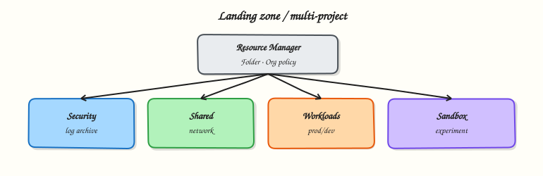

# Production GCP Landing Zones

## Overview

A **landing zone** is the opinionated starting foundation for workloads: how projects are organised, how networks are shared, how identities and guardrails work, and how logs/billing flow. Without one, every team invents a snowflake project and security becomes archaeology.

This is **Tutorial 1** in **Module 15: Production GCP** of the REBASH Academy **Google Cloud for Cloud & DevOps Engineers** series — the course capstone sketch. Personal Free Trial accounts often lack an organisation; the lab still produces architecture artefacts, inventories what you *can* see, and a runbook you can defend in interviews.

!!! warning "Org admin required for some APIs"
    Creating folders or org policies needs Organisation Administrator (or equivalent). If you only have a personal project, complete the **sketch + inventory + runbook** path — do not invent fake org IDs.

## Prerequisites

- [Cost Optimisation](cost-optimisation-on-gcp.md)
- [IAM](iam-identity-access-and-resource-hierarchy.md)
- [VPC Networking](vpc-networking-on-gcp.md)
- Comfortable writing Markdown architecture notes in an editor

## Learning Objectives

By the end of this tutorial, you will be able to:

- [ ] Explain organisation → folder → project → resources
- [ ] Sketch a Shared VPC host/service project layout
- [ ] List org policies you would enforce on day one
- [ ] Produce an ops runbook for a new environment
- [ ] Inventory your real Resource Manager view with `gcloud`

## Architecture

Company **organisation** roots Resource Manager. **Folders** group environments or business units. **Projects** host workloads. A **host project** holds Shared VPC; **service projects** attach. **Org policies** and logging sinks apply guardrails centrally. Billing rolls to one or more billing accounts.



## Theory

### What it is

A landing zone is not a single product SKU. It is a pattern (often implemented with Terraform) covering resource hierarchy, network, identity, security guardrails, logging, and billing.

### Why it matters

Architect interviews ask: “How would you set up Google Cloud for a company with three teams?” If you only answer “make three projects”, you miss Shared VPC, org policies, and log aggregation.

### How it works

1. Establish organisation (Cloud Identity / Workspace).
2. Create folders (`prod`, `nonprod`, `sandbox` or per-business-unit).
3. Create projects with labels and liaison owners.
4. Deploy host networking (Shared VPC) and attach service projects.
5. Enforce org policies (public IP, public buckets, location constraints).
6. Centralise log sinks and security findings.
7. Bootstrap via IaC (Module 12 patterns at scale).

### Shared VPC (sketch)

| Project | Role |
|---------|------|
| `net-host` | Subnets, firewalls, NAT, interconnect |
| `app-prod` | Workloads attached to host subnets |
| `app-dev` | Separate attachment / quotas |

### Day-one org policies (examples)

- Enforce Public Access Prevention on Cloud Storage
- Restrict Cloud SQL public IP
- Restrict resource locations (data residency)
- Disable service account key creation (prefer WIF)

### Common pitfalls

- One shared “prod” project for every team
- Shared VPC without clear host ownership
- Org policies so tight nothing can deploy (no break-glass)
- No billing export / no log sink

## Hands-on Lab

### Objective

Inventory your Resource Manager reality, write a landing-zone architecture sketch and org-policy wishlist, produce an environment runbook, and optionally create a folder if your account allows it.

### Prerequisites

| Tool | Notes |
|------|--------|
| `gcloud` | Authenticated |
| Editor | For Markdown artefacts |
| Optional | Organisation Admin for folder create |

### Lab environment

``` {.bash .ra-terminal title="Terminal"}
mkdir -p ~/rebash-gcp/module-15 && cd ~/rebash-gcp/module-15
export PROJECT_ID="${PROJECT_ID:-$(gcloud config get-value project)}"
gcloud config set project "$PROJECT_ID"
```

### Real-world scenario

A startup just won funding. Leadership asks for a one-page landing zone: hierarchy, network, guardrails, and “how we operate Monday morning”. You deliver artefacts even if the org is not fully online yet.

### Step-by-step tasks

#### Task 1 – Inventory what exists

``` {.bash .ra-terminal title="Terminal"}
cd ~/rebash-gcp/module-15
gcloud projects describe "$PROJECT_ID" --format=json | tee project.json
gcloud organizations list --format=json 2>/dev/null | tee orgs.json || printf '[]\n' | tee orgs.json
ORG_ID=$(python3 -c "import json; d=json.load(open('orgs.json')); print((d[0].get('name','').split('/')[-1] if d else ''))")
if [[ -n "$ORG_ID" ]]; then
  gcloud resource-manager folders list --organization="$ORG_ID" --format=json 2>/dev/null | tee folders.json || printf '[]\n' | tee folders.json
else
  printf '[]\n' | tee folders.json
fi
gcloud projects get-ancestors "$PROJECT_ID" --format=json 2>/dev/null | tee ancestors.json || true
test -s project.json
```

!!! example "Expected output"
    `project.json` populated. `orgs.json` may be `[]` on personal accounts — that is acceptable.

#### Task 2 – Optional folder create

``` {.bash .ra-terminal title="Terminal"}
cd ~/rebash-gcp/module-15
ORG_ID=$(python3 -c "import json; d=json.load(open('orgs.json')); print((d[0].get('name','').split('/')[-1] if d else ''))")
if [[ -n "${ORG_ID}" ]]; then
  gcloud resource-manager folders create \
    --display-name="rebash-m15-lab" \
    --organization="$ORG_ID" \
    --format=json 2>&1 | tee folder-create.json || \
    printf '%s\n' '{"fallback":"folder-create-denied"}' | tee folder-create.json
else
  printf '%s\n' '{"fallback":"no-organization-on-this-account"}' | tee folder-create.json
fi
```

#### Task 3 – Architecture sketch + policy wishlist

Create these files in your editor (no heredocs):

`landing-zone.md` — include:

1. Hierarchy diagram in text (org → folders → projects)
2. Host vs service projects for Shared VPC
3. Where Cloud Run / GKE land
4. Central log sink destination (BigQuery or Cloud Storage)
5. Billing account note

`org-policies.md` — at least five constraints you would enable, each with one sentence “why”.

``` {.bash .ra-terminal title="Terminal"}
cd ~/rebash-gcp/module-15
test -s landing-zone.md
test -s org-policies.md
wc -l landing-zone.md org-policies.md | tee sketch-proof.txt
```

#### Task 4 – Ops runbook (capstone artefact)

Create `runbook-new-env.md` covering:

1. Request path for a new project
2. Required labels
3. Network attachment steps (Shared VPC)
4. Budget creation
5. Break-glass Owner access
6. First deploy checklist (CI → AR → Run/GKE)
7. Cleanup / decommission steps

``` {.bash .ra-terminal title="Terminal"}
cd ~/rebash-gcp/module-15
test -s runbook-new-env.md
# Break/fix thinking: intentionally omit budget in a draft, then add it
grep -qi budget runbook-new-env.md
echo "landing zone artefacts OK" | tee evidence.txt
```

### Validation steps

- [ ] Inventory JSON captured
- [ ] `landing-zone.md`, `org-policies.md`, `runbook-new-env.md` exist
- [ ] Runbook mentions budget and decommission
- [ ] Folder created **or** fallback documented

### Common errors and fixes

| Error you see | Plain meaning | What to do |
|---------------|---------------|------------|
| `ORGANIZATION_INVALID` | No org | Use fallback path; artefacts still count |
| Folder permission denied | Not org admin | Document blocker in `folder-create.json` |
| Python missing | Rare on lab laptops | Install Python 3 or parse `orgs.json` manually |

### Challenge exercise

Add `shared-vpc-faq.txt` with answers to: Who owns firewall rules? Who can create subnets? How do service projects get `compute.networkUser`?

``` {.bash .ra-terminal title="Terminal"}
cd ~/rebash-gcp/module-15
test -s shared-vpc-faq.txt
```

### Learning outcomes

- You can draw a Google Cloud landing zone without ClickOps mythology
- You separated “my Free Trial project” from “company foundation”
- You have portfolio artefacts for architect interviews

### Cleanup

``` {.bash .ra-terminal title="Terminal"}
cd ~/rebash-gcp/module-15
# Delete lab folder if you created one and are allowed:
# FOLDER_ID=... ; gcloud resource-manager folders delete "$FOLDER_ID" --quiet
rm -f project.json orgs.json folders.json ancestors.json folder-create.json \
  sketch-proof.txt evidence.txt
# Keep landing-zone.md org-policies.md runbook-new-env.md shared-vpc-faq.txt
```

## Validation

- [ ] Lab folder `~/rebash-gcp/module-15` used
- [ ] Three Markdown artefacts ready to discuss aloud
- [ ] No fake org IDs claimed as real

## Code Walkthrough

1. **Inventory first** — design against reality.
2. **Optional folder** — only when org admin exists.
3. **Sketch files** — architecture is a deliverable.
4. **Runbook** — operations closes the loop.
5. **Keep artefacts** — portfolio > deleting Markdown.

## Security Considerations

- Org policies without monitoring become tribal knowledge — document exceptions.
- Host project IAM is high value — treat like production network gear.
- Break-glass accounts need logging and time limits.

## Common Mistakes

!!! warning "Landing zone = one big Shared VPC for the universe"
    Segment environments. Blast radius matters.

!!! warning "Org policy will fix culture"
    Policies enforce baselines; teams still need paved roads (IaC modules, CI templates).

!!! warning "Folders are optional cosmetics"
    At company scale they are how you delegate admin and apply policy inheritance.

## Best Practices

- IaC for hierarchy and network
- Separate billing visibility per environment
- Central security + decentralised app deploy
- Explicit network ownership
- Regular landing-zone reviews (new services, new constraints)

## Troubleshooting

| Symptom | Likely cause | Fix |
|---------|--------------|-----|
| Service project cannot use subnet | Missing networkUser | Grant on host subnet/project |
| Policy blocks Cloud Build | Constraint too broad | Scoped exception / alternate pipeline |
| Ancestors empty | Personal account | Expected — note in sketch |

## Summary

Landing zones turn Google Cloud from a pile of projects into a governed platform: hierarchy, Shared VPC sketch, org policies, logging, billing, and runbooks. Next: **troubleshooting** — the triage skills that keep the platform alive.

## Interview Questions

**1. What is a landing zone?**

??? success "Reveal answer"
    A foundational cloud setup — resource hierarchy, network, identity, security guardrails, logging, and billing — that teams build workloads on top of consistently.

**2. Why use folders?**

??? success "Reveal answer"
    Folders group projects for delegation and policy inheritance (for example non-prod vs prod), so you do not manage every project as a one-off.

**3. What is Shared VPC?**

??? success "Reveal answer"
    A model where a host project owns the VPC/subnets and service projects attach workloads to those subnets, centralising network control.

**4. Name two org policies you would enable early.**

??? success "Reveal answer"
    Examples: enforce Public Access Prevention on Cloud Storage; restrict public IPs on Cloud SQL; restrict resource locations; disable service account key creation.

**5. Who should own the host project?**

??? success "Reveal answer"
    Typically a platform/network team with clear change control — not every application squad as Owner.

**6. How does billing relate to the hierarchy?**

??? success "Reveal answer"
    Projects link to billing accounts. Hierarchy helps attribution with labels and folder structure, but bills still need exports and budgets to be actionable.

**7. What belongs in an environment runbook?**

??? success "Reveal answer"
    How to request projects, required labels, network attach steps, budgets, break-glass, first deploy path, and decommission — operational steps, not only diagrams.

**8. Can you build a landing zone on a personal Free Trial?**

??? success "Reveal answer"
    You can practise patterns and artefacts. Full org folders/policies need an organisation. Interviewers accept that distinction if your sketch is solid.

## Related Tutorials

- Previous: [Cost Optimisation on Google Cloud](cost-optimisation-on-gcp.md)
- Next: [Troubleshooting Google Cloud](troubleshooting-gcp.md)
- [IaC on Google Cloud](infrastructure-as-code-on-gcp.md)
- Parallel: [AWS landing zones](../aws/production-aws-landing-zones.md)

## References

- [Resource hierarchy](https://cloud.google.com/resource-manager/docs/cloud-platform-resource-hierarchy)
- [Shared VPC](https://cloud.google.com/vpc/docs/shared-vpc)
- [Organisation policy](https://cloud.google.com/resource-manager/docs/organization-policy/overview)
- [Landing zone design in Google Cloud](https://cloud.google.com/architecture/landing-zones)
- [Cloud Foundation Fabric / blueprints](https://cloud.google.com/docs/enterprise/best-practices-for-enterprise-organizations)
