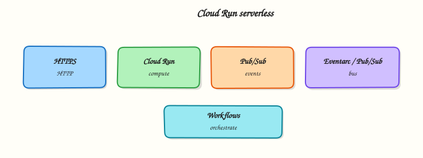

# Serverless on Google Cloud

## Overview

**Serverless** on Google Cloud means you run code or containers without managing VMs or Kubernetes nodes yourself. **Cloud Run** is the primary service for containerised HTTP workloads: you deploy an image, Google scales it (including to zero), and you get an HTTPS URL.

This module also maps **Cloud Functions**, **Pub/Sub**, **Eventarc**, **Workflows**, and **API Gateway** so you can answer architecture questions — then the lab focuses on Cloud Run: deploy, curl prove, break a revision, restore, delete.

This is **Tutorial 1** in **Module 8: Serverless** of the REBASH Academy **Google Cloud for Cloud & DevOps Engineers** series.

!!! warning "Cost hygiene"
    Cloud Run free tier covers small labs. You still pay for requests, CPU allocation choices, and outbound traffic. Delete services in Cleanup. Avoid attaching Cloud Run to a VPC + Cloud NAT in this lab.

## Prerequisites

- [Containers — GKE and Artifact Registry](containers-gke-and-artifact-registry.md) — image URI concepts
- Optional: reuse Module 7 image, or build a fresh one here with Cloud Build

## Learning Objectives

By the end of this tutorial, you will be able to:

- [ ] Explain Cloud Run vs Cloud Functions vs GKE in plain English
- [ ] Deploy a container to Cloud Run and prove the HTTPS URL
- [ ] Roll out a bad revision, observe failure, and route back to a good revision
- [ ] Describe Pub/Sub and Eventarc at interview depth
- [ ] Delete the Cloud Run service and related lab images you no longer need

## Architecture

A container image in Artifact Registry is deployed as a **Cloud Run service**. Each deploy creates a **revision**. Traffic can split across revisions. HTTPS ingress is provided by the platform. Events can arrive from Pub/Sub / Eventarc for non-HTTP triggers (overview here; HTTP is the lab path).



## Theory

### What it is

**Cloud Run** runs stateless containers behind an HTTPS endpoint (and can also run jobs). **Cloud Functions** is a functions-as-a-service layer (often for smaller event handlers). **Pub/Sub** is messaging. **Eventarc** routes events from Google sources to targets (including Cloud Run).

### Why it matters

Many internal tools and APIs do not need a Kubernetes cluster. Cloud Run is often the fastest path from Dockerfile to URL with scale-to-zero. Interviews ask cold starts, concurrency, IAM invokers, and when you outgrow Run for GKE.

### How it works

1. Build/push image to Artifact Registry.
2. `gcloud run deploy --image=... --region=...`
3. Allow unauthenticated access **only** for disposable public labs — production uses IAM invokers.
4. Prove with `curl` to the service URL.
5. New deploy = new revision; shift traffic to roll forward/back.

### Serverless map

| Service | Role |
|---------|------|
| **Cloud Run** | Containers as HTTPS services / jobs |
| **Cloud Functions** | Small event-driven functions |
| **Pub/Sub** | Async messaging between services |
| **Eventarc** | Event routing from sources to targets |
| **Workflows** | Orchestrate multi-step processes |
| **API Gateway** | Front APIs with auth/rate controls |

### Cloud Run vs GKE (again)

| Need | Prefer |
|------|--------|
| Simple HTTP API, scale to zero | Cloud Run |
| Many Kubernetes features / multi-tenant platform | GKE |
| Long custom node config / DaemonSets | GKE Standard |

### Common pitfalls

- `--allow-unauthenticated` left on production services
- Container listens on wrong port (Cloud Run sets `PORT`)
- Memory too low → OOMKill on cold start
- Attaching Serverless VPC Access + NAT “just in case” and paying for it
- Treating Cloud Run like a sticky VM (local disk is ephemeral)

## Hands-on Lab

### Objective

Deploy a container to Cloud Run, prove HTTPS, deploy a broken revision and restore traffic to the healthy revision, then delete the service.

### Prerequisites

| Tool | Notes |
|------|--------|
| Module 7 image optional | Or build in Task 1 |
| Cloud Run Admin | Sandbox Owner is fine |

### Lab environment

``` {.bash .ra-terminal title="Terminal"}
mkdir -p ~/rebash-gcp/module-08 && cd ~/rebash-gcp/module-08
export PROJECT_ID="${PROJECT_ID:-$(gcloud config get-value project)}"
export REGION="${REGION:-europe-west2}"
export REPO="rebash-m08"
export SERVICE="rebash-m08"
export IMAGE_URI="${REGION}-docker.pkg.dev/${PROJECT_ID}/${REPO}/hello:v1"
gcloud config set project "$PROJECT_ID"
gcloud config set run/region "$REGION"
gcloud services enable \
  run.googleapis.com \
  artifactregistry.googleapis.com \
  cloudbuild.googleapis.com \
  --project="$PROJECT_ID"
```

### Real-world scenario

A team wants a public demo API for a workshop afternoon. You must ship Cloud Run with evidence, show you can roll back a bad revision without SSH, and tear everything down before dinner.

### Step-by-step tasks

#### Task 1 – Image in Artifact Registry

Create `Dockerfile` in your editor:

```dockerfile title="Dockerfile"
FROM nginx:1.27-alpine
RUN printf '%s\n' 'rebash-m08 ok' > /usr/share/nginx/html/index.html
```

``` {.bash .ra-terminal title="Terminal"}
cd ~/rebash-gcp/module-08
gcloud artifacts repositories create "$REPO" \
  --repository-format=docker \
  --location="$REGION" \
  --description="REBASH Module 8" 2>/dev/null || true
gcloud builds submit --tag="$IMAGE_URI" .
echo "$IMAGE_URI" | tee image-uri.txt
```

!!! tip "Reuse Module 7"
    If `rebash-m07` image still exists, you may set `IMAGE_URI` to that URI and skip the build — still record it in `image-uri.txt`.

#### Task 2 – Deploy Cloud Run and prove URL

``` {.bash .ra-terminal title="Terminal"}
cd ~/rebash-gcp/module-08
IMAGE_URI=$(cat image-uri.txt)
gcloud run deploy "$SERVICE" \
  --image="$IMAGE_URI" \
  --region="$REGION" \
  --port=80 \
  --allow-unauthenticated \
  --max-instances=2 \
  --format=json | tee deploy-v1.json
SERVICE_URL=$(gcloud run services describe "$SERVICE" --region="$REGION" \
  --format='value(status.url)')
echo "$SERVICE_URL" | tee service-url.txt
curl -fsS "${SERVICE_URL}/" | tee curl-v1.txt
grep -q "rebash-m08 ok\|rebash-m07 ok" curl-v1.txt
```

!!! example "Expected output"
    `service-url.txt` is an `https://…run.app` URL. Curl returns the hello body.

!!! warning "Unauthenticated"
    Fine for a same-day lab. Production services should require authentication (`--no-allow-unauthenticated` + IAM `roles/run.invoker`).

#### Task 3 – Break/fix with a bad revision

Create `Dockerfile.bad` in your editor (listens nowhere useful — we point Cloud Run at a closed port):

```dockerfile title="Dockerfile.bad"
FROM nginx:1.27-alpine
RUN printf '%s\n' 'should-not-serve' > /usr/share/nginx/html/index.html
```

``` {.bash .ra-terminal title="Terminal"}
cd ~/rebash-gcp/module-08
BAD_URI="${REGION}-docker.pkg.dev/${PROJECT_ID}/${REPO}/hello:bad"
gcloud builds submit --tag="$BAD_URI" -f Dockerfile.bad .
# Deploy bad revision listening on wrong port so health fails / requests error
set +e
gcloud run deploy "$SERVICE" \
  --image="$BAD_URI" \
  --region="$REGION" \
  --port=81 \
  --allow-unauthenticated \
  --max-instances=2 2>&1 | tee deploy-bad.txt
set -e
# Even if deploy reports success, requests should fail on port mismatch
SERVICE_URL=$(cat service-url.txt)
set +e
curl -fsS --max-time 10 "${SERVICE_URL}/" 2>&1 | tee curl-bad.txt
BAD_RC=$?
set -e
# Restore good image/port
IMAGE_URI=$(cat image-uri.txt)
gcloud run deploy "$SERVICE" \
  --image="$IMAGE_URI" \
  --region="$REGION" \
  --port=80 \
  --allow-unauthenticated \
  --max-instances=2 | tee deploy-restore.txt
curl -fsS "${SERVICE_URL}/" | tee curl-restored.txt
grep -q "rebash-m08 ok\|rebash-m07 ok" curl-restored.txt
echo "cloud run break/fix OK" | tee evidence.txt
```

!!! tip "Revision traffic"
    For deeper practice: `gcloud run services update-traffic` to send 100% to a known good revision name from `gcloud run revisions list`.

### Validation steps

- [ ] HTTPS URL works for the healthy revision
- [ ] Bad deploy path produced failure evidence (`curl-bad.txt` or failed deploy log)
- [ ] Restored curl succeeds
- [ ] Service deleted in cleanup

### Common errors and fixes

| Error you see | Plain meaning | What to do |
|---------------|---------------|------------|
| Container failed to start | Wrong port / crash | Match `--port` to process listen port |
| 403 on URL | Auth required | Check invoker IAM / allow-unauthenticated |
| Permission denied deploy | Missing Cloud Run Admin | Use Owner sandbox |
| Image pull failed | Wrong URI / AR IAM | Verify `IMAGE_URI` and registry permissions |

### Challenge exercise

Write `serverless-map.txt` listing Pub/Sub, Eventarc, Cloud Functions, and Workflows with one sentence each for when you would use them with Cloud Run.

``` {.bash .ra-terminal title="Terminal"}
cd ~/rebash-gcp/module-08
test -s serverless-map.txt
wc -l serverless-map.txt | tee challenge.txt
```

### Learning outcomes

- You deployed and curled a Cloud Run service
- You practised revision rollback thinking
- You can place Cloud Run among other serverless products

### Cleanup

``` {.bash .ra-terminal title="Terminal"}
cd ~/rebash-gcp/module-08
export PROJECT_ID="${PROJECT_ID:-$(gcloud config get-value project)}"
export REGION="${REGION:-europe-west2}"
export SERVICE="rebash-m08"
export REPO="rebash-m08"
gcloud run services delete "$SERVICE" --region="$REGION" --quiet 2>/dev/null || true
gcloud artifacts repositories delete "$REPO" --location="$REGION" --quiet 2>/dev/null || true
# If you still need Module 7 repo, do not delete rebash-m07 here
rm -f deploy-v1.json deploy-bad.txt deploy-restore.txt service-url.txt \
  curl-v1.txt curl-bad.txt curl-restored.txt evidence.txt image-uri.txt challenge.txt
```

## Validation

- [ ] Lab folder `~/rebash-gcp/module-08` used
- [ ] `gcloud run services list` no longer shows `rebash-m08`
- [ ] You can explain cold start and concurrency briefly

## Code Walkthrough

1. **Image first** — Cloud Run deploys artefacts, not git branches directly (CI builds images).
2. **`--port`** — must match the process inside the container.
3. **Unauthenticated lab vs IAM invoker prod** — say it out loud in interviews.
4. **Bad revision** — platform rollback story without SSH.
5. **Delete service** — scale-to-zero helps, but unused services and images still clutter cost/IAM.

## Security Considerations

- Prefer authenticated Cloud Run + Identity-Aware Proxy or IAM invokers.
- Do not bake secrets into images; use Secret Manager volume/env mounts.
- Restrict egress when the service must call internal APIs.
- Scan images in Artifact Registry before promote-to-prod.

## Common Mistakes

!!! warning "Cloud Run keeps my files on disk"
    The container filesystem is ephemeral. Use Cloud Storage, databases, or mounts designed for that purpose.

!!! warning "Allow unauthenticated is fine if the URL is obscure"
    Obscurity is not auth. Anyone can probe `*.run.app`.

!!! warning "Serverless means zero ops forever"
    You still own SLOs, IAM, revisions, dependencies, and cost alerts.

## Best Practices

- Small images; fast startup
- Set memory/CPU consciously; load test concurrency
- Use min instances only when cold starts break SLOs
- Traffic splitting for canaries
- Structured logs → Cloud Logging

## Troubleshooting

| Symptom | Likely cause | Fix |
|---------|--------------|-----|
| 503 / timeout | Crash loop / wrong port | Revision logs: `gcloud run services logs read` |
| Cold start too slow | Huge image / init work | Slim image; defer work; consider min instances |
| Permission to invoke | IAM | Grant `roles/run.invoker` to caller |

## Summary

**Cloud Run** is Google Cloud’s main serverless container platform for HTTP services. **Functions**, **Pub/Sub**, and **Eventarc** complete the event-driven picture. This lab deployed, broke, and restored a service — then deleted it. Next: **data and analytics** for ops-oriented BigQuery and Pub/Sub.

## Interview Questions

**1. What is Cloud Run?**

??? success "Reveal answer"
    A managed platform that runs stateless containers behind HTTPS (and jobs), scaling including to zero, without you managing VMs or Kubernetes nodes.

**2. Cloud Run vs Cloud Functions?**

??? success "Reveal answer"
    Cloud Run deploys containers (any language/runtime that fits the contract). Cloud Functions targets smaller event-driven function packages. Many teams standardise on Cloud Run for portability.

**3. Cloud Run vs GKE?**

??? success "Reveal answer"
    Cloud Run optimises for request-driven container services with minimal cluster ops. GKE provides the full Kubernetes API for complex platforms and workloads Cloud Run does not model well.

**4. What is a revision?**

??? success "Reveal answer"
    An immutable deploy snapshot of a Cloud Run service (image and settings). You can route traffic across revisions for rollout and rollback.

**5. Why does `--port` matter?**

??? success "Reveal answer"
    Cloud Run sends traffic to the container port you configure. If your process listens on 8080 but you set `--port=80`, health and requests fail.

**6. What is Pub/Sub used for?**

??? success "Reveal answer"
    Asynchronous messaging: publishers send messages to topics; subscribers receive them. It decouples services and buffers load.

**7. What does Eventarc add?**

??? success "Reveal answer"
    A routing layer that delivers events from various Google Cloud sources to targets such as Cloud Run, so you can build event-driven architectures without custom glue everywhere.

**8. How do you secure a Cloud Run service in production?**

??? success "Reveal answer"
    Disable unauthenticated access, grant `roles/run.invoker` to specific identities, manage secrets properly, restrict egress as needed, and scan/pin images.

## Related Tutorials

- Previous: [Containers — GKE and Artifact Registry](containers-gke-and-artifact-registry.md)
- Next: [Data and Analytics on Google Cloud](data-and-analytics-on-gcp.md)
- Parallel: [Serverless on AWS](../aws/serverless-on-aws.md)

## References

- [Cloud Run documentation](https://cloud.google.com/run/docs)
- [gcloud run deploy](https://cloud.google.com/sdk/gcloud/reference/run/deploy)
- [Pub/Sub](https://cloud.google.com/pubsub/docs)
- [Eventarc](https://cloud.google.com/eventarc/docs)
- [Cloud Functions](https://cloud.google.com/functions/docs)
