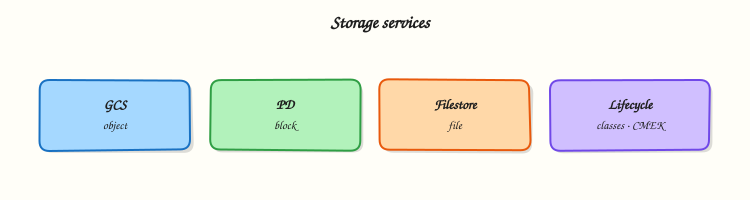

# Cloud Storage, Persistent Disk, and Filestore

## Overview

Every application needs somewhere to keep files, disks, and backups. On Google Cloud you usually choose between three storage shapes — and picking the wrong one wastes money or breaks your design in interviews.

Start with the storage problem each service solves:

- **Cloud Storage (GCS)** — store files as objects (like a massive shared drive accessed over HTTPS APIs)
- **Persistent Disk (PD)** — attach a disk to one virtual machine (like a USB drive for Compute Engine)
- **Filestore** — share a folder across many Linux servers (like a network file share / NFS)

This is **Tutorial 1** in **Module 5: Storage** of the REBASH Academy **Google Cloud for Cloud & DevOps Engineers** series. You will harden a bucket, prove upload/download, apply a **deny** IAM binding and restore access, add a **lifecycle** rule, and delete cleanly.

!!! warning "Cost hygiene"
    Cloud Storage charges for storage and requests. **Persistent Disks bill even when detached.** This lab uses Cloud Storage only — no Filestore (expensive) and no extra VMs. Always run **Cleanup**.

## Prerequisites

- [Compute Engine, MIGs, and Load Balancing](compute-engine-migs-and-load-balancing.md) — you know what a VM disk is for
- `gcloud` with permission to create buckets in a sandbox project
- Module 1 budget alert still recommended

## Learning Objectives

By the end of this tutorial, you will be able to:

- [ ] Explain Cloud Storage vs Persistent Disk vs Filestore using everyday analogies
- [ ] Create a bucket with uniform bucket-level access and prove object read/write
- [ ] Apply an IAM deny-style break (remove objectViewer) and restore access
- [ ] Add a lifecycle rule and delete the bucket completely
- [ ] Answer interview questions on storage classes and public bucket risk

## Architecture

Objects live in **buckets** (global namespace, regional or multi-regional location). VMs use **Persistent Disks** for block storage. **Filestore** provides managed NFS for shared POSIX filesystems. Most DevOps labs and CI artefacts use Cloud Storage.



## Theory

### What it is

**Cloud Storage** is an object store: you put bytes at a key (`gs://bucket/path/file`). **Persistent Disk** is block storage attached to Compute Engine. **Filestore** is managed NFS for shared directories.

### Why it matters

Wrong storage choice shows up as: “why is my disk bill huge when the VM is stopped?”, “why can’t two pods write the same PD?”, and “who made this bucket public?”. Interviews expect crisp analogies and one security habit (no public buckets by accident).

### How it works

1. Create a bucket in a location (`REGION` or multi-region).
2. Choose a default storage class (Standard for labs).
3. Prefer **uniform bucket-level access** (IAM on the bucket, not ACLs per object).
4. Upload/download with `gcloud storage`.
5. Use lifecycle rules to abort incomplete uploads or expire old objects.
6. Use PD when a VM needs a filesystem; Filestore when many VMs need the same POSIX share.

### Key comparisons

| Service | Access model | Typical use |
|---------|--------------|-------------|
| Cloud Storage | Object API (`gs://`) | Artefacts, backups, static assets, data lake landing |
| Persistent Disk | Block device on one VM (or multi-writer special cases) | Boot disks, databases on GCE |
| Filestore | NFS share | Lift-and-shift shared folders, some HPC/legacy apps |

### Storage classes (Cloud Storage)

| Class | When you hear it |
|-------|------------------|
| **Standard** | Frequent access (labs, active data) |
| **Nearline / Coldline / Archive** | Cheaper storage, costlier retrieval — backups and compliance |

### Common pitfalls

- Globally unique bucket names — `my-bucket` is probably taken
- Public `allUsers` objectAdmin “just for a demo”
- Leaving versioned buckets half-deleted
- Creating Filestore for a student lab (cost)
- Assuming PD is shared like NFS

## Hands-on Lab

### Objective

Create a regional bucket with uniform access, upload and download an object, break read access for a lab reader identity (or your secondary binding), restore it, apply a lifecycle rule, and delete the bucket.

### Prerequisites

| Tool | Notes |
|------|--------|
| Modules 1–4 | `PROJECT_ID` and `REGION` pinned |
| Storage Admin (or Owner) | Sandbox project |

### Lab environment

``` {.bash .ra-terminal title="Terminal"}
mkdir -p ~/rebash-gcp/module-05 && cd ~/rebash-gcp/module-05
export PROJECT_ID="${PROJECT_ID:-$(gcloud config get-value project)}"
export REGION="${REGION:-europe-west2}"
export BUCKET="rebash-m05-${PROJECT_ID}"
gcloud config set project "$PROJECT_ID"
gcloud services enable storage.googleapis.com --project="$PROJECT_ID"
```

### Real-world scenario

A CI job needs a private artefact bucket: upload a build file, prove download works, show what happens when IAM is wrong, add a lifecycle rule so abandoned uploads do not live forever, then tear the bucket down when the spike ends.

### Step-by-step tasks

#### Task 1 – Create a hardened bucket and prove read/write

``` {.bash .ra-terminal title="Terminal"}
cd ~/rebash-gcp/module-05
gcloud storage buckets create "gs://${BUCKET}" \
  --location="$REGION" \
  --uniform-bucket-level-access \
  --public-access-prevention \
  --format=json | tee bucket.json
printf 'rebash-m05 artefact\n' > artefact.txt
gcloud storage cp artefact.txt "gs://${BUCKET}/builds/artefact.txt"
gcloud storage cp "gs://${BUCKET}/builds/artefact.txt" artefact-downloaded.txt
diff -u artefact.txt artefact-downloaded.txt | tee diff-proof.txt
test ! -s diff-proof.txt
gcloud storage buckets describe "gs://${BUCKET}" --format=json | tee bucket-describe.json
grep -q uniformBucketLevelAccess bucket-describe.json || grep -q Uniform bucket-describe.json
```

!!! example "Expected output"
    `diff-proof.txt` is empty (files match). Bucket describe shows uniform access / public access prevention enabled.

#### Task 2 – Lifecycle rule

Create `lifecycle.json` in your editor:

```json title="lifecycle.json"
{
  "rule": [
    {
      "action": { "type": "Delete" },
      "condition": {
        "age": 30,
        "matchesPrefix": ["builds/"]
      }
    }
  ]
}
```

``` {.bash .ra-terminal title="Terminal"}
cd ~/rebash-gcp/module-05
gcloud storage buckets update "gs://${BUCKET}" --lifecycle-file=lifecycle.json
gcloud storage buckets describe "gs://${BUCKET}" \
  --format="json(lifecycle_config)" | tee lifecycle-proof.json
test -s lifecycle-proof.json
grep -q Delete lifecycle-proof.json
```

!!! example "Expected output"
    `lifecycle-proof.json` includes a Delete action for the `builds/` prefix.

#### Task 3 – Break/fix IAM on the bucket

Use a temporary reader service account (or skip SA create if Module 2 SA patterns are fresh — recreate a tiny one):

``` {.bash .ra-terminal title="Terminal"}
cd ~/rebash-gcp/module-05
export SA_ID="rebash-m05-reader"
export SA_EMAIL="${SA_ID}@${PROJECT_ID}.iam.gserviceaccount.com"
gcloud iam service-accounts create "$SA_ID" --display-name="M05 reader" 2>/dev/null || true
CALLER=$(gcloud config get-value account)
gcloud iam service-accounts add-iam-policy-binding "$SA_EMAIL" \
  --member="user:${CALLER}" --role="roles/iam.serviceAccountTokenCreator" --quiet
gcloud storage buckets add-iam-policy-binding "gs://${BUCKET}" \
  --member="serviceAccount:${SA_EMAIL}" \
  --role="roles/storage.objectViewer"
gcloud storage cat "gs://${BUCKET}/builds/artefact.txt" \
  --impersonate-service-account="$SA_EMAIL" | tee allow-read.txt
grep -q "rebash-m05" allow-read.txt

# BREAK — remove viewer
gcloud storage buckets remove-iam-policy-binding "gs://${BUCKET}" \
  --member="serviceAccount:${SA_EMAIL}" \
  --role="roles/storage.objectViewer"
set +e
gcloud storage cat "gs://${BUCKET}/builds/artefact.txt" \
  --impersonate-service-account="$SA_EMAIL" 2>&1 | tee deny-read.txt
DENY_RC=$?
set -e
test "$DENY_RC" -ne 0
grep -Ei 'PERMISSION_DENIED|denied|403' deny-read.txt

# FIX — restore viewer
gcloud storage buckets add-iam-policy-binding "gs://${BUCKET}" \
  --member="serviceAccount:${SA_EMAIL}" \
  --role="roles/storage.objectViewer"
gcloud storage cat "gs://${BUCKET}/builds/artefact.txt" \
  --impersonate-service-account="$SA_EMAIL" | tee restore-read.txt
grep -q "rebash-m05" restore-read.txt
echo "storage break/fix OK" | tee evidence.txt
```

### Validation steps

- [ ] Bucket created with uniform access and public access prevention
- [ ] Upload/download diff is empty
- [ ] Lifecycle rule present
- [ ] Impersonated read failed after binding removal and succeeded after restore

### Common errors and fixes

| Error you see | Plain meaning | What to do |
|---------------|---------------|------------|
| Bucket name not available | Global name taken | Change `BUCKET` suffix |
| Impersonation denied | Missing Token Creator | Re-bind Token Creator on the SA |
| Lifecycle file invalid | JSON shape wrong | Match the `rule` / `action` / `condition` structure |
| Public access prevention conflict | Org policy / flag | Keep PAP on; do not make public |

### Challenge exercise

Create `storage-choice.txt` (editor) with six lines: when you would pick GCS vs PD vs Filestore for (a) CI artefacts, (b) MySQL data directory on one VM, (c) shared uploads across three GCE web VMs.

``` {.bash .ra-terminal title="Terminal"}
cd ~/rebash-gcp/module-05
test -s storage-choice.txt
wc -l storage-choice.txt | tee challenge.txt
```

### Learning outcomes

- You operated Cloud Storage with IAM and lifecycle evidence
- You can explain PD and Filestore without creating them yet
- You practised deny/restore — the interview storage security story

### Cleanup

``` {.bash .ra-terminal title="Terminal"}
cd ~/rebash-gcp/module-05
export PROJECT_ID="${PROJECT_ID:-$(gcloud config get-value project)}"
export BUCKET="rebash-m05-${PROJECT_ID}"
export SA_EMAIL="rebash-m05-reader@${PROJECT_ID}.iam.gserviceaccount.com"
gcloud storage rm -r "gs://${BUCKET}" 2>/dev/null || true
gcloud iam service-accounts delete "$SA_EMAIL" --quiet 2>/dev/null || true
rm -f bucket.json artefact.txt artefact-downloaded.txt diff-proof.txt \
  bucket-describe.json lifecycle-proof.json allow-read.txt deny-read.txt \
  restore-read.txt evidence.txt challenge.txt
```

## Validation

- [ ] Lab folder `~/rebash-gcp/module-05` used
- [ ] No leftover `rebash-m05-*` bucket
- [ ] You can teach GCS vs PD vs Filestore in two minutes

## Code Walkthrough

1. **Uniform bucket-level access + PAP** — modern default; fewer ACL foot-guns.
2. **`gcloud storage`** — current CLI family for objects (prefer over legacy `gsutil` in new labs).
3. **Lifecycle on `builds/`** — cost hygiene for CI junk.
4. **Impersonated deny/restore** — proves IAM without public buckets.
5. **Recursive delete** — incomplete cleanup leaves billable objects.

## Security Considerations

- Never grant `allUsers` / `allAuthenticatedUsers` objectAdmin for labs that stay up.
- Prefer CMEK only when your org requires it; Google-managed encryption is fine for this course.
- Signed URLs expire — use them instead of permanent public objects.
- Bucket IAM is as sensitive as project IAM for data exfiltration.

## Common Mistakes

!!! warning "Persistent Disk is shared storage"
    A normal PD attaches to one VM (multi-writer is a special case). Shared POSIX usually means Filestore or a database/object API.

!!! warning "Standard class forever"
    Cold data on Standard wastes money; hot data on Archive wastes money and time on restore.

!!! warning "Delete bucket in Console = done"
    Versioning or incomplete deletes can leave cost. Prefer `gcloud storage rm -r` and verify with `buckets list`.

## Best Practices

- Unique naming convention: `org-env-purpose-random`
- Uniform access + public access prevention
- Lifecycle + object versioning policy decided on purpose (not by accident)
- Labels: `owner`, `tutorial=rebash-m05`
- Separate buckets for logs vs artefacts vs backups

## Troubleshooting

| Symptom | Likely cause | Fix |
|---------|--------------|-----|
| 403 on upload | Missing `storage.objectAdmin` / creator | Use Owner sandbox or grant create |
| Empty lifecycle describe | Update did not apply | Re-run update; check JSON |
| SA still reads after remove | Propagation delay / wrong member | Wait 30s; re-check IAM policy |

## Summary

**Cloud Storage** holds objects; **Persistent Disk** is a VM’s block device; **Filestore** is managed NFS. This lab proved private object storage with lifecycle and IAM break/fix. Next: **databases** — when files are not enough.

## Interview Questions

**1. Cloud Storage vs Persistent Disk vs Filestore — one sentence each?**

??? success "Reveal answer"
    Cloud Storage stores objects via API. Persistent Disk is block storage for a VM. Filestore is managed NFS for shared filesystems across clients.

**2. What is uniform bucket-level access?**

??? success "Reveal answer"
    It forces access control through IAM on the bucket (and prefixes via IAM conditions) instead of mixing per-object ACLs, which reduces accidental public objects and simplifies audits.

**3. Why is a public bucket dangerous?**

??? success "Reveal answer"
    Anyone on the internet may list or read sensitive artefacts, backups, or credentials. Public access prevention and avoiding `allUsers` grants are baseline controls.

**4. When would you use Nearline or Coldline?**

??? success "Reveal answer"
    For infrequently accessed data such as monthly backups where storage price matters more than retrieval price and latency. Hot application assets stay on Standard.

**5. Can two VMs mount the same Persistent Disk like a shared folder?**

??? success "Reveal answer"
    Not as a normal shared filesystem. Use Filestore, a database, or Cloud Storage. Multi-writer PD is a specialised mode, not the default interview answer for “shared files”.

**6. What does a lifecycle Delete rule do?**

??? success "Reveal answer"
    It automatically deletes objects that match conditions such as age and prefix, reducing cost from abandoned artefacts and incomplete uploads.

**7. How do you prove least privilege on a bucket in a demo?**

??? success "Reveal answer"
    Grant a reader role, show a successful read, remove the role, show `PERMISSION_DENIED`, restore the role — with command evidence files.

**8. GCS bucket names are globally unique — why does that matter?**

??? success "Reveal answer"
    Create fails if the name is taken anywhere on Google Cloud. Teams use structured prefixes and random suffixes to avoid collisions and squatting surprises.

## Related Tutorials

- Previous: [Compute Engine, MIGs, and Load Balancing](compute-engine-migs-and-load-balancing.md)
- Next: [Databases on Google Cloud](databases-on-gcp.md)
- Parallel: [AWS Storage](../aws/storage-s3-ebs-efs.md)

## References

- [Cloud Storage documentation](https://cloud.google.com/storage/docs)
- [Storage classes](https://cloud.google.com/storage/docs/storage-classes)
- [Object Lifecycle Management](https://cloud.google.com/storage/docs/lifecycle)
- [Persistent Disk](https://cloud.google.com/compute/docs/disks)
- [Filestore](https://cloud.google.com/filestore/docs)
