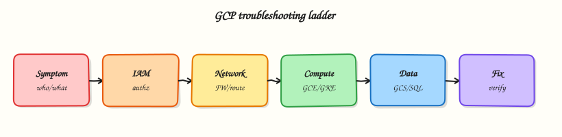

# Troubleshooting Google Cloud

## Overview

Production issues rarely announce the root cause. Good operators use a **decision tree**: confirm identity and project, decide whether the failure is **control plane** (API/`PERMISSION_DENIED`) or **data plane** (timeout/connect), then narrow to IAM, network, workload, or cost/quota.

This is **Tutorial 1** in **Module 16: Troubleshooting** of the REBASH Academy **Google Cloud for Cloud & DevOps Engineers** series — the final module. You will practise a timed triage checklist and a small firewall break/fix that reunites Modules 1–4 skills.

!!! warning "Cost hygiene"
    The lab VM is short-lived. Delete it even if you stop mid-triage.

## Prerequisites

- [Production GCP Landing Zones](production-gcp-landing-zones.md)
- [VPC Networking](vpc-networking-on-gcp.md)
- [IAM](iam-identity-access-and-resource-hierarchy.md)
- Earlier modules completed (or enough to recognise symptoms)

## Learning Objectives

By the end of this tutorial, you will be able to:

- [ ] Run a first-five-minutes checklist on any Google Cloud incident
- [ ] Separate IAM failures from VPC/firewall failures
- [ ] Triage Cloud Run and GKE symptom patterns
- [ ] Break and restore HTTP via firewall with evidence
- [ ] Explain quota and billing “outages” that are not app bugs

## Architecture

Incidents present as user pain → on-call checks identity/project/region → classifies control vs data plane → inspects IAM, VPC/firewall, workload logs/metrics, then quotas/billing. Evidence files beat memory.



## Theory

### What it is

Troubleshooting is structured elimination, not random CLI hope. Google Cloud gives you `gcloud`, Cloud Logging, Monitoring, and Connectivity Tests.

### Why it matters

Interviews simulate: “curl times out”, “ImagePullBackOff”, “PERMISSION_DENIED on deploy”. They want your order of operations and what evidence you would collect.

### First five minutes

1. `gcloud auth list` + `gcloud config list` — wrong project/account?
2. Confirm region/zone assumptions.
3. Reproduce with one command; save output.
4. Control plane error (`PERMISSION_DENIED`, `NOT_FOUND`) vs data plane (timeout)?
5. Check recent deploys / IAM changes / budgets (hard disable).

### Symptom → likely layer

| Symptom | First layer to check |
|---------|----------------------|
| `PERMISSION_DENIED` on `gcloud` | IAM / API enablement |
| TCP timeout to VM IP | Firewall, route, external IP, process down |
| Cloud Run 403 | Invoker IAM / auth |
| Cloud Run 503 | Crash loop, wrong port, revision |
| GKE `ImagePullBackOff` | AR URI / IAM |
| GKE `CrashLoopBackOff` | App/config/secrets |
| APIs suddenly fail | Billing disabled / quota / org policy |

### Common pitfalls

- Debugging the wrong project
- Blaming DNS when the firewall denies
- Restarting Pods before reading logs
- Ignoring serial console for startup-script failures

## Hands-on Lab

### Objective

Create a tiny public HTTP VM path, capture a healthy curl, break the firewall, prove failure, restore, then complete a written triage checklist covering IAM, Run/GKE, and cost.

### Prerequisites

| Tool | Notes |
|------|--------|
| Compute Engine API | Enabled |
| Budget awareness | Delete VM in cleanup |

### Lab environment

``` {.bash .ra-terminal title="Terminal"}
mkdir -p ~/rebash-gcp/module-16 && cd ~/rebash-gcp/module-16
export PROJECT_ID="${PROJECT_ID:-$(gcloud config get-value project)}"
export REGION="${REGION:-europe-west2}"
export ZONE="${ZONE:-europe-west2-a}"
export NETWORK="rebash-m16-vpc"
export SUBNET="rebash-m16-subnet"
export VM="rebash-m16-web"
gcloud config set project "$PROJECT_ID"
gcloud config set compute/region "$REGION"
gcloud config set compute/zone "$ZONE"
gcloud services enable compute.googleapis.com --project="$PROJECT_ID"
```

### Real-world scenario

Pager: “Marketing site on a lab VM is down.” You have fifteen minutes. Prove whether it is firewall or guest process, restore service, and file evidence.

### Step-by-step tasks

#### Task 1 – Baseline identity + healthy path

Create `startup.sh` in your editor:

```bash title="startup.sh"
#!/bin/bash
set -euo pipefail
apt-get update -y
apt-get install -y nginx
printf '%s\n' 'rebash-m16 ok' > /var/www/html/index.html
systemctl enable --now nginx
```

``` {.bash .ra-terminal title="Terminal"}
cd ~/rebash-gcp/module-16
gcloud auth list --format=json | tee auth.json
gcloud config list --format=json | tee config.json
chmod +x startup.sh
gcloud compute networks create "$NETWORK" --subnet-mode=custom
gcloud compute networks subnets create "$SUBNET" \
  --network="$NETWORK" --region="$REGION" --range="10.40.0.0/24"
gcloud compute firewall-rules create "${NETWORK}-allow-ssh" \
  --network="$NETWORK" --allow=tcp:22 --target-tags=rebash-lab \
  --source-ranges=0.0.0.0/0
gcloud compute firewall-rules create "${NETWORK}-allow-http" \
  --network="$NETWORK" --allow=tcp:80 --target-tags=rebash-lab \
  --source-ranges=0.0.0.0/0
gcloud compute instances create "$VM" \
  --zone="$ZONE" --machine-type=e2-micro \
  --network-interface="network=${NETWORK},subnet=${SUBNET}" \
  --tags=rebash-lab \
  --image-family=debian-12 --image-project=debian-cloud \
  --metadata-from-file=startup-script=startup.sh
EXTERNAL_IP=$(gcloud compute instances describe "$VM" --zone="$ZONE" \
  --format='get(networkInterfaces[0].accessConfigs[0].natIP)')
echo "$EXTERNAL_IP" | tee external-ip.txt
for i in $(seq 1 12); do
  if curl -fsS --max-time 5 "http://${EXTERNAL_IP}/" | tee curl-ok.txt; then break; fi
  sleep 15
done
grep -q "rebash-m16 ok" curl-ok.txt
```

#### Task 2 – Break/fix firewall (data plane)

``` {.bash .ra-terminal title="Terminal"}
cd ~/rebash-gcp/module-16
EXTERNAL_IP=$(cat external-ip.txt)
gcloud compute firewall-rules delete "${NETWORK}-allow-http" --quiet
set +e
curl -fsS --max-time 8 "http://${EXTERNAL_IP}/" 2>&1 | tee curl-deny.txt
DENY_RC=$?
set -e
test "$DENY_RC" -ne 0
# Restore
gcloud compute firewall-rules create "${NETWORK}-allow-http" \
  --network="$NETWORK" --allow=tcp:80 --target-tags=rebash-lab \
  --source-ranges=0.0.0.0/0
sleep 5
curl -fsS --max-time 8 "http://${EXTERNAL_IP}/" | tee curl-restored.txt
grep -q "rebash-m16 ok" curl-restored.txt
echo "firewall triage OK" | tee evidence.txt
```

#### Task 3 – Control-plane contrast (IAM)

``` {.bash .ra-terminal title="Terminal"}
cd ~/rebash-gcp/module-16
# Show what a control-plane denial looks like (expected fail as unprivileged SA if you create one quickly)
SA_EMAIL="rebash-m16-deny@${PROJECT_ID}.iam.gserviceaccount.com"
gcloud iam service-accounts create rebash-m16-deny --display-name="m16 deny" 2>/dev/null || true
CALLER=$(gcloud config get-value account)
gcloud iam service-accounts add-iam-policy-binding "$SA_EMAIL" \
  --member="user:${CALLER}" --role="roles/iam.serviceAccountTokenCreator" --quiet
set +e
gcloud compute instances list --impersonate-service-account="$SA_EMAIL" \
  2>&1 | tee iam-deny.txt
set -e
grep -Ei 'PERMISSION_DENIED|denied' iam-deny.txt
```

#### Task 4 – Written triage checklist

Create `triage-checklist.md` in your editor covering branches for:

1. IAM / API enablement / wrong project  
2. VPC firewall / routes / external IP  
3. Cloud Run port / invoker / revision logs  
4. GKE ImagePullBackOff / CrashLoop  
5. Billing disabled / quota / budget cutoffs  

``` {.bash .ra-terminal title="Terminal"}
cd ~/rebash-gcp/module-16
test -s triage-checklist.md
grep -qi 'ImagePullBackOff' triage-checklist.md
grep -qi firewall triage-checklist.md
wc -l triage-checklist.md | tee challenge.txt
```

### Validation steps

- [ ] Healthy curl, denied curl, restored curl evidence
- [ ] IAM deny evidence differs from firewall timeout story
- [ ] `triage-checklist.md` complete
- [ ] VM and VPC deleted

### Common errors and fixes

| Error you see | Plain meaning | What to do |
|---------------|---------------|------------|
| curl fails before break | Startup not done | Wait; check serial port output |
| SSH fails | Firewall/tag | Confirm `rebash-lab` tag and allow-ssh |
| Impersonation fails | Token Creator | Re-bind Task 3 |

### Challenge exercise

Timebox yourself: from a clean shell, run identity checks + list VMs in under three minutes; save commands to `speed-run.txt`.

``` {.bash .ra-terminal title="Terminal"}
cd ~/rebash-gcp/module-16
test -s speed-run.txt
```

### Learning outcomes

- You restored a data-plane outage with firewall evidence
- You contrasted it with IAM deny
- You own a reusable triage checklist for on-call

### Cleanup

``` {.bash .ra-terminal title="Terminal"}
cd ~/rebash-gcp/module-16
export PROJECT_ID="${PROJECT_ID:-$(gcloud config get-value project)}"
export ZONE="${ZONE:-europe-west2-a}"
export REGION="${REGION:-europe-west2}"
export NETWORK="rebash-m16-vpc"
export SUBNET="rebash-m16-subnet"
export VM="rebash-m16-web"
gcloud compute instances delete "$VM" --zone="$ZONE" --delete-disks=all --quiet 2>/dev/null || true
gcloud compute firewall-rules delete "${NETWORK}-allow-http" --quiet 2>/dev/null || true
gcloud compute firewall-rules delete "${NETWORK}-allow-ssh" --quiet 2>/dev/null || true
gcloud compute networks subnets delete "$SUBNET" --region="$REGION" --quiet 2>/dev/null || true
gcloud compute networks delete "$NETWORK" --quiet 2>/dev/null || true
gcloud iam service-accounts delete "rebash-m16-deny@${PROJECT_ID}.iam.gserviceaccount.com" --quiet 2>/dev/null || true
rm -f auth.json config.json external-ip.txt curl-ok.txt curl-deny.txt curl-restored.txt \
  evidence.txt iam-deny.txt challenge.txt
# Keep triage-checklist.md and speed-run.txt
```

## Validation

- [ ] Lab folder `~/rebash-gcp/module-16` used
- [ ] No `rebash-m16` VM/network left
- [ ] You can narrate the decision tree without reading

## Code Walkthrough

1. **Identity first** — wrong project wastes the hour.
2. **Healthy baseline** — never break what you have not proved.
3. **Firewall delete** — classic data-plane incident.
4. **IAM deny** — classic control-plane incident.
5. **Checklist artefact** — transferable to any service.

## Security Considerations

- Lab `0.0.0.0/0` SSH/HTTP is temporary only.
- Do not paste production logs with secrets into tickets.
- Prefer IAP for admin access in real estates.

## Common Mistakes

!!! warning "Restart everything"
    Restarts lose evidence. Capture logs/status first.

!!! warning "Timeout means the app is broken"
    Often firewall, route, or wrong IP. Prove layers.

!!! warning "PERMISSION_DENIED means Google is down"
    Usually your identity, API, org policy, or billing.

## Best Practices

- One changing variable at a time
- Timestamped evidence files
- Pair Monitoring alerts with runbooks
- Practise game days on sandbox projects
- Close with cleanup and a short post-incident note

## Troubleshooting

| Symptom | Likely cause | Fix |
|---------|--------------|-----|
| Serial log apt errors | Startup race | Retry; simplify script |
| Restore curl still fails | Wrong tag / rule priority | Describe VM tags; list firewall rules |
| Quota errors mid-lab | Leftover resources | Module 14 hunt; delete leftovers |

## Summary

Troubleshooting Google Cloud is a disciplined loop: identity → project/region → control vs data plane → IAM / VPC / workload / quota. This lab made firewall and IAM failures visible and left you with a checklist. Congratulations — you have completed the Google Cloud course modules.

## Interview Questions

**1. What do you run in the first five minutes of a GCP incident?**

??? success "Reveal answer"
    Confirm account/project/region with `gcloud auth list` and `config list`, reproduce once with saved output, classify control-plane vs data-plane, then check recent changes, IAM, network, and billing/quota.

**2. How do firewall timeouts differ from IAM denials?**

??? success "Reveal answer"
    Firewall/data-plane issues usually look like hangs or TCP timeouts. IAM issues return explicit `PERMISSION_DENIED` (or 403) from the API or authenticated HTTP frontends.

**3. Cloud Run returns 403 — what do you check?**

??? success "Reveal answer"
    Whether the service requires authentication and whether the caller has `roles/run.invoker`. Also confirm you are hitting the correct service/region URL.

**4. Cloud Run returns 503 — what do you check?**

??? success "Reveal answer"
    Revision logs for crashes, container port mismatch, startup CPU/memory limits, and whether the latest revision is healthy.

**5. Pod shows ImagePullBackOff — first checks?**

??? success "Reveal answer"
    Image URI/tag, Artifact Registry IAM for the node/workload identity, and network path to the registry.

**6. How can billing cause an “outage”?**

??? success "Reveal answer"
    Disabled billing or hard quota/budget enforcement can block API creates or disable services, looking like platform failure when the root is account state.

**7. Why capture evidence files during triage?**

??? success "Reveal answer"
    Memory is unreliable under pressure; evidence supports rollback decisions, handoffs, and post-incident reviews.

**8. What did the Module 16 lab prove?**

??? success "Reveal answer"
    A working HTTP path, a firewall-induced failure and restore, and an IAM denial contrast — plus a reusable written triage checklist.

## Related Tutorials

- Previous: [Production GCP Landing Zones](production-gcp-landing-zones.md)
- Course overview: [Google Cloud](index.md)
- [Monitoring](monitoring-and-observability-on-gcp.md) · [Cost](cost-optimisation-on-gcp.md) · [CI/CD](cicd-on-gcp.md)
- Parallel: [Troubleshooting AWS](../aws/troubleshooting-aws.md)

## References

- [Troubleshooting documentation hub](https://cloud.google.com/docs)
- [VPC firewall rules](https://cloud.google.com/vpc/docs/firewalls)
- [Cloud Run troubleshooting](https://cloud.google.com/run/docs/troubleshooting)
- [GKE troubleshooting](https://cloud.google.com/kubernetes-engine/docs/troubleshooting)
- [Cloud Logging](https://cloud.google.com/logging/docs)
