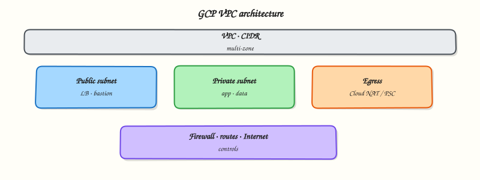

# VPC Networking on Google Cloud

## Overview

Your virtual machine on Google Cloud needs a **network** the same way an office needs corridors and doors. Without a network path, the computer can be “running” but nobody can reach the website on it.

A **VPC network** on Google Cloud is your private network fabric inside the cloud. This tutorial explains VPC for people who have never designed a cloud network: what a subnet is, how routes work, what makes a path “public”, and how **firewall rules** act as allow/deny filters.

This is **Tutorial 1** in **Module 3: Networking** of the REBASH Academy **Google Cloud for Cloud & DevOps Engineers** series — practical Google Cloud for Cloud and DevOps work.

!!! warning "Cost"
    Do **not** create Cloud NAT or a TCP/UDP load balancer in this lab — they are common surprise bills. We use a custom VPC, one subnet, firewall rules, and a short-lived `e2-micro` VM that you delete in Cleanup.

## Prerequisites

- [IAM](iam-identity-access-and-resource-hierarchy.md) — you can run `gcloud` as an allowed identity
- [Networking fundamentals](../networking/index.md) — IP address, CIDR (for example `10.10.0.0/16`), TCP port 80
- Sandbox permission for Compute Engine networking APIs
- Module 1 budget alert still recommended

## Learning Objectives

By the end of this tutorial, you will be able to:

- [ ] Explain VPC network, subnet, route, and firewall rule with an office-building analogy
- [ ] Say what makes a Google Cloud subnet able to reach the internet
- [ ] Contrast firewall rules vs routes in plain English
- [ ] Build a small custom VPC with the CLI and prove HTTP reachability
- [ ] Break and restore a firewall rule (classic interview triage skill)
- [ ] Explain when Cloud NAT and Shared VPC appear in real designs (without building them yet)

## Architecture

A VPC network contains subnets (regional IP ranges). Routes decide where packets go next. Firewall rules filter traffic to instances using **network tags** or other targets. Default internet routes allow egress from VMs with external IPs; ingress from the internet requires an explicit allow rule.



## Theory

### What it is

**VPC** means **Virtual Private Cloud**. On Google Cloud you create a **VPC network**, then **subnets** in regions, then attach VMs (and other services) to those subnets. **Firewall rules** are global to the network (not per-subnet like some people expect from other clouds).

### Why it matters

Most “the site is down” tickets that are not app bugs are path tickets: wrong subnet, missing route, firewall deny, or no external IP when you expected one. Interviews love firewall direction and “why can I SSH from home but not from the office IP range?”

### How it works

1. Create a VPC network (custom mode for labs — you define subnets).
2. Create a subnet with a CIDR in your home region.
3. Create firewall rules (for example allow TCP 22/80 to VMs with a tag).
4. Launch a VM on the subnet with an external IP and matching tags.
5. Prove connectivity; then break a rule and watch it fail.

### Key concepts

| Concept | Plain meaning |
|---------|----------------|
| **VPC network** | Your private network fabric |
| **Subnet** | Regional IP slice (CIDR) inside the VPC |
| **Route** | Next hop for packets (local, internet gateway, appliance) |
| **Firewall rule** | Allow/deny for ingress or egress to targets |
| **Network tag** | Label on a VM used as a firewall target |
| **External IP** | Public address for internet ingress/egress without NAT |
| **Cloud NAT** | Managed egress for private VMs (not in this lab) |
| **Shared VPC** | Host project shares networks with service projects (production pattern) |

### Public path vs private path

On Google Cloud, a VM can reach the internet if routing allows it. For a simple public web lab:

- VM has an **external IP**
- Default route to the internet exists on the network
- **Ingress** firewall allows the client IP (or `0.0.0.0/0` for a disposable lab) to the service port

Private-only VMs (no external IP) need Cloud NAT or a proxy for egress, and typically Identity-Aware Proxy or a bastion for admin access. You will meet those patterns again in production modules.

### Firewall mental model

- Rules are **allow** or **deny**, **ingress** or **egress**
- They target VMs by tag, service account, or all instances
- Priority numbers matter (lower number = higher priority)
- Implied deny ingress / allow egress defaults exist — still write explicit allows you can explain

### Common pitfalls

- Editing the **default** network in a shared training project (avoid — create `rebash-m03-vpc`)
- Forgetting network tags so firewall rules never match
- Opening `0.0.0.0/0` to SSH in production (lab only with cleanup)
- Creating Cloud NAT “to be safe” and leaving it for a week
- Confusing firewall rules with IAM (different layers)

## Hands-on Lab

### Objective

Create a custom VPC and subnet, allow HTTP to tagged VMs, launch a short-lived VM that serves a page, prove curl works, break the firewall, restore it, then delete everything.

### Prerequisites

| Tool | Notes |
|------|--------|
| Modules 1–2 | Project + `gcloud` working |
| Compute Engine API | Will enable in the lab |
| Budget awareness | Delete the VM even if you stop early |

### Lab environment

``` {.bash .ra-terminal title="Terminal"}
mkdir -p ~/rebash-gcp/module-03 && cd ~/rebash-gcp/module-03
export PROJECT_ID="${PROJECT_ID:-$(gcloud config get-value project)}"
export REGION="${REGION:-europe-west2}"
export ZONE="${ZONE:-europe-west2-a}"
export NETWORK="rebash-m03-vpc"
export SUBNET="rebash-m03-subnet"
export VM="rebash-m03-web"
gcloud config set project "$PROJECT_ID"
gcloud config set compute/region "$REGION"
gcloud config set compute/zone "$ZONE"
gcloud services enable compute.googleapis.com --project="$PROJECT_ID"
```

### Real-world scenario

A product team wants a disposable “hello” VM on a **non-default** VPC to prove network understanding before they touch Shared VPC. You must show: custom network, subnet CIDR, firewall tag targeting, and a break/fix story for a blocked port.

### Step-by-step tasks

#### Task 1 – Create custom VPC + subnet

``` {.bash .ra-terminal title="Terminal"}
cd ~/rebash-gcp/module-03
gcloud compute networks create "$NETWORK" \
  --subnet-mode=custom \
  --bgp-routing-mode=regional \
  --format=json | tee network.json
gcloud compute networks subnets create "$SUBNET" \
  --network="$NETWORK" \
  --region="$REGION" \
  --range="10.10.0.0/24" \
  --format=json | tee subnet.json
gcloud compute networks subnets describe "$SUBNET" --region="$REGION" \
  --format="yaml(name,ipCidrRange,network)" | tee subnet-proof.txt
grep -q "10.10.0.0/24" subnet-proof.txt
```

!!! example "Expected output"
    `subnet-proof.txt` shows CIDR `10.10.0.0/24` on your custom network.

#### Task 2 – Firewall rules for SSH and HTTP

``` {.bash .ra-terminal title="Terminal"}
cd ~/rebash-gcp/module-03
gcloud compute firewall-rules create "${NETWORK}-allow-ssh" \
  --network="$NETWORK" \
  --direction=INGRESS \
  --priority=1000 \
  --action=ALLOW \
  --rules=tcp:22 \
  --source-ranges="0.0.0.0/0" \
  --target-tags="rebash-lab" \
  --format=json | tee fw-ssh.json
gcloud compute firewall-rules create "${NETWORK}-allow-http" \
  --network="$NETWORK" \
  --direction=INGRESS \
  --priority=1000 \
  --action=ALLOW \
  --rules=tcp:80 \
  --source-ranges="0.0.0.0/0" \
  --target-tags="rebash-lab" \
  --format=json | tee fw-http.json
gcloud compute firewall-rules list --filter="network:($NETWORK)" \
  --format="table(name,direction,allowed[].map().firewall_rule().list(),targetTags.list())" \
  | tee fw-list.txt
```

!!! warning "Lab-only source range"
    `0.0.0.0/0` is for a short-lived training VM. In production, restrict SSH to bastion / IAP and HTTP to load balancers or known ranges.

#### Task 3 – VM + prove reachability

Create `startup.sh` in your editor (no shell heredoc):

```bash title="startup.sh"
#!/bin/bash
set -euo pipefail
apt-get update -y
apt-get install -y nginx
echo "rebash-m03 ok on $(hostname)" > /var/www/html/index.html
systemctl enable --now nginx
```

``` {.bash .ra-terminal title="Terminal"}
cd ~/rebash-gcp/module-03
chmod +x startup.sh
gcloud compute instances create "$VM" \
  --zone="$ZONE" \
  --machine-type=e2-micro \
  --network-interface="network=${NETWORK},subnet=${SUBNET},network-tier=PREMIUM" \
  --tags=rebash-lab \
  --image-family=debian-12 \
  --image-project=debian-cloud \
  --metadata-from-file=startup-script=startup.sh \
  --format=json | tee vm-create.json
EXTERNAL_IP=$(gcloud compute instances describe "$VM" --zone="$ZONE" \
  --format='get(networkInterfaces[0].accessConfigs[0].natIP)')
echo "$EXTERNAL_IP" | tee external-ip.txt
# Startup can take 1–2 minutes
for i in 1 2 3 4 5 6 7 8 9 10; do
  if curl -fsS --max-time 5 "http://${EXTERNAL_IP}/" | tee curl-allow.txt; then
    break
  fi
  sleep 15
done
grep -q "rebash-m03 ok" curl-allow.txt
```

!!! example "Expected output"
    `curl-allow.txt` contains `rebash-m03 ok` and the hostname.

#### Task 4 – Break/fix the HTTP firewall rule

``` {.bash .ra-terminal title="Terminal"}
cd ~/rebash-gcp/module-03
EXTERNAL_IP=$(cat external-ip.txt)
gcloud compute firewall-rules delete "${NETWORK}-allow-http" --quiet
set +e
curl -fsS --max-time 8 "http://${EXTERNAL_IP}/" 2>&1 | tee curl-deny.txt
DENY_RC=$?
set -e
test "$DENY_RC" -ne 0

# Restore
gcloud compute firewall-rules create "${NETWORK}-allow-http" \
  --network="$NETWORK" \
  --direction=INGRESS \
  --priority=1000 \
  --action=ALLOW \
  --rules=tcp:80 \
  --source-ranges="0.0.0.0/0" \
  --target-tags="rebash-lab"
sleep 5
curl -fsS --max-time 8 "http://${EXTERNAL_IP}/" | tee curl-restored.txt
grep -q "rebash-m03 ok" curl-restored.txt
echo "firewall break/fix OK" | tee evidence.txt
```

!!! example "Expected output"
    After delete, curl fails. After restore, `curl-restored.txt` shows `rebash-m03 ok` again.

### Validation steps

- [ ] Custom VPC and `10.10.0.0/24` subnet exist (before cleanup)
- [ ] Firewall list shows SSH/HTTP rules targeting `rebash-lab`
- [ ] HTTP worked, failed when the rule was removed, then worked again
- [ ] `evidence.txt` present

### Common errors and fixes

| Error you see | Plain meaning | What to do |
|---------------|---------------|------------|
| curl timeouts forever | Startup still running or firewall/tag mismatch | Wait; verify tags on VM; check `fw-list.txt` |
| VM create: subnet not found | Wrong region | Subnet region must match `REGION` |
| SSH works, HTTP fails | nginx not ready or port 80 blocked | Retry Task 3 loop; confirm allow-http |
| Quota errors | Project compute quota | Use another region or delete leftover VMs |

### Challenge exercise

List routes for your VPC and save them:

``` {.bash .ra-terminal title="Terminal"}
cd ~/rebash-gcp/module-03
gcloud compute routes list --filter="network:($NETWORK)" \
  --format="table(name,destRange,nextHopGateway,priority)" | tee routes.txt
test -s routes.txt
```

### Learning outcomes

- You built a non-default VPC path end-to-end
- You used network tags as firewall targets
- You performed firewall break/fix with evidence
- You can explain public ingress without Cloud NAT

### Cleanup

``` {.bash .ra-terminal title="Terminal"}
cd ~/rebash-gcp/module-03
export PROJECT_ID="${PROJECT_ID:-$(gcloud config get-value project)}"
export REGION="${REGION:-europe-west2}"
export ZONE="${ZONE:-europe-west2-a}"
export NETWORK="rebash-m03-vpc"
export SUBNET="rebash-m03-subnet"
export VM="rebash-m03-web"
gcloud compute instances delete "$VM" --zone="$ZONE" --quiet 2>/dev/null || true
gcloud compute firewall-rules delete "${NETWORK}-allow-http" --quiet 2>/dev/null || true
gcloud compute firewall-rules delete "${NETWORK}-allow-ssh" --quiet 2>/dev/null || true
gcloud compute networks subnets delete "$SUBNET" --region="$REGION" --quiet 2>/dev/null || true
gcloud compute networks delete "$NETWORK" --quiet 2>/dev/null || true
rm -f network.json subnet.json subnet-proof.txt fw-ssh.json fw-http.json fw-list.txt \
  vm-create.json external-ip.txt curl-allow.txt curl-deny.txt curl-restored.txt \
  evidence.txt routes.txt
# Keep startup.sh if you want it for Module 4
```

## Validation

- [ ] Lab folder `~/rebash-gcp/module-03` used
- [ ] You can draw VPC → subnet → VM → firewall on paper
- [ ] Break/fix story ready for interviews
- [ ] No leftover VM or custom VPC after cleanup

## Code Walkthrough

1. **Custom mode VPC** — you own the CIDR story instead of using `default`.
2. **Tags on VM + target-tags on firewall** — rules only hit intended instances.
3. **Startup script** — proves the data plane, not only that APIs accepted JSON.
4. **Delete HTTP rule** — classic triage: distinguish “VM down” from “packet filtered”.
5. **Delete VM before network** — dependency order matters in cleanup.

## Security Considerations

- Do not leave SSH open to the world on long-lived VMs; prefer IAP TCP forwarding.
- Prefer load balancers and restricted source ranges for HTTP in production.
- Separate admin and application firewall rules.
- Remember firewalls are not IAM — compromised guest OS still needs hardening.

## Common Mistakes

!!! warning "Firewall rules are per subnet"
    On Google Cloud they belong to the **VPC network** and select targets (tags, service accounts, or all instances).

!!! warning "No external IP means the firewall is broken"
    Private VMs need a different access pattern (IAP, bastion, Private Google Access, Cloud NAT). Missing external IP is often intentional.

!!! warning "Default network is fine forever"
    Training projects often share `default`. Production designs use custom networks and often Shared VPC.

## Best Practices

- Custom mode networks with planned CIDRs
- Tag-based firewall targets
- Deny by default for ingress; open only what you can explain
- Avoid Cloud NAT until a private subnet design needs it
- Document routes and firewall intent next to diagrams

## Troubleshooting

| Symptom | Likely cause | Fix |
|---------|--------------|-----|
| `CONNECTION_TIMED_OUT` | Firewall, wrong IP, or nginx not up | Re-check tags, rules, startup serial log |
| Wrong CIDR overlap | Clashes with on-prem/VPN later | Plan non-overlapping ranges |
| Cannot delete VPC | Resources still attached | Delete VMs/rules/subnets first |
| SSH permission denied | OS login / keys | Use `gcloud compute ssh` after metadata settles |

## Summary

A Google Cloud **VPC network** holds regional **subnets**, **routes**, and **firewall rules**. Public labs usually combine an external IP, an internet route, and an explicit ingress allow. Firewall **break/fix** is a core interview skill. Next you will go deeper on **Compute Engine**, startup scripts, and managed instance patterns.

## Interview Questions

**1. What is a VPC network on Google Cloud?**

??? success "Reveal answer"
    A VPC network is your private virtual network fabric in Google Cloud. It contains subnets, routes, and firewall rules, and is where you attach resources such as Compute Engine VMs.

**2. How do subnets work differently from “one big flat network”?**

??? success "Reveal answer"
    Subnets carve regional CIDR ranges inside the VPC. Resources in a subnet get addresses from that range. Custom mode requires you to create subnets explicitly before launching VMs into them.

**3. What makes a VM reachable from the internet on port 80?**

??? success "Reveal answer"
    Typically: the VM has a path for ingress (often an external IP), routing allows the traffic, a process listens on port 80, and an ingress firewall rule allows TCP 80 to that VM (commonly via a network tag).

**4. How are firewall rules targeted?**

??? success "Reveal answer"
    Rules apply to a VPC network and select targets such as all instances, network tags, or service accounts. Priority and direction (ingress/egress) determine evaluation. Tags are a common lab and production targeting mechanism.

**5. What is Cloud NAT, and why did this lab avoid it?**

??? success "Reveal answer"
    Cloud NAT provides managed egress for VMs without external IPs. It is useful for private subnets but can create ongoing cost. This lab used a short-lived public VM instead.

**6. What is Shared VPC at a high level?**

??? success "Reveal answer"
    A host project owns the VPC and shares selected subnets with service projects. Application teams deploy into shared subnets while a network team keeps central control — a common landing-zone pattern.

**7. How do you triage “curl times out” to a VM?**

??? success "Reveal answer"
    Check VM running state, external IP, listening process, firewall rules and tags, routes, and source IP assumptions. Serial logs help confirm startup scripts. Removing and restoring a firewall rule is a clean isolation test.

**8. Firewall deny vs IAM deny — which did this lab demonstrate?**

??? success "Reveal answer"
    Firewall deny (network path). IAM deny would be `PERMISSION_DENIED` from the API when creating/describing resources. Both matter; they sit at different layers.

## Related Tutorials

- Previous: [IAM](iam-identity-access-and-resource-hierarchy.md)
- Next: [Compute Engine, MIGs, and Load Balancing](compute-engine-migs-and-load-balancing.md)
- [Networking course](../networking/index.md)
- Parallel: [VPC Networking on AWS](../aws/vpc-networking-on-aws.md)

## References

- [VPC networks overview](https://cloud.google.com/vpc/docs/vpc)
- [Firewall rules](https://cloud.google.com/vpc/docs/firewalls)
- [Routes](https://cloud.google.com/vpc/docs/routes)
- [Cloud NAT overview](https://cloud.google.com/nat/docs/overview)
- [Shared VPC](https://cloud.google.com/vpc/docs/shared-vpc)
