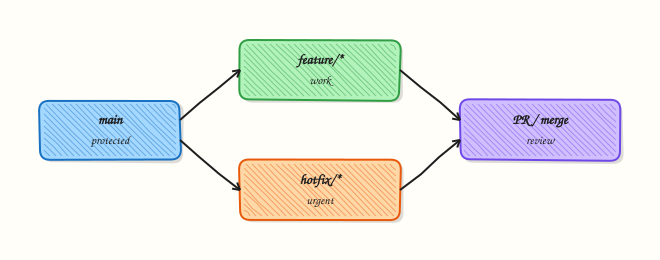

# Advanced Git Workflows

## Overview

Branching strategy determines integration pain, release cadence, and audit shape. **GitFlow** uses long-lived `develop` and `release/*` branches; **GitHub Flow** keeps `main` always deployable with short PRs; **trunk-based development** commits small changes to trunk hourly behind feature flags. Application and platform teams often need different models — this related-depth page goes beyond [Production Git Practices](production-git-practices.md) with promotion mechanics and migration paths.

This is a **Related depth** tutorial in the REBASH Academy **Git & GitHub for Cloud & DevOps Engineers** series.

## Prerequisites

- [Production Git Practices](production-git-practices.md)
- [Pull Requests and Code Review](pull-requests-and-code-review.md)
- [Rebasing and Interactive Rebase](rebasing-and-interactive-rebase.md)

## Learning Objectives

By the end of this tutorial, you will be able to:

- [ ] Contrast GitFlow, GitHub Flow, and trunk-based development with decision criteria
- [ ] Model environment promotion with branches vs tags vs GitOps folders
- [ ] Explain feature flags as alternative to long-lived feature branches
- [ ] Draft CONTRIBUTING.md workflow section for a platform team
- [ ] Complete comparison lab evidence under `~/rebash-git/related/workflows`

## Architecture

Workflow choice constrains branch lifetime, merge methods, release artefacts, and CI investment — all anchored on protected `main`.



## Theory

### What it is

An **advanced Git workflow** is the agreed rules for where work happens, how it integrates, and how releases are cut. **GitFlow** (Vincent Driessen model): `main` + `develop`, feature branches merge to develop, releases from `release/*`, hotfixes from `main`. **GitHub Flow**: branch → PR → merge `main` → deploy. **Trunk-based**: developers commit to trunk (main) within hours; incomplete work hidden behind **feature flags**; release branches optional and short.

### Why it matters

Wrong workflow creates either integration hell (month-long branches) or release chaos (no stabilisation window for on-prem semver). Platform GitOps repos often use GitHub Flow; shrink-wrapped software may need GitFlow release branches. Documenting the choice prevents oral-tradition drift when teams scale.

### How it works

**GitHub Flow (SaaS daily deploy):**
1. Branch from `main`.
2. PR + CI.
3. Merge to `main`.
4. CD/GitOps deploys staging then prod with gates.

**GitFlow (scheduled semver):**
1. Features merge to `develop`.
2. `release/1.2` cut; only fixes allowed.
3. Tag `v1.2.0`; merge to `main` and back to `develop`.
4. Hotfix from `main` tag if needed.

**Trunk-based (high maturity CI):**
1. Small PRs merge to main multiple times daily.
2. Flags hide user-facing incomplete features.
3. No long-lived feature branches; optional release branch ≤ few days.

### Key concepts and comparisons

| Criterion | GitHub Flow | GitFlow | Trunk-based |
|-----------|-------------|---------|-------------|
| Branch lifetime | Days | Weeks–months | Hours–1 day |
| Release cadence | Continuous | Scheduled | Continuous |
| CI maturity needed | High | Medium | Very high |
| Feature flags | Helpful | Optional | Required |
| Audit snapshots | Tags optional | Release branches | Tags/commits |

| Promotion mechanism | Example |
|---------------------|---------|
| Branch | release/2025-Q1 |
| Tag | v2.3.1 on main SHA |
| GitOps folder | clusters/prod bump |

### Common pitfalls

- GitFlow without release manager — develop rots.
- Trunk-based without flags — half-built UX ships.
- Documenting GitHub Flow but running GitFlow in practice.
- Environment branches (`staging`) diverging years — merge nightmares.

## Hands-on Lab

### Objective

Simulate three mini workflow tracks in one lab repo, produce `workflow-matrix.yaml` with scored matrix validated by script, and commit operational `CONTRIBUTING.md` workflow section.

### Prerequisites

- Git 2.x

### Lab environment

Workspace: `~/rebash-git/related/workflows`

```bash
mkdir -p ~/rebash-git/related/workflows && cd ~/rebash-git/related/workflows
set -euo pipefail
```

### Real-world scenario

Engineering leadership asks platform team to document why SaaS services use GitHub Flow while on-prem agent uses quarterly GitFlow-style release branches.

### Step-by-step tasks

#### Task 1 – GitHub Flow track simulation

```bash
cd ~/rebash-git/related/workflows
set -euo pipefail
rm -rf wf-lab
mkdir wf-lab && cd wf-lab
git init -b main
git config user.email 'lab@rebash.local'
git config user.name 'REBASH Lab'
printf 'svc: v1\n' > service.yaml
git add service.yaml && git commit -m 'chore: baseline service'
git switch -c feature/flag-demo
echo 'flag: new_checkout=false' >> service.yaml
git commit -am 'feat: add checkout flag default off'
git switch main
git merge --no-ff feature/flag-demo -m 'merge: PR #1 feature/flag-demo'
git log --oneline --graph | tee ../github-flow-graph.txt
grep -q 'feature/flag-demo' ../github-flow-graph.txt
cd ..
```

**Expected output:** Single merge to main representing PR flow.

#### Task 2 – GitFlow-style release branch simulation

```bash
cd ~/rebash-git/related/workflows/wf-lab
set -euo pipefail
git switch -c develop
echo 'dev: true' >> service.yaml
git commit -am 'feat: develop only tweak'
git switch -c release/0.2.0
echo 'release: stabilising' >> service.yaml
git commit -am 'chore: release branch stabilisation'
git switch main
git merge --no-ff release/0.2.0 -m 'release: v0.2.0'
git tag -a v0.2.0 -m 'GitFlow style release'
git switch develop
git merge main -m 'chore: back-merge release to develop'
git tag -l | tee ../gitflow-tags.txt
grep -q 'v0.2.0' ../gitflow-tags.txt
cd ..
```

**Expected output:** Release branch merged to main; tag v0.2.0; back-merge to develop.

#### Task 3 – Workflow matrix YAML and CONTRIBUTING snippet

Create `workflow-matrix.yaml`:

```yaml
criteria:
  - simplicity
  - scheduled_release_fit
  - cd_gitops_fit
  - small_team_fit
  - mature_ci_required
workflows:
  github_flow:
    simplicity: 5
    scheduled_release_fit: 2
    cd_gitops_fit: 5
    small_team_fit: 5
    mature_ci_required: 4
  gitflow:
    simplicity: 2
    scheduled_release_fit: 5
    cd_gitops_fit: 3
    small_team_fit: 3
    mature_ci_required: 3
  trunk_based:
    simplicity: 4
    scheduled_release_fit: 3
    cd_gitops_fit: 5
    small_team_fit: 4
    mature_ci_required: 5
recommendations:
  saas: github_flow_with_feature_flags
  on_prem_agent: gitflow_quarterly_tags
```

Create `validate-workflow-matrix.sh`:

```bash
#!/usr/bin/env bash
set -euo pipefail
grep -q 'github_flow:' workflow-matrix.yaml
grep -q 'trunk_based:' workflow-matrix.yaml
grep -q 'saas: github_flow' workflow-matrix.yaml
echo 'matrix_ok'
```

Create `CONTRIBUTING.md`:

```markdown
## Git workflow (platform services)

- Branch from `main`: `feature/`, `fix/`, `chore/`
- Open PR; require CI green + 1 review
- Merge squash or merge commit per repo settings
- Delete head branch after merge
- Production via GitOps sync from `main` only
```

Validate and commit:

```bash
cd ~/rebash-git/related/workflows/wf-lab
set -euo pipefail
chmod +x validate-workflow-matrix.sh
./validate-workflow-matrix.sh | tee ../matrix-validate.txt
grep -q 'matrix_ok' ../matrix-validate.txt
git add workflow-matrix.yaml validate-workflow-matrix.sh CONTRIBUTING.md
git commit -m 'chore: workflow matrix YAML and CONTRIBUTING guide'
grep -c 'github_flow\|gitflow\|trunk_based' workflow-matrix.yaml | tee ../comparison-rows.txt
test "$(cat ../comparison-rows.txt)" -ge 3
tar -czf ../related-workflows-evidence.tgz -C .. github-flow-graph.txt gitflow-tags.txt comparison-rows.txt matrix-validate.txt
ls -l ../related-workflows-evidence.tgz | tee ../workflows-evidence.txt
cd ..
```

**Expected output:** Workflow matrix YAML validated; operational CONTRIBUTING committed; evidence tarball.

### Validation steps

- [ ] GitHub Flow merge visible in graph
- [ ] GitFlow-style tag v0.2.0 created
- [ ] `workflow-matrix.yaml` passes validation script
- [ ] CONTRIBUTING.md workflow section present

### Common errors and fixes

| Error | Cause | Fix |
|-------|-------|-----|
| develop diverges | skipped back-merge | merge main/release into develop |
| tag on wrong branch | checked out develop | tag on main commit |
| graph confusing | too many merges | use --oneline --graph |
| policy contradicts | copy-paste | align CONTRIBUTING with ADR |

### Challenge exercise

Add trunk-based simulation: three tiny commits directly on `main` in `trunk-sandbox` branch with `flag_*` toggles in `service.yaml` — merge via fast-forward only; add `trunk_based` scores to `workflow-matrix.yaml` and re-run `validate-workflow-matrix.sh`.

### Learning outcomes

- Simulated GitHub Flow and GitFlow release paths
- Authored scored workflow matrix YAML with validation
- Wrote operational CONTRIBUTING workflow section

### Cleanup

```bash
ls ~/rebash-git/related/workflows/wf-lab
```

## Validation

- [ ] Lab under `~/rebash-git/related/workflows`
- [ ] Can recommend workflow for SaaS vs on-prem
- [ ] Can explain feature flag role in trunk-based
- [ ] Know difference vs Production Git Practices ADR

## Code Walkthrough

1. **Start from team constraints** — release law, audit, cadence — not blog popularity.
2. **Write CONTRIBUTING** — newcomers read this first.
3. **Align CI cost** — GitFlow without automation is manual pain.
4. **Migrate gradually** — shorten branch max age before trunk-based jump.
5. **Revisit ADR yearly** — team size changes optimal model.

## Security Considerations

- Release branches still need signed merges on main
- Hotfix path documented to avoid direct prod kubectl
- Protect develop if GitFlow — not semi-public scratch space
- Tag protection on release tags
- CODEOWNERS on workflow policy files

## Common Mistakes

!!! warning "GitFlow without releases"
    Extra branches, no benefit. **Fix:** Simplify to GitHub Flow.

!!! warning "Trunk-based without CI coverage"
    main breaks constantly. **Fix:** Invest in tests before workflow change.

!!! warning "Long-lived environment branches"
    staging branch never merges — use GitOps env folders or tags instead.

## Best Practices

- ADR per workflow change ([Production Git Practices](production-git-practices.md))
- Feature flags owned by product + platform
- Max branch age metric (e.g. 14 days)
- Release manager role for GitFlow
- Train interview candidates on your actual model

## Troubleshooting

| Symptom | Likely cause | Fix |
|---------|--------------|-----|
| Teams use different flows | No ADR | publish decision |
| Release branch never ends | scope creep | freeze features; ship |
| main not deployable | long branches merge | smaller PRs |
| Flag debt | flags never removed | flag cleanup sprints |

## Summary

Advanced workflows are organisational choices expressed in Git — match model to cadence, CI maturity, and compliance, then document in CONTRIBUTING and ADRs. Return to [course index](index.md) or optional [Git Hooks](git-hooks-and-automation.md).

## Interview Questions

**1. When choose GitFlow over GitHub Flow?**

??? success "Reveal answer"
    Scheduled semver releases, multiple supported versions, packaged software delivered to customers who cannot take daily deploys — when release stabilisation branches add value.

**2. Trunk-based prerequisite?**

??? success "Reveal answer"
    Strong CI, feature flags, culture of fixing main immediately, small batches — high integration frequency discipline.

**3. Feature flags vs long feature branches?**

??? success "Reveal answer"
    Flags hide incomplete work on main safely; long branches defer integration risk until painful merge — trunk-based prefers flags.

**4. GitFlow hotfix path?**

??? success "Reveal answer"
    Branch from production tag on main, fix, tag patch release, merge to main and develop (and release branch if open) — ship fast without waiting for develop features.

**5. Environment promotion without env branches?**

??? success "Reveal answer"
    GitOps `clusters/staging` vs `clusters/prod` folders, or deploy same main SHA to staging then promote tag/manifest to prod — avoid long-lived staging branch diverging from main.

**6. Migrate GitFlow → GitHub Flow?**

??? success "Reveal answer"
    Gradually: shorten release branches, increase deploy frequency, strengthen CI, retire develop or sync develop daily to main, document ADR, train team on PR-to-prod path.

**7. Platform vs app team different workflows?**

??? success "Reveal answer"
    Common — app SaaS on GitHub Flow; platform modules semver tags; infra GitOps repos PR-to-main — unify principles (review, CI) not identical branch names.

**8. CONTRIBUTING.md purpose in workflow?**

??? success "Reveal answer"
    Onboarding contract — branch naming, PR rules, merge method, who owns releases — reduces ad hoc git habits and audit surprises.

## Related Tutorials

- [Production Git Practices](production-git-practices.md)
- [Pull Requests and Code Review](pull-requests-and-code-review.md)
- [Git Submodules and Subtrees](git-submodules-and-subtrees.md)
- [Git in CI/CD and DevOps](git-in-ci-cd-and-devops.md)
- [Course index](index.md)

## References

- [GitHub Flow](https://docs.github.com/en/get-started/using-github/github-flow)
- [Trunk Based Development](https://trunkbaseddevelopment.com/)
- [A successful Git branching model (GitFlow)](https://nvie.com/posts/a-successful-git-branching-model/)
