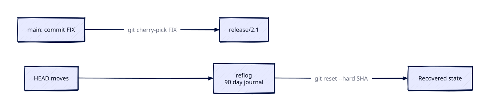

# Cherry-pick and Reflog

## Overview

Production is on `release/2.1` but the fix landed on `main` — cherry-pick copies that commit without merging entire branches. Accidentally ran `git reset --hard` — reflog remembers where HEAD was yesterday. These tools are essential for hotfix backports and disaster recovery.

This is **Tutorial 14** in **Module 5: Recovery & Debugging** of the REBASH Academy Git series.

## Prerequisites

- [Undoing Changes — Reset, Revert, and Stash](undoing-changes-reset-revert-stash.md)
- [Rebasing and Interactive Rebase](rebasing-and-interactive-rebase.md)

## Learning Objectives

By the end of this tutorial, you will be able to:

- [ ] Cherry-pick commits onto another branch
- [ ] Resolve cherry-pick conflicts and continue/abort
- [ ] Cherry-pick ranges and multiple commits
- [ ] Use reflog to find lost commits and branches
- [ ] Recover from reset, rebase, and deleted branch mistakes
- [ ] Backport hotfixes to release branches
- [ ] Understand reflog expiration and limitations

## Architecture

Cherry-pick copies a commit’s patch onto another branch; reflog records local HEAD movements so you can recover after resets and deleted branches.



## Theory

### git cherry-pick

Cherry-pick applies the **patch** of a specific commit onto the current branch. Git creates a **new** commit with a new SHA and (usually) the same tree diff relative to the new parent:

```bash
git switch release/2.1
git cherry-pick abc1234
```

The original commit remains on its branch. You now have two commits that introduce the same change — useful for backports, dangerous if you later merge both lines without noticing duplicates.

Use cases:

- **Hotfix backport** — fix on `main` → cherry-pick onto a maintained release branch
- **Selective feature** — lift one commit from a large feature branch without taking unrelated work
- **Recover a single commit** from an abandoned or rewritten branch tip

Prefer cherry-picking **reviewed** commits only. Backporting an unreviewed emergency patch can spread a vulnerability across every release line you touch.

### How the Patch Is Computed

Git reconstitutes the diff between the cherry-picked commit and its parent, then applies that diff to `HEAD`. That is why cherry-pick can conflict even when merge would succeed: the surrounding context on the target branch may differ, or an earlier dependency commit may be missing.

When cherry-picking a sequence, apply commits in chronological order so each patch sees the prerequisites introduced by earlier picks.

### Cherry-pick vs Merge vs Rebase

| Aspect | Cherry-pick | Merge | Rebase |
|--------|-------------|-------|--------|
| Scope | Selected commit(s) | Entire branch | Replay branch tip |
| History | Extra commit(s) on target | Merge commit or fast-forward | Rewritten SHAs on source branch |
| Duplicates | Same change, two SHAs | Single integration point | Usually no duplicate once replayed |
| Shared branches | Safe on release lines | Preferred for integrating features | Avoid on published history |

Cherry-picked commits appear twice in history (different SHAs) — document the source SHA in release notes. Use `-x` so the commit message records the origin:

```bash
git cherry-pick -x abc1234
```

### Conflict Resolution

Conflict handling matches merge and rebase workflows:

```bash
# fix conflicts in the working tree
git add resolved-file
git cherry-pick --continue
git cherry-pick --abort
git cherry-pick --skip
```

Inspect `git status` carefully: you may be mid-sequence (`cherry-picking` multiple SHAs). Aborting drops the whole in-progress sequence, not only the current commit.

### Cherry-pick Range

```bash
git cherry-pick A..B      # commits after A through B (exclusive A)
git cherry-pick A^..B     # include A
git cherry-pick C1 C2 C3  # explicit list, oldest first recommended
```

Order matters — Git applies oldest first when you pass a range. For hotfixes, an explicit list of SHAs from the incident ticket is clearer than an open-ended range.

### Cherry-pick Merge Commits

Cherry-picking a merge commit requires `-m` to choose the mainline parent. Prefer cherry-picking the individual non-merge commits from the feature branch instead — the intent is clearer in review and less likely to drag unintended parents.

### No-commit Cherry-pick

```bash
git cherry-pick -n abc1234   # apply without committing
```

Useful when you must combine several picks, amend a message for the release branch, or run tests before creating the backport commit.

### Empty Cherry-picks

If the change is already present (perhaps via an earlier backport), Git may stop with an empty cherry-pick. Use `--skip` when that is expected, or `git cherry` beforehand to see which patches are still missing.

### Reflog — Git's Safety Journal

Reflog records when HEAD and branch tips moved:

```bash
git reflog
git reflog show main
```

Format: `SHA HEAD@{n}: action: description`

Entries include commits that remain reachable from those recorded tips even after a hard reset — but reflog is **local only**. It is not pushed to the remote and is not a substitute for regular pushes of important work.

### Recovery Scenarios

**Lost after hard reset:**

```bash
git reflog
git reset --hard HEAD@{3}
```

**Deleted branch:**

```bash
git reflog | grep "checkout: moving from feature"
git switch -c feature-recovered SHA
```

**Failed rebase:**

```bash
git reflog
git reset --hard HEAD@{1}   # before rebase started
```

After recovery, push with care. If the branch was already published, prefer `git push --force-with-lease` only when the team expects a rewrite — release branches often forbid force-push entirely, in which case recover onto a new branch name and open a PR.

### Reflog Expiration

Defaults are typically 90 days for reachable entries and 30 days for unreachable ones, controlled by `gc.reflogExpire` and `gc.reflogExpireUnreachable`. Do not rely on reflog as a permanent backup — push important commits and tags to a remote you control.

### git cherry — Already Applied?

Check whether equivalent patches from a topic branch already exist on another branch:

```bash
git cherry main feature-branch
```

`+` means the patch is not on `main`; `-` means an equivalent patch is already present. Use this before mass backports so you do not create noisy empty or duplicate cherry-picks.

## Hands-on Lab

### Step 1 – Build main and release branches

**Command:**

```bash
mkdir -p /tmp/git-cherry-lab && cd /tmp/git-cherry-lab
git init -b main
echo "v2.0" > VERSION && git add . && git commit -m "release: v2.0 baseline"
git switch -c release/2.0
git switch main
echo "fix: critical patch" >> patch.log
git add patch.log && git commit -m "fix: critical security patch"
FIX_SHA=$(git rev-parse HEAD)
git log --oneline --all
```

**Expected result:** `git log --oneline --all` shows `main` with the fix commit and `release/2.0` at the baseline.

### Step 2 – Cherry-pick fix to release

**Command:**

```bash
git switch release/2.0
git cherry-pick "$FIX_SHA"
git log --oneline --graph --all
cat patch.log
```

**Expected result:** Cherry-pick creates a new commit on `release/2.0`; `patch.log` contains the fix text.

### Step 3 – Simulate disaster and recover

**Command:**

```bash
git switch main
git branch -D release/2.0
git reflog | head -10
RECOVER=$(git rev-parse "$FIX_SHA")
git switch -c release/2.0-recovered HEAD~1
git cherry-pick "$RECOVER"
git log --oneline -3
```

**Expected result:** Reflog still lists the deleted branch tip; recovered branch contains the cherry-picked fix.

### Step 4 – Reflog after hard reset

**Command:**

```bash
git switch main
TIP=$(git rev-parse HEAD)
git reset --hard HEAD~2
git log --oneline -2
git reset --hard "$TIP"
git log --oneline -3
```

**Expected result:** Hard reset moves HEAD back; second hard reset restores the tip via the saved SHA.

### Step 5 – Cherry-pick conflict

**Command:**

```bash
git switch -c conflict-demo HEAD~2
echo "different" > patch.log && git add . && git commit -m "conflict setup"
git switch main
git cherry-pick HEAD~1 2>/dev/null || git cherry-pick $(git rev-parse conflict-demo) || true
# Manual resolution if conflict:
git status
git cherry-pick --abort 2>/dev/null || true
```

**Expected result:** `git status` reports a cherry-pick conflict (or abort leaves a clean tree after `--abort`).

### Step 6 – Clean up

**Command:**

```bash
cd /tmp && rm -rf git-cherry-lab
```

**Expected result:** Lab directory `/tmp/git-cherry-lab` is gone.


## Validation

Confirm the lab before moving on:

1. Re-run the critical commands from the Hands-on Lab and compare them to the expected output in each step.
2. Check that you can explain *why* each successful result matters (not only that it printed).
3. Note any warnings or unexpected output — resolve them using Troubleshooting before continuing.

| Check | Pass criteria |
|-------|----------------|
| Cherry-pick | Fix commit appears on release branch with new SHA |
| Reflog recover | Deleted/reset commit recoverable via reflog SHA |
| Conflict | Cherry-pick conflict detected and aborted/resolved as lab shows |
| Cleanup | `/tmp/git-cherry-lab` removed |

## Code Walkthrough

| Command | Description | Example |
|---------|-------------|---------|
| `git cherry-pick SHA` | Apply commit | `git cherry-pick abc1234` |
| `git cherry-pick A..B` | Range of commits | `git cherry-pick main~3..main` |
| `git cherry-pick -x SHA` | Append source SHA to message | Audit trail |
| `git cherry-pick --abort` | Cancel cherry-pick | On conflict |
| `git reflog` | Show HEAD history | Recovery first step |
| `git reflog show branch` | Branch-specific reflog | `git reflog show main` |
| `git cherry main feature` | Check if commits applied | Backport verification |

### Hotfix backport script

```bash
#!/usr/bin/env bash
# backport.sh — cherry-pick commit to release branch
set -euo pipefail
COMMIT="${1:?Usage: backport.sh COMMIT_SHA release/x.y}"
RELEASE="${2:?release branch required}"
git fetch origin
git switch "$RELEASE"
git pull --ff-only origin "$RELEASE"
git cherry-pick -x "$COMMIT"
git push origin "$RELEASE"
echo "Backported $COMMIT to $RELEASE"
```

## Security Considerations

- Cherry-pick only reviewed commits; backporting an unreviewed hotfix can spread a vulnerability
- Use `cherry-pick -x` so audit trails show the source SHA
- Reflog is local — do not rely on it as a backup for commits never pushed
- Restrict who can force-update release branches after recovery resets
- Scrub recovered branches for secrets before publishing them again

## Common Mistakes

!!! warning "Cherry-picking without -x on release branches"
    `-x` appends `(cherry picked from commit ...)` — audit trail for compliance.

!!! warning "Cherry-picking merge commits without -m"
    Fails or applies wrong diff. Pick individual commits instead.

!!! warning "Assuming reflog exists on remote"
    Reflog is local only. Deleted remote branches need platform recovery or teammate clone.

!!! warning "Cherry-pick order wrong for dependent commits"
    Pick oldest first; dependency failures cause conflicts.

## Best Practices

!!! tip "Tag release branches after backport"
    Annotated tag documents which fixes landed in patch release.

!!! tip "Run git cherry before batch backport"
    Skip already-applied commits.

!!! tip "Document backports in CHANGELOG"
    Link cherry-picked SHAs to CVE or incident tickets.

!!! tip "Increase reflog retention on build machines"
    CI runners doing complex rebases benefit from longer reflogExpire.

## Troubleshooting

| Issue | Cause | Solution |
|-------|-------|----------|
| Cherry-pick empty | Change already present | Skip with `--skip` or `--continue` |
| Conflict on pick | Diverged files | Resolve; continue or abort |
| Commit not in reflog | Too old or gc pruned | Remote recovery; platform support |
| Wrong commit recovered | Misread reflog | Verify SHA with `git show` before reset |
| Duplicate fix different SHA | Expected with cherry-pick | Document; don't re-pick |
| `fatal: bad object` | Corrupt repo | fsck; re-clone |

## Summary

- **Cherry-pick** applies specific commit(s) to current branch — ideal for hotfix backports
- Use **-x** for audit trail; resolve conflicts like merge/rebase
- **Reflog** records local HEAD movements — primary recovery tool after reset/rebase
- Reflog is **local and time-limited** — not a substitute for remote backup
- **git cherry** verifies whether commits already exist on target branch

## Interview Questions

1. What does git cherry-pick do?
2. When would you cherry-pick instead of merge?
3. How do you recover a commit after git reset --hard?
4. What is reflog, and where is it stored?
5. How long does reflog retain entries?
6. What does cherry-pick -x add to commit messages?
7. How do you cherry-pick a range of commits?
8. Why doesn't reflog help recover deleted remote branches?
9. What is the difference between cherry-pick and revert?
10. How do you abort a failed cherry-pick?

??? tip "Sample Answers (Questions 1 and 3)"

    **Q1 — cherry-pick:** Git computes the diff introduced by a specified commit and applies it to the current branch as a new commit with a new SHA. Metadata (author date) may differ from committer date. Used to port fixes without merging entire branches.

    **Q3 — Recover after hard reset:** Run `git reflog` to find SHA before reset (e.g., HEAD@{1}). Verify with `git show SHA`. Run `git reset --hard SHA` to restore branch tip. Push only if branch is private or coordinate force push.

## Related Tutorials

- [Undoing Changes — Reset, Revert, and Stash](undoing-changes-reset-revert-stash.md) *(previous)*
- [Git Bisect and Debugging History](git-bisect-and-debugging-history.md) *(next)*
- [Rebasing and Interactive Rebase](rebasing-and-interactive-rebase.md)
- [Merging and Merge Conflicts](merging-and-merge-conflicts.md)
- [Git – Category Overview](index.md)
- Cheat sheet: [Git Cheat Sheet](../cheatsheets/git.md)
- Interview prep: [Git Interview Prep](../interview/git.md)
- Learning path: [DevOps Engineer](../learning-paths/devops-engineer.md)

## References

- [Pro Git Book – Rebasing – Cherry-picking](https://git-scm.com/book/en/v2/Git-Branching-Rebasing)
- [git cherry-pick documentation](https://git-scm.com/docs/git-cherry-pick)
- [git reflog documentation](https://git-scm.com/docs/git-reflog)
- [Atlassian – git reflog](https://www.atlassian.com/git/tutorials/rewriting-history/git-reflog)
- [REBASH Academy – Git Overview](index.md)
