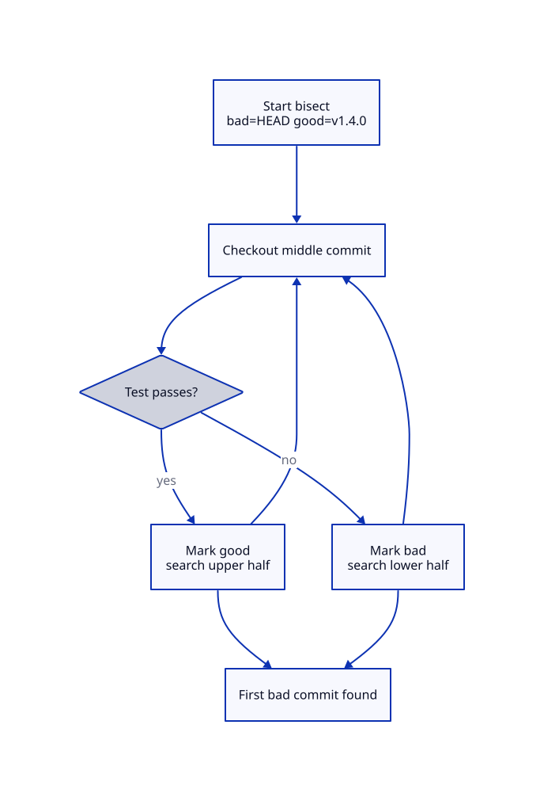

# Git Bisect and Debugging History

## Overview

Production worked in v1.4.0 but fails in v1.5.0 — which of 200 commits broke it? Manual search is impractical. `git bisect` performs binary search through history, halving the candidate set with each test. Combined with automated test scripts, bisect finds regression commits in logarithmic time.

This is **Tutorial 15** in **Module 5: Recovery & Debugging** of the REBASH Academy Git series.

## Prerequisites

- [Cherry-pick and Reflog](cherry-pick-and-reflog.md)
- [Viewing History and Diffs](viewing-history-and-diffs.md)

## Learning Objectives

By the end of this tutorial, you will be able to:

- [ ] Start and run manual git bisect sessions
- [ ] Automate bisect with test scripts (`git bisect run`)
- [ ] Mark commits good/bad/skip appropriately
- [ ] Bisect across merge commits and tags
- [ ] Visualize bisect progress and results
- [ ] Integrate bisect into CI debugging workflows
- [ ] Reset cleanly after bisect with `git bisect reset`

## Architecture

Bisect performs a binary search across history: you mark good and bad commits until Git identifies the first change that introduced the fault.



## Theory

### Binary Search Concept

Given a known **good** commit (works) and a **bad** commit (broken), bisect checks out a midpoint and asks: good or bad? Each answer eliminates roughly half the remaining commits.

For *N* commits you need about log₂(*N*) tests — 1,024 commits need around 10 tests. That is why bisect dominates linear `git log` browsing during incidents: the cost grows slowly even when release trains contain hundreds of merges.

Bisect does not invent knowledge. It only narrows the set of commits that could explain a **reproducible** predicate you define (test failed, metric above threshold, plan errored). If the predicate is noisy, the binary search converges on the wrong SHA.

### Starting Bisect

```bash
git bisect start
git bisect bad                    # current HEAD is broken
git bisect good v1.4.0            # tag known good
```

Git checks out a middle commit and detaches HEAD. You test manually:

```bash
make test
git bisect good    # if pass
git bisect bad     # if fail
```

Repeat until Git prints the first bad commit. At that point, read the commit with `git show` and confirm the change matches the symptom before you open a fix PR.

You may also start with both ends in one command:

```bash
git bisect start HEAD v1.4.0
```

Here `HEAD` is treated as bad and `v1.4.0` as good. Prefer tags or release SHAs from the incident ticket so teammates can reproduce the same search.

### Automated Bisect

```bash
git bisect start HEAD v1.4.0
git bisect run ./test.sh
```

Script exit codes:

- **0** — good
- **1–124, 126–127** — bad
- **125** — skip (untestable commit)

```bash
#!/usr/bin/env bash
# test.sh for bisect — keep side effects local to the worktree
set -euo pipefail
make build && ./run-integration-test.sh
```

Automation enables overnight bisect on large histories. Keep the script **hermetic**: no production deploys, no writes to shared databases, and no reliance on services that differ between commits unless you stub them.

### Designing a Good Bisect Predicate

| Predicate type | Example | Pitfall |
|----------------|---------|---------|
| Unit/integration test | `go test ./...` | Flaky tests flip good/bad randomly |
| Build | `make` / `terraform validate` | Build tool upgrades may break older commits |
| Behavioural check | `curl` health endpoint in a local compose stack | Network timeouts look like regressions |
| Metric threshold | Script fails if p95 latency > 200 ms | Noise needs repeats or medians |

Write the predicate so **exit 0 means the old good behaviour**. Do not invert the sense halfway through a session.

### Skip Commits

Non-buildable commits (missing dependency, broken CI tooling) should be skipped rather than guessed:

```bash
git bisect skip
```

Too many skips may prevent an exact answer — bisect warns when the remaining range cannot be resolved cleanly. In that case, widen the good/bad boundaries or fix the build on the skipped tip in a throwaway branch solely to keep searching.

### Bisect and Merges

On merge-heavy repos, walking every merge parent can land you inside topic branches that never shipped. Prefer the first-parent history of the integration branch when the regression appeared on `main`:

```bash
git bisect start --first-parent
```

If the bug only reproduces after a specific merge, note that in the ticket — the first bad commit may be the merge itself, not a feature commit.

### Worktrees for Parallel Investigation

While bisect detaches HEAD in one clone, you can keep a second worktree on `main` for drafting the fix:

```bash
git worktree add /tmp/fix-worktree main
```

That avoids stashing bisect state or accidentally committing a fix on a detached commit mid-search.

### Finding Good/Bad Boundaries

| Reference | Example |
|-----------|---------|
| Tag | `v1.4.0` |
| Commit SHA | `abc1234` |
| Relative | `HEAD~50` |
| Branch tip | `origin/main` |

Document good/bad boundaries in incident tickets. Re-verify the good boundary once — a mis-tagged “good” release wastes the entire search.

### After Bisect

```bash
git bisect reset    # return to original branch
```

Always reset — bisect leaves you in detached HEAD. If you need the culprit SHA later, copy it from the final bisect message or save the session log first:

```bash
git bisect log > /tmp/bisect.log
# note the "first bad commit" SHA from the terminal output, then:
git bisect reset
```

### DevOps Use Cases

- **Terraform plan regression** — which commit changed module source or provider constraints?
- **Docker build failure** — which Dockerfile or base-image pin broke the build?
- **Flaky test introduction** — harder; run the test multiple times per commit or use a quarantine signal
- **Performance regression** — script comparing response time against a threshold with warm-up discarded
- **Kubernetes manifest drift** — render manifests and `diff` against a known-good golden file

### git bisect log and replay

```bash
git bisect log > bisect.log
git bisect replay bisect.log
```

Share the bisect session with teammates so they can audit how you marked commits. Replay is also useful when a CI runner dies mid-search.

### Limitations

- Requires a reproducible good/bad test
- Shallow clones may lack commits — `git fetch --unshallow` first
- Flaky tests produce wrong results
- Submodule repositories need the submodule pins checked out at each step
- Monorepos may need path-scoped builds so unrelated packages do not dominate runtime

## Hands-on Lab

### Step 1 – Create history with intentional bug

**Command:**

```bash
mkdir -p /tmp/git-bisect-lab && cd /tmp/git-bisect-lab
git init -b main

good_test() { test "$(cat counter.txt 2>/dev/null)" -lt 5; }

for i in 1 2 3 4 5 6 7 8; do
  echo "$i" > counter.txt
  git add counter.txt
  if [ "$i" -le 4 ]; then
    git commit -m "feat: increment to $i (good)"
  else
    git commit -m "feat: increment to $i (bad region)"
  fi
done
git log --oneline
```

**Explanation:** Commits 5-8 are "bad" when threshold is `< 5`.

**Expected result:** Repository contains a linear history with an intentional bad commit in the middle.

### Step 2 – Manual bisect

**Command:**

```bash
git bisect start
git bisect bad HEAD
git bisect good HEAD~7
# Test current counter
VAL=$(cat counter.txt)
if [ "$VAL" -lt 5 ]; then git bisect good; else git bisect bad; fi
# Repeat until found — or use run script below
git bisect reset
```

**Expected result:** Manual bisect session prints the first bad commit SHA matching the injected fault.

### Step 3 – Automated bisect

**Command:**

```bash
cat > test.sh << 'EOF'
#!/usr/bin/env bash
val=$(cat counter.txt)
test "$val" -lt 5
EOF
chmod +x test.sh
git bisect start HEAD HEAD~7
git bisect run ./test.sh
git bisect reset
```

**Expected:** First bad commit is when counter reaches 5.

### Step 4 – Inspect culprit commit

**Command:**

```bash
git log --oneline | head -5
git show HEAD~4 --stat
```

**Expected result:** `git show` / log of the culprit matches the breaking change.

### Step 5 – Clean up

**Command:**

```bash
cd /tmp && rm -rf git-bisect-lab
```

**Expected result:** `git bisect reset` done; `/tmp/git-bisect-lab` removed.


## Validation

Confirm the lab before moving on:

1. Re-run the critical commands from the Hands-on Lab and compare them to the expected output in each step.
2. Check that you can explain *why* each successful result matters (not only that it printed).
3. Note any warnings or unexpected output — resolve them using Troubleshooting before continuing.

| Check | Pass criteria |
|-------|----------------|
| Manual bisect | Session identifies the first bad commit |
| Automate | `git bisect run` (or documented script) exits with the culprit |
| Reset | `git bisect reset` returns you to a normal branch |
| Cleanup | `/tmp/git-bisect-lab` removed |

## Code Walkthrough

| Command | Description | Example |
|---------|-------------|---------|
| `git bisect start` | Begin session | `git bisect start bad good` |
| `git bisect good` | Mark current good | After successful test |
| `git bisect bad` | Mark current bad | After failed test |
| `git bisect skip` | Skip untestable | Broken build commit |
| `git bisect run script` | Automated bisect | `git bisect run ./test.sh` |
| `git bisect reset` | End and restore | Always run when done |
| `git bisect log` | Export session | Share with team |

### Terraform plan bisect test

```bash
#!/usr/bin/env bash
# tf-plan-bisect.sh — exit 0 if plan succeeds without errors
set -euo pipefail
terraform init -backend=false -input=false >/dev/null 2>&1
terraform validate
terraform plan -detailed-exitcode -input=false >/dev/null 2>&1
rc=$?
# 0 = no changes (good), 2 = changes (good), 1 = error (bad)
test "$rc" -ne 1
```

## Security Considerations

- Bisect scripts must not deploy or mutate production; run them in disposable worktrees
- Do not mark commits good/bad based on flaky tests — you may ship the wrong fix
- Skip commits that cannot build rather than guessing, and document skips
- When the first bad commit touches auth or crypto, escalate for security review
- Clean up bisect state (`git bisect reset`) so detached HEAD does not confuse later pushes

## Common Mistakes

!!! warning "Forgetting git bisect reset"
    Leaves repo in detached HEAD — confusing subsequent work.

!!! warning "Wrong good/bad boundaries"
    If good is actually bad, bisect returns wrong commit. Verify boundaries first.

!!! warning "Bisect with flaky tests"
    Random failures mislead binary search. Stabilize test or run multiple times.

!!! warning "Shallow clone missing commits"
    `git fetch --unshallow` before bisect across long history.

## Best Practices

!!! tip "Automate with git bisect run"
    Manual bisect error-prone on >20 steps. Script the test.

!!! tip "Use tags for release boundaries"
    `git bisect good v1.4.0` clearer than SHA in incident docs.

!!! tip "Document bisect result in postmortem"
    Link first-bad commit to fix PR and root cause.

!!! tip "Add bisect helper to Makefile"
    `make bisect-good-release` standardizes test command for team.

## Troubleshooting

| Issue | Cause | Solution |
|-------|-------|----------|
| Bisect cannot find commit | Too many skips | Reduce skips; widen good/bad range |
| Wrong commit identified | Flaky or wrong test | Fix test; re-run bisect |
| `fatal: Needed a single revision` | Invalid ref | Verify tag/SHA exists |
| Bisect stuck in loop | Inconsistent good/bad | Reset; verify test logic |
| Script always exits 125 | Misconfigured skip | Fix script exit codes |
| No commits to bisect | Good and bad adjacent | Already found; inspect good..bad |

## Summary

- **git bisect** binary-searches history between known good and bad commits
- Manual mode: mark **good**/**bad** after each test; automated: **git bisect run**
- Exit code **125** skips untestable commits; **0** good, non-zero bad for scripts
- Always **git bisect reset** when finished
- Essential for regression hunting in IaC, builds, and integration tests

## Interview Questions

1. How does git bisect work algorithmically?
2. What exit codes should a bisect test script use?
3. When would you use git bisect skip?
4. How many steps to bisect 1000 commits approximately?
5. What is git bisect run?
6. Why must you run git bisect reset after finishing?
7. What are limitations of bisect with flaky tests?
8. How do tags help bisect in release debugging?
9. How does shallow clone affect bisect?
10. Give a DevOps scenario where bisect saves significant time.

??? tip "Sample Answers (Questions 1 and 10)"

    **Q1 — Algorithm:** Bisect maintains a range of commits between known good and bad boundaries. It checks out the midpoint commit. If test passes, the bad commit must be later — shrink range to upper half. If fails, bad is in lower half. Repeat until the first bad commit is isolated. Complexity O(log n).

    **Q10 — DevOps scenario:** After weekly deploy, Terraform plan suddenly wants to destroy production RDS. Good state is last week's tag v2.3.0; bad is current main. Bisect with `terraform plan` exit code script finds the exact commit that changed module version or removed lifecycle block — hours of manual log review reduced to ~10 automated tests.

## Related Tutorials

- [Cherry-pick and Reflog](cherry-pick-and-reflog.md) *(previous)*
- [Git Hooks and Automation](git-hooks-and-automation.md) *(next — Module 6)*
- [Viewing History and Diffs](viewing-history-and-diffs.md)
- [Undoing Changes — Reset, Revert, and Stash](undoing-changes-reset-revert-stash.md)
- [Git – Category Overview](index.md)
- Cheat sheet: [Git Cheat Sheet](../cheatsheets/git.md)
- Interview prep: [Git Interview Prep](../interview/git.md)
- Learning path: [DevOps Engineer](../learning-paths/devops-engineer.md)

## References

- [Pro Git Book – Debugging with Git](https://git-scm.com/book/en/v2/Git-Tools-Debugging-with-Git)
- [git bisect documentation](https://git-scm.com/docs/git-bisect)
- [Kernel.org – Bisecting regressions](https://www.kernel.org/doc/html/latest/process/debugging/gdb-kernel-debugging.html)
- [REBASH Academy – Git Overview](index.md)
