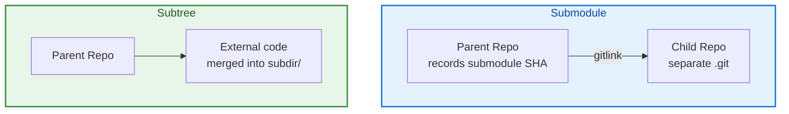

# Git Submodules and Subtrees

## Overview

Platform teams reuse Terraform modules, Helm charts, and shared libraries across repositories. **Submodules** pin exact commits of nested repos; **subtrees** merge external history into a subdirectory. Both solve dependency management — with different tradeoffs in complexity, clone experience, and update workflows.

This is **Tutorial 18** in **Module 6: Advanced & DevOps** of the REBASH Academy Git series.

## Prerequisites

- [Advanced Git Workflows](advanced-git-workflows.md)
- [Working with Remotes](working-with-remotes.md)
- Understanding of commit SHAs and remotes

## Learning Objectives

By the end of this tutorial, you will be able to:

- [ ] Add, update, and clone repositories with submodules
- [ ] Understand `.gitmodules` configuration
- [ ] Compare submodules vs subtrees vs package registries
- [ ] Add and update subtrees with `git subtree`
- [ ] Diagnose common submodule clone and CI failures
- [ ] Choose embedding strategy for shared Terraform modules
- [ ] Remove submodules cleanly

## Submodule vs Subtree Diagram



## Theory

### Why Embed Repositories?

| Approach | When |
|----------|------|
| **Copy-paste** | Quick, no linkage — drift guaranteed |
| **Package registry** | Terraform Registry, npm, Helm repo — preferred for versioned artifacts |
| **Submodule** | Pin exact source commit; child repo independent |
| **Subtree** | Single clone; external history merged in subdirectory |
| **Monorepo** | Everything in one repo — Bazel/Nx tooling |

Submodules/subtrees fit when source must stay in Git but separate lifecycle.

### Git Submodules

Parent repo stores a **gitlink** — special entry recording submodule path and commit SHA. Configuration in `.gitmodules`:

```ini
[submodule "modules/vpc"]
    path = modules/vpc
    url = git@github.com:org/terraform-vpc.git
    branch = main
```

Add submodule:

```bash
git submodule add git@github.com:org/terraform-vpc.git modules/vpc
git commit -m "chore: add vpc module submodule"
```

Clone with submodules:

```bash
git clone --recurse-submodules URL
# or after clone:
git submodule update --init --recursive
```

Update to latest remote commit:

```bash
cd modules/vpc
git fetch && git checkout origin/main
cd ../..
git add modules/vpc
git commit -m "chore: bump vpc module"
```

Or:

```bash
git submodule update --remote modules/vpc
```

### Submodule Characteristics

**Pros:**

- Exact commit pinning — reproducible builds
- Child repo independent history
- Clear ownership boundary

**Cons:**

- Clone requires extra steps (`--recurse-submodules`)
- Easy to commit parent pointing to wrong SHA
- CI must initialize submodules
- Detached HEAD in submodule confuses developers
- Recursive submodule complexity

### Git Subtrees

Merge external repo into subdirectory — history optionally preserved:

```bash
git subtree add --prefix=modules/vpc \
  git@github.com:org/terraform-vpc.git main --squash
```

Update:

```bash
git subtree pull --prefix=modules/vpc \
  git@github.com:org/terraform-vpc.git main --squash
```

Push changes back upstream (if permitted):

```bash
git subtree push --prefix=modules/vpc \
  git@github.com:org/terraform-vpc.git main
```

**Pros:**

- Single clone — no extra init step
- Works transparently for most developers
- No detached HEAD in subdirectory

**Cons:**

- History can bloat (without --squash)
- Push back to upstream is complex
- Less obvious which external version is pinned

### Submodules vs Subtrees Decision

| Criterion | Submodule | Subtree |
|-----------|-----------|---------|
| Clone simplicity | Poor | Good |
| Pin exact version | Explicit SHA | Merge commit |
| CI complexity | Higher | Lower |
| Upstream contribution | Easy in submodule | Harder push |
| Team familiarity | Lower | Higher |

**Terraform modules:** Prefer **Terraform Registry** or **module source with ref** over submodules when possible. Use submodules when internal modules aren't published.

### CI/CD with Submodules


```yaml
# GitHub Actions example
steps:
  - uses: actions/checkout@v4
    with:
      submodules: recursive
      token: ${{ secrets.PAT_WITH_SUBMODULE_ACCESS }}
```


PAT or deploy key needs read access to all submodule URLs.

### Removing a Submodule

```bash
git submodule deinit -f modules/vpc
git rm -f modules/vpc
rm -rf .git/modules/modules/vpc
# Remove entry from .gitmodules and commit
```

Manual cleanup required — submodules leave artifacts if removed incorrectly.

### Alternatives in DevOps

- **Terraform module sources** with version constraints
- **Helm chart dependencies** in Chart.yaml
- **Go modules**, **npm workspaces**
- **Monorepo** with shared packages

Submodules are often a last resort when registry isn't available.

## Hands-on Lab

### Step 1 – Create child and parent repos

**Command:**

```bash
mkdir -p /tmp/sub-child && cd /tmp/sub-child
git init -b main
echo 'output = "vpc-id"' > main.tf && git add . && git commit -m "feat: vpc module v1"
git init --bare /tmp/sub-child.git
git remote add origin /tmp/sub-child.git && git push -u origin main

mkdir -p /tmp/sub-parent && cd /tmp/sub-parent
git init -b main
echo "# Infra" > README.md && git add . && git commit -m "feat: parent repo"
```

### Step 2 – Add submodule

**Command:**

```bash
git submodule add /tmp/sub-child.git modules/vpc
cat .gitmodules
git commit -m "chore: add vpc submodule"
ls -la modules/vpc/
```

### Step 3 – Clone parent with submodules

**Command:**

```bash
cd /tmp
git clone /tmp/sub-parent.git sub-clone
ls sub-clone/modules/vpc/main.tf 2>/dev/null || echo "submodule not initialized"
git clone --recurse-submodules /tmp/sub-parent.git sub-clone-full
cat sub-clone-full/modules/vpc/main.tf
```

### Step 4 – Update submodule

**Command:**

```bash
cd /tmp/sub-child
echo 'version = "2.0"' >> main.tf && git commit -am "feat: v2"
git push origin main
cd /tmp/sub-parent
git submodule update --remote modules/vpc
git add modules/vpc && git commit -m "chore: bump vpc to v2"
```

### Step 5 – Subtree alternative (separate demo)

**Command:**

```bash
mkdir -p /tmp/subtree-demo && cd /tmp/subtree-demo
git init -b main
echo "parent" > README.md && git add . && git commit -m "init"
git subtree add --prefix=vendor/vpc /tmp/sub-child.git main --squash
ls vendor/vpc/
git log --oneline -3
```

### Step 6 – Clean up

**Command:**

```bash
rm -rf /tmp/sub-child /tmp/sub-child.git /tmp/sub-parent /tmp/sub-clone \
  /tmp/sub-clone-full /tmp/subtree-demo
```

## Commands & Code

| Command | Description | Example |
|---------|-------------|---------|
| `git submodule add URL path` | Add submodule | `git submodule add URL modules/x` |
| `git clone --recurse-submodules` | Clone with submodules | Full recursive init |
| `git submodule update --init` | Init after clone | Post-clone setup |
| `git submodule update --remote` | Fetch latest submodule | Bump dependency |
| `git subtree add --prefix=P URL branch` | Add subtree | Merge external repo |
| `git subtree pull --prefix=P URL branch` | Update subtree | Pull upstream changes |
| `git submodule status` | Show submodule SHAs | Verify pinned versions |

## Common Mistakes

!!! warning "Clone without --recurse-submodules"
    Empty submodule directories break builds. Document in README; use CI init.

!!! warning "Committing submodule in detached HEAD"
    Parent records unexpected SHA. Always checkout branch in submodule before update.

!!! warning "Relative URLs breaking for external contributors"
    Use full URLs or configurable insteadOf in docs.

!!! warning "Subtree push overwriting upstream"
    `git subtree push` can force complex history. Coordinate with module owners.

## Best Practices

!!! tip "Prefer module registry over submodules for Terraform"
    `source = "app.terraform.io/org/vpc/aws"` with version constraint.

!!! tip "Pin submodule SHAs in PR description"
    Reviewers verify intentional version bumps.

!!! tip "Automate submodule update checks"
    Dependabot and Renovate support submodule updates.

!!! tip "Document clone command in README"
    `git clone --recurse-submodules` prominently at top.

## Troubleshooting

| Issue | Cause | Solution |
|-------|-------|----------|
| Empty submodule dir | Not initialized | `git submodule update --init --recursive` |
| Permission denied on submodule | CI token lacks access | PAT with repo scope |
| Submodule shows modified always | Line endings or detached | Normalize; checkout branch |
| Wrong submodule SHA on CI | Submodule not updated in commit | Verify `git submodule status` |
| Subtree merge conflicts | Diverged histories | Resolve; consider squash |
| Cannot remove submodule | Incomplete removal | deinit + rm + clean .git/modules |

## Summary

- **Submodules** pin external repos at specific commits — separate clone, explicit updates
- **Subtrees** merge external code into a subdirectory — simpler clone, complex push-back
- **`.gitmodules`** configures submodule paths and URLs
- Clone with **`--recurse-submodules`**; CI must initialize submodules
- For DevOps dependencies, prefer **registries** (Terraform, Helm) when available

## Interview Questions

1. What is a Git submodule?
2. How do submodules differ from subtrees?
3. What is stored in .gitmodules?
4. How do you clone a repo with submodules?
5. How do you update a submodule to a newer commit?
6. Why do submodules confuse CI pipelines?
7. When would you choose subtree over submodule?
8. What alternatives exist to submodules for Terraform modules?
9. How do you remove a submodule completely?
10. What is a gitlink?

??? tip "Sample Answers (Questions 1 and 2)"

    **Q1 — Submodule:** A reference from a parent repository to a specific commit in another Git repository, stored as a gitlink at a path. The parent records the exact SHA; the child maintains independent history. Requires explicit init/update on clone.

    **Q2 — Submodule vs subtree:** Submodule keeps child as separate repo linked by SHA — two repos, explicit pinning. Subtree merges external content into parent's tree at a prefix — single repo, simpler clone, but version tracking is less explicit and pushing changes upstream is harder.

## Related Tutorials

- [Advanced Git Workflows](advanced-git-workflows.md) *(previous)*
- [Signed Commits and Git Security](signed-commits-and-git-security.md) *(next)*
- [Working with Remotes](working-with-remotes.md)
- [Creating and Cloning Repositories](creating-and-cloning-repositories.md)
- [Git – Category Overview](index.md)

## References

- [Pro Git Book – Submodules](https://git-scm.com/book/en/v2/Git-Tools-Submodules)
- [git submodule documentation](https://git-scm.com/docs/git-submodule)
- [git subtree documentation](https://git-scm.com/docs/git-subtree)
- [Atlassian – Git submodules](https://www.atlassian.com/git/tutorials/git-submodule)
- [Terraform Module Sources](https://developer.hashicorp.com/terraform/language/modules/sources)
- [REBASH Academy – Git Overview](index.md)
