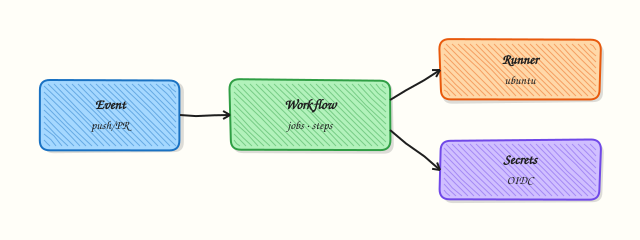

# GitHub Actions for DevOps

## Overview

**GitHub Actions** runs event-driven workflows in YAML — on push, pull request, schedule, or release. Jobs execute on **runners** (GitHub-hosted or self-hosted) with **steps** that checkout code, run tests, build images, and call cloud APIs using **secrets** and **variables**.

This is **Tutorial 1** in **Module 11: GitHub Actions** of the REBASH Academy **Git & GitHub for Cloud & DevOps Engineers** series — written for Cloud, DevOps, Platform, and SRE engineers.

## Prerequisites

- [Pull Requests and Code Review](pull-requests-and-code-review.md)
- Basic YAML
- Understanding of CI concepts

## Learning Objectives

By the end of this tutorial, you will be able to:

- [ ] Structure workflow files under `.github/workflows/`
- [ ] Trigger on push and pull_request with path filters
- [ ] Write a validate job with bash steps and artefact output
- [ ] Escape GitHub Actions syntax for MkDocs (raw Jinja blocks)
- [ ] Validate workflow YAML locally under `~/rebash-git/module-11`

## Architecture

Events trigger workflows; jobs run on runners; steps execute actions or shell commands; secrets inject at runtime — never commit secrets to Git.



## Theory

### What it is

A **workflow** is a YAML file defining `on` triggers, `jobs`, and `steps`. **Jobs** run in parallel by default (unless `needs`); **steps** are sequential. **Actions** are reusable units from marketplace or local `./.github/actions`. **Runners** provide the VM/container environment. **Secrets** (`secrets.AWS_ROLE`) come from repo/org settings; **variables** hold non-sensitive config.

### Why it matters

GitOps and IaC repos gate merges on `terraform validate`, `tflint`, container scans, and unit tests. Actions replace Jenkins for many teams — same repo houses code and pipeline. Misconfigured `pull_request_target` or leaked secrets in logs are common incident sources.

### How it works

1. Developer pushes branch; `pull_request` event fires workflow.
2. Job `validate` checks out repo, sets up tools, runs commands.
3. Step outputs logs; optional artefact upload.
4. Required check name must match branch protection.
5. Reusable workflows (`workflow_call`) share org standards.

### Key concepts and comparisons

| Key | Role |
|-----|------|
| on | Triggers |
| jobs | Parallel units |
| needs | Job dependency DAG |
| strategy.matrix | Multi-version/OS tests |
| permissions | GITHUB_TOKEN scope |
| concurrency | Cancel duplicate runs |

| DevOps pattern | Workflow shape |
|----------------|----------------|
| IaC validate | PR → fmt + validate |
| Image build | push tag → build push ECR |
| Deploy | workflow_dispatch + env |

### Common pitfalls

- Using `pull_request_target` with untrusted code checkout — RCE risk.
- Echoing secrets in logs — GitHub masks but custom encoding may leak.
- Missing `permissions:` least privilege on GITHUB_TOKEN.
- Hard-coding Actions expressions in docs without raw Jinja wrapping, which breaks MkDocs.

## Hands-on Lab

### Objective

Create a repository with a sample `validate.yml` workflow that runs shell validation on Terraform stub files and passes local YAML syntax checks.

### Prerequisites

- Git 2.x
- Python 3 with `pip install pyyaml` optional for yamllint

### Lab environment

Workspace: `~/rebash-git/module-11`

``` {.bash .ra-terminal title="Terminal"}
mkdir -p ~/rebash-git/module-11 && cd ~/rebash-git/module-11
set -euo pipefail
```

### Real-world scenario

Platform team requires every PR touching `*.tf` to run a lightweight validate workflow before reviewers approve.

### Step-by-step tasks

#### Task 1 – Repo and Terraform stub

Create `main.tf`:

```hcl title="main.tf"
terraform {
  required_version = ">= 1.5.0"
}
```

Initialise the repo:

``` {.bash .ra-terminal title="Terminal"}
cd ~/rebash-git/module-11
set -euo pipefail
rm -rf actions-lab
mkdir -p actions-lab/.github/workflows
cd actions-lab
git init -b main
git config user.email 'lab@rebash.local'
git config user.name 'REBASH Lab'
git add main.tf
git commit -m 'chore: terraform stub'
cd ..
```

!!! example "Expected output"
    Minimal Terraform file on main.


#### Task 2 – Write validate workflow (MkDocs-safe pattern documented)

Create `.github/workflows/validate.yml`. In repository docs we escape Actions expressions for MkDocs; in the actual file use real GitHub Actions syntax.



```yaml
name: Validate Terraform

on:
  push:
    branches: [main]
    paths: ['**.tf']
  pull_request:
    paths: ['**.tf']

permissions:
  contents: read

jobs:
  validate:
    runs-on: ubuntu-latest
    steps:
      - uses: actions/checkout@v4
      - name: Install Terraform
        uses: hashicorp/setup-terraform@v3
        with:
          terraform_version: "1.5.7"
      - name: Terraform fmt check
        run: terraform fmt -check -recursive
      - name: Terraform init and validate
        run: |
          terraform init -backend=false
          terraform validate
      - name: Write evidence
        run: echo "validate=pass" > validate-evidence.txt
      - uses: actions/upload-artifact@v4
        with:
          name: validate-evidence
          path: validate-evidence.txt
```



Commit the workflow:

``` {.bash .ra-terminal title="Terminal"}
cd ~/rebash-git/module-11/actions-lab
set -euo pipefail
git add .github/workflows/validate.yml
git commit -m 'ci: add terraform validate workflow'
grep -q 'validate:' .github/workflows/validate.yml
cd ..
```

!!! example "Expected output"
    Workflow committed with path filters and least-privilege permissions.


#### Task 3 – Local validation of workflow structure

Simulate CI checks without GitHub using shell and optional Python.

``` {.bash .ra-terminal title="Terminal"}
cd ~/rebash-git/module-11/actions-lab
set -euo pipefail
terraform fmt -check -recursive 2>/dev/null || terraform fmt -recursive && terraform fmt -check -recursive
terraform init -backend=false
terraform validate | tee ../terraform-validate-out.txt
grep -qi 'success\|Success' ../terraform-validate-out.txt || terraform validate
python3 - <<'PY' 2>/dev/null || true
import yaml, sys
with open('.github/workflows/validate.yml') as f:
    yaml.safe_load(f)
print('yaml_ok')
PY
grep -q 'Validate Terraform' .github/workflows/validate.yml
tar -czf ../module-11-actions-evidence.tgz -C .. terraform-validate-out.txt
ls -l ../module-11-actions-evidence.tgz | tee ../actions-evidence.txt
cd ..
```

!!! example "Expected output"
    Terraform validate succeeds; workflow name grep matches.


### Validation steps

- [ ] Workflow under `.github/workflows/validate.yml`
- [ ] Path filter includes `**.tf`
- [ ] permissions contents read only
- [ ] Local terraform validate passed

### Common errors and fixes

| Error | Cause | Fix |
|-------|-------|-----|
| YAML parse error | Indentation | yamllint; 2-space indent |
| terraform not found | Local PATH | Install tf or use setup action only on GH |
| workflow not triggered | Path filter | Touch .tf file in PR |
| secret not found | Not configured | Add in repo settings |

### Challenge exercise

Add a `workflow_dispatch` trigger and a `concurrency` group keyed on `${ github.ref }` — in your committed YAML use proper GitHub expression syntax (see GitHub docs). Add matrix `terraform_version: ['1.5.7', '1.6.0']` for validate job.

### Learning outcomes

- Authored event-driven workflow YAML
- Applied path filters and permissions
- Ran validate steps locally before push

### Cleanup

``` {.bash .ra-terminal title="Terminal"}
ls ~/rebash-git/module-11/actions-lab
```

## Validation

- [ ] Lab under module-11
- [ ] Can explain jobs vs steps
- [ ] Can explain secrets vs variables
- [ ] Know why permissions block matters

## Code Walkthrough

1. **Pin action versions** — `@v4` not `@main` for supply chain.
2. **Path filters** — save runner minutes on monorepos.
3. **Minimal permissions** — default read-only GITHUB_TOKEN.
4. **Artefacts for plan** — upload terraform plan in guarded workflows.
5. **Reusable workflows** — org standard for validate/deploy.

## Security Considerations

- Never commit secrets; use GitHub Secrets and OIDC to cloud.
- Avoid `pull_request_target` running PR code with secrets.
- Mask outputs; do not print secrets in terraform plan in public forks.
- Use environments with required reviewers for production deploy jobs.
- Enable Dependabot for action version bumps.

## Common Mistakes

!!! warning "Overprivileged GITHUB_TOKEN"
    write-all enables supply chain attacks if workflow compromised. **Fix:** Explicit `permissions:` per job.

!!! warning "Running untrusted PR workflows with secrets"
    Fork PRs can exfiltrate secrets. **Fix:** Approval for first-time contributors; no secrets on fork workflows.

!!! warning "Unpinned third-party actions"
    Tag movement can inject malicious code. **Fix:** Pin SHA or semver tag.

## Best Practices

- Required checks match branch protection names exactly
- Cache Terraform providers in CI for speed
- Self-hosted runners for private network deploy targets
- Separate workflows for CI vs CD with different triggers
- Document workflow in README with badge

## Troubleshooting

| Symptom | Likely cause | Fix |
|---------|--------------|-----|
| Workflow skipped | paths filter | Adjust paths or event |
| Job stuck queued | Runner capacity | Wait or self-hosted |
| 403 GITHUB_TOKEN | permissions | Add contents/write if needed |
| Action not found | Typo or private | Check name and access |

## Summary

GitHub Actions embed CI/CD in the repository — start with validate workflows, least privilege, and pinned actions. Next: [GitOps Fundamentals](gitops-fundamentals.md).

## Interview Questions

**1. Jobs vs steps in Actions?**

??? success "Reveal answer"
    Jobs are independent runner allocations (parallel unless `needs`); steps are sequential commands or action calls within one job sharing the same runner filesystem.

**2. secrets vs variables?**

??? success "Reveal answer"
    Secrets are encrypted sensitive values (API keys); variables are plain config (region name, feature flags) — both inject at runtime but secrets are masked in logs.

**3. Why path filters on on.push.paths?**

??? success "Reveal answer"
    Monorepos trigger only relevant workflows — saves minutes and reduces noise when unrelated directories change.

**4. Self-hosted vs GitHub-hosted runners?**

??? success "Reveal answer"
    GitHub-hosted are managed VMs; self-hosted run inside your network for private resource access — you patch and secure them.

**5. workflow_call purpose?**

??? success "Reveal answer"
    Reusable workflow invoked by other repos/workflows — standardises org-wide validate or deploy patterns.

**6. pull_request vs pull_request_target?**

??? success "Reveal answer"
    Normal pull_request runs in merge context with limited fork secrets; pull_request_target runs base repo context — dangerous with untrusted code checkout — use only with extreme care.

**7. How tie CI to branch protection?**

??? success "Reveal answer"
    Workflow job name becomes status check; enable "Require status checks" and select that job name before merge allowed.

**8. OIDC vs long-lived cloud keys in Actions?**

??? success "Reveal answer"
    OIDC federates short-lived tokens from GitHub to AWS/Azure/GCP — preferred over static keys in secrets for rotation and blast radius.

## Related Tutorials

- [Pull Requests and Code Review](pull-requests-and-code-review.md)
- [GitOps Fundamentals](gitops-fundamentals.md)
- [Git in CI/CD and DevOps](git-in-ci-cd-and-devops.md)
- [Course index](index.md)

## References

- [GitHub Actions documentation](https://docs.github.com/en/actions)
- [Workflow syntax](https://docs.github.com/en/actions/using-workflows/workflow-syntax-for-github-actions)
- [Security hardening](https://docs.github.com/en/actions/security-guides/security-hardening-for-github-actions)

## MkDocs note — escaping Actions expressions in tutorial docs

When documenting Actions expressions inside MkDocs Markdown, wrap examples in raw Jinja blocks (`raw` / `endraw`) so mkdocs-macros does not interpret them. Committed workflow files in your repository use normal Actions expression syntax with no MkDocs wrapping.


```yaml
run: echo "${{ github.ref }}"
```

