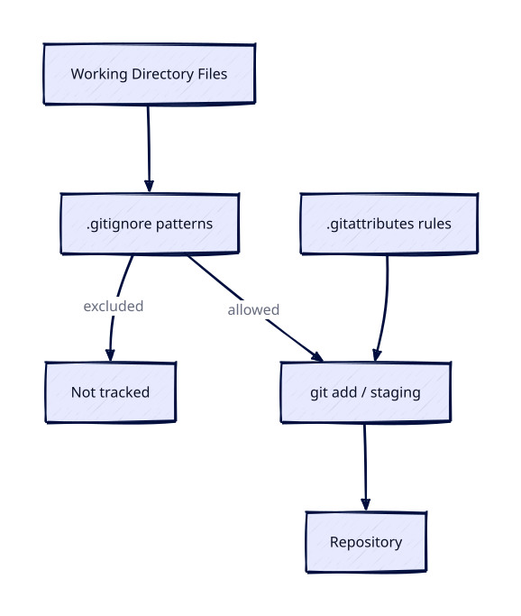

# gitignore and gitattributes

## Overview

Without `.gitignore`, engineers commit `.terraform/` directories, `node_modules/`, and `.env` files containing secrets — triggering security incidents and bloated repositories. Without `.gitattributes`, Windows and Linux developers fight line-ending wars in YAML and shell scripts. These two files are infrastructure-as-code hygiene essentials.

This is **Tutorial 12** in **Module 4: Collaboration** of the REBASH Academy Git series.

## Prerequisites

- [Basic Git Workflow — Add, Commit, Push](basic-git-workflow-add-commit-push.md)
- [Pull Requests and Code Review](pull-requests-and-code-review.md)

## Learning Objectives

By the end of this tutorial, you will be able to:

- [ ] Write `.gitignore` patterns for common DevOps stacks
- [ ] Understand gitignore precedence and negation rules
- [ ] Remove accidentally tracked files from Git history scope
- [ ] Configure `.gitattributes` for line endings and diff behaviour
- [ ] Mark binary files and generated files appropriately
- [ ] Use global gitignore for personal editor files
- [ ] Apply linguist and export-ignore attributes for GitHub

## Architecture

Ignore rules keep artefacts out of commits; attributes control how Git treats line endings, binaries, and filters for specific paths.



## Theory

### .gitignore Purpose

Gitignore tells Git which files to **ignore** — never stage or commit unless forced with `git add -f`.

Patterns apply to:

- Untracked files (primary use)
- Already tracked files are NOT ignored until removed from index

### Pattern Syntax

| Pattern | Matches |
|---------|---------|
| `*.log` | Any `.log` file in any directory |
| `/build/` | `build/` at repo root only |
| `**/tmp/` | `tmp/` anywhere |
| `!important.log` | Negation — do track this file |
| `config/**` | Everything under config/ |

Later rules override earlier; negation un-ignores specific paths.

### DevOps gitignore Essentials

**Terraform:**

```gitignore
.terraform/
*.tfstate
*.tfstate.*
.terraform.lock.hcl
# Note: some teams commit .terraform.lock.hcl — document policy
crash.log
override.tf
*.tfvars
!example.tfvars
```

**Python:**

```gitignore
__pycache__/
*.py[cod]
.venv/
.env
```

**Kubernetes / general:**

```gitignore
*.pem
*.key
secrets/
.env.local
```

Use templates from [gitignore.io](https://www.toptal.com/developers/gitignore) or GitHub's gitignore repository.

### Global gitignore

Personal editor files shouldn't be in project gitignore:

```bash
git config --global core.excludesfile ~/.gitignore_global
```

```gitignore
# ~/.gitignore_global
.DS_Store
.idea/
*.swp
.vscode/
```

### Removing Tracked Files That Should Be Ignored

```bash
git rm --cached secrets.env
git commit -m "chore: stop tracking secrets.env"
echo "secrets.env" >> .gitignore
```

`--cached` removes from index only — keeps local file.

### .gitattributes Purpose

Controls how Git handles files:

- Line ending normalization (`text`, `eol=lf`)
- Diff driver (how diffs display)
- Merge strategy for specific files
- Linguist language detection (GitHub)
- Export-ignore for archive

### Line Endings

```gitattributes
* text=auto
*.sh text eol=lf
*.bat text eol=crlf
*.png binary
```

`* text=auto` lets Git normalize line endings on checkout/commit — critical for cross-platform teams editing YAML and shell scripts.

### Custom Diff Drivers

```gitattributes
*.tf diff=terraform
```

Requires config:

```bash
git config diff.terraform.xfuncmd "terraform fmt -check"
```

### Merge Strategies for Lock Files

```gitattributes
package-lock.json merge=ours
```

Controversial — many teams regenerate lock files post-merge instead.

### export-ignore

Exclude CI artifacts from `git archive`:

```gitattributes
.github/ export-ignore
tests/ export-ignore
```

## Hands-on Lab

### Step 1 – Create repo and demonstrate ignore

**Command:**

```bash
mkdir -p /tmp/gitignore-lab && cd /tmp/gitignore-lab
git init -b main
cat > .gitignore << 'EOF'
*.log
.terraform/
.env
!example.env
EOF
echo "secret=1" > .env
echo "secret=example" > example.env
echo "debug" > app.log
mkdir .terraform && echo "state" > .terraform/plugin
git status
```

**Explanation:** `.env` and `.log` ignored; `example.env` tracked via negation.

**Expected result:** Ignored patterns no longer show as untracked in `git status`.

### Step 2 – Commit allowed files

**Command:**

```bash
git add .
git status
git commit -m "chore: add gitignore and example env"
git check-ignore -v app.log .env example.env
```

**Expected result:** `git rm --cached` untracks a previously committed ignored file without deleting the working copy.

### Step 3 – Add gitattributes

**Command:**

```bash
cat > .gitattributes << 'EOF'
* text=auto eol=lf
*.sh text eol=lf
*.png binary
*.md diff=markdown
EOF
echo '#!/bin/sh' > deploy.sh
echo 'echo deploy' >> deploy.sh
git add .gitattributes deploy.sh && git commit -m "chore: add gitattributes"
```

**Expected result:** Negation patterns re-include the documented exception file.

### Step 4 – Remove accidentally tracked file

**Command:**

```bash
echo "oops" > .env
git add -f .env && git commit -m "mistake: tracked secret"
git rm --cached .env
git commit -m "chore: untrack .env"
git status
test ! -f .env && echo "file missing" || echo ".env still on disk"
```

**Expected result:** `git check-attr` reports the lab attributes on sample paths.

### Step 5 – Verify attributes

**Command:**

```bash
git check-attr -a deploy.sh
git check-attr binary -- *.png 2>/dev/null || echo "no png files"
```

**Expected result:** Line-ending or binary attributes behave as configured for the sample file.

### Step 6 – Clean up

**Command:**

```bash
cd /tmp && rm -rf gitignore-lab
```

**Expected result:** Lab repository removed.


## Validation

Confirm the lab before moving on:

1. Re-run the critical commands from the Hands-on Lab and compare them to the expected output in each step.
2. Check that you can explain *why* each successful result matters (not only that it printed).
3. Note any warnings or unexpected output — resolve them using Troubleshooting before continuing.

| Check | Pass criteria |
|-------|----------------|
| Ignore | Ignored files do not appear as untracked after rule add |
| Cached remove | Previously tracked ignored file leaves the index |
| Attributes | `git check-attr` shows expected attributes on lab files |
| Cleanup | Lab repo removed |

## Code Walkthrough

| Command | Description | Example |
|---------|-------------|---------|
| `git check-ignore -v file` | Why file is ignored | `git check-ignore -v .env` |
| `git rm --cached file` | Untrack without deleting | `git rm --cached secrets.env` |
| `git add -f file` | Force add ignored file | Rare — usually wrong |
| `git check-attr -a file` | Show attributes | `git check-attr -a deploy.sh` |
| `git config core.excludesfile` | Global ignore path | Set global gitignore |

### Terraform starter .gitignore

```gitignore
# Local .terraform directories
.terraform/

# .tfstate files contain sensitive data
*.tfstate
*.tfstate.*

# Variable files with secrets
*.tfvars
*.tfvars.json
!terraform.tfvars.example

# CLI config
.terraformrc
terraform.rc

# Crash logs
crash.log
crash.*.log
```

## Security Considerations

- Put `.env`, key material, and `*.tfstate` in `.gitignore` before the first commit
- Remember ignore rules do not remove already-tracked files — use `git rm --cached`
- Review `gitattributes` filters so smudge/clean scripts cannot exfiltrate data
- Do not force-add ignored secret files with `-f` unless you fully understand the risk
- Keep ignore templates under review so new artefact types (SBOM caches, coverage) stay out

## Common Mistakes

!!! warning "Committing .terraform.lock.hcl without team policy"
    Hashicorp recommends committing lock file for provider consistency. Document whether your org commits it.

!!! warning "gitignore does not untrack existing files"
    Must `git rm --cached` after adding pattern for already-tracked files.

!!! warning "Overly broad ignore patterns"
    `*.yaml` ignoring all YAML breaks K8s manifests. Be specific.

!!! warning "Missing binary attribute on images"
    Git may corrupt binary files with line-ending conversion. Mark `binary`.

## Best Practices

!!! tip "Commit example env files"
    `example.env` or `terraform.tfvars.example` with dummy values — never real secrets.

!!! tip "Scan repos for secrets in CI"
    gitignore is not foolproof. Use gitleaks or trufflehog in pipelines.

!!! tip "Standardize gitattributes org-wide"
    Platform team maintains template copied into new repos.

!!! tip "Review gitignore in every new repo PR"
    First commit should include stack-appropriate ignore rules.

## Troubleshooting

| Issue | Cause | Solution |
|-------|-------|----------|
| File still tracked after gitignore | Already in index | `git rm --cached` |
| Negation not working | Order wrong | Put `!` pattern after ignore |
| CRLF in Linux CI | Missing gitattributes | Add `* text=auto eol=lf` |
| Huge repo size | Committed artifacts | BFG/filter-repo; fix gitignore |
| check-ignore shows nothing | File not ignored | Verify pattern syntax |
| Wrong diff for generated file | Missing -diff attribute | `generated.xml -diff` |

## Summary

- **.gitignore** excludes files from tracking — essential for secrets, build output, and local state
- **Negation patterns** (`!`) re-include specific files under broad rules
- **git rm --cached** stops tracking without deleting local files
- **.gitattributes** controls line endings, binary handling, and diff/merge behaviour
- DevOps repos need stack-specific patterns for Terraform, Python, Node, and secrets

## Interview Questions

1. What is the purpose of .gitignore?
2. How do you stop tracking a file without deleting it locally?
3. What does the negation pattern `!important.log` do?
4. Why doesn't gitignore affect already-tracked files?
5. What is .gitattributes used for?
6. What should a Terraform .gitignore include?
7. What does `* text=auto eol=lf` accomplish?
8. What is a global gitignore, and when use it?
9. Why mark files as `binary` in gitattributes?
10. How would you prevent secrets.env from ever being committed again?

??? tip "Sample Answers (Questions 2 and 6)"

    **Q2 — Untrack without delete:** Run `git rm --cached filename` to remove from index while keeping the working tree file. Commit the change. Add filename to `.gitignore` so it won't be re-added. Local file remains for developer use.

    **Q6 — Terraform gitignore:** Exclude `.terraform/` provider cache, `*.tfstate` and backups (contain secrets), local `*.tfvars` with credentials, override files, crash logs. Optionally include `.terraform.lock.hcl` per team policy. Include `!example.tfvars` for documentation templates.

## Related Tutorials

- [Pull Requests and Code Review](pull-requests-and-code-review.md) *(previous)*
- [Undoing Changes — Reset, Revert, and Stash](undoing-changes-reset-revert-stash.md) *(next — Module 5)*
- [Basic Git Workflow — Add, Commit, Push](basic-git-workflow-add-commit-push.md)
- [Git Installation and Configuration](git-installation-and-configuration.md)
- [Git – Category Overview](index.md)
- Cheat sheet: [Git Cheat Sheet](../cheatsheets/git.md)
- Interview prep: [Git Interview Prep](../interview/git.md)
- Learning path: [DevOps Engineer](../learning-paths/devops-engineer.md)

## References

- [gitignore documentation](https://git-scm.com/docs/gitignore)
- [gitattributes documentation](https://git-scm.com/docs/gitattributes)
- [GitHub gitignore templates](https://github.com/github/gitignore)
- [HashiCorp – Terraform gitignore recommendations](https://developer.hashicorp.com/terraform/tutorials/cli/init)
- [REBASH Academy – Git Overview](index.md)
