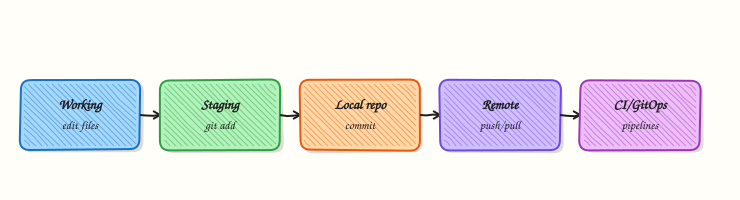

# Introduction to Git and Version Control

## Overview

Incidents ask “what changed?” Compliance asks “who approved?” Delivery asks “can we roll this back?” **Version control** answers those questions with a reviewable history of files — not a folder of `final_v3_really.zip` on someone’s laptop.

**Git** is the distributed Version Control System (VCS) that dominates Cloud and DevOps work: Infrastructure as Code (IaC), application source, pipeline definitions, and GitOps desired state all live as commits. This course is **Git & GitHub for Cloud & DevOps Engineers** — collaboration, recovery, and production workflows, not Git as trivia.

This is **Tutorial 1** in **Module 1: Version Control Fundamentals** of the REBASH Academy **Git & GitHub for Cloud & DevOps Engineers** series — written for Cloud, DevOps, Platform, and Site Reliability Engineering (SRE) engineers. By the end you will compare VCS models, use core Git vocabulary correctly, and leave evidence of a change timeline with and without Git.

## Prerequisites

- [Linux Fundamentals](../linux/index.md) — shell, files, and paths
- Comfort with a terminal (macOS, Linux, or Windows Subsystem for Linux (WSL))
- No GitHub account required for this tutorial

## Learning Objectives

By the end of this tutorial, you will be able to:

- [ ] State the problems version control solves for infrastructure and delivery teams
- [ ] Compare local, centralised, and distributed VCS models
- [ ] Explain why Git fits Cloud-native and IaC workflows
- [ ] Define repository, commit, branch, remote, working tree, and staging area
- [ ] Produce a lab evidence pack under `~/rebash-git/module-01` that contrasts “folder copy” history with Git commits

## Architecture

Edits move from the working tree through the staging area into commits; branches point at commits; remotes share those objects with teammates and CI.



## Theory

### What it is

A **Version Control System (VCS)** records snapshots of a project over time, who made each change, and how to reconstruct earlier states. **Local** VCS tools keep history on one machine. **Centralised** VCS (for example older Subversion-style workflows) require a shared server for almost every operation. **Distributed** VCS — Git — gives every clone a full object database so you can commit, branch, and inspect history offline, then synchronise with remotes when ready.

**Git** stores content-addressed objects (blobs, trees, commits) and moves lightweight pointers called **branches**. A **repository** is that database plus refs. The **working tree** is the checked-out files you edit. The **staging area** (index) is what the next commit will contain. A **remote** is another repository URL (often on GitHub) you fetch from and push to.

### Why it matters

Without Git, IaC drift becomes archaeology: nobody knows which Terraform change broke production. With Git, pull requests encode peer review, CI attaches status to commits, and `git revert` or a previous tag becomes a controlled rollback path. Platform and SRE teams treat the repository as the system of record — the same way they treat monitoring as the system of observation.

### How it works

Mental model: **edit → stage → commit → (optional) push → review/merge on remote**.

1. You change files in the working tree.
2. `git add` records selected changes in the index.
3. `git commit` freezes the index as a new commit on the current branch.
4. `git push` sends new objects and updates the remote branch tip.
5. Teammates `git fetch` / `git pull` to obtain those commits; CI runs against the same SHAs.

Branches let parallel work share a common history without overwriting each other. Remotes do not replace local commits — they publish them.

### Key concepts and comparisons

| Model | Strength | Weakness for DevOps |
|-------|----------|---------------------|
| Local VCS | Simple history on one disk | No collaboration or CI source of truth |
| Centralised VCS | One server of record | Offline work and branching friction |
| Distributed (Git) | Full history per clone; cheap branches | Requires discipline on remotes and shared history |

| Term | Meaning |
|------|---------|
| Repository | `.git` database + working tree |
| Commit | Immutable snapshot + metadata (author, message, parents) |
| Branch | Movable pointer to a commit |
| Remote | Named URL of another repo (`origin`) |
| HEAD | The commit you currently have checked out |

### Common pitfalls

- Treating Git as “backup” and writing useless commit messages.
- Editing production by hand instead of merging reviewed commits.
- Assuming a private repo makes secrets safe to commit.
- Confusing “files on disk” with “what the next commit contains” (always check `git status`).

## Hands-on Lab

### Objective

Contrast an ad-hoc folder timeline with a Git commit timeline for the same infrastructure note, and archive `git log` / `git status` evidence proving two commits on a clean tree.

### Prerequisites

- Git 2.x available as `git` (install comes next module if missing — this lab only needs `git` for Task 2–3)
- A shell and write access under your home directory

### Lab environment

Workspace: `~/rebash-git/module-01`

```bash
mkdir -p ~/rebash-git/module-01 && cd ~/rebash-git/module-01
set -euo pipefail
```

### Real-world scenario

A platform team still shares “prod-firewall-rules-FINAL.docx” over chat. You must show why a Git-backed change log is safer for audit and rollback before the team standardises on GitHub.

### Step-by-step tasks

#### Task 1 – Simulate change history without Git

```bash
cd ~/rebash-git/module-01
set -euo pipefail

mkdir -p without-git
cd without-git
printf 'allow 10.0.0.0/8 to 443\n' > firewall-notes.txt
cp firewall-notes.txt firewall-notes-v1.txt
printf 'allow 10.0.0.0/8 to 443\nallow 10.1.0.0/16 to 22\n' > firewall-notes.txt
cp firewall-notes.txt firewall-notes-v2.txt
ls -1 | tee ../without-git-listing.txt
diff -u firewall-notes-v1.txt firewall-notes-v2.txt | tee ../without-git-diff.txt || true
cd ..
```

**Expected output:** Multiple copies and a diff file — history is manual and easy to lose.

#### Task 2 – Same change as Git commits

```bash
cd ~/rebash-git/module-01
set -euo pipefail

rm -rf with-git
mkdir with-git && cd with-git
git init -b main
git config user.email 'lab@rebash.local'
git config user.name 'REBASH Lab'
printf 'allow 10.0.0.0/8 to 443\n' > firewall-notes.txt
git add firewall-notes.txt
git commit -m 'feat: baseline HTTPS allow for RFC1918'
printf 'allow 10.0.0.0/8 to 443\nallow 10.1.0.0/16 to 22\n' > firewall-notes.txt
git add firewall-notes.txt
git commit -m 'feat: allow SSH from 10.1.0.0/16'
git log --oneline --decorate | tee ../with-git-log.txt
git status | tee ../with-git-status.txt
grep -q 'baseline HTTPS' ../with-git-log.txt
grep -q 'allow SSH' ../with-git-log.txt
grep -q 'nothing to commit, working tree clean' ../with-git-status.txt
test "$(git rev-list --count HEAD)" -eq 2
cd ..
tar -czf module-01-evidence.tgz without-git-listing.txt without-git-diff.txt with-git-log.txt with-git-status.txt
ls -l module-01-evidence.tgz | tee evidence.txt
```

**Expected output:** Two commits on `main`; working tree clean; evidence tarball with log and status files.

### Validation steps

- [ ] Without-Git listing shows versioned copies
- [ ] `with-git-log.txt` shows two meaningful commits
- [ ] `with-git-status.txt` reports a clean working tree
- [ ] `module-01-evidence.tgz` contains log and status evidence

### Common errors and fixes

| Error | Cause | Fix |
|-------|-------|-----|
| `git: command not found` | Git not installed | Install Git (next tutorial) then re-run Task 2 |
| Author identity unknown | Missing user.name/email | Use the `git config` lines in Task 2 |
| Empty log | Commit failed | Re-run `git status` and commit again |

### Challenge exercise

Add a third commit that *removes* the SSH allow line and use `git log -p -1` to prove the removal is recorded as a reversible change.

### Learning outcomes

- Contrasted folder copy history with Git commits
- Used staging and commit messages for an ops-style change
- Captured `git log` and `git status` evidence for audit comparison

### Cleanup

```bash
# Keep evidence; remove when finished:
# rm -rf ~/rebash-git/module-01
ls ~/rebash-git/module-01
```

## Validation

- [ ] Lab completed under `~/rebash-git/module-01/`
- [ ] You can explain local vs centralised vs distributed VCS
- [ ] You can define working tree, index, commit, branch, remote
- [ ] You can name one production failure mode fixed by Git history

## Code Walkthrough

1. **Ask what changed** — prefer `git log` / PR history over chat archaeology.
2. **Stage deliberately** — commits should be reviewable units of work.
3. **Message the why** — future incident responders read messages under pressure.
4. **Publish via remotes** — local commits are not a backup until they leave your laptop.
5. **Never commit secrets** — private remotes still leak through forks, clones, and CI logs.

## Security Considerations

- Assume every commit may be cloned widely — no passwords, tokens, or keys in history.
- Prefer short-lived credentials for remotes (SSH keys, SSO, OIDC) over shared passwords.
- Treat “force push to main” as a privileged, rarely justified action.
- Require review for production IaC paths (later: branch protection).
- Keep auditability: meaningful authors and messages, not anonymous `root` commits on shared repos.

## Common Mistakes

!!! warning "Using zip copies as version control"
    You lose authorship, atomic undo, and CI hooks. **Fix:** one Git repo with commits per change.

!!! warning "Empty commit messages"
    History becomes noise. **Fix:** imperative summary plus why (for example `fix: pin provider to stop plan drift`).

!!! warning "Believing private GitHub means secrets are safe"
    Clones, forks, and logs still expose them. **Fix:** never stage secrets; use a secret manager.

## Best Practices

- One logical change per commit when practical.
- Keep repositories focused (app, modules, or platform concern).
- Agree vocabulary before arguing about branching strategies.
- Record decisions in commits and pull requests, not only chat.
- Move next to the object model so recovery commands make sense.

## Troubleshooting

| Symptom | Likely cause | Fix |
|---------|--------------|-----|
| “Did we deploy that?” | No commit/tag linkage | Tag releases; store deploy SHA in release notes |
| Two “final” folders disagree | Manual copy drift | Single Git source of truth |
| Cannot explain a prod change | Missing messages/authors | Enforce identity config and reviews |
| Fear of changing a file | No rollback story | Learn revert/restore in later modules |

## Summary

Version control is the DevOps system of record. Git’s distributed model fits Cloud delivery because every engineer and every pipeline shares the same commit SHAs. Next: [Understanding the Git Object Model](understanding-the-git-object-model.md).

## Interview Questions

**1. What problem does version control solve for infrastructure teams?**

??? success "Reveal answer"
    It records what changed, who changed it, and how to reconstruct or roll back earlier states — essential for IaC audit, incident response, and collaboration.

**2. How does distributed VCS differ from centralised VCS?**

??? success "Reveal answer"
    Distributed systems like Git give each clone a full history so you can commit and branch offline; centralised systems typically need the server for most history operations.

**3. What is the staging area (index)?**

??? success "Reveal answer"
    The index is the set of changes prepared for the next commit. It lets you craft a coherent snapshot instead of committing every dirty file on disk.

**4. Working tree looks dirty — what do you run first?**

??? success "Reveal answer"
    `git status` and `git diff` (and `git diff --staged`) to see untracked, unstaged, and staged changes before adding or committing.

**5. Why prefer small, reviewable commits in DevOps repos?**

??? success "Reveal answer"
    Reviewers can reason about blast radius, CI failures are easier to bisect, and reverts stay precise instead of undoing unrelated work.

**6. What should never be committed even in a private repository?**

??? success "Reveal answer"
    Secrets, credentials, private keys, and often terraform state or large binaries — private remotes still get cloned, forked, and logged.

**7. What is a branch in Git?**

??? success "Reveal answer"
    A movable pointer to a commit. Creating a branch is cheap because it does not copy the whole project tree.

**8. Why is Git a good fit for GitOps?**

??? success "Reveal answer"
    Desired state is stored as commits that controllers can pull, verify, and reconcile — the same history humans review in pull requests.

## Related Tutorials

- [Understanding the Git Object Model](understanding-the-git-object-model.md)
- [Git Installation and Configuration](git-installation-and-configuration.md)
- [Course overview](index.md)

## References

- [Pro Git — About Version Control](https://git-scm.com/book/en/v2/Getting-Started-About-Version-Control)
- [Git documentation](https://git-scm.com/doc)
