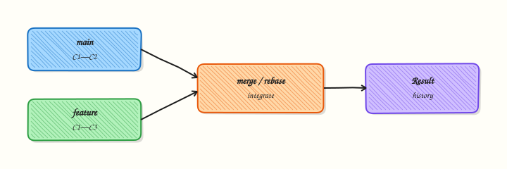

# Merging and Merge Conflicts

## Overview

Merging integrates branch history so combined work ships together. **Fast-forward** merges move a pointer when no divergent commits exist; **three-way merges** create a merge commit when both branches advanced. Conflicts occur when Git cannot pick a single line — common in Terraform, YAML, and Helm values — and must be resolved deliberately.

This is **Tutorial 1** in **Module 6: Merging** of the REBASH Academy **Git & GitHub for Cloud & DevOps Engineers** series — written for Cloud, DevOps, Platform, and SRE engineers. You will perform both merge types and resolve a realistic manifest conflict.

## Prerequisites

- [Branching Fundamentals](branching-fundamentals.md)
- Git 2.x
- Text editor for conflict markers

## Learning Objectives

By the end of this tutorial, you will be able to:

- [ ] Distinguish fast-forward from three-way merges
- [ ] Merge feature branches into `main` locally
- [ ] Read and resolve conflict markers in YAML
- [ ] Complete merges with `git add` and `git commit`
- [ ] Capture merge evidence under `~/rebash-git/module-06`

## Architecture

Git finds the merge base, compares trees from both tips, and either advances the branch pointer (FF) or creates a merge commit linking two parents.



## Theory

### What it is

**Merging** combines histories by integrating changes from one branch into another. A **fast-forward (FF)** merge happens when the target branch tip is an ancestor of the source — Git moves the pointer forward. A **three-way merge** uses the common ancestor (merge base) plus both branch tips to build a new snapshot; if the same lines changed differently, Git marks **conflicts** for human resolution.

### Why it matters

Pull requests on GitHub ultimately perform merges (or rebase merges). Locally you must merge `main` into your feature branch to test integration before CI. IaC conflicts are not syntax errors until apply — wrong resolution can deploy duplicate resources or wrong replica counts.

### How it works

1. Checkout target branch (`main`).
2. `git merge feature` finds merge base.
3. If FF possible and allowed, tip moves; else merge commit or conflict.
4. Conflicts write `<<<<<<<`, `=======`, `>>>>>>>` markers in files.
5. Edit to final content, `git add`, `git commit` (or `git merge --continue`).

### Key concepts and comparisons

| Scenario | Result |
|----------|--------|
| Main unchanged since branch | Fast-forward |
| Both branches have new commits | Three-way merge commit |
| Same line edited differently | Conflict |
| `git merge --ff-only` | Fail if FF impossible |

| Strategy | When |
|----------|------|
| Merge commit | Preserve branch topology |
| Squash merge (on GitHub) | Single commit on main |
| Rebase merge | Linear history (see rebase tutorial) |

### Common pitfalls

- Accepting "theirs" or "ours" blindly in IaC without reading both sides.
- Leaving conflict markers in files — CI may still pass syntax but deploy wrong config.
- Merging without running `terraform validate` or `kubectl apply --dry-run=client`.
- Using wrong parent for "ours" during feature-branch conflict (ours = current branch checked out).

## Hands-on Lab

### Objective

Demonstrate fast-forward merge, then create a divergent three-way merge with a deliberate YAML conflict, resolve it, and verify final manifest content.

### Prerequisites

- Git 2.x

### Lab environment

Workspace: `~/rebash-git/module-06`

```bash
mkdir -p ~/rebash-git/module-06 && cd ~/rebash-git/module-06
set -euo pipefail
```

### Real-world scenario

Two engineers change the same `replicas` key in a deployment manifest on different branches. Release manager merges both; you resolve the conflict to the agreed value (3 replicas).

### Step-by-step tasks

#### Task 1 – Fast-forward merge

Merge a branch with no divergence.

```bash
cd ~/rebash-git/module-06
set -euo pipefail
rm -rf merge-lab
mkdir merge-lab && cd merge-lab
git init -b main
git config user.email 'lab@rebash.local'
git config user.name 'REBASH Lab'
printf 'replicas: 1\n' > deploy.yaml
git add deploy.yaml && git commit -m 'chore: baseline deploy'
git switch -c feature/ff-bump
printf 'replicas: 2\n' > deploy.yaml
git commit -am 'feat: scale to 2'
git switch main
git merge feature/ff-bump --ff-only
grep -q 'replicas: 2' deploy.yaml
git log --oneline --graph | tee ../ff-graph.txt
grep -q 'scale to 2' ../ff-graph.txt
cd ..
```

**Expected output:** Linear history; no merge commit; replicas: 2 on main.

#### Task 2 – Create divergent branches with conflicting edits

Both `main` and `feature/scale` change replicas differently.

```bash
cd ~/rebash-git/module-06/merge-lab
set -euo pipefail
git switch -c feature/scale
printf 'replicas: 5\n' > deploy.yaml
git commit -am 'feat: scale to 5 for campaign'
git switch main
printf 'replicas: 3\n' > deploy.yaml
git commit -am 'fix: scale to 3 for stability'
git merge feature/scale || true
grep -q '<<<<<<<' deploy.yaml
git status | tee ../conflict-status.txt
grep -q 'both modified' ../conflict-status.txt
cd ..
```

**Expected output:** Merge stops with conflict markers in `deploy.yaml`.

#### Task 3 – Resolve conflict and complete merge

Choose agreed value 3, complete merge, archive evidence.

Create `deploy.yaml` with the agreed replica count:

```text
replicas: 3
```

Complete the merge:

```bash
cd ~/rebash-git/module-06/merge-lab
set -euo pipefail
git add deploy.yaml
git commit -m 'merge: resolve replica conflict keeping stable value 3'
grep -q 'replicas: 3' deploy.yaml
! grep -q '<<<<<<<' deploy.yaml
git log --oneline --graph --decorate | tee ../merge-graph.txt
grep -q 'merge: resolve' ../merge-graph.txt
tar -czf ../module-06-merge-evidence.tgz -C .. ff-graph.txt merge-graph.txt conflict-status.txt
ls -l ../module-06-merge-evidence.tgz | tee ../merge-evidence.txt
cd ..
```

**Expected output:** Merge commit exists; file clean; graph shows merge node.

### Validation steps

- [ ] FF merge succeeded with `--ff-only`
- [ ] Conflict reproduced and resolved
- [ ] No conflict markers remain
- [ ] Evidence tarball created

### Common errors and fixes

| Error | Cause | Fix |
|-------|-------|-----|
| `not something we can merge` | Wrong ref | Check branch name |
| Merge abort needed | Wrong resolution | `git merge --abort` |
| Still unmerged paths | Forgot git add | Stage resolved files |
| Wrong replica kept | Misread ours/theirs | Re-read both sides |

### Challenge exercise

`merge=union` is rarely safe for YAML. Instead, add `merge-review.yaml` with three required boolean keys (`desired_prod_value_confirmed`, `tested_in_staging`, `rollback_plan_ready`) and a one-line shell assert that fails unless all three are `true`. Use that gate before you would approve an IaC conflict resolution.

### Learning outcomes

- Performed FF and three-way merges
- Resolved line conflict in manifest
- Verified history with merge graph

### Cleanup

```bash
ls ~/rebash-git/module-06/merge-lab
```

## Validation

- [ ] Lab under `~/rebash-git/module-06`
- [ ] Can explain merge base
- [ ] Can interpret conflict markers
- [ ] Can describe FF vs merge commit trade-off

## Code Walkthrough

1. **Merge main into feature often** — reduces PR surprise.
2. **Read both sides** — `git show :2:file` and `:3:file` in advanced cases.
3. **Validate IaC after resolve** — terraform/kubectl dry-run.
4. **One conflict commit message** — state human decision.
5. **Abort if unsure** — `git merge --abort` restores pre-merge state.

## Security Considerations

- Conflicts in auth or network policy files need security review, not only dev review.
- Do not merge if either side reintroduces ignored secrets.
- Protect `main` with required reviews for conflict-prone paths.
- Log merge commits in change management for regulated environments.
- Verify signed commits after merge if policy requires.

## Common Mistakes

!!! warning "Blind git checkout --theirs"
    You may deploy wrong environment values. **Fix:** Manually compose correct YAML/HCL.

!!! warning "Committing conflict markers"
    Markers break parsers unpredictably. **Fix:** Search repo for `<<<<<<<` before push.

!!! warning "Merging without testing integrated result"
    Each side passed CI separately. **Fix:** Run integration CI on merge result locally or on PR branch.

## Best Practices

- Prefer small PRs to reduce conflict surface
- Use CODEOWNERS on critical paths
- Document resolution rationale in commit message
- Keep `main` mergeable — integrate daily
- Use `--no-ff` only when policy wants explicit merge commits

## Troubleshooting

| Symptom | Likely cause | Fix |
|---------|--------------|-----|
| Endless conflicts on re-merge | Same lines churn | Coordinate; split files |
| Empty merge commit | Trivial merge | Normal for three-way |
| Lost changes after resolve | Overwrote wrong | `git reflog`; redo merge |
| merge HEAD detached | Interrupted merge | `git status`; continue or abort |

## Summary

You merged branches with fast-forward and three-way strategies and resolved a realistic conflict. Next: [Rebasing and Interactive Rebase](rebasing-and-interactive-rebase.md) for linear history techniques.

## Interview Questions

**1. When does Git fast-forward?**

??? success "Reveal answer"
    When the target branch tip is a direct ancestor of the source branch tip — no divergent commits on target — Git moves the pointer without a merge commit.

**2. What is a three-way merge?**

??? success "Reveal answer"
    Git combines changes from two branches using their common ancestor (merge base) as reference, producing a new commit with two parents when both sides diverged.

**3. What do conflict markers mean?**

??? success "Reveal answer"
    `<<<<<<< HEAD` is current branch version, `=======` separates sides, `>>>>>>> branch` is incoming — you edit to the intended final content and remove markers.

**4. Ours vs theirs during merge on feature branch checked out?**

??? success "Reveal answer"
    "Ours" is the branch you have checked out (target of merge into), "theirs" is the branch being merged — easy to confuse; always read file content, not labels alone.

**5. git merge --abort?**

??? success "Reveal answer"
    Cancels an in-progress merge, restoring HEAD and working tree to pre-merge state — use when resolution went wrong.

**6. Merge vs rebase for integrating main?**

??? success "Reveal answer"
    Merge preserves exact history and merge commits; rebase replays feature commits on top of main for linear history — rebase rewrites commits and is risky on shared branches.

**7. Why squash merge on GitHub?**

??? success "Reveal answer"
    Collapses feature commits into one on main for cleaner history — loses granular commits on main but keeps review in PR.

**8. How prevent IaC merge disasters?**

??? success "Reveal answer"
    Small PRs, mandatory review on infra paths, automated validate/plan in CI, and explicit conflict checklists — never merge unresolved ambiguity in production values.

## Related Tutorials

- [Branching Fundamentals](branching-fundamentals.md)
- [Rebasing and Interactive Rebase](rebasing-and-interactive-rebase.md)
- [Git Troubleshooting](git-troubleshooting.md)
- [Course index](index.md)

## References

- [git-merge](https://git-scm.com/docs/git-merge)
- [How conflicts are presented](https://git-scm.com/book/en/v2/Git-Branching-Basic-Branching-and-Merging)
