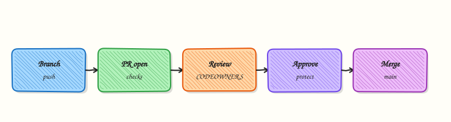

# Pull Requests and Code Review

## Overview

**Pull requests (PRs)** propose integrating a branch into a protected target (usually `main`). They bundle diff, discussion, CI status, and approval records — the audit trail regulators expect. **CODEOWNERS** routes reviews to platform or security teams for sensitive paths. **Branch protection** enforces reviews and green checks before merge.

This is **Tutorial 1** in **Module 10: Collaboration** of the REBASH Academy **Git & GitHub for Cloud & DevOps Engineers** series — written for Cloud, DevOps, Platform, and SRE engineers.

## Prerequisites

- [GitHub Fundamentals](github-fundamentals.md)
- [Branching Fundamentals](branching-fundamentals.md)
- Git 2.x

## Learning Objectives

By the end of this tutorial, you will be able to:

- [ ] Describe the PR lifecycle from branch push to merge
- [ ] Author CODEOWNERS for Terraform and pipeline paths
- [ ] Build branch protection YAML for `main`
- [ ] Simulate PR review with local merge --no-ff and review notes file
- [ ] Store artefacts under `~/rebash-git/module-10`

## Architecture

Feature branch pushes to origin; PR opens against main; reviewers comment; CI runs; merge updates main; branch deleted.



## Theory

### What it is

A **pull request** is a forge object linking source branch, target branch, diff, and metadata. **Code review** is human (or bot) validation of correctness, security, and operability before merge. **CODEOWNERS** (`.github/CODEOWNERS`) assigns required reviewers by file pattern. **Branch protection rules** block direct pushes and require status checks, review count, and signed commits if configured.

### Why it matters

IaC mistakes merged to `main` deploy automatically in GitOps repos. PRs force `terraform plan` visibility, peer review of IAM changes, and documented approval. SOC2-style controls map to "who approved what on main."

### How it works

1. Push `feature/add-s3-bucket` to origin.
2. Open PR: base `main`, compare feature branch.
3. CODEOWNERS requests `@platform-team` for `*.tf`.
4. CI runs plan/lint; reviewers approve.
5. Squash merge (or merge commit per policy); delete branch.
6. CD/GitOps picks up new main SHA.

### Key concepts and comparisons

| Element | Purpose |
|---------|---------|
| Draft PR | WIP signal; skip review noise |
| Required reviewers | CODEOWNERS + count |
| Status checks | CI must pass |
| Review comments | Line-level feedback |
| Merge queue | Serial merges at scale |

| Review focus (DevOps) | Question |
|-----------------------|----------|
| IaC | Blast radius? Rollback? |
| Pipelines | Secrets scoped? |
| Manifests | Prod values isolated? |

### Common pitfalls

- Giant PRs — reviewers skim; defects slip through.
- Approving without reading plan output attached to CI.
- CODEOWNERS typo — wrong team never notified.
- Merging with failing optional checks that were actually required.

## Hands-on Lab

### Objective

Create repo with CODEOWNERS and `branch-protection.yaml`; simulate feature PR via branch, generate `review-findings.txt` from git commands, and local merge representing approved integration.

### Prerequisites

- Git 2.x

### Lab environment

Workspace: `~/rebash-git/module-10`

```bash title="Terminal"
mkdir -p ~/rebash-git/module-10 && cd ~/rebash-git/module-10
set -euo pipefail
```

### Real-world scenario

Terraform change adds S3 bucket module. Platform team must review all `*.tf` via CODEOWNERS; branch protection requires one approval and CI green (simulated locally).

### Step-by-step tasks

#### Task 1 – Main, CODEOWNERS, branch protection YAML

Create `.github/CODEOWNERS`:

```text title="CODEOWNERS"
# Platform owns all Terraform
*.tf @platform-team
/.github/workflows/ @devops-team
```

Create `branch-protection.yaml`:

```yaml title="branch-protection.yaml"
protected_branches:
  main:
    require_pull_request: true
    required_reviews: 1
    require_codeowners: true
    required_checks:
      - terraform-validate
    block_force_push: true
    block_deletions: true
```

Create `validate-branch-protection.sh`:

```bash title="validate-branch-protection.sh"
#!/usr/bin/env bash
set -euo pipefail
grep -q 'require_codeowners: true' branch-protection.yaml
grep -q 'terraform-validate' branch-protection.yaml
grep -q 'block_force_push: true' branch-protection.yaml
echo 'protection_ok'
```

Create `README.md`:

```markdown title="README.md"
# app
```

Bootstrap the PR lab repo:

```bash title="Terminal"
cd ~/rebash-git/module-10
set -euo pipefail
rm -rf pr-lab
mkdir -p pr-lab/.github
cd pr-lab
git init -b main
git config user.email 'lab@rebash.local'
git config user.name 'REBASH Lab'
chmod +x validate-branch-protection.sh
./validate-branch-protection.sh | tee ../protection-validate.txt
grep -q 'protection_ok' ../protection-validate.txt
git add .
git commit -m 'chore: add CODEOWNERS and branch protection YAML'
grep -q 'platform-team' .github/CODEOWNERS
cd ..
```

!!! example "Expected output"
    CODEOWNERS and branch protection YAML validated on main.


#### Task 2 – Feature branch and review findings from git commands

Create `s3.tf`:

```hcl title="s3.tf"
resource "aws_s3_bucket" "logs" {
  bucket = "rebash-logs-lab"
}
```

Commit the feature and capture review findings:

```bash title="Terminal"
cd ~/rebash-git/module-10/pr-lab
set -euo pipefail
git switch -c feature/add-s3-module
git add s3.tf
git commit -m 'feat: add S3 logs bucket module'
{
  echo 'branch=feature/add-s3-module'
  echo 'commits_ahead_of_main:'
  git log --oneline main..HEAD
  echo 'files_changed:'
  git diff --name-only main..HEAD
  echo 'diff_stat:'
  git diff --stat main..HEAD
  echo 'codeowners_match:'
  grep -E '\.tf|platform-team' .github/CODEOWNERS || true
  echo 'simulated_ci=terraform-validate:PASS'
} > review-findings.txt
grep -q 'feat: add S3 logs bucket module' review-findings.txt
grep -q 's3.tf' review-findings.txt
git add review-findings.txt
git commit -m 'chore: capture PR review findings'
git log --oneline main..HEAD | tee ../pr-commits.txt
test "$(git rev-list --count main..HEAD)" -eq 2
cd ..
```

!!! example "Expected output"
    Two commits ahead of main; `review-findings.txt` generated from git log/diff.


#### Task 3 – Simulated approved merge

```bash title="Terminal"
cd ~/rebash-git/module-10/pr-lab
set -euo pipefail
git switch main
git merge --no-ff feature/add-s3-module -m 'merge: PR #42 add S3 module (approved)'
test -f s3.tf
grep -q 'platform-team' .github/CODEOWNERS
git log --oneline --graph | tee ../pr-merge-graph.txt
grep -q 'merge: PR' ../pr-merge-graph.txt
tar -czf ../module-10-pr-evidence.tgz -C .. pr-commits.txt pr-merge-graph.txt review-findings.txt protection-validate.txt
ls -l ../module-10-pr-evidence.tgz | tee ../pr-evidence.txt
cd ..
```

!!! example "Expected output"
    Merge commit on main; S3 tf present; graph shows merge node.


### Validation steps

- [ ] CODEOWNERS assigns *.tf to platform-team
- [ ] `branch-protection.yaml` passes validation script
- [ ] Feature branch merged with --no-ff
- [ ] `review-findings.txt` present on branch history

### Common errors and fixes

| Error | Cause | Fix |
|-------|-------|-----|
| CODEOWNERS ignored on GitHub | Wrong path | Must be .github/CODEOWNERS or root |
| Merge without review | Local lab only | On GitHub enable protection |
| Conflict on merge | main moved | Rebase feature; re-run CI |
| Wrong base branch | PR target | Retarget to main |

### Challenge exercise

Add CODEOWNERS line for `**/production/** @sre-oncall` and extend `review-findings.txt` generation to include rollback command `terraform destroy -target=aws_s3_bucket.logs` — commit on new branch `docs/codeowners-sre`.

### Learning outcomes

- Authored CODEOWNERS for IaC paths
- Defined branch protection rules in validated YAML
- Simulated approved merge workflow locally with git-generated review findings

### Cleanup

```bash title="Terminal"
ls ~/rebash-git/module-10/pr-lab
```

## Validation

- [ ] Lab under module-10
- [ ] Can narrate PR lifecycle stages
- [ ] Can explain CODEOWNERS syntax
- [ ] Can list three branch protection rules

## Code Walkthrough

1. **Small PRs** — one concern; easier plan review.
2. **Attach plan output** — CI artefact or comment bot.
3. **Draft until ready** — reduce premature review load.
4. **Fix CI before re-request review** — respect reviewer time.
5. **Link Issue** — `Fixes #123` closes loop.

## Security Considerations

- Require review for workflow file changes (supply chain).
- Restrict who can dismiss reviews.
- Enforce signed commits if policy demands.
- Scan PR diffs for secrets in CI (gitleaks).
- Limit auto-merge to trusted bots with checks.

## Common Mistakes

!!! warning "Rubber-stamp approval"
    Approving without reading IaC plan. **Fix:** Mandatory plan in CI; checklist in PR template.

!!! warning "Direct push to main"
    Bypasses all controls. **Fix:** Branch protection; admin bypass only break-glass.

!!! warning "Stale PR after long idle"
    Base branch drift breaks CI. **Fix:** Update branch; re-run checks before merge.

## Best Practices

- PR template with rollback and test sections
- Size labels (S/M/L) for queue management
- Required `terraform plan` comment on IaC repos
- Auto-assign CODEOWNERS reviewers
- Delete head branch after merge

## Troubleshooting

| Symptom | Likely cause | Fix |
|---------|--------------|-----|
| Cannot merge — reviews pending | Missing approval | Request CODEOWNERS |
| Required check missing | CI not reported | Fix workflow; re-run |
| CODEOWNERS not requested | Pattern mismatch | Fix glob; file path |
| Merge button grey | Draft or conflict | Ready for review; resolve |

## Summary

Pull requests encode review, CI, and approval before changes hit `main`. Next: [GitHub Actions for DevOps](github-actions-for-devops.md).

## Interview Questions

**1. Purpose of pull request vs direct merge locally?**

??? success "Reveal answer"
    PR adds review gate, discussion, CI status, and audit record on the forge — direct local merge skips collaboration and compliance controls expected in production repos.

**2. How CODEOWNERS works?**

??? success "Reveal answer"
    File pattern lines map paths to teams/users; when those files change in a PR, GitHub requests reviews from listed owners — often required before merge.

**3. Branch protection vs rulesets?**

??? success "Reveal answer"
    Both enforce policies on branches; rulesets are newer org-level flexible policy engine — branch protection is classic per-branch rules (reviews, checks, push restrictions).

**4. Squash merge trade-off?**

??? success "Reveal answer"
    Cleaner main history with one commit per PR — loses granular commit messages from feature branch unless preserved in PR body or squash message edited.

**5. What should IaC PR reviewer verify?**

??? success "Reveal answer"
    Plan output, blast radius, IAM changes, secrets not in diff, rollback path, environment targeting, and alignment with module versioning policy.

**6. Draft PR when?**

??? success "Reveal answer"
    Work in progress — signals reviewers to wait; CI may still run for early feedback without merge eligibility.

**7. Required status check fails — merge?**

??? success "Reveal answer"
    No — protection blocks merge until checks pass or admin bypass (discouraged); fix root cause or flaky test first.

**8. PR lifecycle after merge for GitOps?**

??? success "Reveal answer"
    Main SHA updates; GitOps controller or CD pipeline detects change and syncs cluster desired state — PR merge is the approval gate before deploy automation runs.

## Related Tutorials

- [GitHub Fundamentals](github-fundamentals.md)
- [GitHub Actions for DevOps](github-actions-for-devops.md)
- [Production Git Practices](production-git-practices.md)
- [Course index](index.md)

## References

- [About pull requests](https://docs.github.com/en/pull-requests/collaborating-with-pull-requests)
- [About CODEOWNERS](https://docs.github.com/en/repositories/managing-your-repositorys-settings-and-features/customizing-your-repository/about-code-owners)
- [Managing branch protection](https://docs.github.com/en/repositories/configuring-branches-and-merges-in-your-repository/managing-protected-branches)
