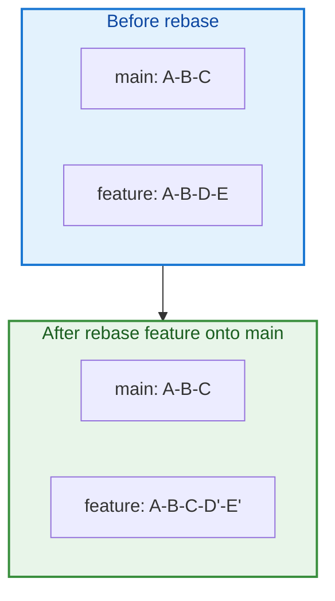

# Rebasing and Interactive Rebase

## Overview

Rebasing replays your commits on top of another branch — producing linear history without merge commits. Interactive rebase lets you squash, reorder, edit, and drop commits before sharing work. Used correctly, rebase keeps main readable; used incorrectly on shared branches, it causes team-wide pain.

This tutorial covers `git rebase`, conflict resolution during rebase, interactive mode, and the golden rule of rebasing.

This is **Tutorial 9** in **Module 3: Branching** of the REBASH Academy Git series.

## Prerequisites

- [Merging and Merge Conflicts](merging-and-merge-conflicts.md)
- [Branching Fundamentals](branching-fundamentals.md)

## Learning Objectives

By the end of this tutorial, you will be able to:

- [ ] Rebase a feature branch onto updated main
- [ ] Resolve conflicts during rebase with continue/skip/abort
- [ ] Use interactive rebase to squash, fixup, and reword commits
- [ ] Explain rebase vs merge tradeoffs
- [ ] Apply the golden rule: never rebase shared/public history
- [ ] Use `git pull --rebase` for cleaner local updates
- [ ] Recover from rebase mistakes with reflog

## Rebase vs Merge Diagram



## Theory

### What Rebase Does

Rebase finds the common ancestor, temporarily removes your commits, fast-forwards to the target tip, then replays commits one by one:

```bash
git switch feature/my-work
git rebase main
```

Each replayed commit gets a **new SHA** — history is rewritten.

### Rebase vs Merge

| Aspect | Merge | Rebase |
|--------|-------|--------|
| History | Preserves branch topology | Linear |
| Merge commits | Yes (non-FF) | No |
| SHA changes | No | Yes (replayed commits) |
| Safe on shared branches | Yes | **No** |
| Best for | Public/main integration | Local cleanup before PR |

### The Golden Rule

**Never rebase commits that exist on shared/public branches** that others may have pulled. Rewriting published history forces painful force-pushes and duplicate work for collaborators.

Safe: rebase local feature branch before opening PR.

Unsafe: rebase main after others cloned it.

### Conflict Resolution During Rebase

When conflict occurs:

1. Fix files (same as merge)
2. `git add` resolved files
3. `git rebase --continue`

Other options:

```bash
git rebase --skip      # drop current commit
git rebase --abort     # return to pre-rebase state
```

### Interactive Rebase

Rewrite last N commits:

```bash
git rebase -i HEAD~3
```

Editor shows:

```text
pick abc1234 feat: add module
pick def5678 fix typo
pick ghi9012 wip debug

# Commands:
# p, pick = use commit
# r, reword = edit message
# e, edit = stop to amend
# s, squash = meld into previous
# f, fixup = squash discarding message
# d, drop = remove commit
```

Common workflow before PR: squash WIP commits into one clean commit.

### git pull --rebase

Default `git pull` merges remote into local. Rebase variant:

```bash
git pull --rebase origin main
```

Keeps local unpushed commits on top of remote — cleaner than merge commit on every pull.

Configure globally:

```bash
git config --global pull.rebase true
```

### Rebase Onto Different Base

```bash
git rebase --onto main old-base feature
```

Useful when feature branch should exclude commits from another feature branch.

### Autosquash

Mark fixups during development:

```bash
git commit --fixup abc1234
git rebase -i --autosquash HEAD~5
```

Fixup commits auto-squash into targets during interactive rebase.

## Hands-on Lab

### Step 1 – Build divergent history

**Command:**

```bash
mkdir -p /tmp/git-rebase-lab && cd /tmp/git-rebase-lab
git init -b main
echo "line1" > app.txt && git add . && git commit -m "feat: line1"
git switch -c feature
echo "line2" >> app.txt && git add . && git commit -m "feat: line2"
echo "line3" >> app.txt && git add . && git commit -m "wip: line3 typo fix later"
git switch main
echo "main-update" >> app.txt && git add . && git commit -m "fix: main update"
git log --oneline --all --graph
```

### Step 2 – Rebase feature onto main

**Command:**

```bash
git switch feature
git rebase main
git log --oneline --graph --all
```

**Explanation:** Feature commits now sit on top of main's latest commit.

### Step 3 – Interactive rebase to squash

**Command:**

```bash
GIT_SEQUENCE_EDITOR="sed -i.bak '3s/^pick/squash/'" git rebase -i HEAD~2 2>/dev/null || \
  git reset --soft HEAD~1 && git commit -m "feat: line2 and line3"
git log --oneline -3
```

**Explanation:** In practice, use editor to squash WIP into feature commit. Lab uses reset as fallback for non-interactive environments.

### Step 4 – Practice abort

**Command:**

```bash
git switch main && git switch -c feature-abort
echo "conflict" > app.txt && git commit -am "feature side"
git switch main && echo "other" > app.txt && git commit -am "main side"
git switch feature-abort
git rebase main || true
git rebase --abort
git log --oneline -1
```

### Step 5 – pull --rebase simulation

**Command:**

```bash
git init --bare /tmp/rebase-remote.git
cd /tmp/git-rebase-lab
git remote add origin /tmp/rebase-remote.git
git push -u origin main
echo "local only" >> app.txt && git commit -am "local commit"
git pull --rebase origin main
git log --oneline -3
```

### Step 6 – Clean up

**Command:**

```bash
cd /tmp && rm -rf git-rebase-lab rebase-remote.git
```

## Commands & Code

| Command | Description | Example |
|---------|-------------|---------|
| `git rebase main` | Rebase current branch onto main | `git rebase main` |
| `git rebase -i HEAD~N` | Interactive rebase last N commits | `git rebase -i HEAD~4` |
| `git rebase --continue` | Continue after conflict fix | `git rebase --continue` |
| `git rebase --abort` | Cancel rebase | `git rebase --abort` |
| `git pull --rebase` | Pull with rebase | `git pull --rebase origin main` |
| `git commit --fixup SHA` | Create autosquash target | `git commit --fixup abc1234` |
| `git rebase --onto A B C` | Rebase C onto A from B | Advanced branch surgery |

### Pre-PR cleanup workflow

```bash
# On feature branch before opening PR
git fetch origin
git rebase origin/main
git rebase -i origin/main   # squash, reword, drop WIP
git push --force-with-lease origin feature/my-branch
```

## Common Mistakes

!!! warning "Rebasing main or shared branches"
    Force-pushing main breaks everyone's clone. Rebase only private feature branches.

!!! warning "Force push without --force-with-lease"
    `--force-with-lease` refuses push if remote advanced — prevents overwriting teammate's work.

!!! warning "Squashing reviewed commits after approval"
    Post-approval squash changes SHAs — re-review required. Squash before requesting review.

!!! warning "Interactive rebase on wrong commit count"
    `HEAD~10` when you meant `HEAD~3` drops commits unintentionally. Verify with `git log` first.

## Best Practices

!!! tip "Rebase feature onto main daily"
    Small incremental rebases beat one giant conflict at PR time.

!!! tip "Use fixup commits during development"
    `--fixup` + `--autosquash` keeps history clean without manual squash editing.

!!! tip "Document team policy"
    Some teams prefer merge-only on main. Align with Advanced Git Workflows tutorial.

!!! tip "Reflog is your safety net"
    Mistakes during rebase recover via `git reflog` — see dedicated tutorial.

## Troubleshooting

| Issue | Cause | Solution |
|-------|-------|----------|
| Rebase conflict loop | Same hunk conflicts repeatedly | Resolve carefully; consider merge instead |
| Commits disappeared | Wrong drop/squash in -i | `git reflog`; reset to pre-rebase |
| Push rejected after rebase | History rewritten | `git push --force-with-lease` |
| Duplicate commits after rebase | Merged and rebased same branch | Pick one strategy; reset |
| Empty commit during rebase | Squash left nothing | `git rebase --skip` or `--continue` |
| `fatal: invalid upstream` | Branch gone | Fetch; verify branch name |

## Summary

- **Rebase** replays commits onto a new base — linear history, new SHAs
- **Interactive rebase** squashes, reorders, edits, and drops commits before sharing
- **Golden rule:** never rebase public/shared branch history
- Resolve rebase conflicts with **continue**, **skip**, or **abort**
- **git pull --rebase** avoids unnecessary merge commits on local updates
- Use **--force-with-lease** when pushing rebased branches

## Interview Questions

1. What does `git rebase main` do step by step?
2. What is the golden rule of rebasing?
3. How does rebase differ from merge in terms of history?
4. What interactive rebase commands squash commits?
5. How do you recover from a bad rebase?
6. When should you use `git pull --rebase`?
7. What is `--force-with-lease`, and why use it over `--force`?
8. What does `git rebase --onto` do?
9. Why do rebased commits get new SHAs?
10. When is merge preferable to rebase for integrating feature branches?

??? tip "Sample Answers (Questions 1 and 2)"

    **Q1 — git rebase main:** Git finds the merge base between feature and main, saves feature commits as patches, moves feature branch pointer to main's tip, then reapplies each commit sequentially. Conflicts pause for resolution. Result: feature commits appear as if developed on latest main.

    **Q2 — Golden rule:** Do not rebase commits that have been pushed to a branch others use. Rebase rewrites SHAs; collaborators with old SHAs face duplicate commits and conflict hell on pull. Rebase local/unshared work only; integrate shared branches with merge or platform merge button.

## Related Tutorials

- [Merging and Merge Conflicts](merging-and-merge-conflicts.md) *(previous)*
- [Working with Remotes](working-with-remotes.md) *(next — Module 4)*
- [Cherry-pick and Reflog](cherry-pick-and-reflog.md)
- [Advanced Git Workflows](advanced-git-workflows.md)
- [Undoing Changes — Reset, Revert, and Stash](undoing-changes-reset-revert-stash.md)

## References

- [Pro Git Book – Rebasing](https://git-scm.com/book/en/v2/Git-Branching-Rebasing)
- [git rebase documentation](https://git-scm.com/docs/git-rebase)
- [Atlassian – Merging vs rebasing](https://www.atlassian.com/git/tutorials/merging-vs-rebasing)
- [REBASH Academy – Git Overview](index.md)
