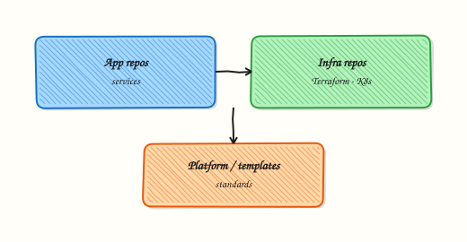

# Signed Commits and Git Security

## Overview

Signed commits prove identity and integrity — GitHub shows **Verified** badges for GPG or SSH signatures. Combined with **secret scanning**, **Dependabot**, branch protection, and least-privilege tokens, repositories become defensible against supply-chain and credential-leak risks.

This is **Tutorial 1** in **Module 15: Security** of the REBASH Academy **Git & GitHub for Cloud & DevOps Engineers** series — written for Cloud, DevOps, Platform, and DevSecOps engineers.

## Prerequisites

- [Repository Management and Releases](repository-management-and-releases.md)
- Git 2.34+ for SSH signing recommended
- SSH key pair (lab generates if missing)

## Learning Objectives

By the end of this tutorial, you will be able to:

- [ ] Configure SSH commit signing in Git
- [ ] Create verified signed commits locally
- [ ] Complete secret scanning config and checks script
- [ ] List PAT, deploy key, and branch protection security controls
- [ ] Store evidence under `~/rebash-git/module-15`

## Architecture

Developer signs commits with private key; Git embeds signature; forge verifies against registered public key; scanners block pushes containing secrets.



## Theory

### What it is

**Commit signing** attaches cryptographic proof that a commit came from a key you control. **SSH signing** (Git 2.34+) reuses SSH keys with `gpg.ssh.defaultKeyCommand` or `user.signingkey`. **GPG signing** uses PGP keys. **Secret scanning** detects known patterns (AWS keys, PATs) in pushes. **Dependabot** alerts on vulnerable dependencies in manifests and Actions.

### Why it matters

Compromised maintainer accounts push malicious Terraform unnoticed without review — signing plus required signatures on `main` raises bar. Leaked cloud keys in Git history require rotation and incident response — prevention beats cleanup.

### How it works

1. Generate SSH key; add public key to GitHub as **Signing** key.
2. `git config gpg.format ssh` and `commit.gpgsign true`.
3. Commits include signature; `git log --show-signature` verifies locally.
4. Enable secret scanning + push protection on org repos.
5. Fine-grained PATs scoped to single repo with expiry.

### Key concepts and comparisons

| Method | Key type |
|--------|----------|
| SSH signing | ssh-ed25519 |
| GPG signing | RSA/EdDSA PGP |
| S/MIME | Enterprise less common |

| Control | Blocks |
|---------|--------|
| Secret push protection | Known secrets in commit |
| Required signatures | Unsigned merges |
| Dependabot | Vulnerable deps |

### Common pitfalls

- Signing only locally but not registering public key on GitHub — no Verified badge.
- Auto-sign broken in CI — bot commits unsigned while humans signed.
- `.env` ignored but never scanned in history — old commits still leak.
- PAT in remote URL cached in shell history.

## Hands-on Lab

### Objective

Generate SSH signing key, configure Git, create signed commit, and add `.gitleaks.toml` plus `secret-scan-checks.sh` that scans the repo and archives results.

### Prerequisites

- Git 2.34+
- `ssh-keygen` available

### Lab environment

Workspace: `~/rebash-git/module-15`

``` {.bash .ra-terminal title="Terminal"}
mkdir -p ~/rebash-git/module-15 && cd ~/rebash-git/module-15
set -euo pipefail
```

### Real-world scenario

DevSecOps mandates signed commits on platform repos and documents secret scanning controls before production classification.

### Step-by-step tasks

#### Task 1 – SSH signing key (lab-only)

``` {.bash .ra-terminal title="Terminal"}
cd ~/rebash-git/module-15
set -euo pipefail
rm -rf security-lab ~/.ssh/rebash-sign-key 2>/dev/null || true
mkdir -p security-lab
ssh-keygen -t ed25519 -f ~/.ssh/rebash-sign-key -N '' -C 'rebash-lab-sign'
mkdir security-lab && cd security-lab
git init -b main
git config user.email 'lab@rebash.local'
git config user.name 'REBASH Lab'
git config gpg.format ssh
git config user.signingkey ~/.ssh/rebash-sign-key.pub
git config commit.gpgsign true
git config gpg.ssh.allowedSignersFile "$(pwd)/allowed_signers"
echo "$(cat ~/.ssh/rebash-sign-key.pub) namespaces=\"git\" $(git config user.email)" > allowed_signers
cd ..
```

!!! example "Expected output"
    Signing key and allowed_signers for local verification.


#### Task 2 – Signed commit and verify

``` {.bash .ra-terminal title="Terminal"}
cd ~/rebash-git/module-15/security-lab
set -euo pipefail
printf '# secure service\n' > README.md
git add README.md
git commit -m 'chore: initial signed commit'
git log --show-signature -1 | tee ../signature-log.txt
grep -Ei 'good|signature|Signed' ../signature-log.txt
git verify-commit HEAD 2>&1 | tee ../verify-out.txt
grep -Ei 'Good|valid' ../verify-out.txt || git log -1 --format='%G?' | grep -q 'G\|U'
cd ..
```

!!! example "Expected output"
    Signature verification good or unknown key locally (G/U); commit created with signing enabled.


#### Task 3 – Secret scanning configuration and checks

Create `.gitleaks.toml`:

```toml title=".gitleaks.toml"
title = "rebash lab gitleaks config"
[allowlist]
paths = ["allowed_signers"]
```

Create `secret-scan-checks.sh`:

```bash title="secret-scan-checks.sh"
#!/usr/bin/env bash
set -euo pipefail
echo 'scan_target=working_tree'
grep -RInE 'AKIA[0-9A-Z]{16}|ghp_[A-Za-z0-9]{20,}' . \
  --exclude='secret-scan-results.txt' \
  --exclude='.gitleaks.toml' || echo 'no_obvious_secrets=ok'
test -f .gitignore || echo 'warning=.gitignore_missing'
grep -q '\.env' .gitignore 2>/dev/null || echo 'hint=add_.env_to_gitignore'
echo 'scan_complete'
```

Run scans and commit:

``` {.bash .ra-terminal title="Terminal"}
cd ~/rebash-git/module-15/security-lab
set -euo pipefail
chmod +x secret-scan-checks.sh
./secret-scan-checks.sh | tee ../secret-scan-results.txt
grep -q 'scan_complete' ../secret-scan-results.txt
git add .gitleaks.toml secret-scan-checks.sh
git commit -m 'chore: add secret scan config and checks script'
tar -czf ../module-15-security-evidence.tgz -C .. signature-log.txt secret-scan-results.txt
ls -l ../module-15-security-evidence.tgz | tee ../security-evidence.txt
cd ..
```

!!! example "Expected output"
    Gitleaks config and scan script committed; `secret-scan-results.txt` shows scan completed.


### Validation steps

- [ ] commit.gpgsign true in lab repo
- [ ] verify-commit or --show-signature run
- [ ] `.gitleaks.toml` and `secret-scan-checks.sh` committed
- [ ] Lab SSH key separate from production keys

### Common errors and fixes

| Error | Cause | Fix |
|-------|-------|-----|
| no secret key | signingkey path wrong | point to .pub in config per Git version docs |
| Bad signature | allowedSigners mismatch | fix email in allowed_signers |
| commit fails sign | agent missing | ssh-add lab key |
| verify unknown | key not in allowedSigners | update file |

### Challenge exercise

Run `gitleaks detect --no-git -v` or `trufflehog filesystem .` on a dummy file containing `AKIAFAKEEXAMPLE` in a temp dir — confirm detector fires; never commit real secrets.

### Learning outcomes

- Configured SSH signing locally
- Verified signed commit
- Added secret scanning config and executable checks script

### Cleanup

``` {.bash .ra-terminal title="Terminal"}
# Remove lab signing key when done:
# rm -f ~/.ssh/rebash-sign-key ~/.ssh/rebash-sign-key.pub
ls ~/rebash-git/module-15/security-lab
```

## Validation

- [ ] Lab under module-15
- [ ] Can explain signing vs HTTPS auth
- [ ] Can list three secret-scan controls enforced by the script
- [ ] Know push protection purpose

## Code Walkthrough

1. **Separate signing key** — not same as auth key if policy says so.
2. **Register on GitHub** — Signing keys section.
3. **CI bot signing** — dedicated bot key with protection.
4. **Scan on PR** — gitleaks in Actions.
5. **Rotate on departure** — remove keys same day.

## Security Considerations

- Lab keys must never enter production org
- Push protection blocks commits; not a substitute for ignore rules
- Signed commits do not prove code is safe — only identity
- Store allowedSigners in repo for team local verify
- Audit admin bypass of branch protection

## Common Mistakes

!!! warning "Signing without required signatures on main"
    Bad commits still merge unsigned. **Fix:** Branch protection requires signed commits.

!!! warning "Secrets in git history"
    Ignore does not heal history. **Fix:** Rotate secret; remove from history with approved tooling.

!!! warning "Org-wide classic PAT"
    Stolen PAT owns all repos. **Fix:** Fine-grained, short-lived tokens.

## Best Practices

- SSH signing simpler than GPG for many teams
- Pre-commit hooks for secrets locally
- Dependabot grouped updates weekly
- Deploy keys per repo read-only
- SECURITY.md with disclosure process

## Troubleshooting

| Symptom | Likely cause | Fix |
|---------|--------------|-----|
| Unverified on GitHub | Key not uploaded | Add signing key |
| Signing prompt fail | ssh agent | ssh-add |
| False positive scan | test key in doc | use example placeholders |
| Bypass allowed | admin rights | remove routine bypass |

## Summary

Signing and secret scanning layer trust and prevention on Git workflows — configure both before calling repos production-grade. Next: [Git Troubleshooting](git-troubleshooting.md).

## Interview Questions

**1. What does a signed commit prove?**

??? success "Reveal answer"
    Cryptographic assurance the commit content was signed by holder of private key — identity and integrity — not that code is vulnerability-free.

**2. SSH vs GPG signing?**

??? success "Reveal answer"
    SSH uses ssh-ed25519 keys familiar to DevOps; GPG uses PGP web of trust — GitHub supports both for Verified badge when public key registered.

**3. Secret scanning push protection?**

??? success "Reveal answer"
    Blocks pushes containing patterns matching known secrets (GitHub PAT, AWS keys) before they enter repository history.

**4. Why fine-grained PATs?**

??? success "Reveal answer"
    Scope to specific repos and permissions with expiry — limits blast radius if leaked compared to classic broad PAT.

**5. commit.gpgsign true impact?**

??? success "Reveal answer"
    Every commit signed automatically — failures if key missing; ensures consistent signing discipline.

**6. Dependabot vs secret scanning?**

??? success "Reveal answer"
    Dependabot finds vulnerable dependency versions; secret scanning finds credentials in content — complementary controls.

**7. Required signed commits on main?**

??? success "Reveal answer"
    Branch protection rejects unsigned merge commits — enforces signing policy for audit and supply-chain assurance.

**8. Leaked AWS key in Git — steps?**

??? success "Reveal answer"
    Rotate/revoke key immediately, remove from history if policy requires, enable push protection, post-incident scan entire org, educate on pre-commit hooks.

## Related Tutorials

- [.gitignore and .gitattributes](gitignore-and-gitattributes.md)
- [Pull Requests and Code Review](pull-requests-and-code-review.md)
- [Git Troubleshooting](git-troubleshooting.md)
- [Course index](index.md)

## References

- [GitHub commit signature verification](https://docs.github.com/en/authentication/managing-commit-signature-verification)
- [Signing commits with SSH](https://docs.github.com/en/authentication/managing-commit-signature-verification/about-commit-signature-verification#ssh-commit-signature-verification)
- [Secret scanning](https://docs.github.com/en/code-security/secret-scanning)
