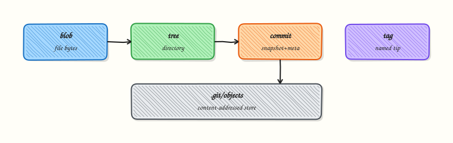

# Viewing History and Diffs

## Overview


Use `git log`, `git show`, and `git diff` to answer “what changed?” during incidents and reviews.

This is a core tutorial in **Module 3 · Git Basics** of the REBASH Academy **Git for Cloud & DevOps Engineers** series — written for Cloud, DevOps, Platform, and SRE engineers.


## Prerequisites


- [Basic Git Workflow](basic-git-workflow-add-commit-push.md)


## Learning Objectives


By the end of this tutorial, you will be able to:

- [ ] Format `git log` for scanning  
- [ ] Inspect one commit with `show`  
- [ ] Diff working tree, staging, and commits  
- [ ] Limit history by path/time


## Architecture


This topic’s control points and relationships are shown below.




## Theory


### What

History and diff tools answer “what changed, when, and why?”. `git log` walks commits; `git show` displays one commit; `git diff` compares working tree, index, and commits. Graph and decorate options make branch topology visible — essential before merges and rebases.

### Why

In incidents you need the commit that introduced a bad Terraform variable or a broken Helm value. In review you need a precise diff, not a vague description. Learning the difference between unstaged, staged, and branch-tip diffs prevents “I thought I committed that” confusion.

### How it works

`git log` starts at HEAD (or a given revision) and follows parent links. Flags trim noise: `--oneline`, `--graph`, `--decorate`, and `-n`. `git show HEAD` prints metadata plus the patch for that commit. `git diff` with no arguments compares the working tree to the index (unstaged). `git diff --cached` (or `--staged`) compares the index to `HEAD`. Three-dot syntax such as `main...feature` shows changes on `feature` since it diverged from `main` — ideal for pull request scope.

```bash
git log --oneline --graph --decorate -n 20
git show HEAD
git diff                 # unstaged
git diff --cached        # staged
git diff main...feature  # PR-style tip comparison
```

### Key concepts

| Comparison | Meaning |
|------------|---------|
| Working tree vs index | Unstaged edits |
| Index vs HEAD | Staged, not yet committed |
| Commit vs commit | Historical patch |
| `A...B` (three-dot) | Changes reachable from B since merge-base with A |

`git blame` attributes lines to commits; use it for archaeology, not blame culture.

### Common pitfalls

- Reading two-dot vs three-dot diffs interchangeably and mis-scoping a PR  
- Assuming `git diff` shows staged changes (it does not, unless `--cached`)  
- Over-relying on GUI diffs without checking binary or generated files  
- Forgetting `--follow` when a file was renamed (history can look empty)


## Hands-on Lab


Create a workspace for this tutorial.

```bash
mkdir -p ~/rebash-git/module-03/hist && cd ~/rebash-git/module-03/hist
```

**Focus:** practise Git skills for: Viewing History and Diffs

### Step 1 – Init repository

```bash
git init -b main
git config user.email 'lab@rebash.local'
git config user.name 'REBASH Lab'
echo '# lab' > README.md
git add README.md
git commit -m 'Initial commit'
git log --oneline
```

### Step 2 – History and diffs

```bash
echo v1 > file.txt && git add file.txt && git commit -m 'v1'
echo v2 > file.txt && git commit -am 'v2'
git log --oneline --decorate | tee hist.txt
git show HEAD | tee show.txt
git diff HEAD~1 HEAD | tee diff.txt
```

### Final step – Cleanup note

```bash
# Safe local repo under the lab directory; delete the folder when finished
```


## Validation


- [ ] Lab commands run under `~/rebash-git/module-03/hist/`
- [ ] You can explain each Theory section in your own words
- [ ] You used modern tooling where it applies to this topic
- [ ] You can describe one production failure mode for this topic


## Code Walkthrough


Production practice for **Viewing History and Diffs** always combines:

1. Inspect before you change (status, plan, logs, dry-run)
2. Prefer reversible, documented changes (Git, IaC, drop-ins, version pins)
3. Capture evidence (command output, pipeline logs) for handovers
4. Prefer current tools and APIs over legacy shortcuts
5. Least privilege — escalate credentials only when required

Keep runbooks short enough to follow under pressure. Automate checks; keep humans for judgement.


## Security Considerations


- Treat credentials and tokens for git as privileged — never commit them
- Prefer short-lived auth (OIDC, roles, SSO) over long-lived keys
- Validate blast radius before apply/deploy/delete operations
- Restrict who can approve production changes
- Collect audit logs; limit who can read sensitive traces


## Common Mistakes


!!! warning "Reading two-dot vs three-dot diffs interchangeably and mis-scoping a PR  "
    Validate assumptions against the Theory section and official docs before changing production.

!!! warning "Assuming `git diff` shows staged changes (it does not, unless `--cached`)  "
    Lab shortcuts (open security groups, admin roles, skip approvals) must not ship unchanged.

!!! warning "Changing production without a rollback path"
    Always know how to revert (previous artefact, prior release, state rollback, DNS failback).


## Best Practices


- Encode Viewing History and Diffs changes as code and review them in pull requests
- Pin versions (images, modules, actions, provider plugins)
- Separate environments with clear promotion gates
- Alert on symptoms with runbooks attached
- Destroy lab resources; tag everything with owner and expiry where possible


## Troubleshooting


| Symptom | Likely cause | Fix |
|---------|--------------|-----|
| Auth / permission denied | Wrong identity, policy, or scope | Check caller identity, roles, and least-privilege policies |
| Timeout / no route | Network, DNS, security group, or endpoint | Trace path, DNS, and allow-lists before retrying |
| Drift / unexpected plan | Manual change or wrong state/workspace | Reconcile desired vs actual; avoid click-ops on managed resources |
| Pipeline/job red | Flaky step, cache, or missing secret | Read failing step logs; bisect recent workflow/config changes |
| Cost spike | Idle load balancer, NAT, oversized compute | Inventory billable resources; stop/delete labs promptly |


## Summary


**Viewing History and Diffs** is essential for Cloud and DevOps engineers working with git. Practise the lab until the inspection and change path is muscle memory, then continue the track.


## Interview Questions


1. Explain **Viewing History and Diffs** as you would in a senior engineer interview.
2. You rebased a shared branch and teammates are blocked — what now?
3. How do you recover a commit that seems lost?
4. What Git security controls belong in a production org?
5. How should Git history look for Infrastructure as Code (IaC) repos?

!!! tip "Sample answer — question 2"
    Stop force-pushing; communicate; use `reflog` to recover; prefer revert on shared main. Reset/rebase only on private branches.

!!! tip "Sample answer — question 4"
    Signed commits, protected branches, secret scanning, least-privilege tokens, and signed tags for releases.


## Related Tutorials


- [Course overview](index.md)
- [gitignore and gitattributes](gitignore-and-gitattributes.md)


## References


- [git-log](https://git-scm.com/docs/git-log) · [git-diff](https://git-scm.com/docs/git-diff)
