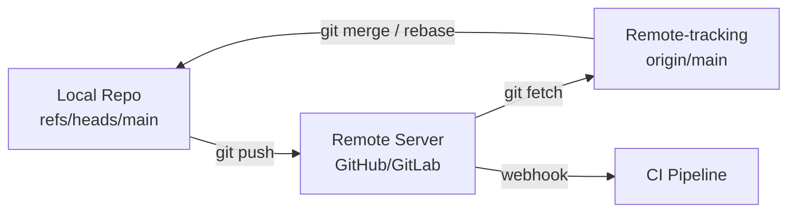

# Working with Remotes

## Overview

Remotes connect your local repository to servers on GitHub, GitLab, or internal Git hosts. Fetching, pulling, and pushing synchronize work across the team — and trigger CI/CD pipelines on every push. DevOps engineers manage multiple remotes for forks, mirrors, and deployment repos.

This is **Tutorial 10** in **Module 4: Collaboration** of the REBASH Academy Git series.

## Prerequisites

- [Rebasing and Interactive Rebase](rebasing-and-interactive-rebase.md)
- [Creating and Cloning Repositories](creating-and-cloning-repositories.md)

## Learning Objectives

By the end of this tutorial, you will be able to:

- [ ] Add, rename, and remove remotes with `git remote`
- [ ] Fetch updates without merging using `git fetch`
- [ ] Pull with merge or rebase strategies
- [ ] Push branches, tags, and set upstream tracking
- [ ] Work with fork workflows (origin + upstream)
- [ ] Understand remote-tracking branches (`origin/main`)
- [ ] Diagnose push rejection and authentication failures

## Remote Sync Diagram



## Theory

### What Is a Remote?

A remote is a named URL (or path) to another repository. Default name after clone: **origin**.

```bash
git remote -v
git remote show origin
```

Remotes store in `.git/config`:

```ini
[remote "origin"]
    url = git@github.com:org/repo.git
    fetch = +refs/heads/*:refs/remotes/origin/*
```

### Remote-Tracking Branches

After `git fetch`, Git updates **remote-tracking branches** like `origin/main` — read-only local copies of remote state. Your local `main` is separate until you merge or rebase.

```bash
git fetch origin
git log main..origin/main --oneline   # commits on remote not in local
```

### git fetch

Downloads objects and updates remote-tracking refs — **does not** change your working branch:

```bash
git fetch origin
git fetch --all
git fetch origin feature/new-api:feature/new-api   # fetch into local branch
git fetch --prune   # remove stale remote-tracking branches
```

Safe to run frequently — inspect before integrating.

### git pull

Fetch + integrate in one command:

```bash
git pull origin main              # fetch + merge
git pull --rebase origin main     # fetch + rebase
git pull --ff-only origin main    # fail if merge needed
```

`--ff-only` enforces linear history — good for main branch updates.

### git push

Upload local commits to remote:

```bash
git push origin main
git push -u origin feature/x      # set upstream on first push
git push origin --delete feature/x
git push origin v1.0.0              # push tag
git push origin --tags            # push all tags
```

### Upstream Tracking

Branch tracks remote for shorthand `git pull` / `git push`:

```bash
git branch -vv
git push -u origin feature/x
git branch --set-upstream-to=origin/main main
```

### Multiple Remotes — Fork Workflow

```bash
git remote add upstream git@github.com:original/project.git
git fetch upstream
git rebase upstream/main
git push origin feature/my-fork
```

- **origin** — your fork (push target)
- **upstream** — canonical project (fetch updates)

### Push Refspecs and Mirrors

Advanced push all refs:

```bash
git push --mirror git@backup:org/repo.git
```

Deploy keys often have push-only access to specific repos — common in CI/CD.

### SSH vs HTTPS URLs

```bash
git remote set-url origin git@github.com:org/repo.git
git remote set-url origin https://github.com/org/repo.git
```

Switch protocols without recloning.

## Hands-on Lab

### Step 1 – Create local repo and bare remote

**Command:**

```bash
mkdir -p /tmp/git-remote-lab && cd /tmp/git-remote-lab
git init -b main
echo "app v1" > app.txt && git add . && git commit -m "feat: v1"
git init --bare /tmp/remote-origin.git
git remote add origin /tmp/remote-origin.git
git push -u origin main
git remote -v
```

### Step 2 – Clone and make divergent changes

**Command:**

```bash
cd /tmp
git clone /tmp/remote-origin.git remote-clone
cd remote-clone
echo "clone change" >> app.txt && git commit -am "feat: clone side"
git push origin main
```

### Step 3 – Fetch and compare on original

**Command:**

```bash
cd /tmp/git-remote-lab
git fetch origin
git log main..origin/main --oneline
git status -sb
```

### Step 4 – Pull with rebase

**Command:**

```bash
echo "local change" >> app.txt && git commit -am "feat: local side"
git pull --rebase origin main
git log --oneline --graph -5
```

### Step 5 – Push feature branch

**Command:**

```bash
git switch -c feature/demo
echo "feature" >> feature.txt && git add . && git commit -m "feat: demo feature"
git push -u origin feature/demo
git branch -vv
```

### Step 6 – Add second remote (upstream simulation)

**Command:**

```bash
git init --bare /tmp/upstream.git
cd /tmp/git-remote-lab
git remote add upstream /tmp/upstream.git
git push upstream main
git remote show upstream
```

### Step 7 – Clean up

**Command:**

```bash
rm -rf /tmp/git-remote-lab /tmp/remote-origin.git /tmp/remote-clone /tmp/upstream.git
```

## Commands & Code

| Command | Description | Example |
|---------|-------------|---------|
| `git remote -v` | List remotes with URLs | `git remote -v` |
| `git remote add name URL` | Add remote | `git remote add upstream URL` |
| `git fetch origin` | Download remote changes | `git fetch --prune origin` |
| `git pull --rebase` | Fetch and rebase | `git pull --rebase origin main` |
| `git push -u origin branch` | Push and set upstream | `git push -u origin feature/x` |
| `git push origin --delete b` | Delete remote branch | `git push origin --delete old-feature` |
| `git remote set-url origin URL` | Change remote URL | Protocol switch |

### Sync fork script

```bash
#!/usr/bin/env bash
# sync-fork.sh — update fork from upstream
set -euo pipefail
git fetch upstream
git switch main
git merge --ff-only upstream/main
git push origin main
echo "Fork synced with upstream main."
```

## Common Mistakes

!!! warning "git pull without knowing merge vs rebase"
    Unexpected merge commits pollute history. Set `pull.rebase` or use explicit flags.

!!! warning "Pushing to wrong remote"
    Verify `git remote -v` before first push to production deploy repo.

!!! warning "Never fetching before rebase"
    Rebase onto stale origin/main causes duplicate conflict resolution.

!!! warning "Force pushing shared branches"
    Overwrites teammate commits. Restrict force push to personal feature branches.

## Best Practices

!!! tip "Fetch often, merge deliberately"
    `git fetch` is safe; inspect `origin/main` before integrating.

!!! tip "Use --force-with-lease for rebased pushes"
    Prevents overwriting remote commits you haven't seen.

!!! tip "Prune stale remote branches"
    `git fetch --prune` keeps `git branch -r` accurate.

!!! tip "Separate remotes for deploy mirrors"
    `origin` for development; `production` remote for GitOps deploy repo if split.

## Troubleshooting

| Issue | Cause | Solution |
|-------|-------|----------|
| `rejected — non-fast-forward` | Remote has commits you lack | Fetch; merge or rebase; push |
| `Permission denied` | SSH/key or token issue | Verify keys; check repo access |
| `Could not read from remote` | Network or wrong URL | `git remote -v`; test SSH/HTTPS |
| Pull creates unwanted merge | Default merge pull | Use `--rebase` or `--ff-only` |
| Upstream not set | First push without -u | `git push -u origin branch` |
| Stale remote-tracking branch | Branch deleted on server | `git fetch --prune` |

## Summary

- **Remotes** are named URLs; **origin** is default after clone
- **git fetch** updates remote-tracking branches without changing local branches
- **git pull** = fetch + integrate; choose merge, rebase, or ff-only
- **git push** publishes commits; **-u** sets upstream for future push/pull
- **Fork workflow** uses origin (fork) + upstream (canonical) remotes

## Interview Questions

1. What is the difference between `git fetch` and `git pull`?
2. What are remote-tracking branches?
3. How do you add a second remote for fork workflows?
4. What does `git push -u origin branch` do?
5. Why might push be rejected as non-fast-forward?
6. What is the difference between `git pull --rebase` and default pull?
7. How do you delete a branch on the remote?
8. What does `git fetch --prune` do?
9. How do you change a remote URL from HTTPS to SSH?
10. When is `--force-with-lease` appropriate?

??? tip "Sample Answers (Questions 1 and 5)"

    **Q1 — fetch vs pull:** Fetch downloads commits and updates remote-tracking refs (e.g., origin/main) without modifying your current branch or working tree. Pull is fetch followed by integration (merge or rebase) into your current branch. Fetch lets you inspect before merging.

    **Q5 — Non-fast-forward rejection:** Remote branch tip is not a direct ancestor of your push. Someone else pushed commits you don't have locally. You must fetch, integrate their changes (merge/rebase), then push. Force push overrides this but rewrites remote history — dangerous on shared branches.

## Related Tutorials

- [Rebasing and Interactive Rebase](rebasing-and-interactive-rebase.md) *(previous — Module 3)*
- [Pull Requests and Code Review](pull-requests-and-code-review.md) *(next)*
- [Creating and Cloning Repositories](creating-and-cloning-repositories.md)
- [Git in CI/CD and DevOps](git-in-ci-cd-and-devops.md)
- [Git – Category Overview](index.md)

## References

- [Pro Git Book – Working with Remotes](https://git-scm.com/book/en/v2/Git-Basics-Working-with-Remotes)
- [git remote documentation](https://git-scm.com/docs/git-remote)
- [git fetch documentation](https://git-scm.com/docs/git-fetch)
- [GitHub – Fork a repo](https://docs.github.com/en/pull-requests/collaborating-with-pull-requests/working-with-forks)
- [REBASH Academy – Git Overview](index.md)
